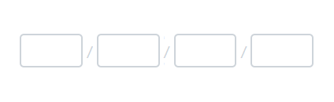

# Separator in Blazor OTP Input component

The separator in the OTP input component is the character or string rendered between adjacent input fields to visually distinguish them. Configure the separator using the [Separator](https://help.syncfusion.com/cr/blazor/Syncfusion.Blazor.Inputs.SfOtpInput.html#Syncfusion_Blazor_Inputs_SfOtpInput_Separator) property.

```cshtml

@using Syncfusion.Blazor.Inputs

<SfOtpInput Separator="/"></SfOtpInput>

```


