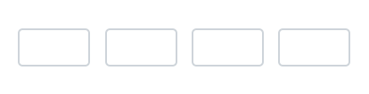

# Styling Modes in Blazor OTP Input component

Styling modes specify the visual variants for the input fields in the OTP input component. These modes allow customization of the inputs’ appearance to match application design.

## Outline mode

Use the outline style by setting the [StylingMode](https://help.syncfusion.com/cr/blazor/Syncfusion.Blazor.Inputs.SfOtpInput.html#Syncfusion_Blazor_Inputs_SfOtpInput_StylingMode) property to [Outlined](https://help.syncfusion.com/cr/blazor/Syncfusion.Blazor.Inputs.OtpInputStyle.html#Syncfusion_Blazor_Inputs_OtpInputStyle_Outlined). The default styling mode is `Outlined`.

```cshtml

@using Syncfusion.Blazor.Inputs

<SfOtpInput StylingMode="OtpInputStyle.Outlined"></SfOtpInput>

```



## Filled mode

Use the filled style by setting the [StylingMode](https://help.syncfusion.com/cr/blazor/Syncfusion.Blazor.Inputs.SfOtpInput.html#Syncfusion_Blazor_Inputs_SfOtpInput_StylingMode) property to [Filled](https://help.syncfusion.com/cr/blazor/Syncfusion.Blazor.Inputs.OtpInputStyle.html#Syncfusion_Blazor_Inputs_OtpInputStyle_Filled).

```cshtml

@using Syncfusion.Blazor.Inputs

<SfOtpInput StylingMode="OtpInputStyle.Filled"></SfOtpInput>

```


## Underline mode

Use the underline style by setting the [StylingMode](https://help.syncfusion.com/cr/blazor/Syncfusion.Blazor.Inputs.SfOtpInput.html#Syncfusion_Blazor_Inputs_SfOtpInput_StylingMode) property to [Underlined](https://help.syncfusion.com/cr/blazor/Syncfusion.Blazor.Inputs.OtpInputStyle.html#Syncfusion_Blazor_Inputs_OtpInputStyle_Underlined).

```cshtml

@using Syncfusion.Blazor.Inputs

<SfOtpInput StylingMode="OtpInputStyle.Underlined"></SfOtpInput>

```

