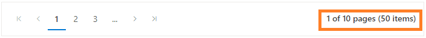

# Behavior Settings in Pager Component

The Syncfusion<sup style="font-size:70%">&reg;</sup> Blazor Pager component includes properties that control its rendering behavior, such as numeric items and navigation buttons. The total number of pages is determined by the values of the [PageSize](https://help.syncfusion.com/cr/blazor/Syncfusion.Blazor.Navigations.SfPager.html#Syncfusion_Blazor_Navigations_SfPager_PageSize) and [TotalItemsCount](https://help.syncfusion.com/cr/blazor/Syncfusion.Blazor.Navigations.SfPager.html#Syncfusion_Blazor_Navigations_SfPager_TotalItemsCount) properties.

**Core properties of the pager component**

* [PageSize](https://help.syncfusion.com/cr/blazor/Syncfusion.Blazor.Navigations.SfPager.html#Syncfusion_Blazor_Navigations_SfPager_PageSize) – Specifies the number of items displayed per page.
* [NumericItemsCount](https://help.syncfusion.com/cr/blazor/Syncfusion.Blazor.Navigations.SfPager.html#Syncfusion_Blazor_Navigations_SfPager_NumericItemsCount) – Defines the number of numeric items shown for navigation.
* [TotalItemsCount](https://help.syncfusion.com/cr/blazor/Syncfusion.Blazor.Navigations.SfPager.html#Syncfusion_Blazor_Navigations_SfPager_TotalItemsCount) – Indicates the total number of items in the data collection.
* [CurrentPage](https://help.syncfusion.com/cr/blazor/Syncfusion.Blazor.Navigations.SfPager.html#Syncfusion_Blazor_Navigations_SfPager_CurrentPage) – Sets the page to display initially.
* [ShowPagerMessage](https://help.syncfusion.com/cr/blazor/Syncfusion.Blazor.Navigations.SfPager.html#Syncfusion_Blazor_Navigations_SfPager_ShowPagerMessage) – Controls the visibility of the pager information message.

## Page size

The Syncfusion<sup style="font-size:70%">&reg;</sup> Blazor Pager component provides the [PageSize](https://help.syncfusion.com/cr/blazor/Syncfusion.Blazor.Navigations.SfPager.html#Syncfusion_Blazor_Navigations_SfPager_PageSize) property to define the number of items displayed per page. The default value is **12**.

```csharp
@using Syncfusion.Blazor.Navigations

<SfPager PageSize="5" TotalItemsCount="20">
</SfPager>

```

## Numeric items count

The Syncfusion<sup style="font-size:70%">&reg;</sup> Blazor Pager component provides the [NumericItemsCount](https://help.syncfusion.com/cr/blazor/Syncfusion.Blazor.Navigations.SfPager.html#Syncfusion_Blazor_Navigations_SfPager_NumericItemsCount) property to define how many numeric navigation items are displayed in the pager. The default value is **10**.

```csharp
@using Syncfusion.Blazor.Navigations

<SfPager NumericItemsCount="5" TotalItemsCount="20" PageSize="4">
</SfPager>

```

## Total items count

The Syncfusion<sup style="font-size:70%">&reg;</sup> Blazor Pager component provides the [TotalItemsCount](https://help.syncfusion.com/cr/blazor/Syncfusion.Blazor.Navigations.SfPager.html#Syncfusion_Blazor_Navigations_SfPager_TotalItemsCount) property to specify the total number of items in the data collection. This value is used to calculate the total number of pages and render numeric items and navigation buttons.

```csharp
@using Syncfusion.Blazor.Navigations

<SfPager TotalItemsCount="75">
</SfPager>

```

## Current page

The Syncfusion<sup style="font-size:70%">&reg;</sup> Blazor Pager component provides the [CurrentPage](https://help.syncfusion.com/cr/blazor/Syncfusion.Blazor.Navigations.SfPager.html#Syncfusion_Blazor_Navigations_SfPager_CurrentPage) property to specify which page is displayed initially when the pager is rendered. The default value is **1**.

```csharp
@using Syncfusion.Blazor.Navigations

<SfPager CurrentPage="3" TotalItemsCount="20" PageSize="4" NumericItemsCount="5">
</SfPager>

```

## Show pager message

The Syncfusion<sup style="font-size:70%">&reg;</sup> Blazor Pager component provides the [ShowPagerMessage](https://help.syncfusion.com/cr/blazor/Syncfusion.Blazor.Navigations.SfPager.html#Syncfusion_Blazor_Navigations_SfPager_ShowPagerMessage) property to control the visibility of the pager information message. The default value is **true**. Setting this property to **false** hides the message from the pager container.

```csharp
@using Syncfusion.Blazor.Navigations

<SfPager ShowPagerMessage="true" PageSize="4" NumericItemsCount="5" TotalItemsCount="20">
</SfPager>

```


