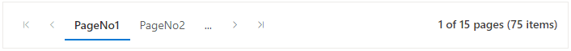

# Customization in Pager Component

The Syncfusion<sup style="font-size:70%">&reg;</sup> Blazor Pager component provides options to customize its appearance and behavior. Customization can include modifying numeric item text and applying custom styles through CSS classes.

## Custom text for numeric items

The Syncfusion<sup style="font-size:70%">&reg;</sup> Blazor Pager component allows adding a custom prefix to numeric items using the [NumericItemPrefix](https://help.syncfusion.com/cr/blazor/Syncfusion.Blazor.Navigations.SfPager.html#Syncfusion_Blazor_Navigations_SfPager_NumericItemPrefix) property. This property accepts a string value that appears before each numeric item in the pager.

```csharp

@using Syncfusion.Blazor.Navigations

<SfPager TotalItemsCount="75"
         PageSize="5"
         NumericItemsCount="2"
         NumericItemPrefix="PageNo">
</SfPager>

```



## Apply custom CSS

The Syncfusion<sup style="font-size:70%">&reg;</sup> Blazor Pager component supports customizing its appearance by applying custom CSS classes. This customization is enabled through the [CssClass](https://help.syncfusion.com/cr/blazor/Syncfusion.Blazor.Navigations.SfPager.html#Syncfusion_Blazor_Navigations_SfPager_CssClass) property. Assign a class name to this property and define the required styles in the CSS file.

```csharp

@using Syncfusion.Blazor.Navigations

<SfPager NumericItemsCount="3" PageSize="5" TotalItemsCount=50 CssClass=customCss>
</SfPager>

<style>

    .e-pager.customCss .e-currentitem.e-numericitem.e-focused, .e-pager.customCss .e-currentitem{
        background: #2bbbad;
        color: #f6f3f1;
        border-bottom: 0px;
        border-radius: 0.125rem;
        outline-style: auto;
    }
        
</style>

```

