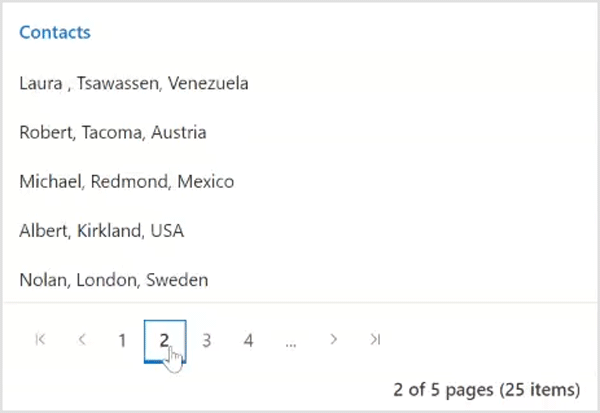

# Getting Started with Blazor Pager Component

This section briefly explains about how to include Blazor Pager component in your Blazor Server App and Blazor WebAssembly App using Visual Studio.

## Prerequisites

* [System requirements for Blazor components](https://blazor.syncfusion.com/documentation/system-requirements)

## Create a new Blazor App in Visual Studio

You can create **Blazor Server App** or **Blazor WebAssembly App** using Visual Studio in one of the following ways:

* [Create a Project using Microsoft Templates](https://docs.microsoft.com/en-us/aspnet/core/blazor/tooling?pivots=windows)

* [Create a Project using Syncfusion Blazor Extension](https://blazor.syncfusion.com/documentation/visual-studio-integration/vs2019-extensions/create-project)

## Install Syncfusion Blazor NuGet in the App

Syncfusion Blazor components are available in [nuget.org](https://www.nuget.org/packages?q=syncfusion.blazor). To use Syncfusion Blazor components in the application, add reference to the corresponding NuGet. Refer to [NuGet packages topic](https://blazor.syncfusion.com/documentation/nuget-packages) for available NuGet packages list with component details.

To add Blazor Pager component in the app, open the NuGet package manager in Visual Studio (Tools → NuGet Package Manager → Manage NuGet Packages for Solution), search for [Syncfusion.Blazor.Navigations](https://www.nuget.org/packages/Syncfusion.Blazor.Navigations/) and then install it.

## Register Syncfusion Blazor Service

Open **~/_Imports.razor** file and import the Syncfusion.Blazor namespace.




@using Syncfusion.Blazor




Now, register the Syncfusion Blazor Service in the Blazor Server App or Blazor WebAssembly App. Here, Syncfusion Blazor Service is registered by setting [IgnoreScriptIsolation](https://help.syncfusion.com/cr/blazor/Syncfusion.Blazor.GlobalOptions.html?&_ga=2.80827295.945255991.1647838461-1223836246.1561029397#Syncfusion_Blazor_GlobalOptions_IgnoreScriptIsolation) property as true to load the scripts externally in the [next steps](#add-script-reference).

> From 2022 Vol1 (20.1) version - The default value of `IgnoreScriptIsolation` is changed to `true`, so, you don’t have to set the `IgnoreScriptIsolation` property explicitly to refer to scripts externally.

### Blazor Server App

* For **.NET 6** app, open the **~/Program.cs** file and register the Syncfusion Blazor Service.

* For **.NET 5 and .NET 3.X** app, open the **~/Startup.cs** file and register the Syncfusion Blazor Service.




using Microsoft.AspNetCore.Components;
using Microsoft.AspNetCore.Components.Web;
using Syncfusion.Blazor;

var builder = WebApplication.CreateBuilder(args);

// Add services to the container.
builder.Services.AddRazorPages();
builder.Services.AddServerSideBlazor();
builder.Services.AddSyncfusionBlazor();

var app = builder.Build();
....





using Syncfusion.Blazor;

namespace BlazorApplication
{
    public class Startup
    {
        ...
        public void ConfigureServices(IServiceCollection services)
        {
            services.AddRazorPages();
            services.AddServerSideBlazor();
            builder.Services.AddSyncfusionBlazor();
        }
        ...
    }
}




### Blazor WebAssembly App

Open **~/Program.cs** file and register the Syncfusion Blazor Service in the client web app.




using Microsoft.AspNetCore.Components.Web;
using Microsoft.AspNetCore.Components.WebAssembly.Hosting;
using Syncfusion.Blazor;

var builder = WebAssemblyHostBuilder.CreateDefault(args);
builder.RootComponents.Add<App>("#app");
builder.RootComponents.Add<HeadOutlet>("head::after");

builder.Services.AddScoped(serviceProvider => new HttpClient { BaseAddress = new Uri(builder.HostEnvironment.BaseAddress) });

builder.Services.AddSyncfusionBlazor();
await builder.Build().RunAsync();
....





using Syncfusion.Blazor;

namespace WebApplication1
{
    public class Program
    {
        public static async Task Main(string[] args)
        {
            ....
            builder.Services.AddSyncfusionBlazor();
            await builder.Build().RunAsync();
        }
    }
}




## Add Style Sheet

Checkout the [Blazor Themes topic](https://blazor.syncfusion.com/documentation/appearance/themes) to learn different ways ([Static Web Assets](https://blazor.syncfusion.com/documentation/appearance/themes#static-web-assets), [CDN](https://blazor.syncfusion.com/documentation/appearance/themes#cdn-reference) and [CRG](https://blazor.syncfusion.com/documentation/common/custom-resource-generator)) to refer themes in Blazor application, and to have the expected appearance for Syncfusion Blazor components. Here, the theme is referred using [Static Web Assets](https://blazor.syncfusion.com/documentation/appearance/themes#static-web-assets). Refer to [Enable static web assets usage](https://blazor.syncfusion.com/documentation/appearance/themes#enable-static-web-assets-usage) topic to use static assets in your project.

To add a theme to the app, open the NuGet package manager in Visual Studio (Tools → NuGet Package Manager → Manage NuGet Packages for Solution), search for [Syncfusion.Blazor.Themes](https://www.nuget.org/packages/Syncfusion.Blazor.Themes/) and then install it. Then, the theme style sheet from NuGet can be referred to as follows:

### Blazor Server App

* For .NET 6 app, add the Syncfusion bootstrap5 theme in the `<head>` of the **~/Pages/_Layout.cshtml** file.

* For .NET 5 and .NET 3.X app, add the Syncfusion bootstrap5 theme in the `<head>` of the **~/Pages/_Host.cshtml** file.




<head>
    <link href="_content/Syncfusion.Blazor.Themes/bootstrap5.css" rel="stylesheet" />
</head>





<head>
    <link href="_content/Syncfusion.Blazor.Themes/bootstrap5.css" rel="stylesheet" />
</head>




### Blazor WebAssembly App

For Blazor WebAssembly App, refer the theme style sheet from NuGet in the `<head>` of **wwwroot/index.html** file in the client web app.




<head>
    <link href="_content/Syncfusion.Blazor.Themes/bootstrap5.css" rel="stylesheet" />
</head>




## Add script reference

Checkout [Adding Script Reference topic](https://blazor.syncfusion.com/documentation/common/adding-script-references) to learn different ways to add script reference in Blazor Application. In this getting started walk-through, the required scripts are referred using [Static Web Assets](https://blazor.syncfusion.com/documentation/common/adding-script-references#static-web-assets) externally inside the `<head>` as follows. Refer to [Enable static web assets usage](https://blazor.syncfusion.com/documentation/common/adding-script-references#enable-static-web-assets-usage) topic to use static assets in your project.

### Blazor Server App

* For **.NET 6** app, refer script in the `<head>` of the **~/Pages/_Layout.cshtml** file.

* For **.NET 5 and .NET 3.X** app, refer script in the `<head>` of the **~/Pages/_Host.cshtml** file.




<head>
    ....
    <link href="_content/Syncfusion.Blazor.Themes/bootstrap5.css" rel="stylesheet" />
    <script src="_content/Syncfusion.Blazor.Core/scripts/syncfusion-blazor.min.js" type="text/javascript"></script>
    <!--Use below script reference if you are using Syncfusion.Blazor Single NuGet-->
    <!--<script  src="_content/Syncfusion.Blazor/scripts/syncfusion-blazor.min.js"  type="text/javascript"></script>-->
</head>





<head>
    ....
    <link href="_content/Syncfusion.Blazor.Themes/bootstrap5.css" rel="stylesheet" />
    <script src="_content/Syncfusion.Blazor.Core/scripts/syncfusion-blazor.min.js" type="text/javascript"></script>
    <!--Use below script reference if you are using Syncfusion.Blazor Single NuGet-->
    <!--<script  src="_content/Syncfusion.Blazor/scripts/syncfusion-blazor.min.js"  type="text/javascript"></script>-->
</head>




### Blazor WebAssembly App

For Blazor WebAssembly App, refer script in the `<head>` of the **~/index.html** file.




<head>
    ....
    <link href="_content/Syncfusion.Blazor.Themes/bootstrap5.css" rel="stylesheet" />
    <script src="_content/Syncfusion.Blazor.Core/scripts/syncfusion-blazor.min.js" type="text/javascript"></script>
    <!--Use below script reference if you are using Syncfusion.Blazor Single NuGet-->
    <!--<script  src="_content/Syncfusion.Blazor/scripts/syncfusion-blazor.min.js"  type="text/javascript"></script>-->
</head>




> Syncfusion recommends to reference scripts using [Static Web Assets](https://blazor.syncfusion.com/documentation/common/adding-script-references#static-web-assets), [CDN](https://blazor.syncfusion.com/documentation/common/adding-script-references#cdn-reference) and [CRG](https://blazor.syncfusion.com/documentation/common/custom-resource-generator) by [disabling JavaScript isolation](https://blazor.syncfusion.com/documentation/common/adding-script-references#disable-javascript-isolation) for better loading performance of the Blazor application.

## Add Blazor Pager component

* Open **~/_Imports.razor** file or any other page under the `~/Pages` folder where the component is to be added and import the **Syncfusion.Blazor.Navigations** namespace.




@using Syncfusion.Blazor
@using Syncfusion.Blazor.Navigations




Here, the Pager component is integrated with the ListView component. So, the first ListView component is added in the **~/Pages/Index.razor** file under the **~/Pages** folder. Refer [here](https://blazor.syncfusion.com/documentation/listview/getting-started) to create the Syncfusion ListView component.

```cshtml
@using Syncfusion.Blazor.Navigations
@using Syncfusion.Blazor.Lists

<SfListView DataSource="@ListData" TValue="DataModel">
        <ListViewFieldSettings TValue="DataModel" Id="Id" Text="Name"></ListViewFieldSettings>
</SfListView>

@code {
    List<DataModel> ListData = new List<DataModel>();
    protected override void OnInitialized()
    {
        base.OnInitialized();
        ListData.Add(new DataModel { Name = "Nancy, Berlin, France" });
        ListData.Add(new DataModel { Name = "Andrew, Madrid, Germany" });
        ListData.Add(new DataModel { Name = "Janet, London, Brazil" });
        ListData.Add(new DataModel { Name = "Margaret, Marseille, Belgium" });
        ListData.Add(new DataModel { Name = "Steven, Cholchester, Switzerland" });
        ListData.Add(new DataModel { Name = "Laura , Tsawassen, Venezuela" });
        ListData.Add(new DataModel { Name = "Robert, Tacoma, Austria" });
        ListData.Add(new DataModel { Name = "Michael, Redmond, Mexico" });
        ListData.Add(new DataModel { Name = "Albert, Kirkland, USA" });
        ListData.Add(new DataModel { Name = "Nolan, London, Sweden" });
        ListData.Add(new DataModel { Name = "Jennifer, Berlin, Finland" });
        ListData.Add(new DataModel { Name = "Carter, Madrid, Italy" });
        ListData.Add(new DataModel { Name = "Allison, Marseille, Spain" });
        ListData.Add(new DataModel { Name = "John, Tsawassen, UK" });
        ListData.Add(new DataModel { Name = "Susan, Redmond, Ireland" });
        ListData.Add(new DataModel { Name = "Lydia, Cholchester, Portugal" });
        ListData.Add(new DataModel { Name = "Kelsey, London, Canada" });
        ListData.Add(new DataModel { Name = "Jessica, Kirkland, Denmark" });
        ListData.Add(new DataModel { Name = "Robert, Berlin, Austria" });
        ListData.Add(new DataModel { Name = "Shelley, Tacoma, Poland" });
        ListData.Add(new DataModel { Name = "Vanjack, Tsawassen, Norway" });
        ListData.Add(new DataModel { Name = "shelley, Cholchester, Argentina" });
        ListData.Add(new DataModel { Name = "Lydia, Kirkland, Finland" });
        ListData.Add(new DataModel { Name = "Jessica, Madrid, Sweden" });
        ListData.Add(new DataModel { Name = "Nolan, London, UK" });
        ListData.Add(new DataModel { Name = "Jennifer, Redmond, Italy" });
    }
    public class DataModel
    {
        public string Name { get; set; }
        public string Id { get; set; }
    }
}
```

In the previous sample, the list view items are rendered. The Pager component provides an option to split this list view data set into sectioned pages and view them page by page. So, the Pager component is added in the **~/Pages/Index.razor** file under the **~/Pages** folder as follows.

```cshtml
@using Syncfusion.Blazor.Navigations

<SfPager PageSize=5 NumericItemsCount=4 TotalItemsCount=25>
</SfPager>
```

Based on the [PageSize](https://help.syncfusion.com/cr/blazor/Syncfusion.Blazor.Navigations.SfPager.html#Syncfusion_Blazor_Navigations_SfPager_PageSize) property of the pager, the list view items are bound to the current page. In the following code sample, the `PageSize` is defined as "5" so that the first five items from the data source of the list view will be displayed on the current page using the Skip and Take values.

```cshtml
@using Syncfusion.Blazor.Data
@using Syncfusion.Blazor.Navigations
@using Syncfusion.Blazor.Lists

<div class="col-lg-12 control-section sb-property-border">
    @{
    var listData = ListData.Skip(SkipValue).Take(TakeValue).ToList();
    <SfListView DataSource="@listData" TValue="DataModel" HeaderTitle="Contacts" ShowHeader="true">
        <ListViewFieldSettings TValue="DataModel" Id="Id" Text="Name"></ListViewFieldSettings>
    </SfListView>
    }
    <SfPager PageSize=5 NumericItemsCount=4 TotalItemsCount=25>
    </SfPager>

</div>
@code {
    public int SkipValue;
    public int TakeValue = 5;
    List<DataModel> ListData = new List<DataModel>();
    protected override void OnInitialized()
    {
        base.OnInitialized();
        ListData.Add(new DataModel { Name = "Nancy, Berlin, France" });
        ListData.Add(new DataModel { Name = "Andrew, Madrid, Germany" });
        ListData.Add(new DataModel { Name = "Janet, London, Brazil" });
        ListData.Add(new DataModel { Name = "Margaret, Marseille, Belgium" });
        ListData.Add(new DataModel { Name = "Steven, Cholchester, Switzerland" });
        ListData.Add(new DataModel { Name = "Laura , Tsawassen, Venezuela" });
        ListData.Add(new DataModel { Name = "Robert, Tacoma, Austria" });
        ListData.Add(new DataModel { Name = "Michael, Redmond, Mexico" });
        ListData.Add(new DataModel { Name = "Albert, Kirkland, USA" });
        ListData.Add(new DataModel { Name = "Nolan, London, Sweden" });
        ListData.Add(new DataModel { Name = "Jennifer, Berlin, Finland" });
        ListData.Add(new DataModel { Name = "Carter, Madrid, Italy" });
        ListData.Add(new DataModel { Name = "Allison, Marseille, Spain" });
        ListData.Add(new DataModel { Name = "John, Tsawassen, UK" });
        ListData.Add(new DataModel { Name = "Susan, Redmond, Ireland" });
        ListData.Add(new DataModel { Name = "Lydia, Cholchester, Portugal" });
        ListData.Add(new DataModel { Name = "Kelsey, London, Canada" });
        ListData.Add(new DataModel { Name = "Jessica, Kirkland, Denmark" });
        ListData.Add(new DataModel { Name = "Robert, Berlin, Austria" });
        ListData.Add(new DataModel { Name = "Shelley, Tacoma, Poland" });
        ListData.Add(new DataModel { Name = "Vanjack, Tsawassen, Norway" });
        ListData.Add(new DataModel { Name = "shelley, Cholchester, Argentina" });
        ListData.Add(new DataModel { Name = "Lydia, Kirkland, Finland" });
        ListData.Add(new DataModel { Name = "Jessica, Madrid, Sweden" });
        ListData.Add(new DataModel { Name = "Nolan, London, UK" });
        ListData.Add(new DataModel { Name = "Jennifer, Redmond, Italy" });
    }
    public class DataModel
    {
        public string Name { get; set; }
        public string Id { get; set; }
    }
}  
```

Through the navigation of the pager items, view the items in the list view page by page. This can be achieved by using the `ItemClick` event of the Pager. In the `ItemClick` event of the Pager, the SkipValue and TakeValue are calculated using the `PageSize` property and arguments of the `ItemClick` event (CurrentPage, PreviousPage). Based on these details, view the items in the list view page by page.

```cshtml
@using Syncfusion.Blazor.Data
@using Syncfusion.Blazor.Navigations
@using Syncfusion.Blazor.Lists

<div class="col-lg-12 control-section sb-property-border">
 @{
    var listData = ListData.Skip(SkipValue).Take(TakeValue).ToList();
    <SfListView @ref="@List" DataSource="@listData" TValue="DataModel" HeaderTitle="Contacts" ShowHeader="true">
        <ListViewFieldSettings TValue="DataModel" Id="Id" Text="Name"></ListViewFieldSettings>
    </SfListView>
}
    <SfPager @ref="@Page" PageSize=5 NumericItemsCount=4 TotalItemsCount=25 ItemClick="Click">
    </SfPager>
</div>
@code {
    SfPager Page;
    public SfListView<DataModel> List { get; set; }
    public int SkipValue;
    public int TakeValue = 5;
    List<DataModel> ListData = new List<DataModel>();
    protected override void OnInitialized()
    {
        base.OnInitialized();
        ListData.Add(new DataModel { Name = "Nancy, Berlin, France" });
        ListData.Add(new DataModel { Name = "Andrew, Madrid, Germany" });
        ListData.Add(new DataModel { Name = "Janet, London, Brazil" });
        ListData.Add(new DataModel { Name = "Margaret, Marseille, Belgium" });
        ListData.Add(new DataModel { Name = "Steven, Cholchester, Switzerland" });
        ListData.Add(new DataModel { Name = "Laura , Tsawassen, Venezuela" });
        ListData.Add(new DataModel { Name = "Robert, Tacoma, Austria" });
        ListData.Add(new DataModel { Name = "Michael, Redmond, Mexico" });
        ListData.Add(new DataModel { Name = "Albert, Kirkland, USA" });
        ListData.Add(new DataModel { Name = "Nolan, London, Sweden" });
        ListData.Add(new DataModel { Name = "Jennifer, Berlin, Finland" });
        ListData.Add(new DataModel { Name = "Carter, Madrid, Italy" });
        ListData.Add(new DataModel { Name = "Allison, Marseille, Spain" });
        ListData.Add(new DataModel { Name = "John, Tsawassen, UK" });
        ListData.Add(new DataModel { Name = "Susan, Redmond, Ireland" });
        ListData.Add(new DataModel { Name = "Lydia, Cholchester, Portugal" });
        ListData.Add(new DataModel { Name = "Kelsey, London, Canada" });
        ListData.Add(new DataModel { Name = "Jessica, Kirkland, Denmark" });
        ListData.Add(new DataModel { Name = "Robert, Berlin, Austria" });
        ListData.Add(new DataModel { Name = "Shelley, Tacoma, Poland" });
        ListData.Add(new DataModel { Name = "Vanjack, Tsawassen, Norway" });
        ListData.Add(new DataModel { Name = "shelley, Cholchester, Argentina" });
        ListData.Add(new DataModel { Name = "Lydia, Kirkland, Finland" });
        ListData.Add(new DataModel { Name = "Jessica, Madrid, Sweden" });
        ListData.Add(new DataModel { Name = "Nolan, London, UK" });
        ListData.Add(new DataModel { Name = "Jennifer, Redmond, Italy" });
    }
    public void Click(PageItemClickEventArgs args)
    {
        SkipValue = (args.CurrentPage * Page.PageSize) - Page.PageSize;
        TakeValue = Page.PageSize;
    }
    public class DataModel
    {
        public string Name { get; set; }
        public string Id { get; set; }
    }
}

```



> [View Sample in GitHub.](https://github.com/SyncfusionExamples/blazor-pager-component)