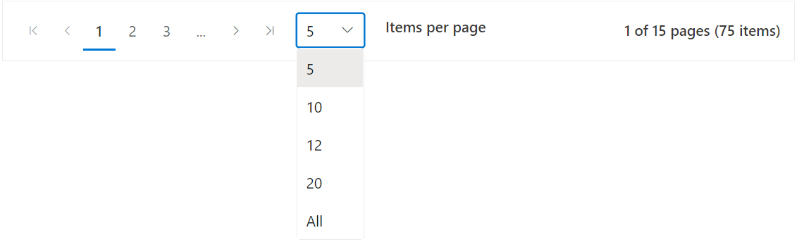

# Pager Component with Dropdown

The Syncfusion<sup style="font-size:70%">&reg;</sup> Blazor Pager component provides navigation for paginated data and supports dynamic page size selection through a dropdown list. This feature allows adjusting the number of items displayed per page without reloading the entire view, improving flexibility and enhancing the experience in applications with large datasets.

## Page size list

The Syncfusion<sup style="font-size:70%">&reg;</sup> Blazor Pager component supports dynamic page size selection through a dropdown list. This is configured using the [PageSizes](https://help.syncfusion.com/cr/blazor/Syncfusion.Blazor.Navigations.SfPager.html#Syncfusion_Blazor_Navigations_SfPager_PageSizes) property. When a value is selected from the dropdown, it updates the [PageSize](https://help.syncfusion.com/cr/blazor/Syncfusion.Blazor.Navigations.SfPager.html#Syncfusion_Blazor_Navigations_SfPager_PageSize) property, and the Pager refreshes to display the specified number of items per page.

The [ShowAllInPageSizes](https://help.syncfusion.com/cr/blazor/Syncfusion.Blazor.Navigations.SfPager.html#Syncfusion_Blazor_Navigations_SfPager_ShowAllInPageSizes) property adds an **All** option to the dropdown list. When `ShowAllInPageSizes` is set to **true**, selecting this option displays all items in a single page, bypassing pagination.

Values for the `PageSizes` property must be provided as a collection of integers representing the available page size options.

```csharp
@using Syncfusion.Blazor.Navigations

<SfPager TotalItemsCount="75" PageSizes=@pagesizes PageSize="5" NumericItemsCount="3" ShowAllInPageSizes="true">
</SfPager>

@code {
    public List<int> pagesizes = new List<int> { 5, 10, 12, 20 };
}

```

