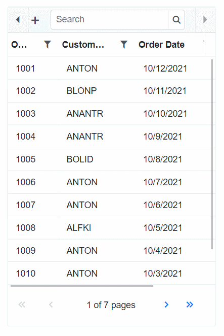

# Responsive Layout in Pager Component

## Responsive

The pager control has responsive support such that control also fit with mobile resolutions. While resizing the browser window, the inner elements in the pager control will adjust automatically to equalize the size.

