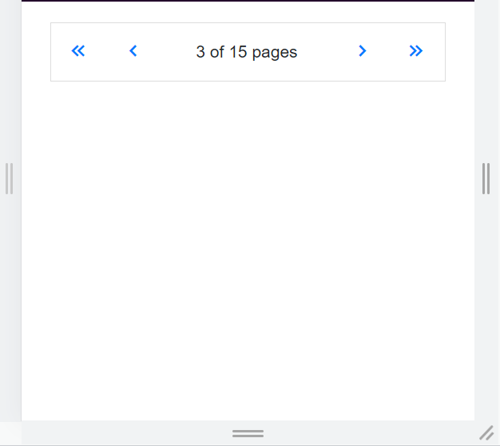

# Responsive Layout in Pager Component

The Syncfusion&reg; Blazor Pager component includes built-in responsive capabilities that automatically adapt its inner elements to the available viewport size. This behavior maintains optimal readability and usability on **mobile devices**, **tablets**, and **desktop monitors** without additional configuration.

## Responsive

When the browser window is resized or when the page loads on a device with a different resolution, the component recalculates and adjusts element sizes to maintain a balanced layout.

