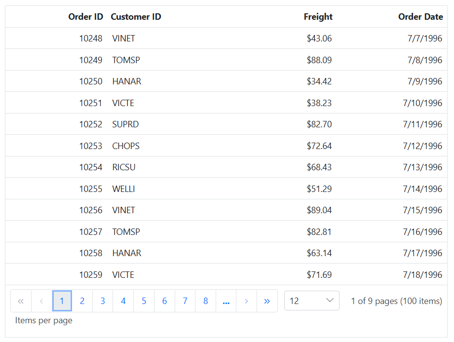
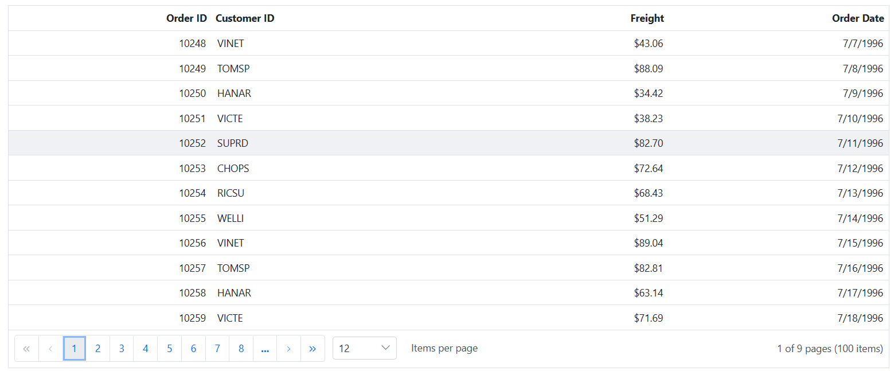

# Responsive layout in Pager component

The Syncfusion&reg; Blazor Pager component includes built-in responsive capabilities that automatically adapt its inner elements to the available viewport size. This behavior maintains optimal readability and usability on **mobile devices**, **tablets**, and **desktop monitors** without additional configuration or custom media queries, allowing developers to focus on application logic rather than UI adjustments.

### Responsive behavior

The **Pager** component continuously monitors changes in the browser window size and device resolution. Whenever a resize occurs, it dynamically recalculates the layout and rearranges its elements to best fit the available space. This includes adjusting numeric page links, navigation controls such as first, previous, next, and last buttons, as well as [PageSize](https://help.syncfusion.com/cr/blazor/Syncfusion.Blazor.Grids.GridPageSettings.html#Syncfusion_Blazor_Grids_GridPageSettings_PageSize) selectors and informational text.

On smaller devices, such as smart phones, the component prioritizes usability by displaying only essential controls. To prevent clutter and maintain readability, non-essential elements are either minimized, repositioned, or temporarily hidden. Numeric page links may be reduced to a smaller subset, and navigation controls may be simplified to ensure that users can still navigate efficiently without horizontal scrolling or UI overlap.

**Smaller device**

For medium-sized devices like tablets, the Pager provides a balanced layout. It intelligently distributes elements to maintain both readability and functionality. Navigation controls remain visible, while numeric links and informational content are organized with appropriate spacing to enhance clarity. This ensures a smooth and visually consistent experience when transitioning between device sizes.

**Medium-Sized devices**

On larger screens, such as desktops and laptops, the Pager fully utilizes the available width to display all features. Users can access a complete set of numeric page links, full navigation controls, page size options, and detailed page information. This expanded layout enhances productivity by providing quick access to all paging functionalities in a single view.

**Larger screens**

### Adaptive element management

A key strength of the **Pager** component lies in its adaptive handling of individual UI elements. Instead of uniformly scaling content, it intelligently prioritizes and reorganizes elements based on the available width. This results in a more effective and user‑centric interface. Numeric page buttons, navigation controls, page size dropdowns, and informational text are all dynamically adjusted to remain accessible and clear, ensuring the layout adapts smoothly across different screen sizes.

These adjustments happen automatically and smoothly, ensuring that the user experience remains consistent and intuitive across all screen sizes. The component's ability to reorganize content rather than simply shrink it makes it especially effective in maintaining clarity and usability even in constrained spaces.

Overall, the responsive and adaptive design of the Syncfusion Blazor **Pager** component ensures that applications maintain a professional and consistent appearance, regardless of the device being used. By dynamically optimizing its layout and prioritizing key elements, the Pager delivers a reliable and efficient navigation interface in every scenario