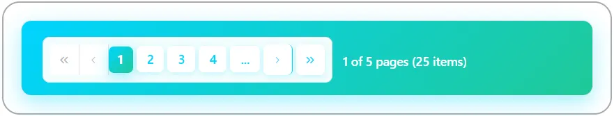
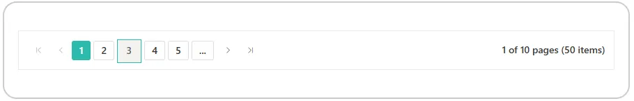
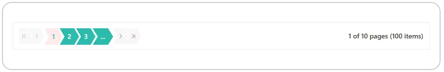
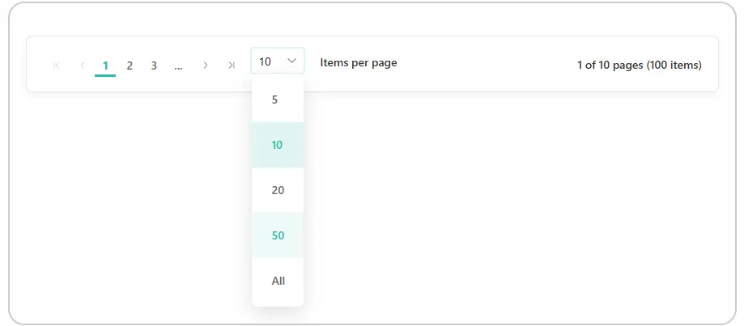
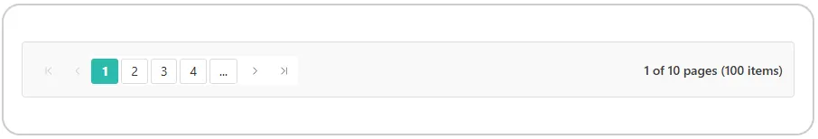
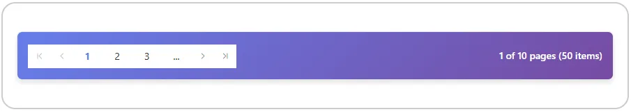

# Style and appearance in Syncfusion Blazor Pager

The Syncfusion<sup style="font-size:70%">&reg;</sup> Blazor Pager supports visual customization using CSS and theme-based styling. Styles can be applied to various elements to match the application's design. Styling options are available for:

- **Pager root element:** Defines the overall appearance of the pager container.
- **Numeric items:** Controls the appearance of page number buttons and currently selected page indicator.
- **Navigation buttons:** Customizes the first, previous, next, and last page buttons.
- **Page size dropdown:** Customizes the dropdown list for selecting items per page.
- **Focused and disabled states:** Manages appearance of focused elements and disabled elements.

**Override Default Styles:**

Default styles such as **colors**, **typography**, **spacing**, and **borders** can be customized using CSS. Use browser developer tools to inspect the rendered HTML and identify relevant selectors. Where possible, use CSS variables or theme tokens to maintain consistency across components.

```css
.e-pager .e-numericitem {
    background-color: #f0f0f0; /* Override numeric item background */
    color: #333;
}
```

Properties like **background-color**, **color**, **font-family**, and **padding** can be changed to match the pager layout design and improve visual consistency.

## Customize the Pager root element

The **.e-pager** class styles the root container of the Blazor Pager. Apply CSS to modify its appearance:

```css
.e-pager {
    font-family: 'Segoe UI', sans-serif;
    padding: 12px;
    border-radius: 4px;
    border: 1px solid #e0e0e0;
}
.e-pager, .e-pager .e-pagercontainer{
    background-color: #f9f9f9;
}
```

Properties such as **font-family**, **background-color**, **padding**, and **border-radius** can be adjusted to align with the pager design. Additional styling can be applied to individual elements within the pager for a cohesive visual experience.

```cshtml
@using Syncfusion.Blazor.Navigations

<SfPager TotalItemsCount="25" PageSize="5" NumericItemsCount="4">
</SfPager>

<style>
    .e-pager {
        font-family: 'Segoe UI', sans-serif;
        padding: 12px;
        border-radius: 4px;
        border: 1px solid #e0e0e0;
    }
    .e-pager, .e-pager .e-pagercontainer{
        background-color: #f9f9f9;
    }
</style>
```



## Customize numeric items

The **.e-numericitem** class styles the page number buttons in the Pager. Apply CSS to modify their appearance:

```css
.e-pager .e-numericitem {
    background-color: #ffffff;
    color: #333;
    border: 1px solid #ddd;
    margin: 0 4px;
    padding: 6px 10px;
    border-radius: 3px;
}
```

Properties such as **background-color**, **border**, **padding**, and **border-radius** can be adjusted. The **.e-currentitem** class further defines the styling of the active page button.

```cshtml
@using Syncfusion.Blazor.Navigations

<SfPager TotalItemsCount="50" PageSize="5" NumericItemsCount="5">
</SfPager>

style>
    .e-pager .e-numericitem {
        background-color: #ffffff;
        color: #333;
        border: 2px solid #ddd;
        margin: 0 6px;
        padding: 8px 14px;
        border-radius: 20px;
        font-weight: 600;
        transition: all 0.3s ease;
        cursor: pointer;
        box-shadow: 0 2px 4px rgba(0, 0, 0, 0.05);
    }

    .e-pager .e-numericitem:hover {
        background-color: #e8f4f8;
        border-color: #2bbbad;
        border-radius: 20px;
        padding: 8px 14px;
        box-shadow: 0 4px 12px rgba(43, 187, 173, 0.2);
    }

    .e-pager .e-currentitem.e-numericitem {
        background-color: #2bbbad;
        color: #ffffff;
        border-color: #2bbbad;
        box-shadow: 0 4px 12px rgba(43, 187, 173, 0.35);
    }

    .e-pager .e-currentitem.e-numericitem:hover {
        background-color: #20a399;
        border-color: #20a399;
        box-shadow: 0 6px 16px rgba(43, 187, 173, 0.4);
    }

    .e-pager .e-currentitem.e-numericitem.e-focused {
        color: #2bbbad;
    }
</style>
```



## Customize navigation buttons

The **.e-numericitem.e-navigation** class and related selectors style the navigation buttons (first, previous, next, last). Apply CSS to customize their appearance:

```css
.e-pager .e-numericitem.e-navigation {
    background-color: #ffffff;
    color: #333;
    border: 1px solid #ddd;
    padding: 6px 12px;
    margin: 0 2px;
}
```

Adjust properties such as **background-color**, **padding**, and **border** to match the desired design. Navigation buttons can be further customized for disabled states using the **.e-disable** class.

```cshtml

@using Syncfusion.Blazor.Navigations

<SfPager TotalItemsCount="100" PageSize="10" NumericItemsCount="3">
</SfPager>

<style>
    .e-pager .e-icons {
        background-color: #ffffff;
        color: #333;
        border: 1px solid #ddd;
        padding: 6px 12px;
        margin: 0 2px;
        border-radius: 3px;
        font-weight: 500;
    }
    .e-pager .e-icons:hover {
        background-color: #e8f4f8;
        border-color: #2bbbad;
        color: #2bbbad;
    }

    .e-pager .e-icons.e-disable {
        background-color: #f5f5f5;
        color: #999;
        border-color: #ddd;
        cursor: not-allowed;
        opacity: 0.6;
    }
    .e-pager .e-disable {
        pointer-events: none;
        cursor: not-allowed;
    }
</style>
```




## Customize page size dropdown

When the [PageSizes](https://help.syncfusion.com/cr/blazor/Syncfusion.Blazor.Navigations.SfPager.html#Syncfusion_Blazor_Navigations_SfPager_PageSizes) property is configured, a dropdown list appears for selecting items per page. The dropdown renders as a separate component outside the pager container, so dropdown input styling and dropdown list item styling use different CSS class selectors:

```css
/* Dropdown input field styling */
.e-pager .e-input-focus {
    border-color: #25decc !important;
        box-shadow: 0 0 0 1px #25decc !important;
}

.e-pager .e-currentitem {
    border-bottom: 2px solid #2bbbad;
}

/* Dropdown list items styling */
.e-dropdownbase .e-list-item.e-item-focus, 
.e-dropdownbase .e-list-item.e-active, 
.e-dropdownbase .e-list-item.e-active.e-hover, 
.e-dropdownbase .e-list-item.e-hover {
    background-color: #e8f4f8;
    color: #2bbbad;
}
```

The dropdown component renders outside the `.e-pager` container, therefore dropdown list items use the `.e-dropdownbase` class selector instead of `.e-pager` for styling.

```cshtml

@using Syncfusion.Blazor.Navigations

<SfPager TotalItemsCount="100" PageSize="10" PageSizes="@pageSizes" NumericItemsCount="3" ShowAllInPageSizes="true">
</SfPager>


<style>
    .e-pager {
        padding: 16px 20px;
        background-color: #ffffff;
        border: 1px solid #e8e8e8;
        border-radius: 8px;
        box-shadow: 0 2px 8px rgba(0, 0, 0, 0.06);
    }

    .e-pager .e-icons {
        background-color: transparent;
        border: none;
        color: #666;
        padding: 6px 8px;
        font-size: 16px;
        cursor: pointer;
        transition: all 0.3s ease;
        border-radius: 4px;
    }

    .e-pager .e-icons:hover:not(.e-disable) {
        color: #2bbbad;
        background-color: rgba(43, 187, 173, 0.1);
    }

    .e-pager .e-icons.e-disable {
        color: #ccc;
        cursor: not-allowed;
        opacity: 0.5;
    }

    .e-pager .e-numericitem {
        background-color: transparent;
        border: none;
        border-bottom: 3px solid transparent;
        color: #666;
        margin: 0 4px;
        padding: 4px 8px;
        cursor: pointer;
        transition: all 0.3s ease;
        font-weight: 500;
    }

    .e-pager .e-numericitem:hover {
        color: #2bbbad;
        padding: 4px 8px;
    }

    .e-pager .e-currentitem {
        border-bottom: 3px solid #2bbbad;
        color: #2bbbad;
        font-weight: 700;
        padding: 4px 8px;
    }

    .e-pager .e-ddl.e-input-group {
        border: none;
        background-color: transparent;
        box-shadow: none;
    }

    .e-pager .e-ddl.e-input-group .e-input-focus {
        border: none !important;
        box-shadow: none !important;
    }

    .e-pager .e-input-focus {
        border-color: #2bbbad !important;
        box-shadow: 0 0 0 2px rgba(43, 187, 173, 0.15) !important;
    }

    .e-ddl.e-popup {
        border: none !important;
        border-radius: 8px !important;
        box-shadow: 0 8px 24px rgba(0, 0, 0, 0.12) !important;
        overflow: hidden;
    }

    .e-content.e-dropdownbase {
        border: none;
        background-color: #ffffff;
        padding: 4px 0;
    }

    .e-list-parent.e-ul {
        border: none;
        padding: 0;
        margin: 0;
    }

    .e-dropdownbase .e-list-item {
        padding: 10px 16px;
        border: none;
        color: #666;
        font-weight: 500;
        cursor: pointer;
        transition: all 0.2s ease;
        background-color: transparent;
    }

    .e-dropdownbase .e-list-item.e-hover {
        background-color: rgba(43, 187, 173, 0.08);
        color: #2bbbad;
    }

    .e-dropdownbase .e-list-item.e-active {
        background-color: rgba(43, 187, 173, 0.15);
        color: #2bbbad;
        font-weight: 600;
    }

    .e-dropdownbase .e-list-item.e-item-focus {
        background-color: rgba(43, 187, 173, 0.12);
        color: #2bbbad;
        outline: none;
    }

    .e-dropdownbase .e-list-item.e-active.e-hover {
        background-color: rgba(43, 187, 173, 0.2);
    }
</style>

@code {
    public List<int> pageSizes = new List<int> { 5, 10, 20, 50 };
}
```




## Customize focus and disabled states

The **.e-focused** and **.e-disable** classes manage the appearance during keyboard navigation and when buttons are inactive. Customize these for improved accessibility:

```css
.e-pager .e-numericitem.e-focused {
    outline: 2px solid #005a9e;
    outline-offset: -2px;
}

.e-pager .e-disable {
    background-color: #f5f5f5;
    color: #999;
    border-color: #ddd;
    opacity: 0.6;
    cursor: not-allowed;
}
```

Properties such as **outline**, **outline-offset**, **opacity**, and **cursor** can be adjusted to indicate focus and disabled states clearly.

```cshtml

@using Syncfusion.Blazor.Navigations

<SfPager TotalItemsCount="100" PageSize="10" NumericItemsCount="4">
</SfPager>

<style>
    .e-pager {
        padding: 12px;
        background-color: #f9f9f9;
        border: 1px solid #e0e0e0;
        border-radius: 4px;
    }

    .e-pager .e-numericitem {
        background-color: #ffffff;
        color: #333;
        border: 1px solid #ddd;
        margin: 0 3px;
        padding: 6px 10px;
        border-radius: 3px;
        transition: all 0.2s ease;
    }

    .e-pager .e-icons.e-focused {
        outline: 2px solid #005a9e;
        outline-offset: -2px;
        box-shadow: inset 0 0 0 1px #005a9e;
    }

    .e-pager .e-icons:hover:not(.e-disable) {
        background-color: #e8f4f8;
        border-color: #2bbbad;
    }

    .e-pager .e-icons.e-disable {
        background-color: #f5f5f5;
        color: #999;
        border-color: #ddd;
        opacity: 0.6;
        cursor: not-allowed;
    }

    .e-pager .e-currentitem.e-numericitem {
        background-color: #2bbbad;
        color: #ffffff;
        border-color: #2bbbad;
        font-weight: bold;
    }

    .e-pager .e-currentitem.e-numericitem.e-focused {
        outline: 2px solid #005a9e;
        outline-offset: 2px;
        color: #2bbbad;
    }
</style>
```


## Apply custom CSS class

The [CssClass](https://help.syncfusion.com/cr/blazor/Syncfusion.Blazor.Navigations.SfPager.html#Syncfusion_Blazor_Navigations_SfPager_CssClass) property enables the application of custom CSS classes to the Pager component. Assign a class name to this property and define the required styles in the CSS file:

```cshtml
@using Syncfusion.Blazor.Navigations

<SfPager TotalItemsCount="50" PageSize="5" NumericItemsCount="3" CssClass="custom-pager">
</SfPager>

<style>
    .e-pager.custom-pager {
        background: linear-gradient(135deg, #667eea 0%, #764ba2 100%);
        padding: 15px;
        border-radius: 8px;
        box-shadow: 0 4px 6px rgba(0, 0, 0, 0.1);
    }

    .e-pager.custom-pager .e-numericitem {
        background-color: rgba(255, 255, 255, 0.9);
        color: #333;
        border: none;
        margin: 0 5px;
        border-radius: 4px;
    }

    .e-pager.custom-pager .e-currentitem.e-numericitem {
        background-color: #ffffff;
        color: #667eea;
        font-weight: bold;
    }

    .e-pager.custom-pager .e-parentmsgbar{
        color: #ffffff;
    }
</style>
```

This approach allows creating multiple pager variants with different visual themes within the same application, maintaining design consistency while providing flexibility for specific use cases.

