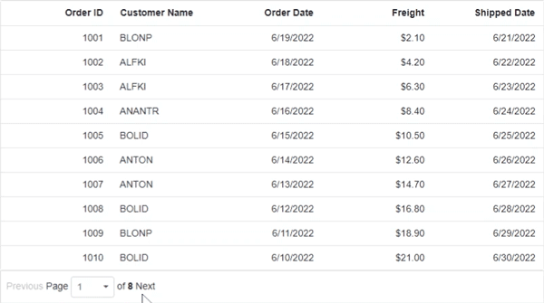

# Pager Component with Template

The Syncfusion<sup style="font-size:70%">&reg;</sup> Blazor Pager component divides large data collections into manageable pages and provides built-in navigation controls. The [Template](https://help.syncfusion.com/cr/blazor/Syncfusion.Blazor.Navigations.SfPager.html#Syncfusion_Blazor_Navigations_SfPager_Template) property extends this functionality by allowing any Blazor content such as **buttons**, **hyperlinks**, or **drop-down lists** to be rendered inside the pager area, enabling fully customized paging experiences that align with application requirements and design guidelines.

This configuration renders two **anchor** elements for navigating to **previous** and **next** pages, with page information displayed between them. Navigation elements are dynamically enabled or disabled based on the current page using Pager APIs.

```cshtml
@using Syncfusion.Blazor.Data
@using Syncfusion.Blazor.Navigations
@using Syncfusion.Blazor.Grids
@using Syncfusion.Blazor.DropDowns
@using Syncfusion.Blazor.Buttons

<div class="control-section">
    <SfGrid @ref="grid" DataSource="@Orders" Query="@queryData">
        <GridColumns>
            <GridColumn Field="@nameof(Order.OrderID)" HeaderText="Order ID" TextAlign="TextAlign.Right" Width="120"></GridColumn>
            <GridColumn Field="@nameof(Order.CustomerID)" HeaderText="Customer Name" Width="150"></GridColumn>
            <GridColumn Field="@nameof(Order.OrderDate)" HeaderText="Order Date" Format="d" Type="ColumnType.Date" TextAlign="TextAlign.Right" Width="130"></GridColumn>
            <GridColumn Field="@nameof(Order.Freight)" HeaderText="Freight" Format="C2" TextAlign="TextAlign.Right" Width="120"></GridColumn>
            <GridColumn Field="@nameof(Order.ShippedDate)" HeaderText="Shipped Date" Format="d" Type="ColumnType.Date" TextAlign="TextAlign.Right" Width="130"></GridColumn>
        </GridColumns>
    </SfGrid>

    <SfPager @ref="pager" TotalItemsCount="80" NumericItemsCount="5" PageSize="10" CurrentPage="1">
        <Template>
            @{
                var pageContext = (context as PagerTemplateContext);
                <div class="e-pagerContainer">
                    <div class="@($"e-navigationStyle {EnablePreviousButton()}")" @onclick="NavigatePreviousPage">
                        <a>Previous</a>
                    </div>
                    <div>
                        <span>Page </span>
                        <SfDropDownList Width="64px" Value="@(ddlIndex + 1)" DataSource="@dropdownDataSource" TValue="int" TItem="TemplateDropdown">
                            <DropDownListEvents TItem="TemplateDropdown" TValue="int" ValueChange="@ValueChangeHandler"></DropDownListEvents>
                            <DropDownListFieldSettings Value="Paging"></DropDownListFieldSettings>
                        </SfDropDownList>
                        <span> of <b>@pageContext.TotalPages</b></span>
                    </div>
                    <div class="@($"e-navigationStyle {EnableNextButton()}")" @onclick="NavigateNextPage">
                        <a>Next</a>
                    </div>
                </div>
            }
        </Template>
    </SfPager>
</div>

<style>
    .disable-pointer { pointer-events: none; }
    .enable-pointer { pointer-events: auto; }
    .e-navigationStyle { padding: 13px 12px 10px 12px; text-align: center; min-width: 26px; }
</style>

@code {
    private SfGrid<Order>? grid;
    private SfPager? pager;
    private bool backButtonDisabled = true;
    private bool forwardButtonDisabled;
    private Query queryData = new Query().Skip(0).Take(10);
    private int ddlIndex = 0;

    public List<Order> Orders { get; set; } = new();
    private List<TemplateDropdown> dropdownDataSource = new()
    {
        new TemplateDropdown() { Paging = 1 },
        new TemplateDropdown() { Paging = 2 },
        new TemplateDropdown() { Paging = 3 },
        new TemplateDropdown() { Paging = 4 },
        new TemplateDropdown() { Paging = 5 },
        new TemplateDropdown() { Paging = 6 },
        new TemplateDropdown() { Paging = 7 },
        new TemplateDropdown() { Paging = 8 }
    };

    protected override void OnInitialized()
    {
        Orders = Enumerable.Range(1, 80).Select(x => new Order()
        {
            OrderID = 1000 + x,
            CustomerID = new[] { "ALFKI", "ANANTR", "ANTON", "BLONP", "BOLID" }[new Random().Next(5)],
            Freight = 2.1 * x,
            OrderDate = DateTime.Now.AddDays(-x),
            ShippedDate = DateTime.Now.AddDays(x)
        }).ToList();
    }

    private async Task ValueChangeHandler(ChangeEventArgs<int, TemplateDropdown> args)
    {
        var currentPage = args.Value - 1;
        int skipValue = currentPage * (pager?.PageSize ?? 10);
        int takeValue = pager?.PageSize ?? 10;
        queryData = new Query().Skip(skipValue).Take(takeValue);
        ddlIndex = currentPage;

        int totalPages = (int)Math.Ceiling((double)(pager?.TotalItemsCount ?? 80) / (pager?.PageSize ?? 10));
        forwardButtonDisabled = args.Value == totalPages;
        backButtonDisabled = args.Value == 1;

        await grid?.Refresh();
        await pager?.GoToPageAsync(args.Value);
    }

    private string EnablePreviousButton() => backButtonDisabled ? "e-disabled disable-pointer" : "enable-pointer";
    private string EnableNextButton() => forwardButtonDisabled ? "e-disabled disable-pointer" : "enable-pointer";

    private async Task NavigatePreviousPage()
    {
        backButtonDisabled = pager?.CurrentPage == 2;
        forwardButtonDisabled = false;
        int skipValue = ((pager?.CurrentPage ?? 2) * (pager?.PageSize ?? 10)) - ((pager?.PageSize ?? 10) * 2);
        queryData = new Query().Skip(skipValue).Take(pager?.PageSize ?? 10);
        ddlIndex--;
        await grid?.Refresh();
        await pager?.GoToPreviousPageAsync();
    }

    private async Task NavigateNextPage()
    {
        backButtonDisabled = false;
        int totalPages = (int)Math.Ceiling((double)(pager?.TotalItemsCount ?? 80) / (pager?.PageSize ?? 10));
        forwardButtonDisabled = pager?.CurrentPage == totalPages - 1;
        int skipValue = (pager?.CurrentPage ?? 1) * (pager?.PageSize ?? 10);
        queryData = new Query().Skip(skipValue).Take(pager?.PageSize ?? 10);
        ddlIndex++;
        await grid?.Refresh();
        await pager?.GoToNextPageAsync();
    }

    public class Order
    {
        public int? OrderID { get; set; }
        public string CustomerID { get; set; }
        public DateTime? OrderDate { get; set; }
        public double? Freight { get; set; }
        public DateTime? ShippedDate { get; set; }
    }

    public class TemplateDropdown
    {
        public int Paging { get; set; }
    }
}
```

