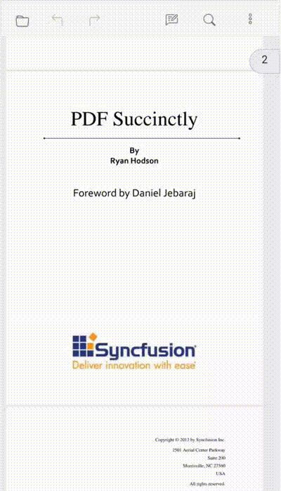
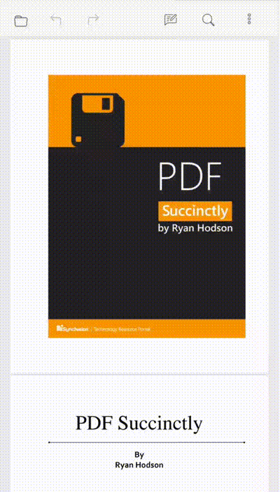

# To open the annotation toolbar

To Open the annotation toolbar, click on the **Edit Annotation** option in the mobile primary toolbar. The mobile annotation toolbar will open at bottom of the viewer.

## To add sticky notes annotation

Click the **Sticky Note Annotation** icon and then click anywhere in the viewer to add the sticky notes. This action will open the comment panel, allowing you to add the required comment for the added sticky notes.

## To add text markup annotation

Long-press to select any text in the PDF, then click on any **Text Markup Annotation** in the annotation toolbar. This action will display the required properties for this annotation in the toolbar.

## To add shape annotation

Click the **Shape Annotation** icon in the toolbar. It will display the supported shape annotations. Choose any annotation type from the list, then click and drag anywhere in the viewer to add the annotation. The toolbar will also switch to display the properties that is required for the added annotation.

## To add measure annotation

Click the **Measure Annotation** icon in the toolbar. It will display the supported measure annotations. Choose any annotation type from the list, then click and drag anywhere in the viewer to add the annotation. The toolbar will also switch to display the properties that is required for the added annotation.

## To add free text annotation

Click the **Free Text Annotation** icon in the toolbar. Which will display the properties that is required for free text. Click anyWhere in the viewer to add the free text annotation.

## To add stamp annotation

Click on the **Stamp Annotation** icon and choose the desired stamp from the various types listed in the menu. Afterward, click anywhere in the viewer to add the stamp. The toolbar will then switch to display the properties required for the stamp annotation.

## To add signature

Click the **Handwritten Signature** icon to open the signature dialog box. Draw your signature in the signature dialog canvas, then click the ‘Create’ button to add the signature into the viewer. Click anywhere in the viewer to place the signature. The toolbar will then switch to display the properties required for the signature.

## To add ink annotation

Click the **Ink Annotation** icon and draw anywhere in the viewer. Once you’ve finished drawing, click the ink annotation displayed in the toolbar to stop the ink annotation drawing. The toolbar will then switch to display the properties required for the ink annotation.

## Change annotation properties (Before adding)

You can modify annotations properties before adding them. Click the rectangle shape annotation, which will display the toolbar with corresponding properties. You can be able to adjust these properties and then add the annotation by clicking and dragging it. The annotation will be added with the modified property.

## Change annotation properties (After adding)

After adding the annotation, you can modify its properties. Select the added annotation, and it will display the corresponding properties. Change the necessary property, and it will reflect in the added annotation.

## Delete Annotation

To delete an annotation, first, select the annotation you want to remove. The delete icon will appear in the property toolbar. Clicking on the delete icon will remove the annotation from the PDF along with its associated comment.

## Open and Close Comment Panel

You can open the comments through the **more option** located at the right end of the mobile primary toolbar.To close the comment panel, click the close icon located within the comment panel.

