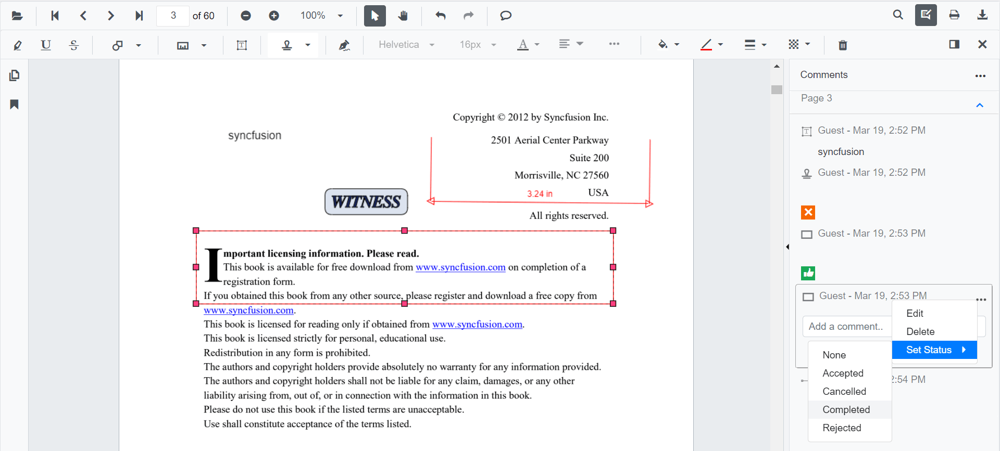
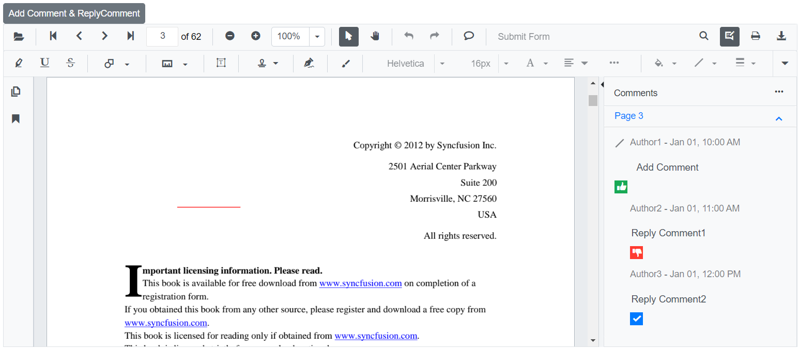
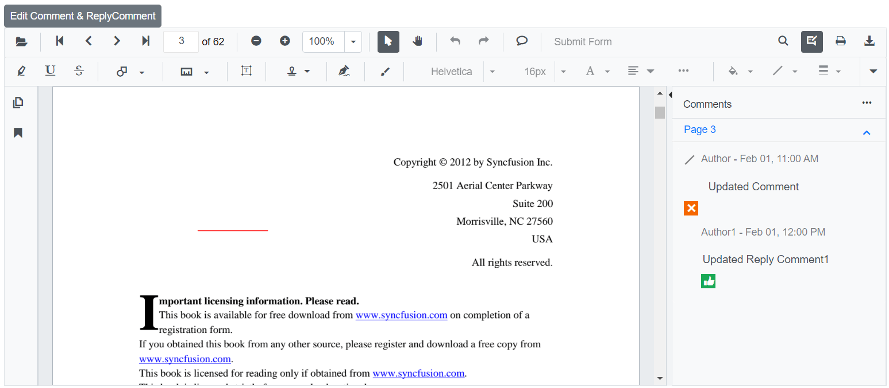
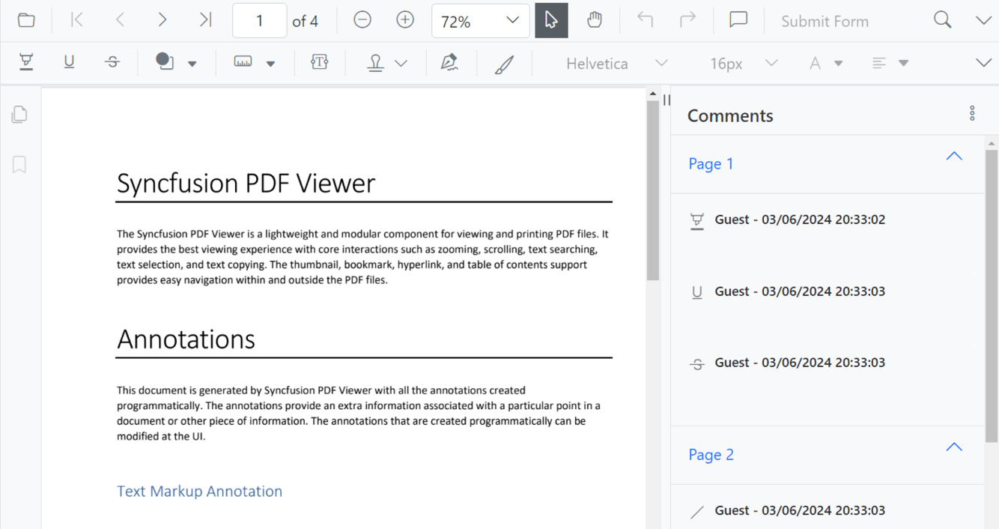
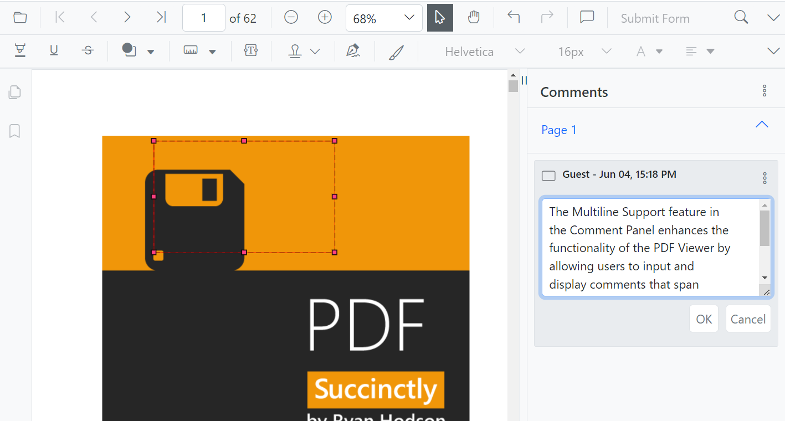

# Comments in Blazor SfPdfViewer Component

The SfPdfViewer control provides options to add, edit, and delete the comments to the following annotation in the PDF documents:

* Shape annotation
* Stamp annotation
* Sticky note annotation
* Measurement annotation
* Text markup annotation
* Free text annotation


## Adding a comment to the annotation

Annotation comment, comment replies, and status can be added to the PDF document using the comment panel.

### Comment panel

Annotation comments can be added to the PDF using the comment panel. Comment panel can be opened by the following ways:

1. Using the annotation menu.

    * Click the Edit Annotation button in the SfPdfViewer toolbar. A toolbar appears below it.
    * Click the Comment Panel button. A comment panel will appear.

2. Using Context menu.

    * Select annotation in the PDF document and right-click it.
    * Select comment option in the context menu that appears.

3. Using Mouse click.

    * Select annotation in the PDF document and double click it, a comment panel will appear.

If the comment panel is already in open state, you can select the annotations and add annotation comment using comment panel.

### Adding comments

* Select annotation in the PDF document and click it.
* Selected annotation comment container is highlighted in the comment panel.
* Now, you can add comment and comment replies using comment panel.


### Adding Comment Replies

* SfPdfViewer control provides an option to add multiple replies to the comment.
* After adding the annotation comment, you can add reply to the comment.

### Adding Comment or Reply Status

* Select the Annotation Comments in the comment panel.
* Click the more options button showing in Comments or reply container.
* Select Set Status option in the context menu that appears.
* Select the status of the annotation comment in the context menu that appears.



### Editing the comments and comments replies of the annotations

The comment, comment replies, and status of the annotation can be edited using the comment panel.

### Editing Comment or Comment Replies

The annotation comment and comment replies can be edited by the following ways:

1. Using Context menu.

    * Select the Annotation Comments in comment panel.
    * Click the More option button showing in Comments or reply container.
    * Select Edit option in the context menu that appears.
    * Now, editable text box appears. You can change the content of the annotation comment or comment reply.

2. Using Mouse Click.

    * Select the annotation comments in comment panel.
    * Double click the comment or comment reply content.
    * Now, editable text box appears. You can change the content of the annotation comment or comment reply.

### Editing Comment or Reply Status

* Select the Annotation Comments in comment panel.
* Click the more options button showing in Comments or reply container.
* Select Set Status option in the context menu that appears.
* Select the status of the annotation comment in the context menu that appears.
* Status ‘None’ is the default state. If status set to ‘None’, the comments or reply does not appear.


### Delete Comment or Comment Replies

* Select the Annotation Comments in comment panel.
* Click the more options button shown in Comments or reply container.
* Select Delete option in the context menu that appears.


N> The annotation will be deleted on deleting the comment using comment panel.

### Show or hide the Comment panel

The SfPdfViewer control provides an option to show or hide the Comment panel by using the `CommentPanelVisible` property of the SfPdfViewerServer class.

The following code snippet explains how to show the Comment panel.

```cshtml

@using Syncfusion.Blazor.Buttons
@using Syncfusion.Blazor.SfPdfViewer

<SfButton OnClick="@OnClick">ShowOrHideCommentPanel</SfButton>
<SfPdfViewer2 @ref="Viewer"
              @bind-CommentPanelVisible="@isOpen"
              DocumentPath=@DocumentPath
              Height="100%"
              Width="100%">
</SfPdfViewer2>

@code
{
    SfPdfViewer2 Viewer;
    //Sets the PDF document path for initial loading.
    private string DocumentPath { get; set; } = "wwwroot/Data/PDF_Succinctly.pdf";

    private bool isOpen = true;
    //Method to update the visibility of the comment panel.

    public void OnClick()
    {
        if(isOpen)
        {
            isOpen = false;
        }
        else
        {
            isOpen = true;
        }
    }
}
```
[View sample in GitHub](https://github.com/SyncfusionExamples/blazor-pdf-viewer-examples/tree/master/Annotations/Comment%20Panel/Show%20or%20hide%20comment%20panel%20-%20SfPdfViewer).

## Add Comments and Reply Comments Programmatically

The Blazor SfPdfViewer offers the capability to programmatically add the line annotation with Comment and Reply Comment to the annotation within the SfPdfViewer control using the [AddAnnotationAsync](https://help.syncfusion.com/cr/blazor/Syncfusion.Blazor.SfPdfViewer.PdfViewerBase.html#Syncfusion_Blazor_SfPdfViewer_PdfViewerBase_AddAnnotationAsync_Syncfusion_Blazor_SfPdfViewer_PdfAnnotation_) method.

Below is an example demonstrating how you can use this method to add Line annotation with Comment and Reply Comment to a PDF document:

```cshtml

@using Syncfusion.Blazor.Buttons
@using Syncfusion.Blazor.SfPdfViewer

<SfButton OnClick="@AddCommentandReplyCommentAsync">Add Comment & ReplyComment</SfButton>
<SfPdfViewer2 Width="100%" Height="100%" DocumentPath="@DocumentPath" @ref="@Viewer" />

@code {
    SfPdfViewer2 Viewer;
    public string DocumentPath { get; set; } = "wwwroot/Data/Comment_and_Reply_Comment.pdf";

    public async void AddCommentandReplyCommentAsync(MouseEventArgs args)
    {
        PdfAnnotation annotation = new PdfAnnotation();
        // Set the annotation type of Line
        annotation.Type = AnnotationType.Line;
        // Set the PageNumber starts from 0. So, if set 0 it repersent the page 1.
        annotation.PageNumber = 0;

        // Vertex Points of the Line Annotation
        List<VertexPoint> vertexPoints = new List<VertexPoint>();
        VertexPoint vertexPoint = new VertexPoint();
        vertexPoint.X = 200;
        vertexPoint.Y = 200;
        vertexPoints.Add(vertexPoint);
        vertexPoint = new VertexPoint();
        vertexPoint.X = 300;
        vertexPoint.Y = 200;
        vertexPoints.Add(vertexPoint);
        // Set the VertexPoints of Line annotation
        annotation.VertexPoints = vertexPoints;

        // Add Comment
        annotation.Note = "Add Comment";

        // Add Comment Status
        annotation.Review = new Review();
        annotation.Review.State = "Accepted";

        // Add Comment Author name
        annotation.Author = "Author1";

        // Add Comment Modified Date
        annotation.ModifiedDate = "1/1/2024 10:00:00 AM";

        // Add Reply Comment
        List<Comment> comments = new List<Comment>();
        Comment comment = new Comment();

        // Add First Reply Comment
        comment.Note = "Reply Comment1";
        // Add First Reply Comment Author name
        comment.Author = "Author2";

        // Add First Reply Comment Modified Date
        comment.ModifiedDate = "1/1/2024 11:00:00 AM";

        // Add First Reply Comment Status
        comment.State = "Rejected";
        comments.Add(comment);

        comment = new Comment();
        // Add Second Reply Comment
        comment.Note = "Reply Comment2";

        // Add Second Reply Comment Author name
        comment.Author = "Author3";

        // Add Second Reply Comment Modified Date
        comment.ModifiedDate = "1/1/2024 12:00:00 PM";

        // Add Second Reply Comment Status
        comment.State = "Completed";
        comments.Add(comment);

        // Add Reply Comment
        annotation.Comments = comments;

        // Add Line annotation with Comments and Reply Comments
        await Viewer.AddAnnotationAsync(annotation);
    }
}

```

This code will add a line annotation with comment and reply comment to the first page of the PDF document.



[View sample in GitHub](https://github.com/SyncfusionExamples/blazor-pdf-viewer-examples/tree/master/Annotations/Programmatic%20Support/Comment/Add).

## Edit Comments and Reply Comments Programmatically

The Blazor SfPdfViewer offers the capability to programmatically edit the Comment and Reply Comment of the annotation within the SfPdfViewer control using the [EditAnnotationAsync](https://help.syncfusion.com/cr/blazor/Syncfusion.Blazor.SfPdfViewer.PdfViewerBase.html#Syncfusion_Blazor_SfPdfViewer_PdfViewerBase_EditAnnotationAsync_Syncfusion_Blazor_SfPdfViewer_PdfAnnotation_) method.

Below is an example demonstrating how you can utilize this method to edit the Comment and Reply Comment of the annotation programmatically:

```cshtml

@using Syncfusion.Blazor.Buttons
@using Syncfusion.Blazor.SfPdfViewer

<SfButton OnClick="@EditCommentandReplyCommentAsync">Edit Comment & ReplyComment</SfButton>
<SfPdfViewer2 Width="100%" Height="100%" DocumentPath="@DocumentPath" @ref="@Viewer" />

@code {
    SfPdfViewer2 Viewer;
    public string DocumentPath { get; set; } = "wwwroot/Data/Comment_and_Reply_Comment.pdf";

    public async void EditCommentandReplyCommentAsync(MouseEventArgs args)
    {
        // Get annotation collection
        List<PdfAnnotation> annotationCollection = await Viewer.GetAnnotationsAsync();
        // Select the annotation want to edit
        PdfAnnotation annotation = annotationCollection[0];
        // Edit the Comment of Annotation
        annotation.Note = "Updated Comment";
        // Edit the Comment Status of Annotation
        annotation.Review.State = "Cancelled";
        // Edit the Comment Author of Annotation
        annotation.Author = "Author";
        // Edit the Comment ModifiedDate of Annotation
        annotation.ModifiedDate = "2/1/2024 11:00:00 AM";
        // Edit the Reply Comment of Annotation
        annotation.Comments[0].Note = "Updated Reply Comment1";
        // Edit the Reply Comment Status of Annotation
        annotation.Comments[0].State = "Accepted";
        // Edit the Reply Comment Author of Annotation
        annotation.Comments[0].Author = "Author1";
        // Edit the Reply Comment ModifiedDate of Annotation
        annotation.Comments[0].ModifiedDate = "2/1/2024 12:00:00 PM";
        // Delete or Remove Second Reply Comment
        annotation.Comments.RemoveAt(1);
        // Edit the Line Annotation Comments and Reply Comments
        await Viewer.EditAnnotationAsync(annotation);
    }
}

```
This code snippet will edit the comment and reply comment programmatically within the SfPdfViewer control.



[View sample in GitHub](https://github.com/SyncfusionExamples/blazor-pdf-viewer-examples/tree/master/Annotations/Programmatic%20Support/Comment/Edit).

## Customizing DateTime Format

The PDF Viewer provides the support to customize the date and time format displayed in the comment panel using the [PdfViewerCommentPanelSettings](https://help.syncfusion.com/cr/blazor/Syncfusion.Blazor.SfPdfViewer.html). This feature allows you to tailor the appearance of date and time according to your preferences or regional standards.   

The [DateTimeFormat](https://help.syncfusion.com/cr/blazor/Syncfusion.Blazor.SfPdfViewer.html) API in [PdfViewerCommentPanelSettings](https://help.syncfusion.com/cr/blazor/Syncfusion.Blazor.SfPdfViewer.html) enables you to change the format of date and time displayed in the comment panel. 

The following table describes various supported patterns

| Format | Result |
|---|---|
| DateTime.Now.ToString("MM/dd/yyyy") | 05/29/2015 |
| DateTime.Now.ToString("dddd, dd MMMM yyyy") | Friday, 29 May 2015 |
| DateTime.Now.ToString("dddd, dd MMMM yyyy HH:mm") | Friday, 29 May 2015 05:50 |
| DateTime.Now.ToString("dddd, dd MMMM yyyy HH:mm tt") | Friday, 29 May 2015 05:50 AM |
| DateTime.Now.ToString("dddd, dd MMMM yyyy H:mm") | Friday, 29 May 2015 5:50 |
| DateTime.Now.ToString("dddd, dd MMMM yyyy H:mm tt") | Friday, 29 May 2015 5:50 AM |
| DateTime.Now.ToString("dddd, dd MMMM yyyy HH:mm:ss") | Friday, 29 May 2015 05:50:06 |
| DateTime.Now.ToString("MM/dd/yyyy HH:mm") | 05/29/2015 05:50 |
| DateTime.Now.ToString("MM/dd/yyyy hh:mm tt") | 05/29/2015 05:50 AM |
| DateTime.Now.ToString("MM/dd/yyyy H:mm") | 05/29/2015 5:50 |
| DateTime.Now.ToString("MM/dd/yyyy h:mm tt") | 05/29/2015 5:50 AM |
| DateTime.Now.ToString("MM/dd/yyyy HH:mm:ss") | 05/29/2015 05:50:06 |
| DateTime.Now.ToString("MMMM dd") | May 29 |
| DateTime.Now.ToString("yyyy’-‘MM’-‘dd’T’HH’:’mm’:’ss.fffffffK") | 2015-05-16T05:50:06.7199222-04:00 |
| DateTime.Now.ToString("ddd, dd MMM yyy HH’:’mm’:’ss ‘GMT’") | Fri, 16 May 2015 05:50:06 GMT |
| DateTime.Now.ToString("yyyy’-‘MM’-‘dd’T’HH’:’mm’:’ss") | 2015-05-16T05:50:06 |
| DateTime.Now.ToString("HH:mm") | 05:50 |
| DateTime.Now.ToString("hh:mm tt") | 05:50 AM |
| DateTime.Now.ToString("H:mm") | 5:50 |
| DateTime.Now.ToString("h:mm tt") | 5:50 AM |
| DateTime.Now.ToString("HH:mm:ss") | 05:50:06 |
| DateTime.Now.ToString("yyyy MMMM") | 2015 May |

Here is a sample code snippet demonstrating how to apply this setting 

```cshtml

@using Syncfusion.Blazor.SfPdfViewer; 

<SfPdfViewer2 DocumentPath="@DocumentPath" Height="100%" Width="100%" EnableAnnotationToolbar="true" CommentPanelVisible="true"> 
    <PdfViewerCommentPanelSettings DateTimeFormat=@dateFormat> </PdfViewerCommentPanelSettings>
</SfPdfViewer2> 

@code { 
    // This is a valid C# datetime format 
    private string dateFormat = "dd/MM/yyyy HH:mm:ss"; 
    private string DocumentPath { get; set; } = "wwwroot/Annotation.pdf"; 
} 

```
This code implements date and time formatting for the comment panel of the PDF viewer 



[View sample in GitHub](https://github.com/SyncfusionExamples/blazor-pdf-viewer-examples/tree/889407_vol2_2024/Annotations/Comment%20Panel/Customize%20DateTimeFormat%20-%20SfPdfViewer).

## Enabling Multiline Support 

The multiline support feature in the comment panel enhances the functionality of the PDF Viewer by allowing users to input and display comments that span multiple lines. The PDF Viewer provides the support to enable multiline support in the comment panel using the [PdfViewerCommentPanelSettings](https://help.syncfusion.com/cr/blazor/Syncfusion.Blazor.SfPdfViewer.html). 

The [Multiline](https://help.syncfusion.com/cr/blazor/Syncfusion.Blazor.SfPdfViewer.html) API in [PdfViewerCommentPanelSettings](https://help.syncfusion.com/cr/blazor/Syncfusion.Blazor.SfPdfViewer.html) is used to enable or disable multiline support in the comment panel.

Here is a sample code snippet demonstrating how to apply this setting

```cshtml

@using Syncfusion.Blazor.SfPdfViewer; 

<SfPdfViewer2 DocumentPath="@DocumentPath" Height="100%" Width="100%" EnableAnnotationToolbar="true" CommentPanelVisible="true"> 
    <PdfViewerCommentPanelSettings Multiline=@multiline> </PdfViewerCommentPanelSettings> 
</SfPdfViewer2> 

@code {
    // This variable stores the user's choice for enabling or disabling multiline support 
    private bool multiline = true; 
    private string DocumentPath { get; set; } = "wwwroot/Annotation.pdf";
}

```

This code will enable multiline support in the Comment panel of the PDF Viewer



[View sample in GitHub](https://github.com/SyncfusionExamples/blazor-pdf-viewer-examples/tree/889407_vol2_2024/Annotations/Comment%20Panel/Enable%20Multiline%20Support%20-%20SfPdfViewer).

## See also

* [How to delete the annotation programmatically](./text-markup-annotation#delete-annotation-programmatically)