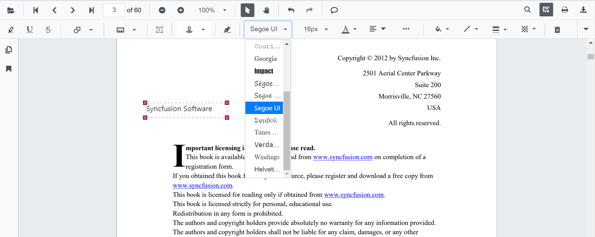
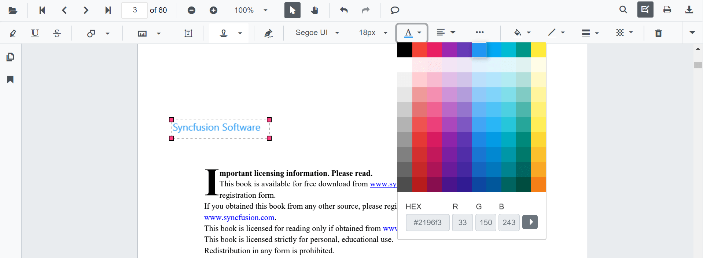
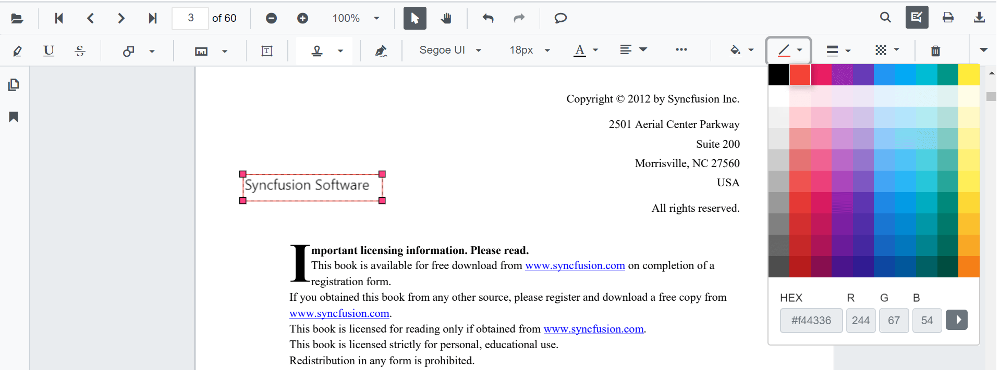
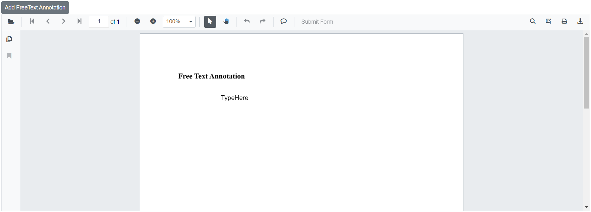
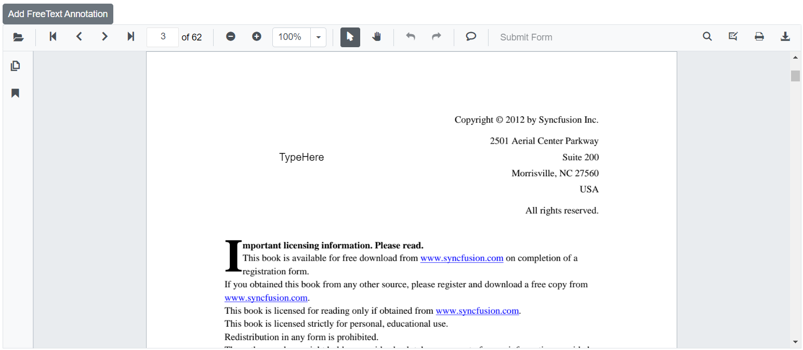

# Free text annotations in Blazor SfPdfViewer Component

The SfPdfViewer control provides the options to add, edit and delete the free text annotations.

## Adding a free text annotation to the PDF document

The free text annotations can be added to the PDF document using the annotation toolbar.

* Click the **Edit Annotation** button in the SfPdfViewer toolbar. A toolbar appears below it. 
* Select the **Free Text Annotation** button in the annotation toolbar. It enables the Free Text Annotation mode.
* You can add the text over the pages of the PDF document.

In the pan mode, if the free text annotation mode is entered, the SfPdfViewer control will switch to text select mode.


```cshtml

@using Syncfusion.Blazor.Buttons
@using Syncfusion.Blazor.SfPdfViewer

<SfButton OnClick="OnClick">Free Text</SfButton>
<SfPdfViewer2 @ref="viewer" DocumentPath=@DocumentPath Height="100%" Width="100%" ></SfPdfViewer2>

@code {
    SfPdfViewer2 viewer;
    private string DocumentPath { get; set; } = "wwwroot/Data/PDF_Succinctly.pdf";

    public async void OnClick(MouseEventArgs args)
    {
        await viewer.SetAnnotationModeAsync(AnnotationType.FreeText);
    }
}

```

## Editing the properties of free text annotation

The font family, font size, font styles, font color, text alignment, fill color, the border stroke color, border thickness, and opacity of the free text annotation can be edited using the Font Family tool, Font Size tool, Font Color tool, Text Align tool, Font Style tool  Edit Color tool, Edit Stroke Color tool, Edit Thickness tool, and Edit Opacity tool in the annotation toolbar.

### Editing font family

The font family of the annotation can be edited by selecting the desired font in the Font Family tool.



### Editing font size

The font size of the annotation can be edited by selecting the desired size in the Font Size tool.


### Editing font color

The font color of the annotation can be edited using the color palette provided in the Font Color tool.



### Editing the text alignment

The text in the annotation can be aligned by selecting the desired styles in the dropdown pop-up in the Text Align tool.


### Editing text styles

The style of the text in the annotation can be edited by selecting the desired styles in the dropdown pop-up in the Font Style tool.


### Editing fill color

The fill color of the annotation can be edited using the color palette provided in the Edit Color tool.


### Editing stroke color

The stroke color of the annotation can be edited using the color palette provided in the Edit Stroke Color tool.



### Editing thickness

The thickness of the border of the annotation can be edited using the range slider provided in the Edit Thickness tool.


### Editing opacity

The opacity of the annotation can be edited using the range slider provided in the Edit Opacity tool.


## Setting default properties during control initialization

The properties of the free text annotation can be set before creating the control using FreeTextSettings.

After editing the default values, they will be changed to the selected values.

```cshtml

@using Syncfusion.Blazor.SfPdfViewer

<SfPdfViewer2 @ref="viewer" DocumentPath=@DocumentPath Height="100%" Width="100%" 
FreeTextSettings=@FreeTextSettings></SfPdfViewer2>

@code {
    SfPdfViewer2 viewer;
    private string DocumentPath { get; set; } = "wwwroot/Data/PDF_Succinctly.pdf";
    
    PdfViewerFreeTextSettings FreeTextSettings = new PdfViewerFreeTextSettings 
    { 
        FillColor = "green", 
        BorderColor = "blue", 
        FontColor = "yellow" 
    };
}

```

## Add free text annotation programmatically

The Blazor SfPdfViewer offers the capability to programmatically add the free text annotation within the SfPdfViewer control using the [AddAnnotationAsync](https://help.syncfusion.com/cr/blazor/Syncfusion.Blazor.SfPdfViewer.PdfViewerBase.html#Syncfusion_Blazor_SfPdfViewer_PdfViewerBase_AddAnnotationAsync_Syncfusion_Blazor_SfPdfViewer_PdfAnnotation_) method.

Below is an example demonstrating how you can use this method to add free text annotation to a PDF document:

```cshtml

@using Syncfusion.Blazor.Buttons
@using Syncfusion.Blazor.SfPdfViewer

<SfButton OnClick="@AddFreeTextAnnotationAsync">Add FreeText Annotation</SfButton>
<SfPdfViewer2 Width="100%" Height="100%" DocumentPath="@DocumentPath" @ref="@Viewer" />

@code {
    SfPdfViewer2 Viewer;
    public string DocumentPath { get; set; } = "wwwroot/Data/Free_Text_Annotation.pdf";

    public async void AddFreeTextAnnotationAsync(MouseEventArgs args)
    {
        PdfAnnotation annotation = new PdfAnnotation();
        // Set the annotation type of free text
        annotation.Type = AnnotationType.FreeText;
        // Set the PageNumber starts from 0. So, if set 0 it repersent the page 1.
        annotation.PageNumber = 0;

        // Bound of the free text annotation
        annotation.Bound = new Bound();
        annotation.Bound.X = 200;
        annotation.Bound.Y = 150;
        annotation.Bound.Width = 150;
        annotation.Bound.Height = 30;
        // Add free text annotation
        await Viewer.AddAnnotationAsync(annotation);
    }
}

```

This code will add a free text annotation to the first page of the PDF document.



[View sample in GitHub](https://github.com/SyncfusionExamples/blazor-pdf-viewer-examples/tree/master/Annotations/Programmatic%20Support/Free%20Text/Add).

## Edit free text annotation programmatically

The Blazor SfPdfViewer offers the capability to programmatically edit the free text annotation within the SfPdfViewer control using the [EditAnnotationAsync](https://help.syncfusion.com/cr/blazor/Syncfusion.Blazor.SfPdfViewer.PdfViewerBase.html#Syncfusion_Blazor_SfPdfViewer_PdfViewerBase_EditAnnotationAsync_Syncfusion_Blazor_SfPdfViewer_PdfAnnotation_) method.

Below is an example demonstrating how you can utilize this method to edit the free text annotation programmatically:

```cshtml

@using Syncfusion.Blazor.Buttons
@using Syncfusion.Blazor.SfPdfViewer

<SfButton OnClick="@EditFreeTextAnnotationAsync">Edit FreeText Annotation</SfButton>
<SfPdfViewer2 Width="100%" Height="100%" DocumentPath="@DocumentPath" @ref="@Viewer" />

@code {
    SfPdfViewer2 Viewer;
    public string DocumentPath { get; set; } = "wwwroot/Data/Free_Text_Annotation.pdf";

    public async void EditFreeTextAnnotationAsync(MouseEventArgs args)
    {
        // Get annotation collection
        List<PdfAnnotation> annotationCollection = await Viewer.GetAnnotationsAsync();
        // Select the annotation want to edit
        PdfAnnotation annotation = annotationCollection[0];
        // Change the position of the free text annotation
        annotation.Bound.X = 125;
        annotation.Bound.Y = 125;
        // Change the width and height of the free text annotation
        annotation.Bound.Width = 250;
        annotation.Bound.Height = 40;
        // Change the font style of free text annotation like bold, italic, underline strikethrough
        annotation.FontStyle = FontStyle.Bold | FontStyle.Italic;
        // Change the font size of free text annotation
        annotation.FontSize = 20;
        // Change the font color of free text annotation
        annotation.FontColor = "#00008B";
        // Change the font family of free text annotation
        annotation.FontFamily = "Symbol";
        // Change the border width of free text annotation
        annotation.BorderWidth = 3;
        // Change the border color of free text annotation
        annotation.BorderColor = "#000000";
        // Change the text of free text annotation
        annotation.DynamicText = "Modified Free Text";
        // Change the text align of free text annotation
        annotation.TextAlignment = TextAlignment.Center;
        // Change the fill color of free text annotation
        annotation.FillColor = "#FFFF00";
        // Change the Opacity (0 to 1) of free text annotation
        annotation.Opacity = 0.5;
        // Edit the free text annotation
        await Viewer.EditAnnotationAsync(annotation);
    }
}

```

This code snippet will edit the free text annotation programmatically within the SfPdfViewer control.



[View sample in GitHub](https://github.com/SyncfusionExamples/blazor-pdf-viewer-examples/tree/master/Annotations/Programmatic%20Support/Free%20Text/Edit).

## See also

* [How to delete the annotation programmatically](./text-markup-annotation#delete-annotation-programmatically)