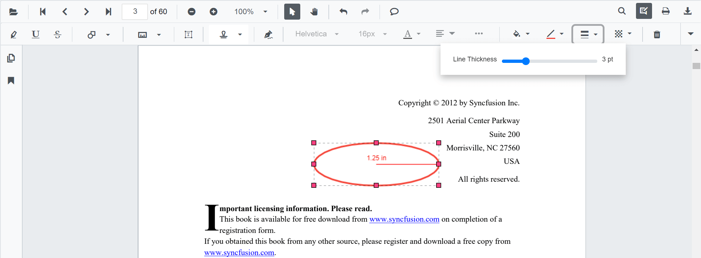
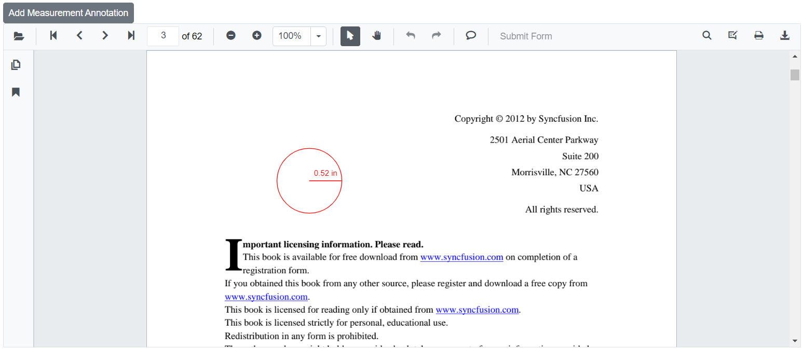
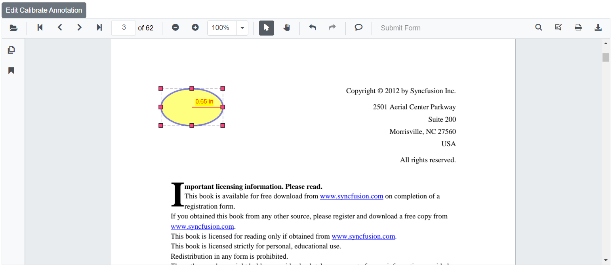

# Measurement annotations in Blazor SfPdfViewer Component

The SfPdfViewer provides the options to add measurement annotations. The page annotations can be measured with the help of measurement annotation. The supported measurement annotations in the SfPdfViewer control are:

* Distance
* Perimeter
* Area
* Radius
* Volume


## Adding measurement annotations to the PDF document

The measurement annotations can be added to the PDF document using the annotation toolbar.

* Click the **Edit Annotation** button in the SfPdfViewer toolbar. A toolbar appears below it.
* Click the **measurement Annotation** dropdown button. A dropdown pop-up will appear and shows the measurement annotations to be added.
* Select the measurement type to be added to the page in the dropdown pop-up. It enables the selected measurement annotation mode.
* You can measure and add the annotation over the pages of the PDF document.

In the pan mode, if the measurement annotation mode is entered, the SfPdfViewer control will switch to text select mode.


```cshtml

@using Syncfusion.Blazor.SfPdfViewer
@using Syncfusion.Blazor.Buttons

<SfButton OnClick="OnClick">Measurement Annotation</SfButton>
<SfPdfViewer2 DocumentPath="@DocumentPath"
              @ref="viewer"
              Width="100%"
              Height="100%">
</SfPdfViewer2>

@code {
    SfPdfViewer2 viewer;

    public async void OnClick(MouseEventArgs args)
    {
        await viewer.SetAnnotationModeAsync(AnnotationType.Distance);
    }
    private string DocumentPath { get; set; } = "wwwroot/Data/PDF_Succinctly.pdf";
}

```

## Editing the properties of measurement annotation

The fill color, stroke color, thickness, and opacity of the measurement annotation can be edited using the Edit Color tool, Edit Stroke Color tool, Edit Thickness tool, and Edit Opacity tool in the annotation toolbar.

### Editing fill color

The fill color of the annotation can be edited using the color palette provided in the Edit Color tool.


### Editing stroke color

The stroke color of the annotation can be edited using the color palette provided in the Edit Stroke Color tool.


### Editing thickness

The thickness of the border of the annotation can be edited using the range slider provided in the Edit thickness tool.



### Editing opacity

The opacity of the annotation can be edited using the range slider provided in the Edit Opacity tool.


### Editing the line properties

The properties of the line shapes such as distance and perimeter annotations can be edited using the Line properties window. It can be opened by selecting the Properties option in the context menu that appears on right-clicking the distance and perimeter annotations.


## Setting default properties during control initialization

The properties of the shape annotations can be set before creating the control using distanceSettings, perimeterSettings, areaSettings, radiusSettings and volumeSettings.

```cshtml

@using Syncfusion.Blazor.Buttons
@using Syncfusion.Blazor.SfPdfViewer

<SfPdfViewer2 @ref="@viewer"
              DocumentPath="@DocumentPath"
              Height="100%" Width="100%"
              DistanceSettings="@DistanceSettings"
              PerimeterSettings="@PerimeterSettings"
              AreaSettings="@AreaSettings"
              RadiusSettings="@RadiusSettings"
              VolumeSettings="@VolumeSettings">
</SfPdfViewer2>

@code {
    SfPdfViewer2 viewer;
    private string DocumentPath { get; set; } = "wwwroot/Data/PDF_Succinctly.pdf";
    
    PdfViewerDistanceSettings DistanceSettings = new PdfViewerDistanceSettings
        {
            FillColor = "blue",
            Opacity = 0.6,
            StrokeColor = "green",
            LineHeadEndStyle = LineHeadStyle.Closed,
            LineHeadStartStyle = LineHeadStyle.Round
        };
    PdfViewerPerimeterSettings PerimeterSettings = new PdfViewerPerimeterSettings
        {
            FillColor = "green",
            Opacity = 0.6,
            StrokeColor = "blue"
        };
    PdfViewerAreaSettings AreaSettings = new PdfViewerAreaSettings
        {
            FillColor = "yellow",
            Opacity = 0.6,
            StrokeColor = "orange"
        };
    PdfViewerVolumeSettings VolumeSettings = new PdfViewerVolumeSettings
        {
            FillColor = "orange",
            Opacity = 0.6,
            StrokeColor = "pink"
        };
    PdfViewerRadiusSettings RadiusSettings = new PdfViewerRadiusSettings
        {
            FillColor = "pink",
            Opacity = 0.6,
            StrokeColor = "yellow"
        };
}

```

## Editing scale ratio and unit of the measurement annotation

The scale ratio and unit of measurement can be modified using the scale ratio option provided in the context menu of the PDF Viewer control.


The Units of measurements support for the measurement annotations in the PDF Viewer are

* Inch
* Millimeter
* Centimeter
* Point
* Pica
* Feet


## Setting default scale ratio settings during control initialization

The properties of scale ratio for measurement annotation can be set before creating the control using ScaleRatioSettings as shown in the following code snippet,

```cshtml

@using Syncfusion.Blazor.SfPdfViewer

<SfPdfViewer2 @ref="@viewer"
              DocumentPath="@DocumentPath"
              MeasurementSettings="@MeasurementSettings"
              Height="100%"
              Width="100%">
</SfPdfViewer2>


@code {
    SfPdfViewer2 viewer;
    private string DocumentPath { get; set; } = "wwwroot/Data/PDF_Succinctly.pdf";

    PdfViewerMeasurementSettings MeasurementSettings = new PdfViewerMeasurementSettings 
    { 
        ScaleRatio = 2, 
        ConversionUnit = CalibrationUnit.Cm 
    };
}
```

## Add measurement annotation programmatically

The Blazor SfPdfViewer offers the capability to programmatically add the measurement annotation within the SfPdfViewer control using the [AddAnnotationAsync](https://help.syncfusion.com/cr/blazor/Syncfusion.Blazor.SfPdfViewer.PdfViewerBase.html#Syncfusion_Blazor_SfPdfViewer_PdfViewerBase_AddAnnotationAsync_Syncfusion_Blazor_SfPdfViewer_PdfAnnotation_) method.

Below is an example demonstrating how you can use this method to add measurement annotation to a PDF document:

```cshtml

@using Syncfusion.Blazor.Buttons
@using Syncfusion.Blazor.SfPdfViewer

<SfButton OnClick="@AddMeasurementAnnotationAsync">Add Measurement Annotation</SfButton>
<SfPdfViewer2 Width="100%" Height="100%" DocumentPath="@DocumentPath" @ref="@Viewer" />

@code {
    SfPdfViewer2 Viewer;
    public string DocumentPath { get; set; } = "wwwroot/Data/Measurement_Annotation.pdf";

    public async void AddMeasurementAnnotationAsync(MouseEventArgs args)
    {
        PdfAnnotation annotation = new PdfAnnotation();
        // Set the annotation type of measurement annotation like radius, distance, perimeter, area, volume
        annotation.Type = AnnotationType.Radius;
        // Set the PageNumber starts from 0. So, if set 0 it represents the page 1.
        annotation.PageNumber = 0;

        // Bound of the radius annotation
        annotation.Bound = new Bound();
        annotation.Bound.X = 200;
        annotation.Bound.Y = 150;
        annotation.Bound.Width = 100;
        annotation.Bound.Height = 100;
        // Add radius measurement annotation
        await Viewer.AddAnnotationAsync(annotation);
    }
}

```

This code will add a measurement annotation to the first page of the PDF document.



[View sample in GitHub](https://github.com/SyncfusionExamples/blazor-pdf-viewer-examples/tree/master/Annotations/Programmatic%20Support/Measurement/Add).

## Edit measurement annotation programmatically

The Blazor SfPdfViewer offers the capability to programmatically edit the measure annotation within the SfPdfViewer control using the [EditAnnotationAsync](https://help.syncfusion.com/cr/blazor/Syncfusion.Blazor.SfPdfViewer.PdfViewerBase.html#Syncfusion_Blazor_SfPdfViewer_PdfViewerBase_EditAnnotationAsync_Syncfusion_Blazor_SfPdfViewer_PdfAnnotation_) method.

Below is an example demonstrating how you can utilize this method to edit the measure annotation programmatically:

```cshtml

@using Syncfusion.Blazor.Buttons
@using Syncfusion.Blazor.SfPdfViewer

<SfButton OnClick="@EditMeasurementAnnotationAsync">Edit Measurement Annotation</SfButton>
<SfPdfViewer2 Width="100%" Height="100%" DocumentPath="@DocumentPath" @ref="@Viewer" />

@code {
    SfPdfViewer2 Viewer;
    public string DocumentPath { get; set; } = "wwwroot/Data/Measurement_Annotation.pdf";

    public async void EditMeasurementAnnotationAsync(MouseEventArgs args)
    {
        // Get annotation collection
        List<PdfAnnotation> annotationCollection = await Viewer.GetAnnotationsAsync();
        // Select the annotation want to edit
        PdfAnnotation annotation = annotationCollection[0];
        // Change the position of the radius annotation
        annotation.Bound.X = 125;
        annotation.Bound.Y = 125;
        // Change the width and height of the radius annotation
        annotation.Bound.Width = 125;
        annotation.Bound.Height = 75;
        // Change the fill color of radius annotation
        annotation.FillColor = "#FFFF00";
        // Change the stroke color of radius annotation
        annotation.StrokeColor = "#0000FF";
        // Change the thickness of radius annotation
        annotation.Thickness = 3;
        // Change the opacity (0 to 1) of radius annotation
        annotation.Opacity = 0.5;
        // Edit the radius measurement annotation
        await Viewer.EditAnnotationAsync(annotation);
    }
}

```

This code snippet will edit the measurement annotation programmatically within the SfPdfViewer control.



[View sample in GitHub](https://github.com/SyncfusionExamples/blazor-pdf-viewer-examples/tree/master/Annotations/Programmatic%20Support/Measurement/Edit).

## See also

* [How to delete the annotation programmatically](./text-markup-annotation#delete-annotation-programmatically)