# Redaction annotations in Blazor SfPdfViewer Component

Redaction annotations help hide sensitive content in a PDF. Syncfusion Blazor PDF Viewer supports both interactive and programmatic redaction annotation annotations with customization and final application support.

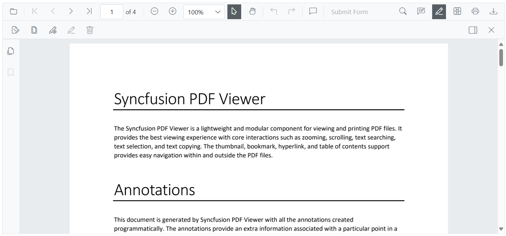

## Adding a Redaction annotation to the PDF document

The redaction feature in the Blazor PDF Viewer allows users to hide sensitive content by adding redaction annotations to PDF pages. These annotations can be added either through the toolbar or programmatically, making the feature easy to use.

### Adding a Redaction annotation using Toolbar

The Blazor PDF Viewer provides support for redacting sensitive content through redaction annotations. Users can activate the redaction tool from the toolbar and draw over specific content on the PDF pages to mark it for redaction. Once applied, the redaction annotation can display an overlay text (e.g., “Confidential”) or can be styled using customizable fill color property.

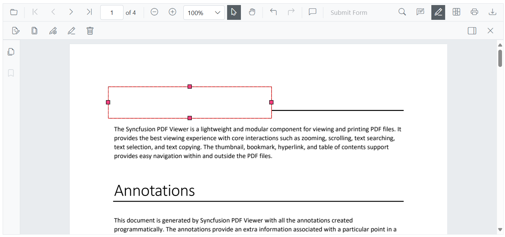

#### Redaction annotations are fully interactive:

* **Movable**: Users can reposition the annotation within the same page.

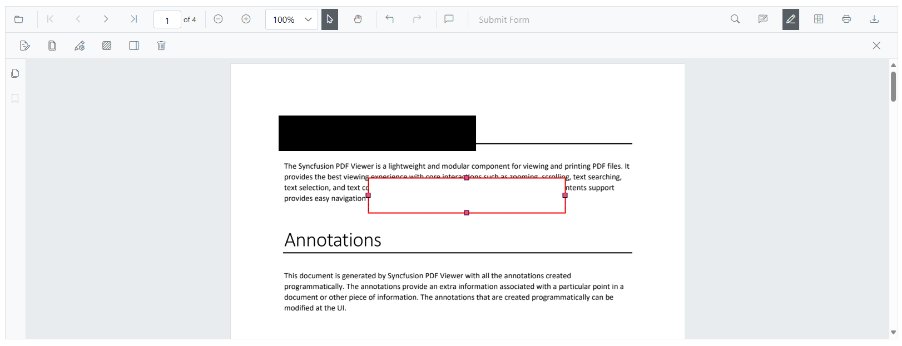

* **Resizable**: Users can adjust the size of the annotation to cover different content areas.

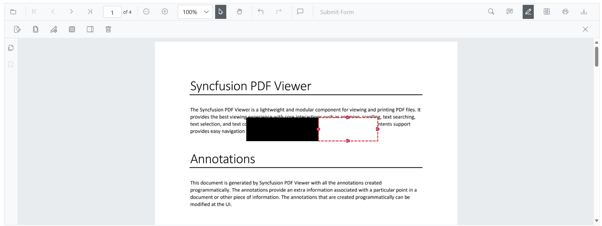

N> The redaction tool is not available in the toolbar by default. To display the redaction tool, the toolbar must be customized to include it. For instructions on customizing the toolbar, refer to the [Toolbar Customization section](./../toolbar-customization.md).

### Adding a Redaction annotation using Programmatically

You can use the [`AddAnnotationAsync`](https://help.syncfusion.com/cr/blazor/Syncfusion.Blazor.PdfViewer.SfPdfViewer2.html#Syncfusion_Blazor_PdfViewer_SfPdfViewer2_AddAnnotationAsync_Syncfusion_Blazor_PdfViewer_PdfAnnotation_) method to programmatically add a redaction annotation by defining a [`PdfAnnotation`](https://help.syncfusion.com/cr/blazor/Syncfusion.Blazor.PdfViewer.PdfAnnotation.html) object. The redaction-specific configuration is defined using the [`RedactionProperties`](https://help.syncfusion.com/cr/blazor/Syncfusion.Blazor.PdfViewer.RedactionProperties.html) property inside the annotation.

Below is an example that demonstrates how to create and add a redaction annotation with customized appearance, redaction properties, and positioning on the first page of the PDF document.

```razor
@page "/"

<SfButton OnClick="AddRedactionAnnotation">Add Redaction Annotation</SfButton>
<SfPdfViewer2 @ref="SfPdfViewer2" DocumentPath="@DocumentPath" Height="800px" Width="100%">
</SfPdfViewer2>

@code{

    private string DocumentPath { get; set; } = "wwwroot/data/Annotations.pdf";
    private SfPdfViewer2? SfPdfViewer2;

    // Adds a redaction annotation to the first page of the PDF Viewer
    async private void AddRedactionAnnotation()
    {
        // Create a redaction annotation with custom appearance and properties
        PdfAnnotation annotation = new PdfAnnotation()
        {
            Id = "redaction_Annotation",
            FontSize = 20,
            Bound = new Bound()
            {
                X = 200,
                Y = 80,
                Width = 150,
                Height = 75
            },
            PageNumber = 0,

            // Configure redaction-specific properties
            AnnotationProperties = new RedactionProperties()
            {
                MarkerFillColor = "#FF00FF",
                MarkerOpacity = 0.5,
                MarkerBorderColor = "#233A77",
                OverlayText = "Hello",
                IsRepeat = false
            },

            // Set the font and fill style
            FontColor = "#0000FF",
            FontFamily = "Courier",
            FillColor = "#EEEEEE",

            // Specify the annotation type
            Type = AnnotationType.Rectangle
        };

        // Add the annotation to the PDF Viewer
        await SfPdfViewer2.AddAnnotationAsync(annotation);
    }
}
```

Refer to the Image below for details.

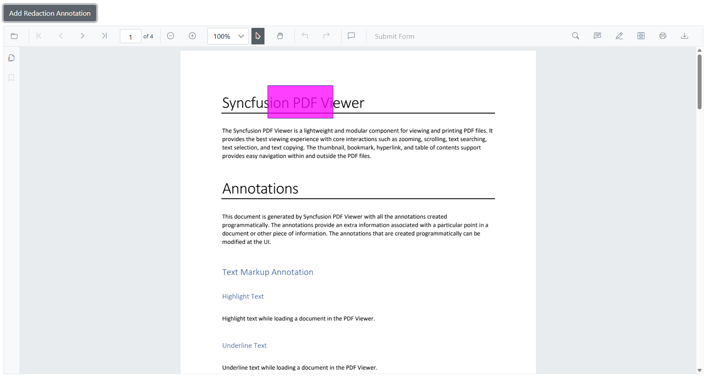

## Updating the properties of the Redaction  Annotations

The Blazor PDF Viewer allows users to update redaction annotations after they have been added, providing flexibility to adjust redaction details as needed. Updates can be made either interactively through the **Property panel** or programmatically via the [`EditAnnotationAsync`](https://help.syncfusion.com/cr/blazor/Syncfusion.Blazor.PdfViewer.SfPdfViewer2.html#Syncfusion_Blazor_PdfViewer_SfPdfViewer2_EditAnnotationAsync_Syncfusion_Blazor_PdfViewer_PdfAnnotation_). API.

### Updating Redaction Annotations Using the Property Panel

When a redaction annotation is selected, users can update its properties like font, overlay text, or fill color using the **property panel**. This instantly updates the annotation in the viewer.

The property panel can be accessed in multiple ways:

* By clicking the **redaction panel** icon available on the redaction toolbar.

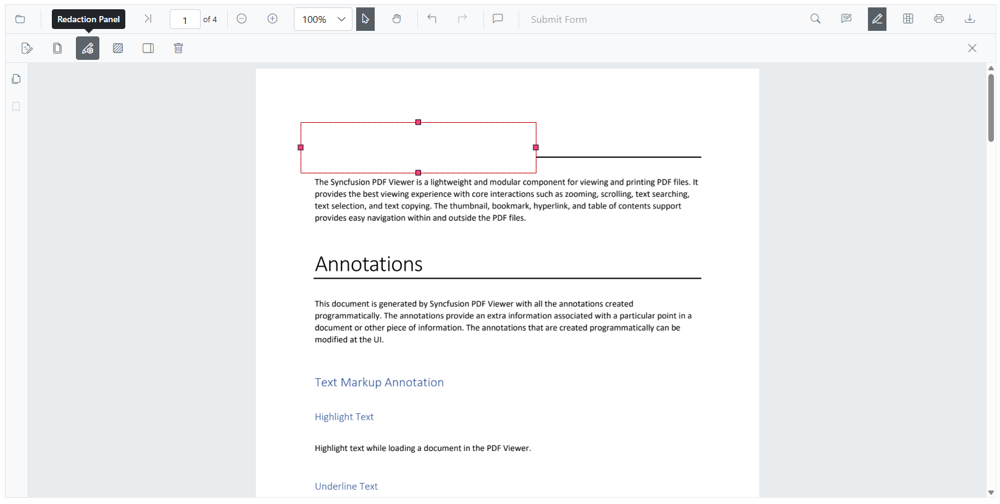

* Through the **context menu** by right-clicking (or long-pressing on mobile) the redaction annotation and selecting the Properties option.

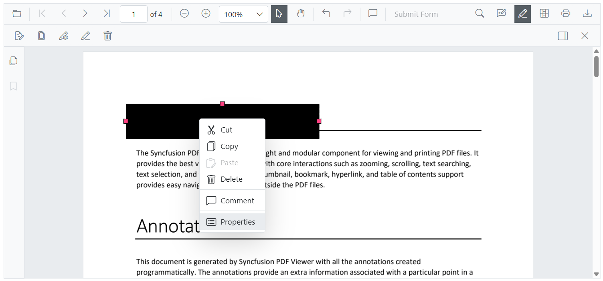

### Updating Redaction Annotations Programmatically

To update an existing redaction annotation, first retrieve it using [`GetAnnotationsAsync`](https://help.syncfusion.com/cr/blazor/Syncfusion.Blazor.PdfViewer.SfPdfViewer2.html#Syncfusion_Blazor_PdfViewer_SfPdfViewer2_GetAnnotationsAsync), then modify the required properties and apply the changes using [`EditAnnotationAsync`](https://help.syncfusion.com/cr/blazor/Syncfusion.Blazor.PdfViewer.SfPdfViewer2.html#Syncfusion_Blazor_PdfViewer_SfPdfViewer2_EditAnnotationAsync_Syncfusion_Blazor_PdfViewer_PdfAnnotation_).

The following example demonstrates how to update an existing redaction annotation in the PDF Viewer. It retrieves the annotation, modifies redaction-specific properties such as overlay text, fill color, border color, and opacity, along with general appearance settings like font size and text alignment, and then applies the changes using the [`EditAnnotationAsync`](https://help.syncfusion.com/cr/blazor/Syncfusion.Blazor.SfPdfViewer.PdfViewerBase.html#Syncfusion_Blazor_SfPdfViewer_PdfViewerBase_EditAnnotationAsync_Syncfusion_Blazor_SfPdfViewer_PdfAnnotation_) method.

```razor
@page "/"

<SfButton OnClick="EditRedaction">Edit Redaction</SfButton>

<SfPdfViewer2 @ref="SfPdfViewer2" DocumentPath="@DocumentPath" Height="800px" Width="100%">  
</SfPdfViewer2>

@code{
    private string DocumentPath { get; set; } = "wwwroot/data/Annotations.pdf";
    private SfPdfViewer2? SfPdfViewer2;
    // Updates the first redaction annotation's properties in the PDF Viewer
    async private void EditRedaction()
    {
        // Retrieve all annotations from the viewer
        List<PdfAnnotation> annotations = await SfPdfViewer2.GetAnnotationsAsync();

        // Get the first annotation to update
        PdfAnnotation annotation = annotations[0];

        // Check if the annotation is a redaction type and update redaction-specific properties
        if (annotation.AnnotationProperties is RedactionProperties redaction)
        {
            redaction.OverlayText = "Updated Text";
            redaction.MarkerFillColor = "#9bc7b8";
            redaction.MarkerBorderColor = "#888f8c";
            redaction.IsRepeat = true;
            redaction.MarkerOpacity = 0.2;
        }

        // Update general annotation properties
        annotation.FontSize = 15;
        annotation.FontColor = "Yellow";
        annotation.TextAlignment = TextAlignment.Left;

        // Apply the changes to the annotation in the viewer
        await SfPdfViewer2.EditAnnotationAsync(annotation);
    }
}
```
Refer to the Image below for details.

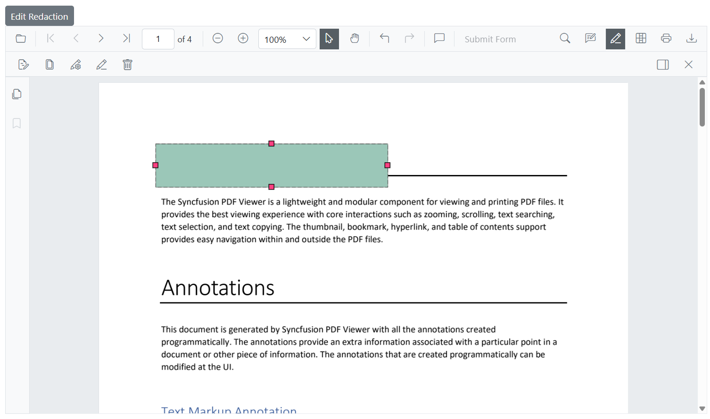

## Deleting the Deleting Redaction Annotations

Redaction annotations in the PDF Viewer can be removed easily through user interaction or programmatically. The following methods are available:

### Deleting Redaction Annotations Using the UI

Redaction annotations can be deleted directly within the viewer using any of these options:

* **Right-click and select _Delete_** from the context menu.

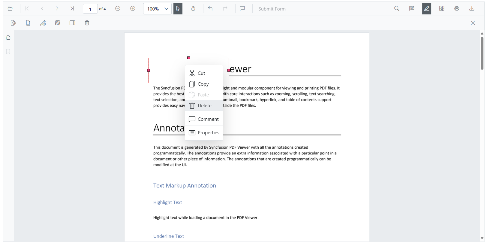

* **Click the _Delete_ button** in the toolbar.

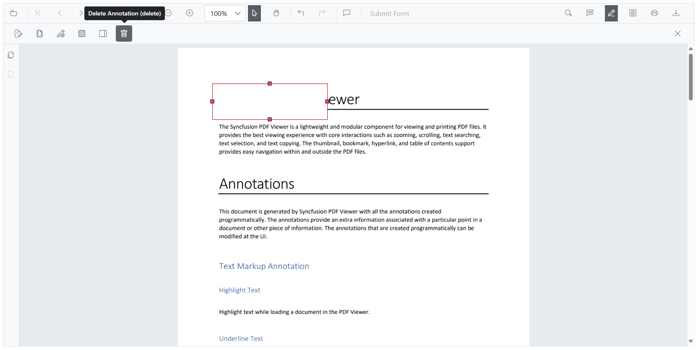

* **Press the `Delete` key** after selecting the annotation.

### Deleting Redaction Annotations Programmatically

Redaction annotations can also be deleted programmatically using the `DeleteAnnotationAsync` method. This method enables the removal of a specific annotation by providing its ID or object reference.

## Configuring Default Properties for Redaction Annotations

Use the [`PdfViewerRedactionSettings`](https://help.syncfusion.com/cr/blazor/Syncfusion.Blazor.PdfViewer.PdfViewerRedactionSettings.html) component inside the viewer to set default redaction properties for newly created annotations. These include fill color, overlay text, font style, and alignment.

These settings are applied to newly added **toolbar-based** redaction annotations (unless explicitly overridden).

The example below shows how to set default properties for redaction annotations using the [`PdfViewerRedactionSettings`](https://help.syncfusion.com/cr/blazor/Syncfusion.Blazor.PdfViewer.PdfViewerRedactionSettings.html) in the Syncfusion Blazor PDF Viewer. These settings control how new redaction annotations.

```razor
@* 
    This component demonstrates how to configure default redaction annotation settings 
    in the Syncfusion Blazor PDF Viewer.
*@
<SfPdfViewer2 @ref="SfPdfViewer2" DocumentPath="@DocumentPath" Height="800px" Width="100%">
    <PdfViewerRedactionSettings OverlayText="Confidential" 
                                MarkerFillColor="#FF0000"
                                MarkerBorderColor="#000000"
                                IsRepeat="false"
                                FillColor="#F8F8F8" 
                                FontColor="#333333"
                                FontSize="14" 
                                FontFamily="Symbol" 
                                TextAlignment="TextAlignment.Right" />
        <PdfViewerToolbarSettings ToolbarItems="ToolbarItems" MobileToolbarItems="MobileToolbarItems"></PdfViewerToolbarSettings>
</SfPdfViewer2>
```

This uses the [`PdfViewerRedactionSettings`](https://help.syncfusion.com/cr/blazor/Syncfusion.Blazor.PdfViewer.PdfViewerRedactionSettings.html) class to define defaults.

## Add Page Redaction

The Blazor PDF Viewer provides support to redact entire pages containing sensitive or confidential information. Redaction can be done programmatically or through the built-in UI dialog that offers flexible page selection options.

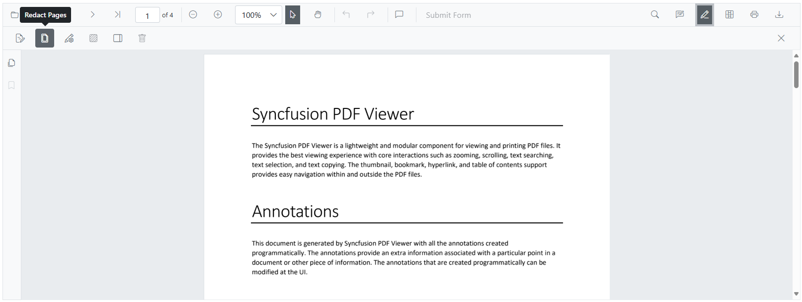

### Adding Redact Pages Using the UI

Users can redact entire pages using the Redact Pages option from the redaction toolbar. Upon clicking the redact pages icon, a Mark Page Range popup appears with the following options:

* **Current Page** – Redacts the currently visible page.

* **Odd Pages Only** – Redacts all odd-numbered pages.

* **Even Pages Only** – Redacts all even-numbered pages.

* **Specific Pages** – Allows the user to manually enter a list of specific page numbers to redact (e.g., 1, 3–5, 7).

After selecting the desired range, clicking the Save button applies redaction marks to the selected pages.

Refer to the Image below for details.

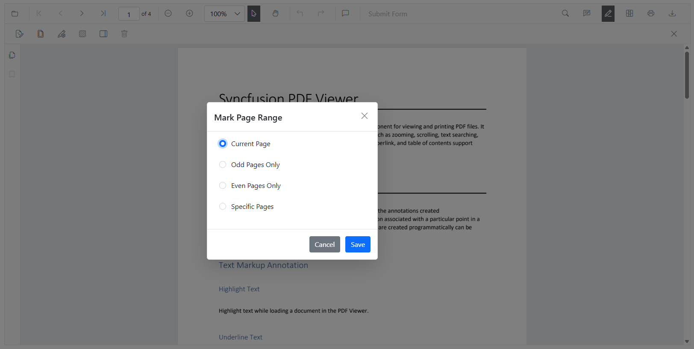

### Adding Redact Pages Using Programmatically

Entire pages can be marked for redaction using the [`AddPageRedactionsAsync`](https://help.syncfusion.com/cr/blazor/Syncfusion.Blazor.PdfViewer.SfPdfViewer2.html#Syncfusion_Blazor_PdfViewer_SfPdfViewer2_AddPageRedactionsAsync_System_Collections_Generic_List_System_Int32__) method.

This is useful when the full page contains confidential data.

The following example adds redaction annotations to specific pages in a PDF using 0-based page indexes. Here, redaction is applied to the first and third pages.

```razor
@page "/"

<SfButton OnClick="RedactPages">Add Redact Pages</SfButton>

<SfPdfViewer2 @ref="SfPdfViewer2" DocumentPath="@DocumentPath" Height="800px" Width="100%">
</SfPdfViewer2>

@code{

    private string DocumentPath { get; set; } = "wwwroot/data/Annotations.pdf";

    private SfPdfViewer2? SfPdfViewer2;

    // Adds redaction annotations to entire pages using 0-based page indexes.
    // In this example, redaction is applied to the first (0) and third (2) pages.
    async private void RedactPages()
    {
        List<int> pagesToRedact = new() { 0, 2 }; // Page indexes start from 0
        await SfPdfViewer2.AddPageRedactionsAsync(pagesToRedact);
    }

}
```

Refer to the Image below for details.

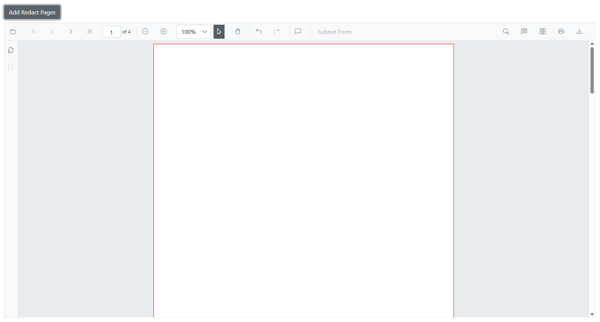

## Redaction Property Panel

When no annotation is selected, the property panel shows **default values** from [`PdfViewerRedactionSettings`](https://help.syncfusion.com/cr/blazor/Syncfusion.Blazor.PdfViewer.PdfViewerRedactionSettings.html). When a redaction is selected, the panel shows the current annotation's properties.

You can update overlay text, font, opacity, and more using this visual UI.

Refer to the Image below for details.

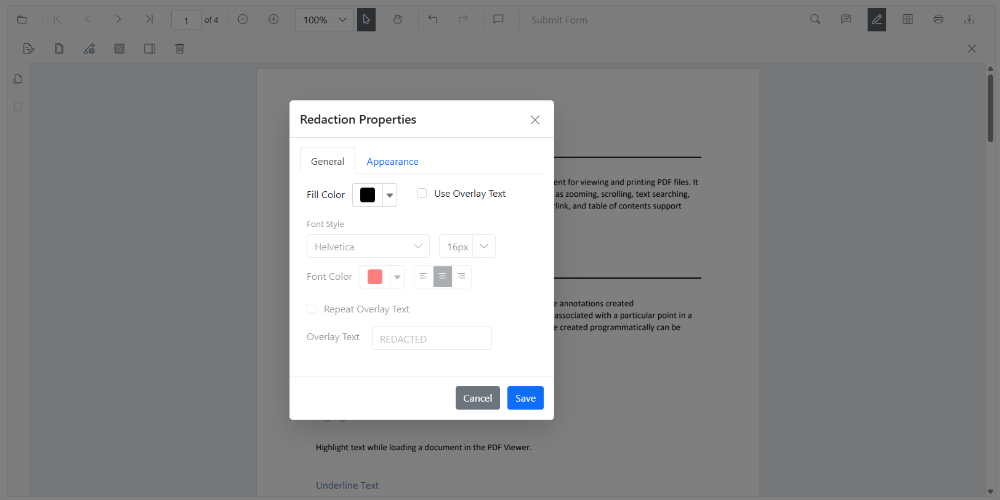

## Comment Panel Support for Redaction Annotations

The redaction annotations support **commenting** through the built-in **comment panel**. Users can add remarks, track review notes, or indicate why a section is redacted.

Commenting is available through both UI and API. Learn more in the [Comments Documentation](./comments.md).

## Export and Import Support for the Redaction Annotations

The SfPdfViewer supports exporting and importing redaction annotations, allowing users to save and reload redaction annotation.

For more details, refer to the [Export and Import Annotations Documentation](./import-export-annotation.md).