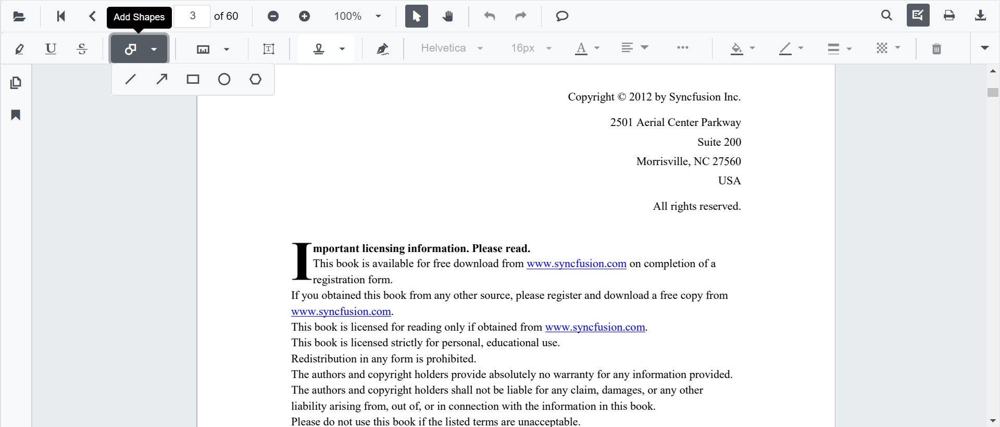
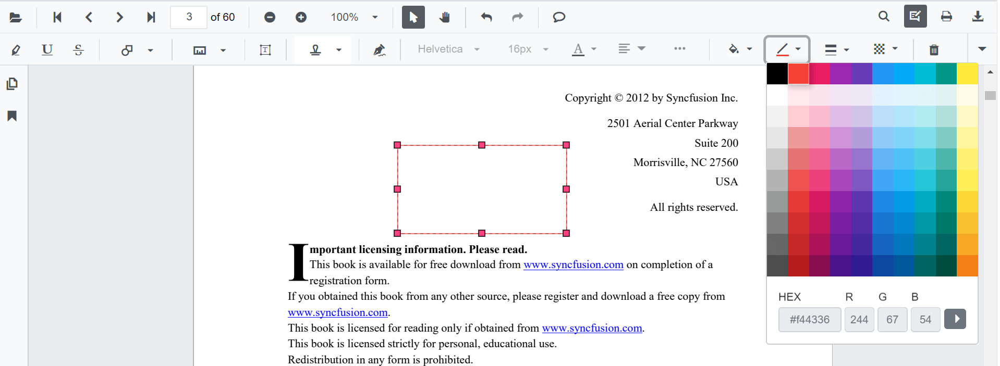
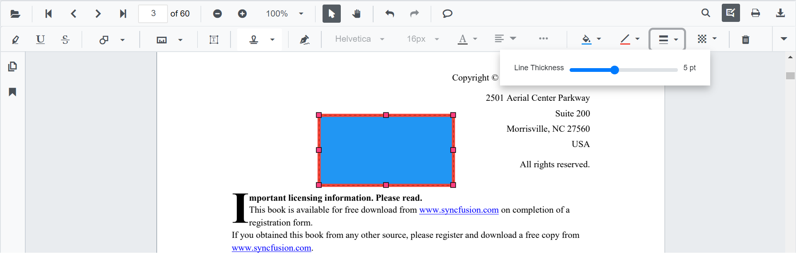
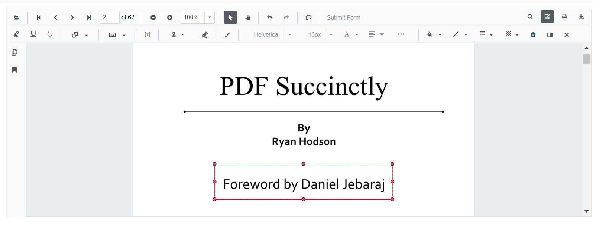
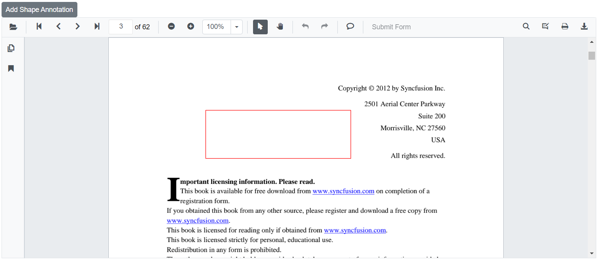
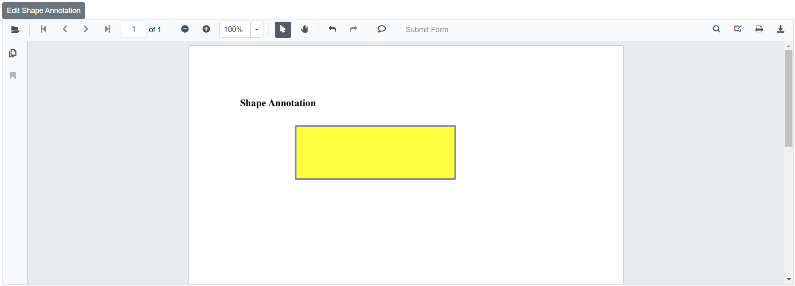

# Shape annotations in Blazor SfPdfViewer Component

The SfPdfViewer control provides the options to add, edit and delete the shape annotations. The shape annotation types supported in the SfPdfViewer control are:

* Line
* Arrow
* Rectangle
* Circle
* Polygon


## Adding a shape annotation to the PDF document

Shape annotations can be added to the PDF document using the annotation toolbar.

* Click the **Edit Annotation** button in the SfPdfViewer toolbar. A toolbar appears below it.
* Click the **Shape Annotation** dropdown button. A dropdown pop-up will appear and shows the shape annotations to be added.
* Select the shape types to be added to the page in the dropdown pop-up. It enables the selected shape annotation mode.
* You can add the shapes over the pages of the PDF document.

In the pan mode, if the shape annotation mode is entered, the SfPdfViewer control will switch to text select mode.




```cshtml

@using Syncfusion.Blazor.Buttons
@using Syncfusion.Blazor.SfPdfViewer

<SfButton OnClick="OnClick">Circle Annotation</SfButton>
<SfPdfViewer2 DocumentPath="@DocumentPath"
              @ref="viewer"
              Width="100%"
              Height="100%">
</SfPdfViewer2>

@code {
    SfPdfViewer2 viewer;
    public async void OnClick(MouseEventArgs args)
    {
        await viewer.SetAnnotationModeAsync(AnnotationType.Circle);
    }
    private string DocumentPath { get; set; } = "wwwroot/Data/PDF_Succinctly.pdf";
}

```

## Editing the properties of the shape annotation

The fill color, stroke color, thickness and opacity of the shape annotation can be edited using the Edit color tool, Edit stroke color tool, Edit thickness tool and Edit opacity tool in the annotation toolbar.

### Editing fill color

The fill color of the annotation can be edited using the color palette provided in the Edit Color tool.


### Editing stroke color

The stroke color of the annotation can be edited using the color palette provided in the Edit Stroke Color tool.



### Editing thickness

The thickness of the border of the annotation can be edited using the range slider provided in the Edit Thickness tool.



### Editing opacity

The opacity of the annotation can be edited using the range slider provided in the Edit Opacity tool.


### Editing the line properties

The properties of the line shapes such as line and arrow annotations can be edited using the Line Properties window. It can be opened by selecting the Properties option in the context menu that appears on right clicking the line and arrow annotations.


## Setting default properties during control initialization

The properties of the shape annotations can be set before creating the control using LineSettings, ArrowSettings, RectangleSettings, CircleSettings, and PolygonSettings.

```cshtml

@using Syncfusion.Blazor.SfPdfViewer

<SfPdfViewer2 @ref="@viewer"
              DocumentPath="@DocumentPath"
              LineSettings="@LineSettings"
              ArrowSettings="@ArrowSettings"
              RectangleSettings="@RectangleSettings"
              CircleSettings="@CircleSettings"
              PolygonSettings="@PolygonSettings"
              Width="100%"
              Height="100%">
</SfPdfViewer2>

@code {
    SfPdfViewer2 viewer;
    private string DocumentPath { get; set; } = "wwwroot/Data/PDF_Succinctly.pdf";

    PdfViewerLineSettings LineSettings = new PdfViewerLineSettings
        {
            FillColor = "blue",
            Opacity = 0.6,
            StrokeColor = "green"
        };

     PdfViewerArrowSettings ArrowSettings = new PdfViewerArrowSettings
        {
            FillColor = "green",
            Opacity = 0.6,
            StrokeColor = "blue"
        };

    PdfViewerRectangleSettings RectangleSettings = new PdfViewerRectangleSettings
        {
            FillColor = "yellow",
            Opacity = 0.6,
            StrokeColor = "orange"
        };

    PdfViewerCircleSettings CircleSettings = new PdfViewerCircleSettings
        {
            FillColor = "orange",
            Opacity = 0.6,
            StrokeColor = "pink"
        };

    PdfViewerPolygonSettings PolygonSettings = new PdfViewerPolygonSettings
        {
            FillColor = "pink",
            Opacity = 0.6,
            StrokeColor = "yellow"
        };
}

```

## Customize annotation selector

You can customize the appearance of the annotation's selector using the [AnnotationSelectorSettings](https://help.syncfusion.com/cr/blazor/Syncfusion.Blazor.SfPdfViewer.PdfViewerAnnotationSelectorSettings.html) property of the [PdfViewerRectangleSettings](https://help.syncfusion.com/cr/blazor/Syncfusion.Blazor.SfPdfViewer.PdfViewerRectangleSettings.html) class.

The following code illustrates how to change the resizer shape of the shape annotation's selector.

```cshtml

@using Syncfusion.Blazor.SfPdfViewer

<SfPdfViewer2 @ref="viewer"
              DocumentPath="@DocumentPath"
              Height="100" Width="100%"
              RectangleSettings=@rectangleSettings>
</SfPdfViewer2>

@code {
    //Sets the PDF document path for initial loading.
    private string DocumentPath { get; set; } = "wwwroot/data/PDF_Succinctly.pdf";
    SfPdfViewer2 viewer;

    //Defines the settings of rectangle annotation.
    PdfViewerRectangleSettings rectangleSettings = new PdfViewerRectangleSettings
    {
        //Defines the annotation selector settings for the annotation.
        AnnotationSelectorSettings = new PdfViewerAnnotationSelectorSettings()
        {
            //Defines the shape of the resizer. By default it is square.
            ResizerShape = AnnotationResizerShape.Circle
        }
    };
}

```



[View sample in GitHub](https://github.com/SyncfusionExamples/blazor-pdf-viewer-examples/tree/master/Annotations/Selector/Customize%20Annotation%20%20Selector%20-%20SfPdfViewer).

## Add shape annotation Programmatically

The Blazor SfPdfViewer offers the capability to programmatically add shape annotations such as Rectangle, Line, Arrow, Circle, and Polygon within the SfPdfViewer control using the [AddAnnotationAsync](https://help.syncfusion.com/cr/blazor/Syncfusion.Blazor.SfPdfViewer.PdfViewerBase.html#Syncfusion_Blazor_SfPdfViewer_PdfViewerBase_AddAnnotationAsync_Syncfusion_Blazor_SfPdfViewer_PdfAnnotation_)  method.

Below is an example demonstrating how you can use this method to add shape annotation to a PDF document:

```cshtml

@using Syncfusion.Blazor.Buttons
@using Syncfusion.Blazor.SfPdfViewer

<SfButton OnClick="@AddShapeAnnotationAsync">Add Shape Annotation</SfButton>
<SfPdfViewer2 Width="100%" Height="100%" DocumentPath="@DocumentPath" @ref="@Viewer" />

@code {
    SfPdfViewer2 Viewer;
    public string DocumentPath { get; set; } = "wwwroot/Data/PDF_Succinctly.pdf";

    public async void AddShapeAnnotationAsync(MouseEventArgs args)
    {
        PdfAnnotation annotation = new PdfAnnotation();
        // Set the Shape annotation type like Rectangle, Line, Arrow, Circle, Polygon.
        annotation.Type = AnnotationType.Rectangle;
        // Set the page number starts from 0. So, if set 2 it represents the page 3.
        annotation.PageNumber = 2;

        // Bound of the rectangle annotation
        annotation.Bound = new Bound();
        annotation.Bound.X = 200;
        annotation.Bound.Y = 150;
        annotation.Bound.Width = 300;
        annotation.Bound.Height = 100;
        // Add rectangle annotation
        await Viewer.AddAnnotationAsync(annotation);
    }
}

```
This code will add a shape annotation to the third page of the PDF document.



## Edit Shape annotation Programmatically

The Blazor SfPdfViewer offers the capability to programmatically edit the shape annotation such as Rectangle, Line, Arrow, Circle, and Polygon within the SfPdfViewer control using the [EditAnnotationAsync](https://help.syncfusion.com/cr/blazor/Syncfusion.Blazor.SfPdfViewer.PdfViewerBase.html#Syncfusion_Blazor_SfPdfViewer_PdfViewerBase_EditAnnotationAsync_Syncfusion_Blazor_SfPdfViewer_PdfAnnotation_) method.

Below is an example demonstrating how you can utilize this method to edit the shape annotation programmatically:

```cshtml

@using Syncfusion.Blazor.Buttons
@using Syncfusion.Blazor.SfPdfViewer

<SfButton OnClick="@EditShapeAnnotationAsync">Edit Shape Annotation</SfButton>
<SfPdfViewer2 Width="100%" Height="100%" DocumentPath="@DocumentPath" @ref="@Viewer" />

@code {
    SfPdfViewer2 Viewer;
    public string DocumentPath { get; set; } = "wwwroot/Data/RectangleAnnotation.pdf";

    public async void EditShapeAnnotationAsync(MouseEventArgs args)
    {
        // Get annotation collection
        List<PdfAnnotation> annotationCollection = await Viewer.GetAnnotationsAsync();
        // Select the annotation want to edit
        PdfAnnotation annotation = annotationCollection[0];
        // Change the fill color of rectangle annotation
        annotation.FillColor = "#FFFF00";
        // Change the stroke color of rectangle annotation
        annotation.StrokeColor = "#0000FF";
        // Change the thickness of rectangle annotation
        annotation.Thickness = 3;
        // Change the Opacity (0 to 1) of rectangle annotation
        annotation.Opacity = 0.5;
        // Edit the rectangle shape annotation
        await Viewer.EditAnnotationAsync(annotation);
    }
}

```

This code snippet will edit the shape annotation programmatically within the SfPdfViewer control.



## See also

* [How to delete the annotation programmatically](./text-markup-annotation#delete-annotation-programmatically)