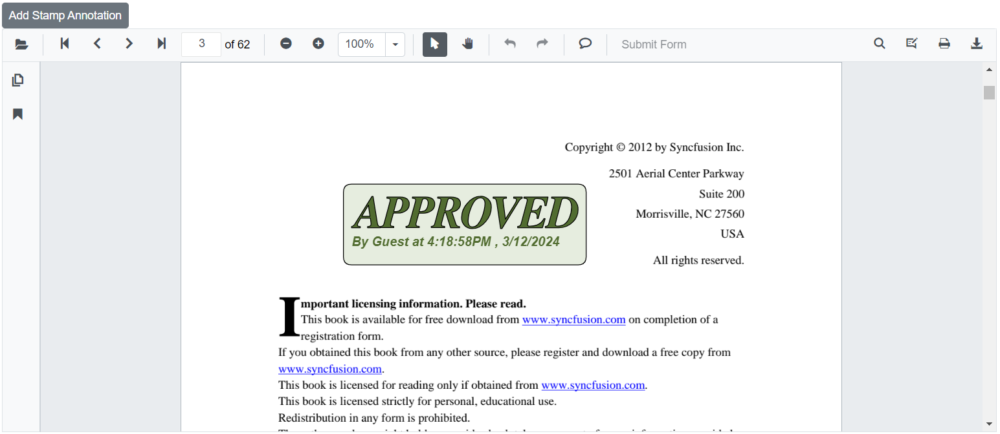
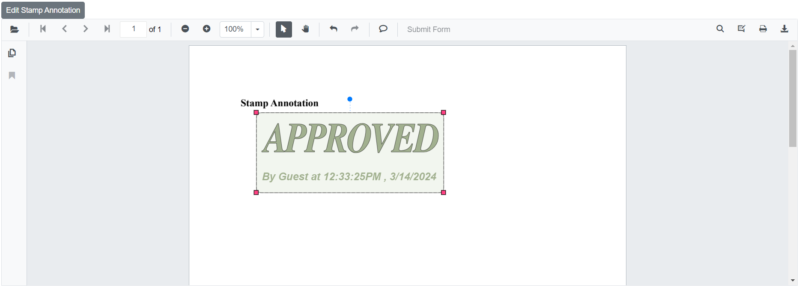
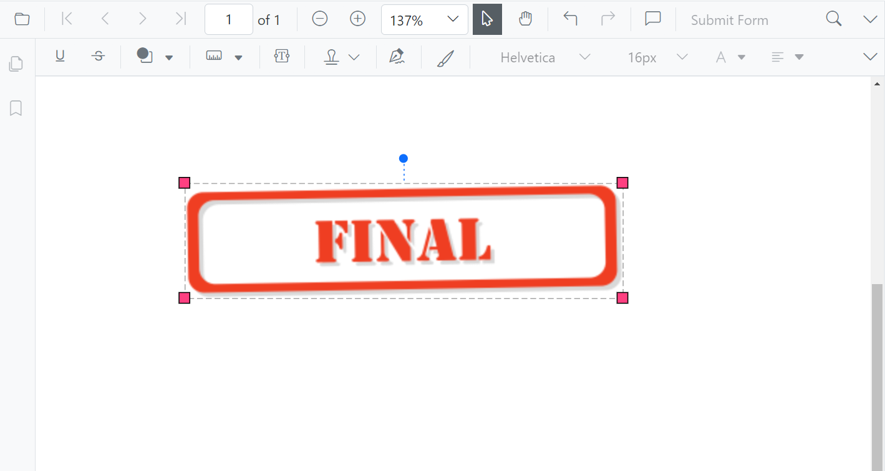
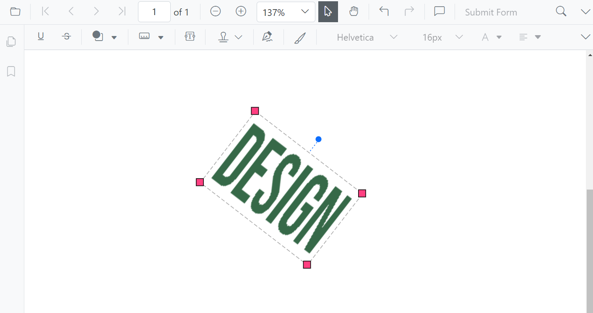

# Stamp annotations in Blazor SfPdfViewer Component

The SfPdfViewer control provides options to add, edit, delete and rotate the following stamp annotation in the PDF documents:

* Dynamic
* Sign Here
* Standard Business
* Custom Stamp


## Adding stamp annotations to the PDF document

The stamp annotations can be added to the PDF document using the annotation toolbar.

* Click the **Edit Annotation** button in the SfPdfViewer toolbar. A toolbar appears below it.
* Click the **Stamp Annotation** dropdown button. A dropdown pop-up will appear and shows the stamp annotations to be added.


* Select the annotation type to be added to the page in the pop-up.


* You can add the annotation over the pages of the PDF document.

In the pan mode, if the stamp annotation mode is entered, the SfPdfViewer control will switch to text select mode.

## Adding custom stamp to the PDF document through interaction

* Click the **Edit Annotation** button in the SfPdfViewer toolbar. A toolbar appears below it.
* Click the **Stamp Annotation** dropdown button. A dropdown pop-up will appear and shows the stamp annotations to be added.
* Click the Custom Stamp button.


* The file explorer dialog will appear, choose the image and then add the image in the PDF page.

N>The JPG and JPEG image format are only supported in custom stamp annotations.

## Setting default properties during control initialization

The properties of the stamp annotation can be set before creating the control using StampSettings.

After editing the default opacity using the Edit Opacity tool, they will be changed to the selected values.

```cshtml

@using Syncfusion.Blazor.SfPdfViewer

<SfPdfViewer2 @ref="viewer"
              DocumentPath="@DocumentPath"
              Height="100"
              Width="100%"
              StampSettings=@StampSettings>
</SfPdfViewer2>

@code {
    //Sets the PDF document path for initial loading.
    private string DocumentPath { get; set; } = "wwwroot/data/PDF_Succinctly.pdf";
    SfPdfViewer2 viewer;

    //Defines the settings of rectangle annotation.
    PdfViewerStampSettings StampSettings = new PdfViewerStampSettings
        {
            Opacity = 0.3,
            Author = "Blazor"
        };
}

```

## Adding a custom stamp to the PDF document via PdfViewerCustomStampSettings

You can add an image as a custom stamp icon using the CustomStamps property of the PdfViewerCustomStampSettings class.

The following code illustrates how to add the image as a stamp annotation in the PDFViewer.

```cshtml

@using Syncfusion.Blazor.Navigations;
@using Syncfusion.Blazor.SfPdfViewer

<SfToolbar>
        <ToolbarItems>
            <ToolbarItem PrefixIcon="e-pv-previous-page-navigation-icon"
                         TooltipText="Previous Page"
                         id="previousPage"
                         OnClick="@previousClicked"
                         Align="@Syncfusion.Blazor.Navigations.ItemAlign.Left">
            </ToolbarItem>
            <ToolbarItem PrefixIcon="e-pv-next-page-navigation-icon"
                         TooltipText="Next Page"
                         id="nextPage"
                         OnClick="@nextClicked"
                         Align="@Syncfusion.Blazor.Navigations.ItemAlign.Left">
            </ToolbarItem>
            <ToolbarItem PrefixIcon="e-pv-download-document-icon"
                         TooltipText="Download"
                         id="Download"
                         OnClick="@downloadDocument"
                         Align="@Syncfusion.Blazor.Navigations.ItemAlign.Right">
            </ToolbarItem>
            <ToolbarItem PrefixIcon="e-pv-stamp-icon"
                         TooltipText="AddCustomStamp"
                         id="AddCustomStamp"
                         OnClick="@stampClicked"
                         Align="@Syncfusion.Blazor.Navigations.ItemAlign.Right">
            </ToolbarItem>
        </ToolbarItems>
    </SfToolbar>

<SfPdfViewer2 EnableToolbar="false"
              EnableAnnotationToolbar="false"
              EnableNavigationToolbar="false" @ref="viewer"
              DocumentPath="@DocumentPath"
              Height="100%"
              Width="100%">
    <PdfViewerCustomStampSettings CustomStamps="@pdfViewerCustomStamps">
    </PdfViewerCustomStampSettings>

@code
{
    SfPdfViewer2 viewer;
    public List<PdfViewerCustomStamp> pdfViewerCustomStamps { get; set; }
    private string DocumentPath { get; set; } = "wwwroot/Data/PDF_Succinctly.pdf";

    public void stampClicked(ClickEventArgs args)
    {
        pdfViewerCustomStamps = new List<PdfViewerCustomStamp>()
        {
            new PdfViewerCustomStamp()
            {
                //Defines the custom stamp name to be added in the stamp menu of the SfPdfViewer toolbar.
                CustomStampName = "Stamp",
                //Defines the custom stamp images source to be added in the stamp menu of the SfPdfViewer toolbar.
                CustomStampImageSource ="data:image/jpeg;base64,/9j/4AAQSkZJRgABAQAAAQABAAD/2wCEAAkGBwgHBgkIBwgKCgkLDRYPDQwMDRsUFRAWIB0iIiAdHx8kKDQsJCYxJx8fLT0tMTU3Ojo6Iys/RD84QzQ5OjcBCgoKDQwNGg8PGjclHyU3Nzc3Nzc3Nzc3Nzc3Nzc3Nzc3Nzc3Nzc3Nzc3Nzc3Nzc3Nzc3Nzc3Nzc3Nzc3Nzc3N//AABEIAIIAqwMBIgACEQEDEQH/xAAbAAEAAgMBAQAAAAAAAAAAAAAABQYBAwQHAv/EAEEQAAEDAwIEAwYDBAYLAAAAAAECAwQABREGIRIxQVETYXEHFCIygZEVQmIjUnKCJCUzU6HRFhc1c5KisbKzwvD/xAAVAQEBAAAAAAAAAAAAAAAAAAAAAf/EABQRAQAAAAAAAAAAAAAAAAAAAAD/2gAMAwEAAhEDEQA/APcaUpQKUpQKUpQKUpQKUpQKVzXGdFtsN2ZPfbYjNJ4nHHDgJFfEK5Q5ttbuUaQhcNxvxUPcklPfflQdlYJxURpe/salthuMNpxEYvuNtKc28VKVcPGB2JB577Vyz7pNuUxy26eWlCml8Mu4OI4kR/0oB2Wvp2T17EJK43qDbloakOqL7m6I7TanHVjOMhCQTjzxgVut89i4Mqdj8Y4VlC0OIKFIUOYKTuOn0INRZZtWkrVLuDpIIHHJlPK4nX1dOJR5kk4A5DYDArVoWbHuVgTPjvF5Ul5xx5zhIBc4jkJyBlI+UHqE0FjpSlApSlApSlApSlApSlApSlApSlArClAczgVmqr7QZLptkezxHi1KvD4ihxKsFprBU6v6IB+pFBTdUKf1uUuFa0WpyUIVoYBx706chchXdKEhZSPLNXXVTsOw6NdjNxkvJS0iLEidHnDhLaPME4z5ZzVHk6kTHu1vTpyE1Jf8L3Oww1ZDaGc4XJXjklXDhP6UlWd63ybrL1rq1mNa1hLcAKEeQgcTbbvyuScHnw5KGweZJPIVRYoDT6okfSlnfWhmCwlu43FGAUKxu2j9atyT+UHvirZBixLZBaiQ2kR4zCMIQnZKRWuz2yLZ7czBgo4GWh13KidypR6qJJJPevOvaFqCXqC4HSGmzxlxQbmvJJAPXwwe2M8R9R3FQc1xde9qOqEW+C44jTFuVxPvtnHvCvI+e4HYZPavV4sdmLGajxmktMtJCENpGAkDkBUbpixRNO2dm3Q0/Cj4lrPNazzUf/uWKlkkEZByKDNKUoFKUoFKUoFKUoFKwahZ2p7dFfMZhTs+ZnHu0FHirB/VjZHqogUE3WOIYzUApzUlwBKUxLOwQCFL/bv467DCEn6qr5i6btk5ht+ZOlXlCxlLkiTxtr8whGG8fy0HdK1FZorymHbjH8dPNlC+NY/lTk1XNTe0m12SCXBFnrkOpX7uh6ItkKUBzPGEnhzjcA1bokKLAZS1BjMx20jAQy2EjHoK85i6PuOovaFNv+pWPDt8J/ggMKUCXktq+BX8HNXmT2G9HLF1trSyW2GrUFgbluT3eCIRIS26tS/iSjwgCcDl35Z3qBlSb/edVcN58e4tojKafiW2MfDQpRBXF8X5UnZPGsq5ZAr0TV2j52oL9Anx7wqCxHYWypLbeXAFH4lNqz8KiNs8x0qy2e1QrNbmYFuZDUdkYSkHOT1JPUk7k0HhsG6u3SHPeisLFwnucE95hOPdmc8DUNhR/OrCR5Ak9NvX9F6cRp20IZIR706AX1I5DA2Qn9KRsPvzJqGmXG0N6pfk3KTEhW2ykBsLKUh2Y4nKlY6lKCAOuVmuafry5T5rFs0vaHQ5JSVIm3FBaQhvq7wfNwjurAPnQZ9pms1WtlVmtDqRcnxwrdK+ERknqT0Vj7DftUN7OA1BilywWx65TnU8PjOAtMsJJzlbhBypXMhPFgADbrF6B0sNSagkzrk+5cbTDeUQ5IHwy3T+bHbYE/y9yK9sabQ02lDSAhCRhKUjAAoIaFaZ8gh++zg8vIKYsUFphB+/Ev8AmONuVTYGBgcqzSoFKUoFKUoFKUoFcV4mOW+2yJbEN6Y40gqTHYGVuHsK7awRmg8rd/1gameJn2n8Ptv5YQn+78f+8cSFLI57AJ8/Oy2eyalhxkRo79htEVI2YgQ1uEH+JSgD68NW/FQ2r7yqxWCTNZR4knZqM1/ePLPChP3IoKRc4l91FqJ3TkfUst2Aygfiz7TDTaEA8mkEAnjPXfAH2NohaPehR2Y8bVF9QwygNttJMcJSkDAAAZru0hY02CyMxFK8SWv9rMfPN55W6lE9d9vQCpughmrLNZVxI1Fc19kupYUn/wAYP+NdQVMjD+khEhsfM40nhUPMp3z9D9K76xQRN/uNxjWj3qwW9F0krKfDa8YISUn83F25VVocf2kXdR/EJlrskZQxiM14ryR5ZJA9c/SrHo973m2SFjPhCfKSzn9wPLCceXbyxUpPmRrdDemTHUMx2UFbjizgJAoPGrbpyJBRPvEi53STfhc34MRCVMrckLSvCT8aFEEjBUQdhUlfbHcrcItuYvc+VqbUBDcpf7PgDSfnJPBxBCQcDBGcnlUn7Om4kly+aonhbPBPkeGiRsIqCEqUcHkSMZ9K5bRqqMbjJ1E5FkTrndFe72m2sAF1MVBI4iD8iVKyoqO2w7VRbrJpRdkt7MGDe56GGhgJ8Njn1P8AZ9fPNd5gXNKQEXt0q7uRmz/0AqFja29znGFq2EmxuqaLzDrkhK2XUj5gF7YUNvhqsX+66nvtqlarsrsmDa7aUvQIqQULuCUqHiLdGPk4c8I686g9BMK8/lu7IxyzCB/9q4bpJkWeP7xd9TQojGeHjdipRk9hlW5/yrF21raoEGM/HcM+TMSDEhwyFuv55YA5DfcnYVx2fTD9wm/jeskMS7goYYhY42IKeyQeajtlR68tqCUjtXWVHakQL/FejupC23PcwsLSeoKVgEVsLWomsFMm1yAM5C2HGir6hSsfY1B6ILViuV50utSWkRpHvNvQTgGO6OLCe/CviB7bVMXjVMC2vCG0VTrk4MtQIeHHleZHJCf1KwKDTcNSqskB2XqSCYjTQ3fYcDzSj0SOSgSdhlP1r50FqherbM5cVQVQwmQtkNlfFxBON8/XB8wa4JNsfUzJ1Jq/wXFQWnH4tvbPEzFCUk8RyPjd2+bkOQ7nHs0iSLRY7dBkKUoy4gnYV8yHFEFxPoCtOPU+VBdaUpQKUpQKqF4H4xry027YxrYyq4yB3cPwND/vV9BVvNVTRf8ATrhqC9KIUJU4x2T2aZHAB/xcZ+tBa6UpQKr+r7lIjRWrdaz/AFrcleBF2z4W3xOq8kDf1wOtSV5ukSz216fOc4GGhk4GSo9EpHVROwHU1DaWtst2S9qG+N8Nzlp4WWSc+6R85S0P1dVHqfSgm7Rb2bTbItvjcXhR2g2kqOVKx1J6k8zVbfP+leoSxkGx2h7LxztJlD8h6FCOZ/VjtXdq25ymWY9ptSv61uSi2yr+4Rj43T5JHLzIrRfHIujtCy/dthFiqQyD8zrqhgZ7qUo/40FJsbL2q7W/YYchUdqdMlXC5SEDJQhbq/CbHTKuEEj90edXfRWi4Gk4yvAUqTMdADsp35ikckj91I7Vn2e6bTpnTUaG5hUtweLJcHVw9PQch6VZ6Dhudot12aQ1dIEWa2hXEhEllLgSe4Cga7OBPBwYHDjGMbYr6pQRNp03ZrM669arVChuu/OphkJJ8tunlUt0pSgjLxYLVew2LtAYleEctqcT8SPRXMfevq0WO12VtTdpgRoiVHKy02AVnuo8z9akaUEBr2O9L0beI8dtx1xyMpIQ2kqUodQANycZrk07JVeLyq4R2HmrZCiiJFW62UF9SilS1AHfhHAgA7b8XlVqIzWMb0GaUpQKUpQc9wkCJAkyVcmWlOH6AmoL2bsqZ0LZi4SXHowfcUeZU58ZP3VUpqNlcjT1zYaGVuRHUJA6koIFcuiZDcnR9lea+RcFkgdvgG1BN1omS48GM7JluoZYaSVuOLOEpSOZJrXdLjEtUF2bcJLceM0MrccOAP8AP0qqR4czWk1qfd2HItgZWFxLe6MLlKHJ14dE9kH1NBttDEjVVzYvtxaUza4547ZCdThSz0kLHQ4+UdAc86tcmQzDjOyJLiW2WUFxxxWwSkDJJ+lbQAOVVPU6vx29xdLsqPgBKZdzIG3ghWEtE9CtX/Kk0GzSTDlwekamnNlL08BMNCs5ZijdAweRVniPqB0qsarce1XrezWlghVsiTCp3B/tFtDicPok8CP4lq7VedSzXYFr8OBwpmyVCPEyPhStQPxEfupAKj5JNVz2eW9t2RIvLJWqGlsQbetXN1pCsuPerjmVZ6gCqLyBis0pUClKUClKUClKUClKUClKUClKUGCMjFVNqw36yeOxpmbb/wAPdcU43GntLPuqlHJCFJO6ckkJI2zzq20oKtE0iZE5q46mnKu8to8TLSmwiMwe6G99/wBSiTVoGwrNcV4uUez2yTcJiiGY7ZWrAyT2AHUk7D1oMXq6R7PapNxlk+FHQVkAZKj0SB1JOAPWozRtqfhW5ybcf9qXJz3qZk54FEbNg9kDCfoT1qGi++alvEGJdGwlq2hE+e0FApTKVu0we4Qk8R7nhNXkcqCs6q0zK1DcIWbkqNbW23ESmWk4ceCsZAV+UEAgnngnvViix2okZqPHbS2y0kIbQkYCUjYAVtpQKUpQKUpQKUpQKUpQKUpQKUpQKUpQKUpQKouv7mwi7W2HJBdZiJNxXHSd5DoUER2gOpU4rI/gq9VxO2i3PXRu6OwmFz2m/DbkKQCtKck4B+p+9BxaTtblqtQEvhM+UtUqatO4U8vdW/YbJHkkVNVgDFZoFKUoFKUoFKUoFKUoFKUoFKUoFKUoFKUoFKUoFKUoFKUoFKUoFKUoFKUoFKUoFKUoFKUoFKUoP//Z"
            }
        };

    }

    public async void previousClicked(ClickEventArgs args)
    {
        //Navigate to previous page of the PDF document.
        await viewer.GoToPreviousPageAsync();
    }

    public async void nextClicked(ClickEventArgs args)
    {
        //Navigate to next page of the PDF document loaded in the SfPdfViewer.
        await viewer.GoToNextPageAsync();
    }

    public async void downloadDocument(ClickEventArgs args)
    {
        //Downloads the PDF document being loaded in the SfPdfViewer.
        await viewer.DownloadAsync();
    }
}

<style>
    .e-pv-previous-page-navigation-icon::before {
        content: '\e70d';
    }

    .e-pv-stamp-icon::before {
        content: '\e74c';
    }
    .e-pv-next-page-navigation-icon::before {
        content: '\e76a';
    }

    .e-pv-download-document-icon::before {
        content: '\e75d';
    }
</style>

```
[View sample in GitHub](https://github.com/SyncfusionExamples/blazor-pdf-viewer-examples/tree/master/Annotations/Stamp/Add%20a%20custom%20stamp%20-%20SfPdfViewer)

## Add stamp annotation programmatically

The Blazor SfPdfViewer offers the capability to programmatically add the stamp annotation within the SfPdfViewer control using the [DynamicStampAnnotation](https://help.syncfusion.com/cr/blazor/Syncfusion.Blazor.SfPdfViewer.PdfViewerBase.html#Syncfusion_Blazor_SfPdfViewer_PdfViewerBase_AddAnnotationAsync_Syncfusion_Blazor_SfPdfViewer_PdfAnnotation_Syncfusion_Blazor_SfPdfViewer_DynamicStampItem_), [SignStampAnnotation](https://help.syncfusion.com/cr/blazor/Syncfusion.Blazor.SfPdfViewer.PdfViewerBase.html#Syncfusion_Blazor_SfPdfViewer_PdfViewerBase_AddAnnotationAsync_Syncfusion_Blazor_SfPdfViewer_PdfAnnotation_Syncfusion_Blazor_SfPdfViewer_SignStampItem_), and [StandardBusinessStampAnnotation](https://help.syncfusion.com/cr/blazor/Syncfusion.Blazor.SfPdfViewer.PdfViewerBase.html#Syncfusion_Blazor_SfPdfViewer_PdfViewerBase_AddAnnotationAsync_Syncfusion_Blazor_SfPdfViewer_PdfAnnotation_Syncfusion_Blazor_SfPdfViewer_StandardBusinessStampItem_) method.

Below is an example demonstrating how you can use this method to add stamp annotation to a PDF document:

```cshtml

@using Syncfusion.Blazor.Buttons
@using Syncfusion.Blazor.SfPdfViewer

<SfButton OnClick="@AddStampAnnotationAsync">Add Stamp Annotation</SfButton>
<SfPdfViewer2 Width="100%" Height="100%" DocumentPath="@DocumentPath" @ref="@Viewer" />

@code {
    SfPdfViewer2 Viewer;
    public string DocumentPath { get; set; } = "wwwroot/Data/Stamp_Annotation.pdf";

    public async void AddStampAnnotationAsync(MouseEventArgs args)
    {
        PdfAnnotation annotation = new PdfAnnotation();
        // Set the annotation type stamp
        annotation.Type = AnnotationType.Stamp;
        // Set the PageNumber starts from 0. So, if set 0 it represents the page 1.
        annotation.PageNumber = 0;

        // Bound of the dynamic stamp annotation
        annotation.Bound = new Bound();
        annotation.Bound.X = 200;
        annotation.Bound.Y = 150;
        annotation.Bound.Width = 300;
        annotation.Bound.Height = 100;
        // Add dynamic approved stamp annotation
        await Viewer.AddAnnotationAsync(annotation, DynamicStampItem.Approved);
        // Add standardbusiness approved stamp annotation
        //await Viewer.AddAnnotationAsync(annotation, StandardBusinessStampItem.Approved);
        // Add sign accepted stamp annotation
        //await Viewer.AddAnnotationAsync(annotation, SignStampItem.Accepted);
    }
}

```

This code will add a stamp annotation to the first page of the PDF document.



[View sample in GitHub](https://github.com/SyncfusionExamples/blazor-pdf-viewer-examples/tree/master/Annotations/Programmatic%20Support/Stamp/Add).

N> To add a custom stamp annotation, you need to set the annotation type as an [Image](https://help.syncfusion.com/cr/blazor/Syncfusion.Blazor.SfPdfViewer.AnnotationType.html#Syncfusion_Blazor_SfPdfViewer_AnnotationType_Image) and [CustomStampSource](https://help.syncfusion.com/cr/blazor/Syncfusion.Blazor.SfPdfViewer.PdfAnnotation.html#Syncfusion_Blazor_SfPdfViewer_PdfAnnotation_CustomStampSource) API to set the custom stamp image data. Then use [AddAnnotationAsync](https://help.syncfusion.com/cr/blazor/Syncfusion.Blazor.SfPdfViewer.PdfViewerBase.html#Syncfusion_Blazor_SfPdfViewer_PdfViewerBase_AddAnnotationAsync_Syncfusion_Blazor_SfPdfViewer_PdfAnnotation_) to add the annotation properly.

## Edit stamp annotation programmatically

The Blazor SfPdfViewer offers the capability to programmatically edit the stamp annotation within the SfPdfViewer control using the  [EditAnnotationAsync](https://help.syncfusion.com/cr/blazor/Syncfusion.Blazor.SfPdfViewer.PdfViewerBase.html#Syncfusion_Blazor_SfPdfViewer_PdfViewerBase_EditAnnotationAsync_Syncfusion_Blazor_SfPdfViewer_PdfAnnotation_) method.

Below is an example demonstrating how you can utilize this method to edit the stamp annotation programmatically:

```cshtml

@using Syncfusion.Blazor.Buttons
@using Syncfusion.Blazor.SfPdfViewer

<SfButton OnClick="@EditStampAnnotationAsync">Edit Stamp Annotation</SfButton>
<SfPdfViewer2 Width="100%" Height="100%" DocumentPath="@DocumentPath" @ref="@Viewer" />

@code {
    SfPdfViewer2 Viewer;
    public string DocumentPath { get; set; } = "wwwroot/Data/Stamp_Annotation.pdf";

    public async void EditStampAnnotationAsync(MouseEventArgs args)
    {
        // Get annotation collection
        List<PdfAnnotation> annotationCollection = await Viewer.GetAnnotationsAsync();
        // Select the annotation want to edit
        PdfAnnotation annotation = annotationCollection[0];
        // Change the position of the stamp annotation
        annotation.Bound.X = 125;
        annotation.Bound.Y = 125;
        // Change the width and height of the stamp annotation
        annotation.Bound.Width = 350;
        annotation.Bound.Height = 150;
        // Change the Opacity (0 to 1) of stamp annotation
        annotation.Opacity = 0.5;
        // Edit the stamp annotation
        await Viewer.EditAnnotationAsync(annotation);
    }
}

```

This code snippet will edit the stamp annotation programmatically within the SfPdfViewer control.



[View sample in GitHub](https://github.com/SyncfusionExamples/blazor-pdf-viewer-examples/tree/master/Annotations/Programmatic%20Support/Stamp/Edit).

## Customized templated stamp appearance

The customized templated stamp appearance feature provides support for displaying personalized stamps with tailored templates, focusing solely on their visual representation. 



[View sample in GitHub](https://github.com/SyncfusionExamples/blazor-pdf-viewer-examples/tree/master/Annotations/Stamp/Customized%20templated%20stamp%20appearance).

## Rotation support for Custom Stamp and Customized templated stamps

The PDF Viewer also supports smooth rotation of Custom stamps and Customized templated stamps 



[View sample in GitHub](https://github.com/SyncfusionExamples/blazor-pdf-viewer-examples/tree/master/Annotations/Stamp/Customized%20templated%20stamp%20appearance).

## See also

* [How to delete the annotation programmatically](./text-markup-annotation#delete-annotation-programmatically)