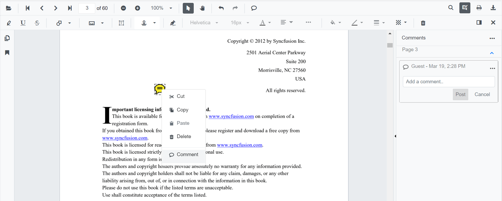
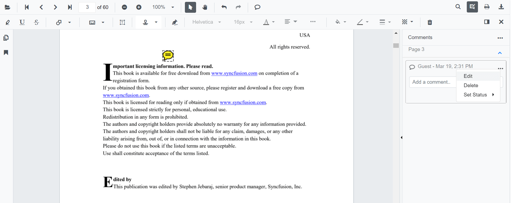
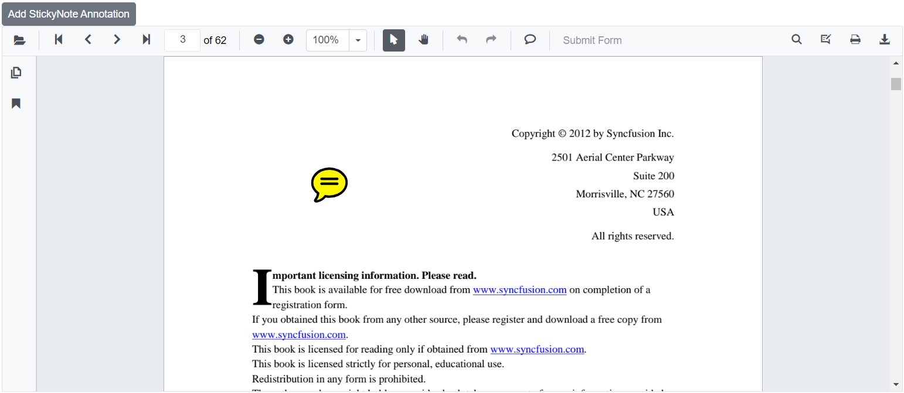
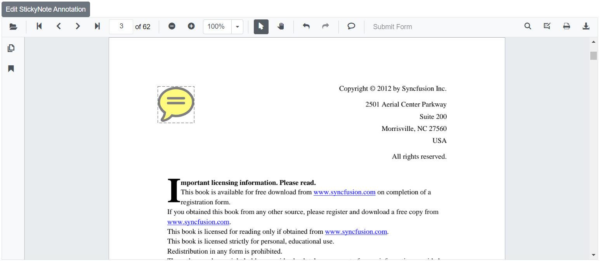

# Sticky notes annotations in Blazor SfPdfViewer Component

The SfPdfViewer control provides the options to add, edit, and delete the sticky note annotations in the PDF document.


## Adding a sticky note annotation to the PDF document

Sticky note annotations can be added to the PDF document using the annotation toolbar.

* Click the **Comments** button in the SfPdfViewer toolbar. A toolbar appears below it.
* Click the position, where you want to add sticky note annotation in the PDF document.
* Sticky note annotation will be added in the clicked positions.


Annotation comments can be added to the PDF document using the comment panel.

* Select a Sticky note annotation in the PDF document and right-click it.
* Select Comment option in the context menu that appears.
* Now, you can add Comments, Reply, and Status using Comment Panel.



## Editing the properties of the sticky note annotation

### Editing opacity

The opacity of the annotation can be edited using the range slider provided in the Edit Opacity tool.


### Editing comments

The comment, comment reply, and comment status of the annotation can be edited using the Comment Panel.

* Open the comment panel using the Comment Panel button displayed in the annotation toolbar.


You can modify or delete the comments or comments replay and it’s status using the menu option provided in the comment panel.



## Setting default properties during control initialization

The properties of the sticky note annotation can be set before creating the control using StickyNoteSettings.

After editing the default opacity using the Edit Opacity tool, they will be changed to the selected values.

```cshtml

@using Syncfusion.Blazor.SfPdfViewer

<SfPdfViewer2 @ref="@viewer"
              DocumentPath="@DocumentPath"
              StickyNotesSettings="@StickyNotesSettings"
              Height="100%"
              Width="100%">
</SfPdfViewer2>

@code {
    SfPdfViewer2 viewer;
    private string DocumentPath { get; set; } = "wwwroot/Data/PDF_Succinctly.pdf";

    PdfViewerStickyNotesSettings StickyNotesSettings = new PdfViewerStickyNotesSettings
        {
            Author = "Syncfusion"
        };
}

```

## Disabling sticky note annotations

The SfPdfViewer2 control provides an option to disable the sticky note annotations feature.

```cshtml

@using Syncfusion.Blazor.SfPdfViewer

<SfPdfViewer2 DocumentPath="@DocumentPath"
              Height="100%"
              Width="100%"
              EnableStickyNotesAnnotation=false>
</SfPdfViewer2>

@code{
    private string DocumentPath { get; set; } = "wwwroot/Data/PDF_Succinctly.pdf";
}

```

## Add sticky note annotation programmatically

The Blazor SfPdfViewer offers the capability to programmatically add the sticky note annotation within the SfPdfViewer control using the [AddAnnotationAsync](https://help.syncfusion.com/cr/blazor/Syncfusion.Blazor.SfPdfViewer.PdfViewerBase.html#Syncfusion_Blazor_SfPdfViewer_PdfViewerBase_AddAnnotationAsync_Syncfusion_Blazor_SfPdfViewer_PdfAnnotation_) method.

Below is an example demonstrating how you can use this method to add sticky note annotation to a PDF document:


```cshtml

@using Syncfusion.Blazor.Navigations;
@using Syncfusion.Blazor.SfPdfViewer

<SfButton OnClick="@AddStickyNoteAnnotationAsync">Add StickyNote Annotation</SfButton>
<SfPdfViewer2 Width="100%" Height="100%" DocumentPath="@DocumentPath" @ref="@Viewer" />

@code {
    SfPdfViewer2 Viewer;
    public string DocumentPath { get; set; } = "wwwroot/Data/PDF_Succinctly.pdf";

    public async void AddStickyNoteAnnotationAsync(MouseEventArgs args)
    {
        PdfAnnotation annotation = new PdfAnnotation();
        // Set the annotation type sticky note
        annotation.Type = AnnotationType.StickyNotes;
        // Set the PageNumber starts from 0. So, if set 2 it represents the page 3.
        annotation.PageNumber = 2;

        // Bound of the sticky note annotation
        annotation.Bound = new Bound();
        annotation.Bound.X = 200;
        annotation.Bound.Y = 150;
        annotation.Bound.Width = 50;
        annotation.Bound.Height = 50;
        // Add sticky note annotation
        await Viewer.AddAnnotationAsync(annotation);
    }
}

```

This code will add a sticky note annotation to the third page of the PDF document.



## Edit sticky note annotation programmatically

The Blazor SfPdfViewer offers the capability to programmatically edit the sticky note annotation within the SfPdfViewer control using the [EditAnnotationAsync](https://help.syncfusion.com/cr/blazor/Syncfusion.Blazor.SfPdfViewer.PdfViewerBase.html#Syncfusion_Blazor_SfPdfViewer_PdfViewerBase_EditAnnotationAsync_Syncfusion_Blazor_SfPdfViewer_PdfAnnotation_) method.

Below is an example demonstrating how you can utilize this method to edit the StickyNote annotation programmatically:

```cshtml

@using Syncfusion.Blazor.Buttons
@using Syncfusion.Blazor.SfPdfViewer

<SfButton OnClick="@EditStickyNoteAnnotationAsync">Edit StickyNote Annotation</SfButton>
<SfPdfViewer2 Width="100%" Height="100%" DocumentPath="@DocumentPath" @ref="@Viewer" />

@code {
    SfPdfViewer2 Viewer;
    public string DocumentPath { get; set; } = "wwwroot/Data/DynamicStampAnnotation.pdf";

    public async void EditStickyNoteAnnotationAsync(MouseEventArgs args)
    {
        // Get annotation collection
        List<PdfAnnotation> annotationCollection = await Viewer.GetAnnotationsAsync();
        // Select the annotation want to edit
        PdfAnnotation annotation = annotationCollection[0];
        // Change the position of the sticky note annotation
        annotation.Bound.X = 100;
        annotation.Bound.Y = 100;
        // Change the width and height of the sticky note annotation
        annotation.Bound.Width = 75;
        annotation.Bound.Height = 75;
        // Change the Opacity (0 to 1) of sticky note annotation
        annotation.Opacity = 0.5;
        // Edit the sticky note annotation
        await Viewer.EditAnnotationAsync(annotation);
    }
}

```

This code snippet will edit the sticky note annotation programmatically within the SfPdfViewer control.



## See also

* [How to delete the annotation programmatically](./text-markup-annotation#delete-annotation-programmatically)