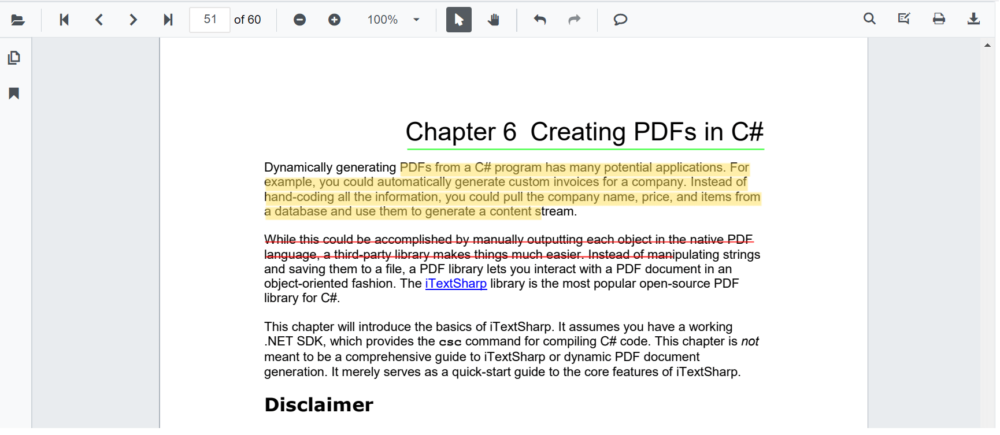
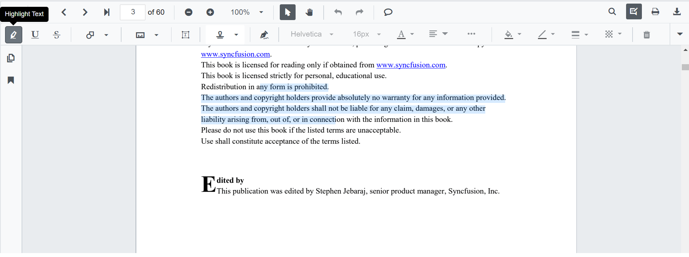
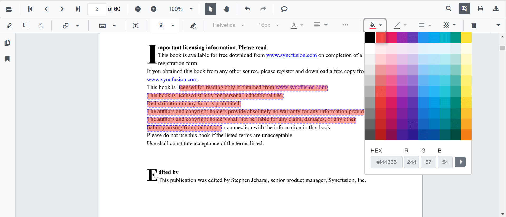
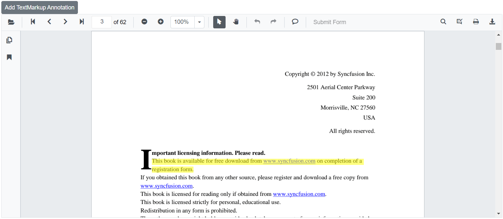
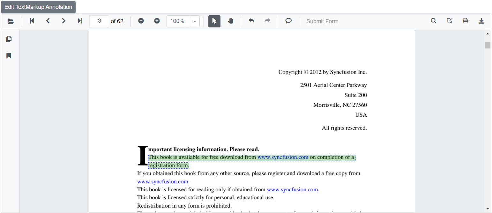

# Text markup annotations in Blazor SfPdfViewer Component

The SfPdfViewer control provides the options to add, edit, and delete text markup annotations such as highlight, underline, and strikethrough annotations in the PDF document.



## Adding text markup annotation to the PDF Document

Text Markup annotations can be added to the PDF document using the annotation toolbar and by using context menu.

## Highlight a text

There are two ways to highlight a text in the PDF document.

**Using the context menu.**

* Select a text in the PDF document and right-click it.
* Select **Highlight** option in the context menu that appears


**Using the annotation toolbar.**

* Click the **Edit Annotation** button in the SfPdfViewer toolbar. A toolbar appears below it.
* Select the **Highlight** button in the annotation toolbar. It enables the highlight mode.
* Select the text and the highlight annotation will be added.
* You can also select the text and apply the highlight annotation using the **Highlight** button.



In the pan mode, if the highlight mode is entered, the SfPdfViewer control will switch to text select mode to enable the text selection for highlighting the text.

```cshtml

@using Syncfusion.Blazor.SfPdfViewer
@using Syncfusion.Blazor.Buttons

<SfButton OnClick="OnClick">Highlight</SfButton>
<SfPdfViewer2 DocumentPath="@DocumentPath"
              @ref="viewer"
              Width="100%"
              Height="100%">
</SfPdfViewer2>

@code {
    SfPdfViewer2 viewer;

    public async void OnClick(MouseEventArgs args)
    {
        await viewer.SetAnnotationModeAsync(AnnotationType.Highlight);
    }
    private string DocumentPath { get; set; } = "wwwroot/Data/PDF_Succinctly.pdf";
}

```

## Underline a text

There are two ways to underline a text in the PDF document.

**Using the context menu.**

* Select a text in the PDF document and right-click it.
* Select **Underline** option in the context menu that appears.


**Using the annotation toolbar.**

* Click the **Edit Annotation** button in the SfPdfViewer toolbar. A toolbar appears below it.
* Select the **Underline** button in the annotation toolbar. It enables the underline mode.
* Select the text and the underline annotation will be added.
* You can also select the text and apply the underline annotation using the **Underline** button.


In the pan mode, if the underline mode is entered, the SfPdfViewer control will switch to text select mode to enable the text selection for underlining the text.

```cshtml

@using Syncfusion.Blazor.SfPdfViewer
@using Syncfusion.Blazor.Buttons

<SfButton OnClick="OnClick">Underline</SfButton>
<SfPdfViewer2 DocumentPath="@DocumentPath"
              @ref="viewer"
              Width="100%"
              Height="100%">
</SfPdfViewer2>

@code {
    SfPdfViewer2 viewer;

    public void OnClick(MouseEventArgs args)
    {
        viewer.SetAnnotationModeAsync(AnnotationType.Underline);
    }
    private string DocumentPath { get; set; } = "wwwroot/Data/PDF_Succinctly.pdf";
}

```

## Strikethrough a text

There are two ways to strikethrough a text in the PDF document:

Using the context menu.

* Select a text in the PDF document and right-click it.
* Select **strikethrough** option in the context menu that appears.


**Using the annotation toolbar.**

* Click the **Edit Annotation** button in the SfPdfViewer toolbar. A toolbar appears below it.
* Select the **Strikethrough** button in the annotation toolbar. It enables the strikethrough mode.
* Select the text and the strikethrough annotation will be added.
* You can also select the text and apply the strikethrough annotation using the **Strikethrough** button.


In the pan mode, if the strikethrough mode is entered, the SfPdfViewer control will switch to text select mode to enable the text selection to strike through the text.

```cshtml

@using Syncfusion.Blazor.SfPdfViewer
@using Syncfusion.Blazor.Buttons

<SfButton OnClick="OnClick">Strikethrough</SfButton>
<SfPdfViewer2 DocumentPath="@DocumentPath"
              @ref="viewer"
              Width="100%"
              Height="100%">
</SfPdfViewer2>

@code {
    SfPdfViewer2 viewer;

    public void OnClick(MouseEventArgs args)
    {
        viewer.SetAnnotationModeAsync(AnnotationType.Strikethrough);
    }
    private string DocumentPath { get; set; } = "wwwroot/Data/PDF_Succinctly.pdf";
}

```

## Editing the properties of the text markup annotation

The color and the opacity of the text markup annotation can be edited using the Edit Color tool and the Edit Opacity tool in the annotation toolbar.

### Editing color

The color of the annotation can be edited using the color palette provided in the Edit Color tool.



### Editing opacity

The opacity of the annotation can be edited using the range slider provided in the Edit Opacity tool.


## Text markup annotation settings

The properties of the text markup annotation can be set before creating the control using highlightSettings, underlineSettings, and strikethroughSettings.

N> After editing the default color and opacity using the Edit color tool and Edit opacity tool, they will be changed to the selected values.

```cshtml

@using Syncfusion.Blazor.SfPdfViewer

<SfPdfViewer2 @ref="@viewer"
              DocumentPath="@DocumentPath"
              HighlightSettings="@HighlightSettings"
              UnderlineSettings="@UnderlineSettings"
              StrikethroughSettings="@StrikethroughSettings"
              Height="100%"
              Width="100%">
</SfPdfViewer2>

@code {
    SfPdfViewer2 viewer;
    private string DocumentPath { get; set; } = "wwwroot/Data/PDF_Succinctly.pdf";

    PdfViewerHighlightSettings HighlightSettings = new PdfViewerHighlightSettings
        {
            Color = "green",
            Opacity = 0.6
        };

    PdfViewerUnderlineSettings UnderlineSettings = new PdfViewerUnderlineSettings
        {
            Color = "blue",
            Opacity = 0.6
        };

    PdfViewerStrikethroughSettings StrikethroughSettings = new PdfViewerStrikethroughSettings
        {
            Color = "orange",
            Opacity = 0.6
        };
}

```
## Add text markup annotation programmatically

The Blazor SfPdfViewer offers the capability to programmatically add the text markup annotation such as Highlight, Underline, and Strikethrough within the SfPdfViewer control using the [AddAnnotationAsync](https://help.syncfusion.com/cr/blazor/Syncfusion.Blazor.SfPdfViewer.PdfViewerBase.html#Syncfusion_Blazor_SfPdfViewer_PdfViewerBase_AddAnnotationAsync_Syncfusion_Blazor_SfPdfViewer_PdfAnnotation_)  method.

Below is an example demonstrating how you can use this method to add a text markup annotation to a PDF document:

```cshtml

@using Syncfusion.Blazor.Buttons
@using Syncfusion.Blazor.SfPdfViewer

<SfButton OnClick="@AddTextMarkupAnnotation">Add TextMarkup Annotation</SfButton>
<SfPdfViewer2 Width="100%" Height="100%" DocumentPath="@DocumentPath" @ref="@Viewer" />

@code {
    SfPdfViewer2 Viewer;
    public string DocumentPath { get; set; } = "wwwroot/Data/PDF_Succinctly.pdf";

    public async void AddTextMarkupAnnotation(MouseEventArgs args)
    {
        PdfAnnotation annotation = new PdfAnnotation();
        // Set the Text markup annotation type like highlight, underline, strikethrough
        annotation.Type = AnnotationType.Highlight;
        // Set the PageNumber starts from 0. So, if set to 2 it represents the page 3. 
        annotation.PageNumber = 2;
        List<Bound> bounds = new List<Bound>();
        Bound bound = new Bound();
        bound.X = 148;
        bound.Y = 313;
        bound.Width = 520;
        bound.Height = 15;
        bounds.Add(bound);
        bound = new Bound();
        bound.X = 148;
        bound.Y = 332;
        bound.Width = 102;
        bound.Height = 15;
        bounds.Add(bound);
        // Set the Text Markup annotation bounds value
        annotation.Bounds = bounds;
        await Viewer.AddAnnotationAsync(annotation);
    }
}

```

This code will add a text markup annotation to the third page of the PDF document.



[View sample in GitHub](https://github.com/SyncfusionExamples/blazor-pdf-viewer-examples/tree/master/Annotations/Programmatic%20Support/Text%20Markup/Add).

## Edit text markup annotation programmatically

The Blazor SfPdfViewer offers the capability to programmatically edit the text markup annotation such as Highlight, Underline, and Strikethrough within the SfPdfViewer control using the [EditAnnotationAsync](https://help.syncfusion.com/cr/blazor/Syncfusion.Blazor.SfPdfViewer.PdfViewerBase.html#Syncfusion_Blazor_SfPdfViewer_PdfViewerBase_EditAnnotationAsync_Syncfusion_Blazor_SfPdfViewer_PdfAnnotation_) method.

Below is an example demonstrating how you can utilize this method to edit the text markup annotation programmatically:

```cshtml

@using Syncfusion.Blazor.Buttons
@using Syncfusion.Blazor.SfPdfViewer

<SfButton OnClick="@EditTextMarkupAnnotation">Edit TextMarkup Annotation</SfButton>
<SfPdfViewer2 Width="100%" Height="100%" DocumentPath="@DocumentPath" @ref="@Viewer" />

@code {
    SfPdfViewer2 Viewer;
    public string DocumentPath { get; set; } = "wwwroot/Data/TextMarkupAnnotation.pdf";

    public async void EditTextMarkupAnnotation(MouseEventArgs args)
    {
        // Get annotation collection
        List<PdfAnnotation> annotationCollection = await Viewer.GetAnnotationsAsync();
        // Select the annotation want to edit
        PdfAnnotation annotation = annotationCollection[0];
        // Change the color of the text markup annotation to green        
        annotation.Color = "#008000";
        // Change the opacity of the text markup annotation to 50% (0.5)        
        annotation.Opacity = 0.5;
        await Viewer.EditAnnotationAsync(annotation);
    }
}

```

This code snippet will edit the text markup annotation programmatically within the SfPdfViewer control.



[View sample in GitHub](https://github.com/SyncfusionExamples/blazor-pdf-viewer-examples/tree/master/Annotations/Programmatic%20Support/Text%20Markup/Edit).

## Delete annotation programmatically

The Blazor SfPdfViewer additionally offers the functionality to programmatically remove annotations within the SfPdfViewer control using the [DeleteAnnotationAsync](https://help.syncfusion.com/cr/blazor/Syncfusion.Blazor.SfPdfViewer.PdfViewerBase.html#Syncfusion_Blazor_SfPdfViewer_PdfViewerBase_DeleteAnnotationAsync_Syncfusion_Blazor_SfPdfViewer_PdfAnnotation_) method.

Below is an example demonstrating how you can utilize this method to delete an annotation programmatically:

```cshtml

@using Syncfusion.Blazor.Buttons
@using Syncfusion.Blazor.SfPdfViewer

<SfButton OnClick="@DeleteAnnotation">Delete Annotation</SfButton>
<SfPdfViewer2 Width="100%" Height="100%" DocumentPath="@DocumentPath" @ref="@Viewer" />

@code {
    SfPdfViewer2 Viewer;
    public string DocumentPath { get; set; } = "wwwroot/Data/Annotation.pdf";

    public async void DeleteAnnotation(MouseEventArgs args)
    {
        // Get the annotation collection
        List<PdfAnnotation> annotationCollection = await Viewer.GetAnnotationsAsync();
        // Select the annotation you want to delete
        PdfAnnotation annotation = annotationCollection[0];
        // Delete the specified PdfAnnotation
        await Viewer.DeleteAnnotationAsync(annotation);
        // Alternatively, you can also delete the specified PdfAnnotation based on AnnotationId
        //await Viewer.DeleteAnnotationAsync(annotation.Id);
    }
}

```
This code snippet demonstrates how to programmatically delete an annotation within the Syncfusion Blazor SfPdfViewer using the [DeleteAnnotationAsync](https://help.syncfusion.com/cr/blazor/Syncfusion.Blazor.SfPdfViewer.PdfViewerBase.html#Syncfusion_Blazor_SfPdfViewer_PdfViewerBase_DeleteAnnotationAsync_Syncfusion_Blazor_SfPdfViewer_PdfAnnotation_) method.

N> Alternatively, delete the annotation with the annotation ID using the [DeleteAnnotationAsync](https://help.syncfusion.com/cr/blazor/Syncfusion.Blazor.SfPdfViewer.PdfViewerBase.html#Syncfusion_Blazor_SfPdfViewer_PdfViewerBase_DeleteAnnotationAsync_System_String_) method.

[View sample in GitHub](https://github.com/SyncfusionExamples/blazor-pdf-viewer-examples/tree/master/Annotations/Programmatic%20Support/Delete%20Annotation).

## See also

* [How to change the highlight color of the text](../how-to/change-the-highlighted-color-of-the-text)