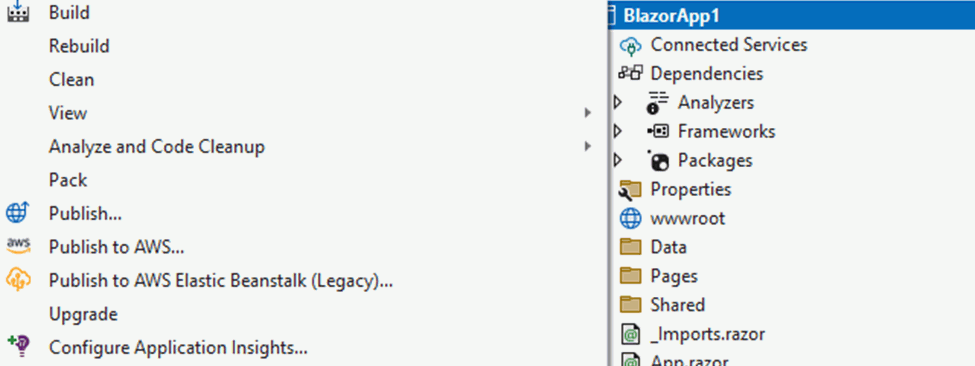
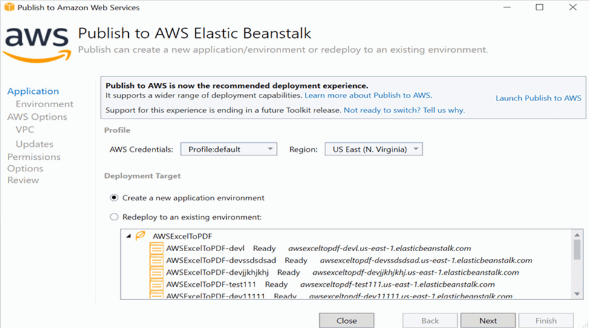
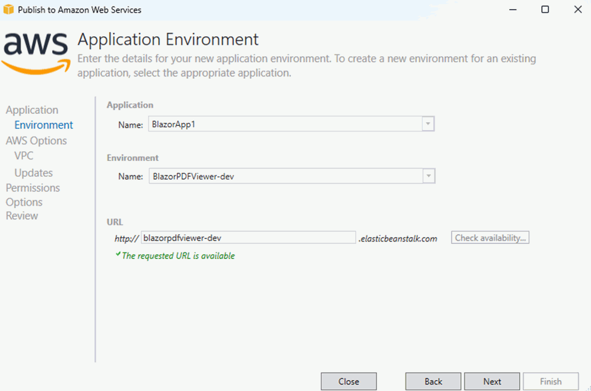
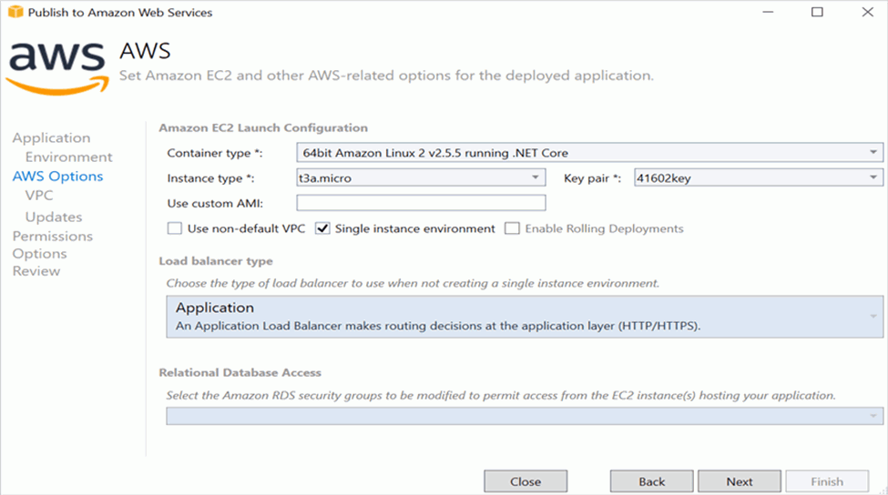
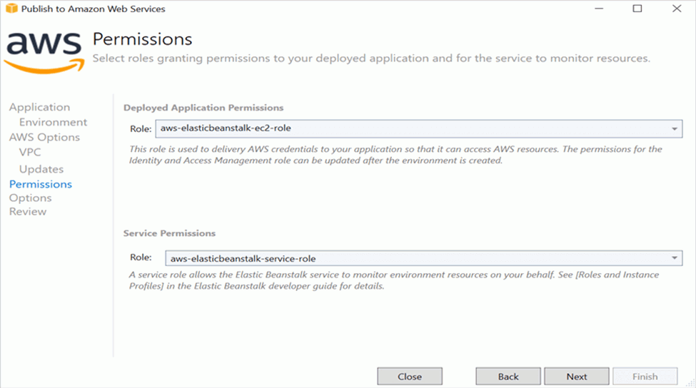

# Deploy Blazor Server App on AWS Elastic Beanstalk Linux

In this section, we'll guide you through the process of adding Syncfusion's Blazor PDF Viewer (Next Gen) component to your Blazor Server app and deploy it on AWS Elastic Beanstalk. We'll break it down into simple steps to make it easy to follow. Additionally, you can find a fully functional example project on our [GitHub repository](https://github.com/SyncfusionExamples/blazor-pdf-viewer-examples/tree/master/Server%20Deployment/AWS/AWS_Elastic_Beanstalk/SfPdfViewerApp).

## Prerequisites

* [System requirements for Blazor components](https://blazor.syncfusion.com/documentation/system-requirements)

## Create a new Blazor App in Visual Studio

Create a new Blazor Server app and name it **PDFViewerGettingStarted**.

N> The PDF Viewer (Next Gen) component is supported from .NET 6.0 onwards.

## Install Blazor PDF Viewer NuGet package in Blazor Server App

Add the following NuGet packages into the Blazor Server app.

* [Syncfusion.Blazor.SfPdfViewer](https://www.nuget.org/packages/Syncfusion.Blazor.SfPdfViewer) 
* [Syncfusion.Blazor.Themes](https://www.nuget.org/packages/Syncfusion.Blazor.Themes)

## Register Syncfusion Blazor Service

* In the **~/_Imports.razor** file, add the following namespaces:




@using Syncfusion.Blazor;
@using Syncfusion.Blazor.SfPdfViewer;




* Register the Syncfusion Blazor Service in the **~/Program.cs** file.




using Microsoft.AspNetCore.Components;
using Microsoft.AspNetCore.Components.Web;
using Syncfusion.Blazor;

var builder = WebApplication.CreateBuilder(args);

// Add services to the container.
builder.Services.AddRazorPages();
builder.Services.AddServerSideBlazor().AddHubOptions(o => { o.MaximumReceiveMessageSize = 102400000; });

// Add Syncfusion Blazor service to the container.
builder.Services.AddSyncfusionBlazor();

var app = builder.Build();




## Adding stylesheet and script

Add the following stylesheet and script to the head section of the **~/Pages/_Host.cshtml** file.




<head>
    <!-- Syncfusion Blazor PDF Viewer (Next Gen) control's theme style sheet -->
    <link href="_content/Syncfusion.Blazor.Themes/bootstrap5.css" rel="stylesheet" />
    <!-- Syncfusion Blazor PDF Viewer (Next Gen) control's scripts -->
    
</head>




## Adding Blazor PDF Viewer (Next Gen) Component

Add the Syncfusion PDF Viewer (Next Gen) component in the **~/Pages/Index.razor** file




@page "/"

<SfPdfViewer2 DocumentPath="https://cdn.syncfusion.com/content/pdf/pdf-succinctly.pdf"
              Height="100%"
              Width="100%">
</SfPdfViewer2>




N> If you don't provide the `DocumentPath` property value, the PDF Viewer (Next Gen) component will be rendered without loading the PDF document. Users can then use the **open** option from the toolbar to browse and open the PDF as required.

## Run the application

Run the application, and the PDF file will be displayed using Syncfusion's Blazor PDF Viewer (Next Gen) component in your browser.



## Steps to publish as AWS Elastic Beanstalk

1. Right-click the project and select Publish to AWS Elastic Beanstalk (Legacy) option.

2. Select the Deployment Target as Create a new application environment and click Next button.

3. Choose the Environment Name in the dropdown list and the URL will be automatically assign and check the URL is available, if available click next otherwise change the URL

4. Select the instance type in t3a.micro from the dropdown list and click next.

5. Click the Next button to proceed further.

6. Click the Next button

7. Click the Deploy button to deploy the sample on AWS Elastic Beanstalk.

8. After changing the status from Updating to Environment is healthy, click the URL.

9. After opening the provided URL the provided PDF document will be displayed in PDF Viewer.

## See also

* [Getting Started with Blazor PDF Viewer (Next Gen) Component in Blazor WASM App](https://blazor.syncfusion.com/documentation/pdfviewer-2/getting-started/web-assembly-application)

* [Getting Started with Blazor PDF Viewer (Next Gen) Component in WSL mode](https://blazor.syncfusion.com/documentation/pdfviewer-2/getting-started/wsl-application)

* [Learn different ways to add script reference in Blazor Application](https://blazor.syncfusion.com/documentation/common/adding-script-references)

