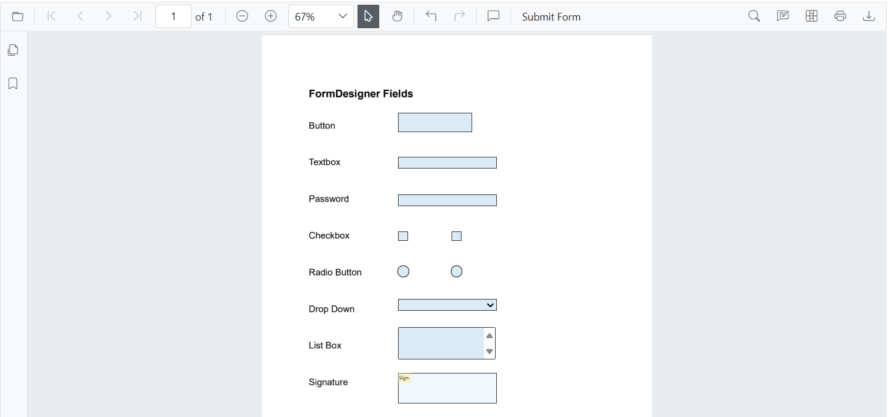
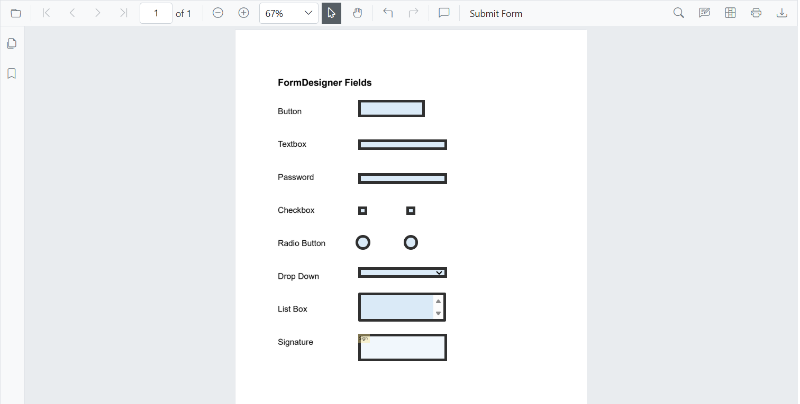
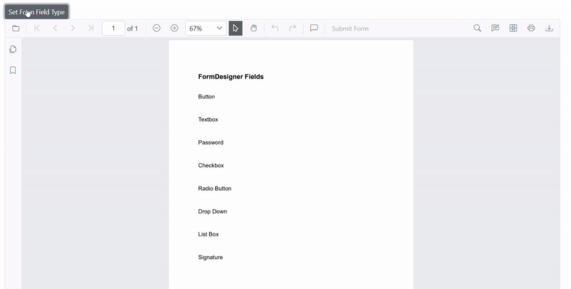
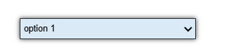
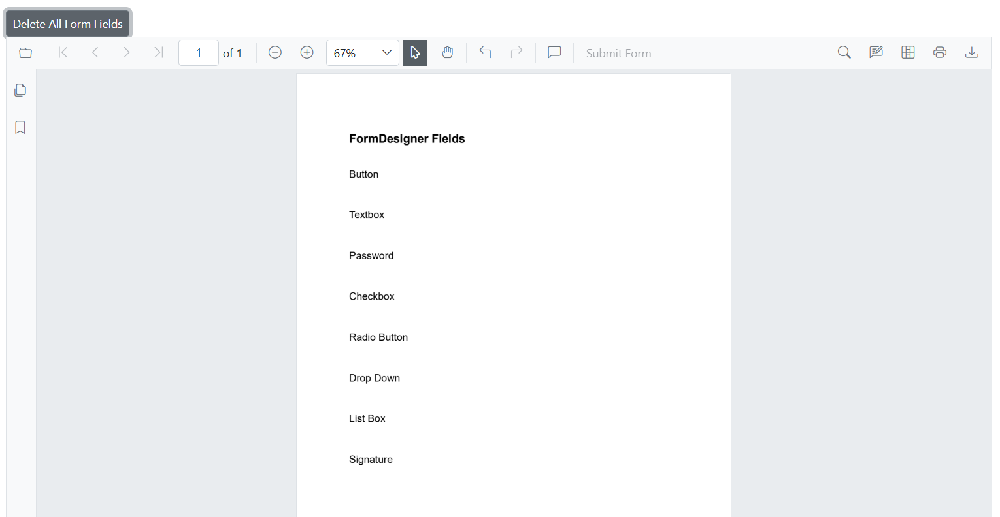
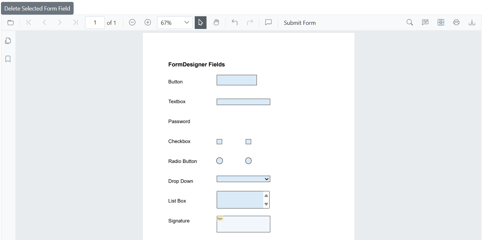
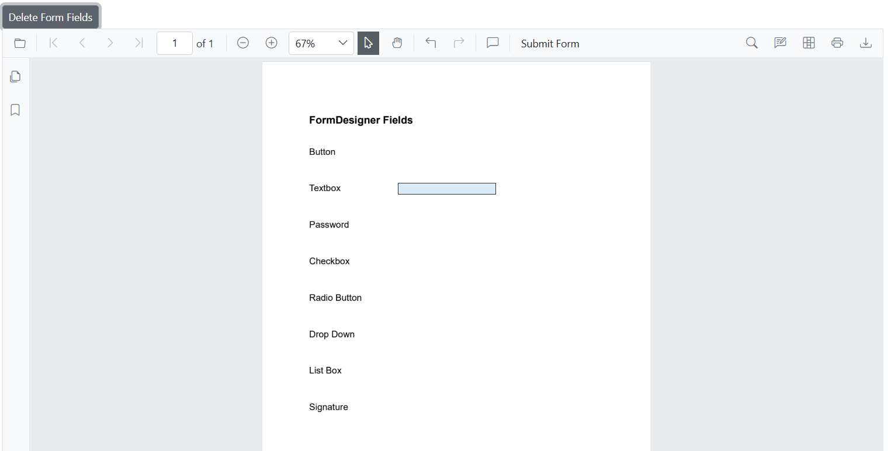
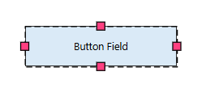

# Create Fields Programmatically in Blazor SfPdfViewer  

The Blazor SfPdfViewer component provides programmatic control over form fields in a PDF document. This enables seamless form handling and enhances user interaction through code.  

## Adding Form Fields Programmatically

The Blazor SfPdfViewer offers a way to add form fields programmatically using the [`AddFormFieldsAsync`](https://help.syncfusion.com/cr/blazor/Syncfusion.Blazor.SfPdfViewer.PdfViewerBase.html#Syncfusion_Blazor_SfPdfViewer_PdfViewerBase_AddFormFieldsAsync_System_Collections_Generic_List_Syncfusion_Blazor_SfPdfViewer_FormFieldInfo__) method.
This method accepts a list of [`FormFieldInfo`](https://help.syncfusion.com/cr/blazor/Syncfusion.Blazor.SfPdfViewer.FormFieldInfo.html) objects, where each object represents a form field with specific properties.  

The example below demonstrates how to add form fields in the PdfViewer component:

```razor
@page "/"

<!-- PDF Viewer component with reference binding and document loading -->
<SfPdfViewer2 @ref="@viewer" Height="100%" Width="100%" DocumentPath="@DocumentPath">
    <PdfViewerEvents DocumentLoaded="@AddFormFields"></PdfViewerEvents>
</SfPdfViewer2>

@code {
    // Reference to the PDF Viewer instance
    private SfPdfViewer2 viewer;
    
    // Path to the PDF document
    private string DocumentPath = "wwwroot/data/formDesigner_Empty.pdf";

    // Method triggered when the document is loaded
    private async Task AddFormFields()
    {
        // Define various form fields with their properties and positions
        List<FormFieldInfo> formFields = new List<FormFieldInfo>
        {
            new ButtonField { Name = "Button Field", Bounds = new Bound { X = 278, Y = 157, Width = 150, Height = 40 } },
            new TextBoxField { Name = "TextBox Field", Bounds = new Bound { X = 278, Y = 247, Width = 200, Height = 24 } },
            new PasswordField { Name = "Password Field", Bounds = new Bound { X = 278, Y = 323, Width = 200, Height = 24 } },
            new CheckBoxField { Name = "CheckBox Field1", IsChecked = false, Bounds = new Bound { X = 278, Y = 398, Width = 20, Height = 20 } },
            new CheckBoxField { Name = "CheckBox Field2", IsChecked = false, Bounds = new Bound { X = 386, Y = 398, Width = 20, Height = 20 } },
            new RadioButtonField { Name = "RadioButton", Value = "Value1", IsSelected = false, Bounds = new Bound { X = 278, Y = 470, Width = 20, Height = 20 } },
            new RadioButtonField { Name = "RadioButton", Value = "Value2", IsSelected = false, Bounds = new Bound { X = 386, Y = 470, Width = 20, Height = 20 } },
            new DropDownField { Name = "DropDown Field", Bounds = new Bound { X = 278, Y = 536, Width = 200, Height = 24 } },
            new ListBoxField { Name = "ListBox Field", Bounds = new Bound { X = 278, Y = 593, Width = 198, Height = 66 } },
            new SignatureField { Name = "Signature Field", Bounds = new Bound { X = 278, Y = 686, Width = 200, Height = 63 } }
        };
        
        // Add form fields asynchronously to the PDF Viewer
        await viewer.AddFormFieldsAsync(formFields);
    }
}
```
The following image illustrates the programmatic addition of form fields in Blazor SfPdfViewer:



N> Users can also add form fields through the UI in SfPdfViewer, allowing for an intuitive and interactive customization experience.  
[Interactively Add Form Fields]()

[View sample in GitHub](https://github.com/SyncfusionExamples/blazor-pdf-viewer-examples/blob/master/Form%20Designer/Components/Pages/AddFormField.razor).

## Form Field Settings  

The Blazor SfPdfViewer provides [`FormFieldSettings`](https://help.syncfusion.com/cr/blazor/Syncfusion.Blazor.SfPdfViewer.FormFieldSettings.html) to configure the appearance of form fields in a PDF document. These settings allow defining the border, background, text styles, and other properties.

This code below is for thickness. You can also configure **background color, border color, text color, font family, font size, and font style**.

```razor
@page "/"

<!-- PDF Viewer component with reference binding and document loading -->
<SfPdfViewer2 @ref="@viewer" Height="100%" Width="100%" DocumentPath="@DocumentPath">
    <!-- Form field settings with specified thickness -->
    <FormFieldSettings Thickness="@thickness"></FormFieldSettings>
    <!-- Event triggered when the document is loaded -->
    <PdfViewerEvents DocumentLoaded="@AddFormFields"></PdfViewerEvents>
</SfPdfViewer2>

@code {
    // Reference to the PDF Viewer instance
    private SfPdfViewer2 viewer;

    // Default thickness value for form fields
    private double thickness { get; set; } = 4;

    // Path to the PDF document to be loaded in the viewer
    private string DocumentPath = "wwwroot/data/formDesigner_Empty.pdf";

    // Method triggered when the document is loaded
    private async Task AddFormFields()
    {
        // Define a new ListBox form field with specified name and position
        ListBoxField listBox = new ListBoxField 
        { 
            Name = "ListBox Field", 
            Bounds = new Bound { X = 278, Y = 593, Width = 198, Height = 66 } 
        };

        // Add the form field asynchronously to the PDF Viewer
        await viewer.AddFormFieldsAsync(new List<FormFieldInfo> { listBox });
    }
}

```
The following image illustrates the listbox field thickness customization in Blazor SfPdfViewer:



[View sample in GitHub](https://github.com/SyncfusionExamples/blazor-pdf-viewer-examples/blob/master/Form%20Designer/Components/Pages/FieldSetting.razor).

## Activating and Deactivating Form Field Mode

The [`SetFormDrawingModeAsync`](https://help.syncfusion.com/cr/blazor/Syncfusion.Blazor.SfPdfViewer.PdfViewerBase.html#Syncfusion_Blazor_SfPdfViewer_PdfViewerBase_SetFormDrawingModeAsync_System_Nullable_Syncfusion_Blazor_SfPdfViewer_FormFieldType__) method allows defining the type of form field that can be drawn in the PDF Viewer. This enables users to add form fields interactively.

### Usage

- **Setting Form Field Mode:** Specify a [`FormFieldType`](https://help.syncfusion.com/cr/blazor/Syncfusion.Blazor.SfPdfViewer.FormFieldType.html) to allow adding a specific form field.
- **Clearing Form Field Mode:** Reset the form field selection by calling [`SetFormDrawingModeAsync()`](https://help.syncfusion.com/cr/blazor/Syncfusion.Blazor.SfPdfViewer.PdfViewerBase.html#Syncfusion_Blazor_SfPdfViewer_PdfViewerBase_SetFormDrawingModeAsync_System_Nullable_Syncfusion_Blazor_SfPdfViewer_FormFieldType__) without parameters.

### Example

Below is an example demonstrating how to set and clear the form field drawing mode:

```razor
@page "/"
@using Syncfusion.Blazor.Buttons

<!-- Buttons to set and clear the form field drawing mode -->
<SfButton @onclick="SetFormDrawingMode">Set Form Field Type</SfButton>
<SfButton @onclick="ClearFormDrawingMode">Clear Form Field Type</SfButton>

<!-- PDF Viewer component -->
<SfPdfViewer2 @ref="@viewer" Height="100%" Width="100%" DocumentPath="@DocumentPath">
</SfPdfViewer2>

@code {
    // Reference to the PDF Viewer instance
    private SfPdfViewer2 viewer;

    // Path to the PDF document to be loaded in the viewer
    private string DocumentPath = "wwwroot/data/formDesigner_Empty.pdf";

    // Method to enable form field drawing mode with a specific field type
    async Task SetFormDrawingMode()
    {
        // Sets the form field drawing mode to DropDown, allowing users to add dropdown fields
        await viewer.SetFormDrawingModeAsync(FormFieldType.DropDown);
    }

    // Method to disable form field drawing mode
    async Task ClearFormDrawingMode()
    {
        // Clears the form field drawing mode, preventing further form field additions
        await viewer.SetFormDrawingModeAsync();
    }
}
```
The following image illustrates setting and clearing the form field mode in Blazor SfPdfViewer:  



[View sample in GitHub](https://github.com/SyncfusionExamples/blazor-pdf-viewer-examples/blob/master/Form%20Designer/Components/Pages/SetMode.razor).

## Update Form Fields

The Update functionality enables dynamic modification of form field properties in a PDF document by retrieving fields via [`GetFormFieldsAsync()`](https://help.syncfusion.com/cr/blazor/Syncfusion.Blazor.SfPdfViewer.PdfViewerBase.html#Syncfusion_Blazor_SfPdfViewer_PdfViewerBase_GetFormFieldsAsync) and updating their values, appearance, or behavior. These changes are applied using [`UpdateFormFieldsAsync()`](https://help.syncfusion.com/cr/blazor/Syncfusion.Blazor.SfPdfViewer.PdfViewerBase.html#Syncfusion_Blazor_SfPdfViewer_PdfViewerBase_UpdateFormFieldsAsync_Syncfusion_Blazor_SfPdfViewer_FormField_), ensuring they reflect in the viewer.

### Appearance Properties
Controls the visual aspects of form fields, including background color, border color, text color, thickness, maxLength, visibility, font size, font family, font style and text alignment. These properties help customize the look and feel of form fields in the document.

```razor
@page "/"

<!-- PDF Viewer component with reference binding and document loading -->
<SfPdfViewer2 @ref="@viewer" Height="100%" Width="100%" DocumentPath="@DocumentPath">
    <!-- Event triggered when the document is loaded -->
    <PdfViewerEvents DocumentLoaded="@UpdateFormField"></PdfViewerEvents>
</SfPdfViewer2>

@code {
    // Reference to the PDF Viewer instance
    private SfPdfViewer2 viewer;

    // Path to the PDF document to be loaded in the viewer
    private string DocumentPath = "wwwroot/data/formDesigner_Document.pdf";

    // Method triggered when the document is loaded
    private async Task UpdateFormField()
    {
        // Retrieve the list of added form fields from the PDF Viewer
        List<FormFieldInfo> formFields = await viewer.GetFormFieldsAsync();

        // Access the first form field in the list (assuming it is a button field)
        FormFieldInfo buttonField = formFields[0];

        // Modify the appearance properties of the form field
        buttonField.BackgroundColor = "#008000";
        buttonField.BorderColor = "#FFFF00";     
        buttonField.Thickness = 2;                

        // Update the form field in the PDF Viewer with the new properties
        await viewer.UpdateFormFieldsAsync(new List<FormFieldInfo> { buttonField });
    }
}

```
The following image illustrates updating the appearance of a button form field in Blazor SfPdfViewer:  


[View sample in GitHub](https://github.com/SyncfusionExamples/blazor-pdf-viewer-examples/blob/master/Form%20Designer/Components/Pages/UpdateApperanceProperties.razor).

### Identification & Metadata Properties
Includes properties like name (unique identifier) and value (storing user input or assigned data). These attributes help distinguish and manage form fields efficiently.

```razor
@page "/"

<!-- PDF Viewer component with reference binding and document loading -->
<SfPdfViewer2 @ref="@viewer" Height="100%" Width="100%" DocumentPath="@DocumentPath">
    <PdfViewerEvents DocumentLoaded="@UpdateFormField"></PdfViewerEvents>
</SfPdfViewer2>

@code {
    private SfPdfViewer2 viewer;
    private string DocumentPath = "wwwroot/data/formDesigner_Document.pdf";

    private async Task UpdateFormField()
    {
        // Retrieve the list of added form fields
        List<FormFieldInfo> formFields = await viewer.GetFormFieldsAsync();
        foreach (FormFieldInfo field in formFields)
        {
            if (field is DropDownField dropDown)
            {
                dropDown.Items = new List<ListItem> {
                        new ListItem { Name = "option 1", Value = "Option 1" },
                        new ListItem { Name = "option 2", Value = "Option 2" },
                        new ListItem { Name = "option 3", Value = "Option 3" }
                    };
                // Update form fields in the viewer with new properties
                await viewer.UpdateFormFieldsAsync(new List<FormFieldInfo> { dropDown });
            }
        }
    }
}
```
The following image illustrates updating the metadata of dropdown field in Blazor SfPdfViewer:  



[View sample in GitHub](https://github.com/SyncfusionExamples/blazor-pdf-viewer-examples/blob/master/Form%20Designer/Components/Pages/UpdateValueProperties.razor).

### Grouping and Synchronizing Form Fields Properties

When multiple fields share the same name, changes apply to all linked fields. Updates to **Value, Required, Readonly, Multiline, and Tooltip** reflect instantly. This ensures consistency across the document.

```razor
@page "/"

<!-- PDF Viewer component with reference binding and document loading -->
<SfPdfViewer2 @ref="@viewer" Height="100%" Width="100%" DocumentPath="@DocumentPath">
    <PdfViewerEvents DocumentLoaded="@UpdateFormField"></PdfViewerEvents>
</SfPdfViewer2>

@code {
    private SfPdfViewer2 viewer;
    private string DocumentPath = "wwwroot/data/formDesigner_Document.pdf";

    private async Task UpdateFormField()
    {
        // Retrieve the list of added form fields
        List<FormFieldInfo> formFields = await viewer.GetFormFieldsAsync();
        FormFieldInfo radioButton = formFields[6];
        radioButton.IsReadOnly = true;
        radioButton.IsRequired = true;
        await viewer.UpdateFormFieldsAsync(new List<FormFieldInfo> { radioButton });
    }
}
```
The following image illustrates updating linked properties of a radio button form field in Blazor SfPdfViewer:  


[View sample in GitHub](https://github.com/SyncfusionExamples/blazor-pdf-viewer-examples/blob/master/Form%20Designer/Components/Pages/UpdateLinkedProperties.razor).

N> Users can also Update form fields through the UI in SfPdfViewer, allowing for an intuitive and interactive customization experience.  
[Interactively Update Form Fields]()

## Delete Form Fields

The [`DeleteFormFieldsAsync()`](https://help.syncfusion.com/cr/blazor/Syncfusion.Blazor.SfPdfViewer.PdfViewerBase.html#Syncfusion_Blazor_SfPdfViewer_PdfViewerBase_DeleteFormFieldsAsync_System_Boolean_) method enables the removal of form fields from the document, allowing users to manage and modify form structures efficiently.  

### Delete All Form Fields  
Removes all form fields from the document using [`DeleteFormFieldsAsync()`](https://help.syncfusion.com/cr/blazor/Syncfusion.Blazor.SfPdfViewer.PdfViewerBase.html#Syncfusion_Blazor_SfPdfViewer_PdfViewerBase_DeleteFormFieldsAsync_System_Boolean_) , clearing all interactive elements at once.

```razor
@page "/"
@using Syncfusion.Blazor.Buttons

<!-- Button to delete all form fields -->
<SfButton onclick="@DeleteAllFormFields">Delete All Form Fields</SfButton>

<!-- PDF Viewer component with reference binding and document loading -->
<SfPdfViewer2 @ref="@viewer" Height="100%" Width="100%" DocumentPath="@DocumentPath">
</SfPdfViewer2>

@code {
    // Reference to the PDF Viewer instance
    private SfPdfViewer2 viewer;
    
    // Path to the PDF document
    private string DocumentPath = "wwwroot/data/formDesigner_Document.pdf";
    
    private async Task DeleteAllFormFields() 
    {
        // Deletes all form fields from the PDF Viewer.
        await viewer.DeleteFormFieldsAsync(true);
    }
}
```
The following image illustrates deleting all form fields in Blazor SfPdfViewer:  



[View sample in GitHub](https://github.com/SyncfusionExamples/blazor-pdf-viewer-examples/blob/master/Form%20Designer/Components/Pages/DeleteAllFields.razor).

### Delete Selected Form Fields  
Deletes only the currently selected form field using [`DeleteFormFieldsAsync()`](https://help.syncfusion.com/cr/blazor/Syncfusion.Blazor.SfPdfViewer.PdfViewerBase.html#Syncfusion_Blazor_SfPdfViewer_PdfViewerBase_DeleteFormFieldsAsync_System_Boolean_), enabling users to modify the document while keeping the rest of the form structure intact.

```razor
@page "/"
@using Syncfusion.Blazor.Buttons

<!-- Button to delete the selected form fields -->
<SfButton onclick="@DeleteSelectedFormField">Delete Selected Form Field</SfButton>

<!-- PDF Viewer component with reference binding and document loading -->
<SfPdfViewer2 @ref="@viewer" Height="100%" Width="100%" DocumentPath="@DocumentPath">
</SfPdfViewer2>

@code {
    // Reference to the PDF Viewer instance
    private SfPdfViewer2 viewer;
    
    // Path to the PDF document
    private string DocumentPath = "wwwroot/data/formDesigner_Document.pdf";
    
    private async Task DeleteSelectedFormField() 
    {
        // Delete selected form field from the PDF Viewer.
        await viewer.DeleteFormFieldsAsync(false);
    }
}
```
The following image illustrates deleting a selected password field in Blazor SfPdfViewer:  



[View sample in GitHub](https://github.com/SyncfusionExamples/blazor-pdf-viewer-examples/blob/master/Form%20Designer/Components/Pages/DeleteSelectedField.razor).

### Delete Form Fields by IDs  
Removes specific form fields using [`DeleteFormFieldsAsync()`](https://help.syncfusion.com/cr/blazor/Syncfusion.Blazor.SfPdfViewer.PdfViewerBase.html#Syncfusion_Blazor_SfPdfViewer_PdfViewerBase_DeleteFormFieldsAsync_System_Collections_Generic_List_System_String__) based on their unique identifiers, allowing precise control over which fields are deleted without affecting others.  

 ```razor
@page "/"
@using Syncfusion.Blazor.Buttons

<!-- Delete form fields by ID -->
<SfButton @onclick="DeleteFormFields">Delete Form Field By ID</SfButton>

<!-- PDF Viewer component with reference binding and document loading -->
<SfPdfViewer2 @ref="@viewer" Height="100%" Width="100%" DocumentPath="@DocumentPath">
</SfPdfViewer2>

@code {
    // Reference to the PDF Viewer instance
    private SfPdfViewer2 viewer;

    // Path to the PDF document that will be loaded into the viewer
    private string DocumentPath = "wwwroot/data/formDesigner_Document.pdf";

    // Method to delete form fields based on their ID
    private async Task DeleteFormFields()
    {
        List<FormFieldInfo> formFields = await viewer.GetFormFieldsAsync();
        await viewer.DeleteFormFieldsAsync(new List<string> {formFields[0].Id}); // Delete form fields by ID
    }
}
```
The following image illustrates deleting form fields by their IDs in Blazor SfPdfViewer:  



[View sample in GitHub](https://github.com/SyncfusionExamples/blazor-pdf-viewer-examples/blob/master/Form%20Designer/Components/Pages/DeleteById.razor).

N> Users can also Delete form fields through the UI in SfPdfViewer, allowing for an intuitive and interactive customization experience.  
[Interactively Delete Form Fields]()

## Select Form Field

Form field can be programmatically selected using the [`SelectFormFieldAsync`](https://help.syncfusion.com/cr/blazor/Syncfusion.Blazor.SfPdfViewer.PdfViewerBase.html#Syncfusion_Blazor_SfPdfViewer_PdfViewerBase_SelectFormFieldAsync_Syncfusion_Blazor_SfPdfViewer_FormFieldInfo_) method. This allows users to highlight specific form field based on either their unique identifier or their object reference.

### Select Form Field by ID

To select a form field using its unique identifier, pass the field's ID to the [`SelectFormFieldAsync`](https://help.syncfusion.com/cr/blazor/Syncfusion.Blazor.SfPdfViewer.PdfViewerBase.html#Syncfusion_Blazor_SfPdfViewer_PdfViewerBase_SelectFormFieldAsync_System_String_) method.

```razor
@page "/"
@using Syncfusion.Blazor.Buttons

<!-- Button to select a form field by its ID -->
<SfButton @onclick="SelectFormFieldByID">Select Form Field By ID</SfButton>

<!-- PDF Viewer component with reference binding and document loading -->
<SfPdfViewer2 @ref="@viewer" Height="100%" Width="100%" DocumentPath="@DocumentPath">
</SfPdfViewer2>

@code {
    // Reference to the PDF Viewer instance
    private SfPdfViewer2 viewer;

    // Path to the PDF document that will be loaded in the viewer
    private string DocumentPath = "wwwroot/data/formDesigner_Document.pdf";

    // Method to select a form field by ID
    private async Task SelectFormFieldByID()
    {
        // Retrieve all form fields currently present in the PDF
        List<FormFieldInfo> formFields = await viewer.GetFormFieldsAsync();
        // Select the form field asynchronously using its ID
        await viewer.SelectFormFieldAsync(formFields[0]);
  
    }
}
```
The following image illustrates selecting a button field by its ID in Blazor SfPdfViewer:  



[View sample in GitHub](https://github.com/SyncfusionExamples/blazor-pdf-viewer-examples/blob/master/Form%20Designer/Components/Pages/SelectFieldById.razor).

### Select Form Field by Object Reference

Alternatively, you can retrieve all available form fields using [`GetFormFieldsAsync`](https://help.syncfusion.com/cr/blazor/Syncfusion.Blazor.SfPdfViewer.PdfViewerBase.html#Syncfusion_Blazor_SfPdfViewer_PdfViewerBase_GetFormFieldsAsync), then select a specific field by passing its object reference to [`SelectFormFieldAsync`](https://help.syncfusion.com/cr/blazor/Syncfusion.Blazor.SfPdfViewer.PdfViewerBase.html#Syncfusion_Blazor_SfPdfViewer_PdfViewerBase_SelectFormFieldAsync_Syncfusion_Blazor_SfPdfViewer_FormFieldInfo_).

```razor
@page "/"
@using Syncfusion.Blazor.Buttons

<!-- Button to trigger form field selection -->
<SfButton @onclick="SelectFormField">Select Form Field</SfButton>

<!-- PDF Viewer component with reference binding and document loading -->
<SfPdfViewer2 @ref="@viewer" Height="100%" Width="100%" DocumentPath="@DocumentPath">
</SfPdfViewer2>

@code {
    // Reference to the PDF Viewer instance
    private SfPdfViewer2 viewer;

    // Path to the PDF document that will be loaded in the viewer
    private string DocumentPath = "wwwroot/data/formDesigner_Document.pdf";

    // Method to select the first available form field in the document
    private async Task SelectFormField()
    {
        // Retrieve all form fields present in the PDF
        List<FormFieldInfo> formFields = await viewer.GetFormFieldsAsync();
        // Select the first form field from the list
        FormFieldInfo formField = formFields[3];
        await viewer.SelectFormFieldAsync(formField);

    }
}
```
The following image illustrates selecting a checkbox field in Blazor SfPdfViewer:  


[View sample in GitHub](https://github.com/SyncfusionExamples/blazor-pdf-viewer-examples/blob/master/Form%20Designer/Components/Pages/SelectByField.razor).

N> Ensure form field interaction mode is enabled before selecting a field.
Refer to the documentation for enabling form field toolbar [Interaction mode]().

## See also

* [Overview of Form Designer]()
* [How to Add Form Fields Using UI Interaction]()
* [Events in Form Designer]()