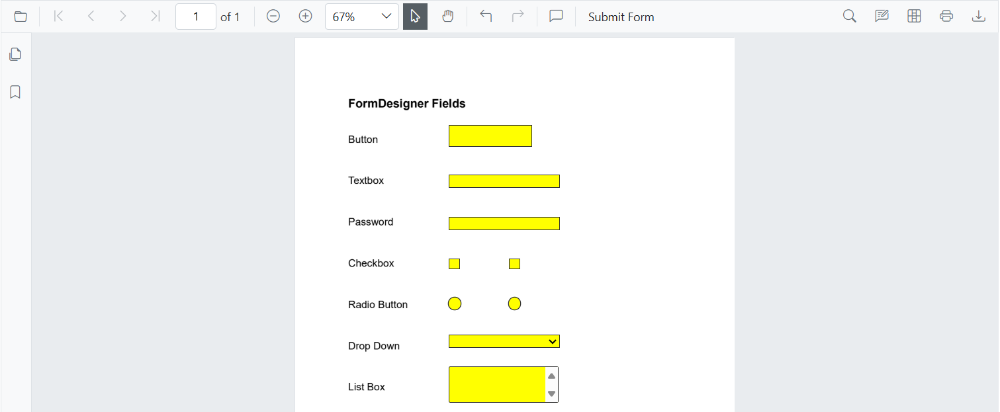
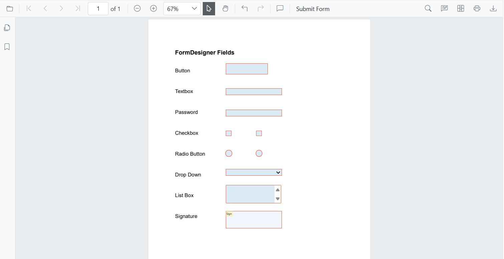
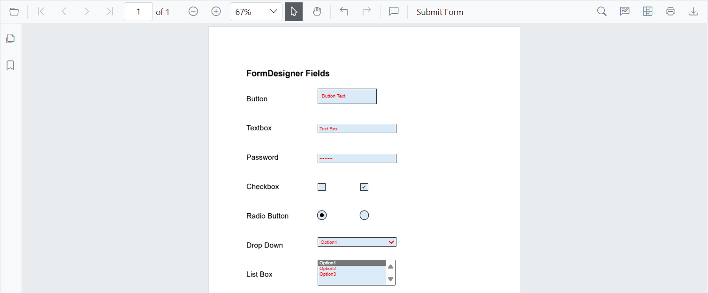
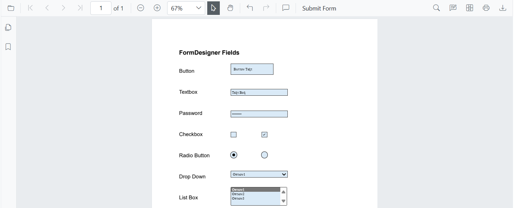
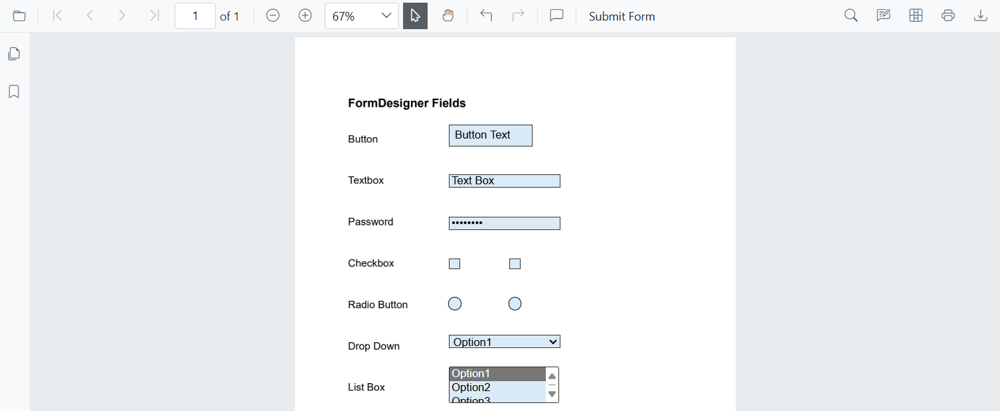
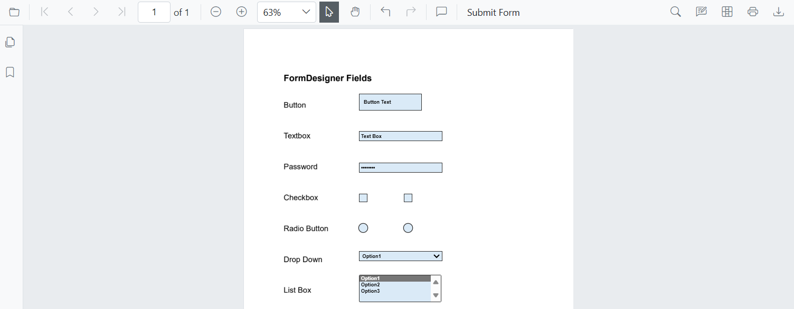
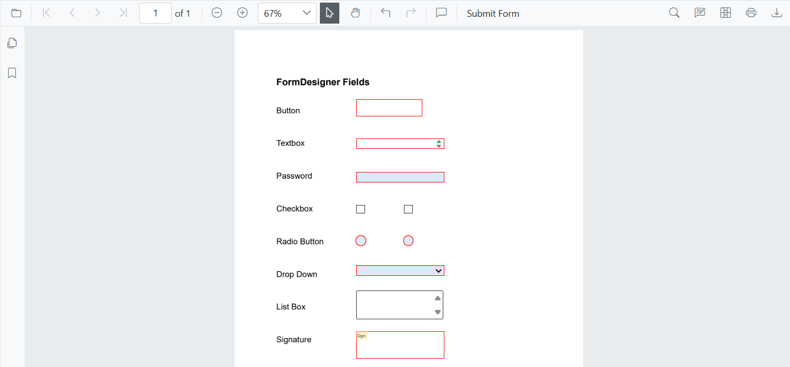

# Create Fields Programmatically in Blazor SfPdfViewer  

The Blazor SfPdfViewer component provides programmatic control over form fields in a PDF document. This enables seamless form handling and enhances user interaction through code.  

## Adding Form Fields Programmatically

The Blazor SfPdfViewer offers a way to add form fields programmatically using the `AddFormFieldsAsync` method. This method accepts a list of `FormFieldInfo` objects, where each object represents a form field with specific properties.  

### Example: Adding Form Fields to a PDF Document
```razor
@page "/"

<!-- PDF Viewer component with reference binding and document loading -->
<SfPdfViewer2 @ref="@viewer" Height="100%" Width="100%" DocumentPath="@DocumentPath">
    <PdfViewerEvents DocumentLoaded="@AddFormFields"></PdfViewerEvents>
</SfPdfViewer2>

@code {
    // Reference to the PDF Viewer instance
    private SfPdfViewer2 viewer;
    
    // Path to the PDF document
    private string DocumentPath = "wwwroot/formDesigner.pdf";

    // Method triggered when the document is loaded
    private async Task AddFormFields()
    {
        // Define various form fields with their properties and positions
        List<FormFieldInfo> formFields = new List<FormFieldInfo>
        {
            new ButtonField { Name = "Button Field", Bounds = new Bound { X = 278, Y = 157, Width = 150, Height = 40 } },
            new TextBoxField { Name = "TextBox Field", Bounds = new Bound { X = 278, Y = 247, Width = 200, Height = 24 } },
            new PasswordField { Name = "Password Field", Bounds = new Bound { X = 278, Y = 323, Width = 200, Height = 24 } },
            new CheckBoxField { Name = "CheckBox Field", Value = "Value1", IsChecked = false, Bounds = new Bound { X = 278, Y = 398, Width = 20, Height = 20 } },
            new CheckBoxField { Name = "CheckBox Field", Value = "Value2, IsChecked = false, Bounds = new Bound { X = 386, Y = 398, Width = 20, Height = 20 } },
            new RadioButtonField { Name = "RadioButton", Value = "Value1", IsSelected = false, Bounds = new Bound { X = 278, Y = 470, Width = 20, Height = 20 } },
            new RadioButtonField { Name = "RadioButton", Value = "Value2", IsSelected = false, Bounds = new Bound { X = 386, Y = 470, Width = 20, Height = 20 } },
            new DropDownField { Name = "DropDown Field", Bounds = new Bound { X = 278, Y = 536, Width = 200, Height = 24 } },
            new ListBoxField { Name = "ListBox Field", Bounds = new Bound { X = 278, Y = 593, Width = 198, Height = 66 } },
            new SignatureField { Name = "Signature Field", Bounds = new Bound { X = 278, Y = 686, Width = 200, Height = 63 } }
        };
        
        // Add form fields asynchronously to the PDF Viewer
        await viewer.AddFormFieldsAsync(formFields);
    }
}
```
The following image illustrates the programmatic addition of form fields in Blazor SfPdfViewer:


By following this approach, you can dynamically create and manage form fields in a Blazor SfPdfViewer component to enhance interactivity and usability in your applications.

## Form Field Settings  

The Blazor SfPdfViewer provides `FormFieldSettings` to configure the appearance of form fields in a PDF document. These settings allow defining the border, background, text styles, and other properties.

### Thickness

Defines the border thickness of the form field, allowing customization of the field's boundary. The default thickness is `1` pixel. Setting the value to `0` hides the form field border. This setting applies globally to all newly added form fields through the `FormFieldSettings` class.

#### Example:
```razor
@page "/"

<!-- PDF Viewer component with reference binding and document loading -->
<SfPdfViewer2 @ref="@viewer" Height="100%" Width="100%" DocumentPath="@DocumentPath">
    <!-- Form field settings with specified thickness -->
    <FormFieldSettings Thickness="@thickness"></FormFieldSettings>
    <!-- Event handler for when the document is loaded -->
    <PdfViewerEvents DocumentLoaded="@AddFormFields"></PdfViewerEvents>
</SfPdfViewer2>

@code {
    // Reference to the PDF Viewer instance
    private SfPdfViewer2 viewer;

    // Default thickness value for form fields
    private double thickness { get; set; } = 4;

    // Path to the PDF document to be loaded in the viewer
    private string DocumentPath = "wwwroot/formDesigner.pdf";

    // Method triggered when the document is loaded
    private async Task AddFormFields()
    {
        // Define a list of various form fields with their properties and positions
        List<FormFieldInfo> formFields = new List<FormFieldInfo>
        {
            new ButtonField { Name = "Button Field", Bounds = new Bound { X = 278, Y = 157, Width = 150, Height = 40 } },
            new TextBoxField { Name = "TextBox Field", Bounds = new Bound { X = 278, Y = 247, Width = 200, Height = 24 } },
            new PasswordField { Name = "Password Field", Bounds = new Bound { X = 278, Y = 323, Width = 200, Height = 24 } },
            new CheckBoxField { Name = "CheckBox Field1", IsChecked = false, Bounds = new Bound { X = 278, Y = 398, Width = 20, Height = 20 } },
            new CheckBoxField { Name = "CheckBox Field2", IsChecked = false, Bounds = new Bound { X = 386, Y = 398, Width = 20, Height = 20 } },
            new RadioButtonField { Name = "RadioButton", Value = "Value1", IsSelected = false, Bounds = new Bound { X = 278, Y = 470, Width = 20, Height = 20 } },
            new RadioButtonField { Name = "RadioButton", Value = "Value2", IsSelected = false, Bounds = new Bound { X = 386, Y = 470, Width = 20, Height = 20 } },
            new DropDownField { Name = "DropDown Field", Bounds = new Bound { X = 278, Y = 536, Width = 200, Height = 24 } },
            new ListBoxField { Name = "ListBox Field", Bounds = new Bound { X = 278, Y = 593, Width = 198, Height = 66 } },
            new SignatureField { Name = "Signature Field", Bounds = new Bound { X = 278, Y = 686, Width = 200, Height = 63 } }
        };
        // Add the defined form fields asynchronously to the PDF Viewer
        await viewer.AddFormFieldsAsync(formFields);
    }
}
```
The following image illustrates the form field thickness customization in Blazor SfPdfViewer:  


### Background Color

Defines the background color of the form field. This property accepts any valid HEX color code, RGB value, or CSS color name. The default background color is `#daeaf7ff` (light blue). Supports color formats like `#RRGGBB`, `#AARRGGBB`, and CSS color names. This setting applies to all newly added form fields.

#### Example:
```razor
@page "/"

<!-- PDF Viewer component with reference binding and document loading -->
<SfPdfViewer2 @ref="@viewer" DocumentPath="@DocumentPath" Height="100%" Width="100%">
    <!-- Form field settings with specified background color -->
    <FormFieldSettings BackgroundColor="@backgroundColor"></FormFieldSettings>
    <!-- Event handler for when the document is loaded -->
    <PdfViewerEvents DocumentLoaded="@AddFormFields"></PdfViewerEvents>
</SfPdfViewer2>

@code {
    // Background color for form fields (Yellow)
    private string backgroundColor = "#FFFF00";
    
    // Reference to the PDF Viewer instance
    private SfPdfViewer2 viewer;

    // Path to the PDF document to be loaded in the viewer
    private string DocumentPath = "wwwroot/formDesigner.pdf";

    // Method triggered when the document is loaded
    private async Task AddFormFields()
    {
        // Define a list of various form fields with their properties and positions
        List<FormFieldInfo> formFields = new List<FormFieldInfo>
        {
            new ButtonField { Name = "Button Field", Bounds = new Bound { X = 278, Y = 157, Width = 150, Height = 40 } },
            new TextBoxField { Name = "TextBox Field", Bounds = new Bound { X = 278, Y = 247, Width = 200, Height = 24 } },
            new PasswordField { Name = "Password Field", Bounds = new Bound { X = 278, Y = 323, Width = 200, Height = 24 } },
            new CheckBoxField { Name = "CheckBox Field1", IsChecked = false, Bounds = new Bound { X = 278, Y = 398, Width = 20, Height = 20 } },
            new CheckBoxField { Name = "CheckBox Field2", IsChecked = false, Bounds = new Bound { X = 386, Y = 398, Width = 20, Height = 20 } },
            new RadioButtonField { Name = "RadioButton", Value = "Value1", IsSelected = false, Bounds = new Bound { X = 278, Y = 470, Width = 20, Height = 20 } },
            new RadioButtonField { Name = "RadioButton", Value = "Value2", IsSelected = false, Bounds = new Bound { X = 386, Y = 470, Width = 20, Height = 20 } },
            new DropDownField { Name = "DropDown Field", Bounds = new Bound { X = 278, Y = 536, Width = 200, Height = 24 } },
            new ListBoxField { Name = "ListBox Field", Bounds = new Bound { X = 278, Y = 593, Width = 198, Height = 66 } },
            new SignatureField { Name = "Signature Field", Bounds = new Bound { X = 278, Y = 686, Width = 200, Height = 63 } }
        };

        // Add the defined form fields asynchronously to the PDF Viewer
        await viewer.AddFormFieldsAsync(formFields);
    }
}
```
The following image illustrates the background color customization of form fields in Blazor SfPdfViewer:  



### Border Color

Specifies the border color of the form field. This property enhances visibility and applies to all newly added form fields. The default border color is `#303030` (dark gray).

#### Example:
```razor
@page "/"

<!-- PDF Viewer component with reference binding and document loading -->
<SfPdfViewer2 @ref="@viewer" DocumentPath="@DocumentPath" Height="100%" Width="100%">
    <!-- Form field settings with specified border color -->
    <FormFieldSettings BorderColor="@borderColor"></FormFieldSettings>
    <!-- Event handler for when the document is loaded -->
    <PdfViewerEvents DocumentLoaded="@AddFormFields"></PdfViewerEvents>
</SfPdfViewer2>

@code {
     // Border color for form fields (Orange)
    private string borderColor = "#FF5733";
    
    // Reference to the PDF Viewer instance
    private SfPdfViewer2 viewer;

    // Path to the PDF document to be loaded in the viewer
    private string DocumentPath = "wwwroot/formDesigner.pdf";

    // Method triggered when the document is loaded
    private async Task AddFormFields()
    {
        // Define a list of various form fields with their properties and positions
        List<FormFieldInfo> formFields = new List<FormFieldInfo>
        {
            new ButtonField { Name = "Button Field", Bounds = new Bound { X = 278, Y = 157, Width = 150, Height = 40 } },
            new TextBoxField { Name = "TextBox Field", Bounds = new Bound { X = 278, Y = 247, Width = 200, Height = 24 } },
            new PasswordField { Name = "Password Field", Bounds = new Bound { X = 278, Y = 323, Width = 200, Height = 24 } },
            new CheckBoxField { Name = "CheckBox Field1", IsChecked = false, Bounds = new Bound { X = 278, Y = 398, Width = 20, Height = 20 } },
            new CheckBoxField { Name = "CheckBox Field2", IsChecked = false, Bounds = new Bound { X = 386, Y = 398, Width = 20, Height = 20 } },
            new RadioButtonField { Name = "RadioButton", Value = "Value1", IsSelected = false, Bounds = new Bound { X = 278, Y = 470, Width = 20, Height = 20 } },
            new RadioButtonField { Name = "RadioButton", Value = "Value2", IsSelected = false, Bounds = new Bound { X = 386, Y = 470, Width = 20, Height = 20 } },
            new DropDownField { Name = "DropDown Field", Bounds = new Bound { X = 278, Y = 536, Width = 200, Height = 24 } },
            new ListBoxField { Name = "ListBox Field", Bounds = new Bound { X = 278, Y = 593, Width = 198, Height = 66 } },
            new SignatureField { Name = "Signature Field", Bounds = new Bound { X = 278, Y = 686, Width = 200, Height = 63 } }
        };

        // Add the defined form fields asynchronously to the PDF Viewer
        await viewer.AddFormFieldsAsync(formFields);
    }
}
```
The following image illustrates the border color customization of form fields in Blazor SfPdfViewer:  



### Text Color

Defines the color of the text inside the form field. Applicable to text-based fields like Button, Text Box, Password, List Box, and Drop Down. The default color is black.

#### Example:
```razor
@page "/"

<!-- PDF Viewer component with reference binding and document loading -->
<SfPdfViewer2 @ref="@viewer" DocumentPath="@DocumentPath" Height="100%" Width="100%">
    <!-- Form field settings with color configuration -->
    <FormFieldSettings Color="@textColor"></FormFieldSettings>
    <!-- Event handler for when the document is loaded -->
    <PdfViewerEvents DocumentLoaded="@AddFormFields"></PdfViewerEvents>
</SfPdfViewer2>

@code {
    // Text color for form fields (Red text color)
    private string textColor = "#FF0000";
    
    // Reference to the PDF Viewer instance
    private SfPdfViewer2 viewer;

    // Path to the PDF document to be loaded in the viewer
    private string DocumentPath = "wwwroot/formDesigner.pdf";

    // Method triggered when the document is loaded
    private async Task AddFormFields()
    {
        // Define a list of various form fields with their properties and positions
        List<FormFieldInfo> formFields = new List<FormFieldInfo>
        {
            new ButtonField { Name = "Button Field", Bounds = new Bound { X = 278, Y = 157, Width = 150, Height = 40 } },
            new TextBoxField { Name = "TextBox Field", Bounds = new Bound { X = 278, Y = 247, Width = 200, Height = 24 } },
            new PasswordField { Name = "Password Field", Bounds = new Bound { X = 278, Y = 323, Width = 200, Height = 24 } },
            new CheckBoxField { Name = "CheckBox Field1", IsChecked = false, Bounds = new Bound { X = 278, Y = 398, Width = 20, Height = 20 } },
            new CheckBoxField { Name = "CheckBox Field2", IsChecked = false, Bounds = new Bound { X = 386, Y = 398, Width = 20, Height = 20 } },
            new RadioButtonField { Name = "RadioButton", Value = "Value1", IsSelected = false, Bounds = new Bound { X = 278, Y = 470, Width = 20, Height = 20 } },
            new RadioButtonField { Name = "RadioButton", Value = "Value2", IsSelected = false, Bounds = new Bound { X = 386, Y = 470, Width = 20, Height = 20 } },
            new DropDownField { Name = "DropDown Field", Bounds = new Bound { X = 278, Y = 536, Width = 200, Height = 24 } },
            new ListBoxField { Name = "ListBox Field", Bounds = new Bound { X = 278, Y = 593, Width = 198, Height = 66 } },
            new SignatureField { Name = "Signature Field", Bounds = new Bound { X = 278, Y = 686, Width = 200, Height = 63 } }
        };

        // Add the defined form fields asynchronously to the PDF Viewer
        await viewer.AddFormFieldsAsync(formFields);
    }
}
```
The following image illustrates the text color customization of form fields in Blazor SfPdfViewer:  



### Font Family

Defines the font style used for displaying text inside the form field. If the specified font is unavailable, the browser may use a default fallback font. The default font is Helvetica.

#### Example:
```razor
@page "/"

<!-- PDF Viewer component with reference binding and document loading -->
<SfPdfViewer2 @ref="@viewer" DocumentPath="@DocumentPath" Height="100%" Width="100%">
    <!-- Form field settings with font family configuration -->
    <FormFieldSettings FontFamily="@fontFamily"></FormFieldSettings>
    <!-- Event handler for when the document is loaded -->
    <PdfViewerEvents DocumentLoaded="@AddFormFields"></PdfViewerEvents>
</SfPdfViewer2>

@code {
    // Font family for form fields, set to "Symbol"
    private string fontFamily = "Symbol";

    // Reference to the PDF Viewer instance
    private SfPdfViewer2 viewer;

    // Path to the PDF document to be loaded in the viewer
    private string DocumentPath = "wwwroot/formDesigner.pdf";

    // Method triggered when the document is loaded
    private async Task AddFormFields()
    {
        // Define a list of various form fields with their properties and positions
        List<FormFieldInfo> formFields = new List<FormFieldInfo>
        {
            new ButtonField { Name = "Button Field", Bounds = new Bound { X = 278, Y = 157, Width = 150, Height = 40 } },
            new TextBoxField { Name = "TextBox Field", Bounds = new Bound { X = 278, Y = 247, Width = 200, Height = 24 } },
            new PasswordField { Name = "Password Field", Bounds = new Bound { X = 278, Y = 323, Width = 200, Height = 24 } },
            new CheckBoxField { Name = "CheckBox Field1", IsChecked = false, Bounds = new Bound { X = 278, Y = 398, Width = 20, Height = 20 } },
            new CheckBoxField { Name = "CheckBox Field2", IsChecked = false, Bounds = new Bound { X = 386, Y = 398, Width = 20, Height = 20 } },
            new RadioButtonField { Name = "RadioButton", Value = "Value1", IsSelected = false, Bounds = new Bound { X = 278, Y = 470, Width = 20, Height = 20 } },
            new RadioButtonField { Name = "RadioButton", Value = "Value2", IsSelected = false, Bounds = new Bound { X = 386, Y = 470, Width = 20, Height = 20 } },
            new DropDownField { Name = "DropDown Field", Bounds = new Bound { X = 278, Y = 536, Width = 200, Height = 24 } },
            new ListBoxField { Name = "ListBox Field", Bounds = new Bound { X = 278, Y = 593, Width = 198, Height = 66 } },
            new SignatureField { Name = "Signature Field", Bounds = new Bound { X = 278, Y = 686, Width = 200, Height = 63 } }
        };

        // Add the defined form fields asynchronously to the PDF Viewer
        await viewer.AddFormFieldsAsync(formFields);
    }
}
```
The following image illustrates the font family customization of form fields in Blazor SfPdfViewer:  



### Font Size

Defines the size of the text displayed inside the form field. Applicable to text-based fields like Button, Text Box, Password, List Box, and Drop Down. The default font size is `10` pixels.

#### Example:
```razor
@page "/"

<!-- PDF Viewer component with reference binding and document loading -->
<SfPdfViewer2 @ref="@viewer" DocumentPath="@DocumentPath" Height="100%" Width="100%">
    <!-- Form field settings with font size configuration -->
    <FormFieldSettings FontSize="@fontSize"></FormFieldSettings>
    <!-- Event handler for when the document is loaded -->
    <PdfViewerEvents DocumentLoaded="@AddFormFields"></PdfViewerEvents>
</SfPdfViewer2>

@code {
    // Font size for form fields, set to 20px
    public double fontSize { get; set; } = 20;

    // Reference to the PDF Viewer instance
    private SfPdfViewer2 viewer;

    // Path to the PDF document to be loaded in the viewer
    private string DocumentPath = "wwwroot/formDesigner.pdf";

    // Method triggered when the document is loaded
    private async Task AddFormFields()
    {
        // Define a list of various form fields with their properties and positions
        List<FormFieldInfo> formFields = new List<FormFieldInfo>
        {
            new ButtonField { Name = "Button Field", Bounds = new Bound { X = 278, Y = 157, Width = 150, Height = 40 } },
            new TextBoxField { Name = "TextBox Field", Bounds = new Bound { X = 278, Y = 247, Width = 200, Height = 24 } },
            new PasswordField { Name = "Password Field", Bounds = new Bound { X = 278, Y = 323, Width = 200, Height = 24 } },
            new CheckBoxField { Name = "CheckBox Field1", IsChecked = false, Bounds = new Bound { X = 278, Y = 398, Width = 20, Height = 20 } },
            new CheckBoxField { Name = "CheckBox Field2", IsChecked = false, Bounds = new Bound { X = 386, Y = 398, Width = 20, Height = 20 } },
            new RadioButtonField { Name = "RadioButton", Value = "Value1", IsSelected = false, Bounds = new Bound { X = 278, Y = 470, Width = 20, Height = 20 } },
            new RadioButtonField { Name = "RadioButton", Value = "Value2", IsSelected = false, Bounds = new Bound { X = 386, Y = 470, Width = 20, Height = 20 } },
            new DropDownField { Name = "DropDown Field", Bounds = new Bound { X = 278, Y = 536, Width = 200, Height = 24 } },
            new ListBoxField { Name = "ListBox Field", Bounds = new Bound { X = 278, Y = 593, Width = 198, Height = 66 } },
            new SignatureField { Name = "Signature Field", Bounds = new Bound { X = 278, Y = 686, Width = 200, Height = 63 } }
        };

        // Add the defined form fields asynchronously to the PDF Viewer
        await viewer.AddFormFieldsAsync(formFields);
    }
}
```
The following image illustrates the font size customization of form fields in Blazor SfPdfViewer:  



### Font Style

Defines the style of the text inside the form field. Applicable to text-based fields. The default style is `FontStyle.None`.

#### Example:
```razor
@page "/"

<!-- PDF Viewer component with reference binding and document loading -->
<SfPdfViewer2 @ref="@viewer" DocumentPath="@DocumentPath" Height="100%" Width="100%">
    <!-- Form field settings with font style configuration -->
    <FormFieldSettings FontStyle="@fontStyle"> </FormFieldSettings>
    <!-- Event handler for when the document is loaded -->
    <PdfViewerEvents DocumentLoaded="@AddFormFields"></PdfViewerEvents>
</SfPdfViewer2>

@code {
    // Font style for form fields
    private FontStyle fontStyle = FontStyle.Bold;

    // Reference to the PDF Viewer instance
    private SfPdfViewer2 viewer;

    // Path to the PDF document to be loaded in the viewer
    private string DocumentPath = "wwwroot/formDesigner.pdf";

    // Method triggered when the document is loaded
    private async Task AddFormFields()
    {
        // Define a list of various form fields with their properties and positions
        List<FormFieldInfo> formFields = new List<FormFieldInfo>
        {
            new ButtonField { Name = "Button Field", Bounds = new Bound { X = 278, Y = 157, Width = 150, Height = 40 } },
            new TextBoxField { Name = "TextBox Field", Bounds = new Bound { X = 278, Y = 247, Width = 200, Height = 24 } },
            new PasswordField { Name = "Password Field", Bounds = new Bound { X = 278, Y = 323, Width = 200, Height = 24 } },
            new CheckBoxField { Name = "CheckBox Field1", IsChecked = false, Bounds = new Bound { X = 278, Y = 398, Width = 20, Height = 20 } },
            new CheckBoxField { Name = "CheckBox Field2", IsChecked = false, Bounds = new Bound { X = 386, Y = 398, Width = 20, Height = 20 } },
            new RadioButtonField { Name = "RadioButton", Value = "Value1", IsSelected = false, Bounds = new Bound { X = 278, Y = 470, Width = 20, Height = 20 } },
            new RadioButtonField { Name = "RadioButton", Value = "Value2", IsSelected = false, Bounds = new Bound { X = 386, Y = 470, Width = 20, Height = 20 } },
            new DropDownField { Name = "DropDown Field", Bounds = new Bound { X = 278, Y = 536, Width = 200, Height = 24 } },
            new ListBoxField { Name = "ListBox Field", Bounds = new Bound { X = 278, Y = 593, Width = 198, Height = 66 } },
            new SignatureField { Name = "Signature Field", Bounds = new Bound { X = 278, Y = 686, Width = 200, Height = 63 } }
        };

        // Add the defined form fields asynchronously to the PDF Viewer
        await viewer.AddFormFieldsAsync(formFields);
    }
}
```
The following image illustrates the font style customization of form fields in Blazor SfPdfViewer:  



## Set Form Field Mode

The `SetFormDrawingModeAsync` method allows setting the form field type that can be drawn in the PDF Viewer. This helps in programmatically defining the type of form field a user can add.

### Usage

You can specify the form field type by passing a `FormFieldType` value to the `SetFormDrawingModeAsync` method.

### Example

Below is an example of setting the form field mode to `TextBox`:

```razor
@page "/"
@using Syncfusion.Blazor.Buttons

<!-- Button to set the form field drawing mode to TextBox -->
<SfButton @onclick="SetFormDrawingMode">Set Form Field Type</SfButton>

<!-- PDF Viewer component with reference binding and document loading -->
<SfPdfViewer2 @ref="@viewer" Height="100%" Width="100%" DocumentPath="@DocumentPath">
</SfPdfViewer2>

@code {
    // Reference to the PDF Viewer instance
    private SfPdfViewer2 viewer;

    // Path to the PDF document that will be loaded in the viewer
    private string DocumentPath = "wwwroot/formDesigner.pdf";

    // Method to enable form drawing mode and set it to TextBox type
    private async Task SetFormDrawingMode()
    {
        // Set the form field drawing mode to TextBox, allowing the user to add TextBox fields
        await viewer.SetFormDrawingModeAsync(FormFieldType.Textbox);
    }
}
```
The following image illustrates adding a textbox field in Blazor SfPdfViewer:  


## Update Form Fields

The Update functionality enables dynamic modification of form field properties in a PDF document by retrieving fields via `GetFormFieldsAsync()` and updating their values, appearance, or behavior. These changes are applied using `UpdateFormFieldsAsync()`, ensuring they reflect in the viewer.

### Appearance Properties
Controls the visual aspects of form fields, including background color, text color, font size, font family, font style and text alignment. These properties help customize the look and feel of form fields in the document.

```razor
@page "/"

<!-- PDF Viewer component with reference binding and document loading -->
<SfPdfViewer2 @ref="@viewer" Height="100%" Width="100%" DocumentPath="@DocumentPath">
    <PdfViewerEvents DocumentLoaded="@AddFormFields"></PdfViewerEvents>
</SfPdfViewer2>

@code {
    private SfPdfViewer2 viewer;
    private string DocumentPath = "wwwroot/formDesigner.pdf";

    private async Task AddFormFields()
    {
        // Define a list of form fields with their properties and positions
        List<FormFieldInfo> formFields = new List<FormFieldInfo>
        {
            new ButtonField { Name = "Button Field", Bounds = new Bound { X = 278, Y = 157, Width = 150, Height = 40 } },
            new TextBoxField { Name = "TextBox Field", Bounds = new Bound { X = 278, Y = 247, Width = 200, Height = 24 } },
            new PasswordField { Name = "Password Field", Bounds = new Bound { X = 278, Y = 323, Width = 200, Height = 24 } },
            new CheckBoxField { Name = "CheckBox Field1", Bounds = new Bound { X = 278, Y = 398, Width = 20, Height = 20 } },
            new CheckBoxField { Name = "CheckBox Field2", Bounds = new Bound { X = 386, Y = 398, Width = 20, Height = 20 } },
            new RadioButtonField { Name = "RadioButton", Value = "Value1", Bounds = new Bound { X = 278, Y = 470, Width = 20, Height = 20 } },
            new RadioButtonField { Name = "RadioButton", Value = "Value2, Bounds = new Bound { X = 386, Y = 470, Width = 20, Height = 20 } },
            new DropDownField { Name = "DropDown Field", Bounds = new Bound { X = 278, Y = 536, Width = 200, Height = 24 } },
            new ListBoxField { Name = "ListBox Field", Bounds = new Bound { X = 278, Y = 593, Width = 198, Height = 66 } },
            new SignatureField { Name = "Signature Field", Bounds = new Bound { X = 278, Y = 686, Width = 200, Height = 63 } }
        };

        // Add form fields to the viewer
        await viewer.AddFormFieldsAsync(formFields);

        // Retrieve the list of added form fields
        List<FormFieldInfo> updatedFields = await viewer.GetFormFieldsAsync();

        // Iterate over each form field and apply specific property values
        foreach (FormFieldInfo field in updatedFields)
        {
            switch (field)
            {
                case TextBoxField textField:
                    // Custom styling for text fields
                    textField.BackgroundColor = "lightblue";
                    textField.Color = "black";
                    textField.BorderColor = "yellow";
                    textField.Thickness = 2;
                    textField.FontSize = 14;
                    textField.FontFamily = "Symbol";
                    textField.FontStyle = FontStyle.Bold;
                    textField.TextAlignment = TextAlignment.Center;
                    break;

                case PasswordField passwordField:
                    // Custom styling for password fields
                    passwordField.BackgroundColor = "lightgray";
                    passwordField.Color = "darkblue";
                    passwordField.BorderColor = "blue";
                    passwordField.Thickness = 2;
                    passwordField.FontSize = 12;
                    passwordField.FontFamily = "Symbol";
                    passwordField.FontStyle = FontStyle.Italic;
                    passwordField.TextAlignment = TextAlignment.Right;
                    break;

                case CheckBoxField checkBox:
                    // Custom styling for checkbox fields
                    checkBox.BackgroundColor = "yellow";
                    checkBox.Color = "black";
                    checkBox.BorderColor = "pink";
                    checkBox.Thickness = 2;
                    break;

                case RadioButtonField radioButton:
                    // Custom styling for radio button fields
                    radioButton.BackgroundColor = "orange";
                    radioButton.Color = "black";
                    radioButton.BorderColor = "yellow";
                    radioButton.Thickness = 2;
                    break;

                case DropDownField dropDown:
                    // Custom styling for dropdown fields
                    dropDown.BackgroundColor = "pink";
                    dropDown.Color = "blue";
                    dropDown.BorderColor = "yellow";
                    dropDown.Thickness = 2;
                    dropDown.FontSize = 14;
                    dropDown.FontFamily = "Symbol";
                    dropDown.FontStyle = FontStyle.Bold;
                    dropDown.TextAlignment = TextAlignment.Left;
                    break;

                case ListBoxField listBox:
                    // Custom styling for list box fields
                    listBox.BackgroundColor = "lightgreen";
                    listBox.Color = "darkred";
                    listBox.BorderColor = "yellow";
                    listBox.Thickness = 2;
                    listBox.FontSize = 14;
                    listBox.FontFamily = "Symbol";
                    listBox.FontStyle = FontStyle.Bold;
                    listBox.TextAlignment = TextAlignment.Right;
                    break;

                case SignatureField signature:
                    // Custom styling for signature fields
                    signature.BorderColor = "yellow";
                    signature.Thickness = 2;
                    break;

                case ButtonField buttonField:
                    // Custom styling for button fields
                    buttonField.BackgroundColor = "purple";
                    buttonField.Color = "white";
                    buttonField.BorderColor = "yellow";
                    buttonField.Thickness = 2;
                    buttonField.FontSize = 14;
                    buttonField.FontFamily = "Symbol";
                    buttonField.FontStyle = FontStyle.Bold;
                    buttonField.TextAlignment = TextAlignment.Left;
                    break;
            }
        }
        // Update form fields in the viewer with new properties
        await viewer.UpdateFormFieldsAsync(updatedFields);
    }
}
```
The following image illustrates updating the appearance of form fields in Blazor SfPdfViewer:  


### Behavior Properties
Defines how form fields interact, such as visibility (show or hide), isMultiline (textbox field), maxLength (textbox and password fields), read-only mode (prevent editing), and required fields (ensuring user input is mandatory). These settings determine the usability and restrictions applied to form fields.

```razor
@page "/"

<!-- PDF Viewer component with reference binding and document loading -->
<SfPdfViewer2 @ref="@viewer" Height="800px" Width="100%" DocumentPath="@DocumentPath">
    <PdfViewerEvents DocumentLoaded="@AddFormFields"></PdfViewerEvents>
</SfPdfViewer2>

@code {
    // Reference to the PDF Viewer instance
    private SfPdfViewer2 viewer;

    // Path to the PDF document
    private string DocumentPath = "wwwroot/formDesigner.pdf";

    private async Task AddFormFields()
    {
        // Define and add form fields with their initial positions and properties
        List<FormFieldInfo> formFields = new List<FormFieldInfo>
        {
            new ButtonField { Name = "Button Field", Bounds = new Bound { X = 278, Y = 157, Width = 150, Height = 40 } },
            new TextBoxField { Name = "TextBox Field", Bounds = new Bound { X = 278, Y = 247, Width = 200, Height = 24 } },
            new PasswordField { Name = "Password Field", Bounds = new Bound { X = 278, Y = 323, Width = 200, Height = 24 } },
            new CheckBoxField { Name = "CheckBox Field1", Bounds = new Bound { X = 278, Y = 398, Width = 20, Height = 20 } },
            new CheckBoxField { Name = "CheckBox Field2", Bounds = new Bound { X = 386, Y = 398, Width = 20, Height = 20 } },
            new RadioButtonField { Name = "RadioButton", Value = "Value1", Bounds = new Bound { X = 278, Y = 470, Width = 20, Height = 20 } },
            new RadioButtonField { Name = "RadioButton", Value = "Value2", Bounds = new Bound { X = 386, Y = 470, Width = 20, Height = 20 } },
            new DropDownField { Name = "DropDown Field", Bounds = new Bound { X = 278, Y = 536, Width = 200, Height = 24 } },
            new ListBoxField { Name = "ListBox Field", Bounds = new Bound { X = 278, Y = 593, Width = 198, Height = 66 } },
            new SignatureField { Name = "Signature Field", Bounds = new Bound { X = 278, Y = 686, Width = 200, Height = 63 } }
        };

        // Add form fields to the PDF viewer
        await viewer.AddFormFieldsAsync(formFields);

        // Retrieve the added fields to update their properties
        List<FormFieldInfo> updatedFields = await viewer.GetFormFieldsAsync();

        // Iterate through each field and update specific properties
        foreach (FormFieldInfo field in updatedFields)
        {
            // Apply unique property values based on the field type
            switch (field)
            {
                case TextBoxField textField:
                    textField.IsMultiline = true; // Allow multiple lines
                    textField.MaxLength = 20; // Limit input length
                    textField.Visibility = VisibilityMode.Visible; // Set visibility fields
                    textField.IsReadOnly = true; // Make field non-editable
                    textField.IsRequired = true; // Require input
                    break;

                case PasswordField passwordField:
                    passwordField.MaxLength = 8; // Limit password length
                    passwordField.Visibility = VisibilityMode.Visible; // Set visibility fields
                    passwordField.IsReadOnly = false; // Allow user input
                    passwordField.IsRequired = true; // Require password
                    break;

                case CheckBoxField checkBox:
                    checkbox.Visibility = VisibilityMode.Visible; // Set visibility fields
                    checkBox.IsReadOnly = true; // Disable editing
                    checkBox.IsRequired = false; // Not mandatory
                    break;

                case RadioButtonField radioButton:
                    radioButton.Visibility = VisibilityMode.VisibleNotPrintable; // Hide when printed
                    radioButton.IsReadOnly = false; // Allow selection
                    radioButton.IsRequired = true; // Mandatory selection
                    break;

                case DropDownField dropDown:
                    dropDown.Visibility = VisibilityMode.VisibleNotPrintable; // Hide when printed
                    dropDown.IsReadOnly = false; // Allow selection
                    dropDown.IsRequired = true; // Mandatory selection
                    break;

                case ListBoxField listBox:
                    listBox.Visibility = VisibilityMode.Visible; // Set visibility fields
                    listBox.IsReadOnly = true; // Disable editing
                    listBox.IsRequired = false; // Not mandatory
                    break;

                case SignatureField signature:
                    signature.Visibility = VisibilityMode.Visible; // Set visibility fields
                    signature.IsReadOnly = true; // Disable editing
                    signature.IsRequired = true; // Require signature
                    break;

                case ButtonField buttonField:
                    buttonField.Visibility = VisibilityMode.Visible; // Set visibility fields
                    buttonField.IsReadOnly = true; // Disable clicking
                    buttonField.IsRequired = true; // Require field
                    break;
            }
        }

        // Apply the updated field properties to the PDF viewer
        await viewer.UpdateFormFieldsAsync(updatedFields);
    }
}
```
The following image illustrates updating the behavior of form fields in Blazor SfPdfViewer:  



### Identification & Metadata Properties
Includes properties like name (unique identifier), tooltip (providing additional information on hover), and value (storing user input or assigned data). These attributes help distinguish and manage form fields efficiently.

```razor
@page "/"

<!-- PDF Viewer component with reference binding and document loading -->
<SfPdfViewer2 @ref="@viewer" Height="100%" Width="100%" DocumentPath="@DocumentPath">
    <PdfViewerEvents DocumentLoaded="@AddFormFields"></PdfViewerEvents>
</SfPdfViewer2>

@code {
    // Reference to the PDF Viewer component
    private SfPdfViewer2 viewer;

    // Path to the PDF document that will be loaded
    private string DocumentPath = "wwwroot/formDesigner.pdf";
    
    private async Task AddFormFields()
    {
        // Define a list of form fields with specified properties and positions
        List<FormFieldInfo> formFields = new List<FormFieldInfo>
        {
            new ButtonField { Name = "Button Field", Bounds = new Bound { X = 278, Y = 157, Width = 150, Height = 40 } },
            new TextBoxField { Name = "TextBox Field", Bounds = new Bound { X = 278, Y = 247, Width = 200, Height = 24 } },
            new PasswordField { Name = "Password Field", Bounds = new Bound { X = 278, Y = 323, Width = 200, Height = 24 } },
            new CheckBoxField { Name = "CheckBox Field1", Bounds = new Bound { X = 278, Y = 398, Width = 20, Height = 20 } },
            new CheckBoxField { Name = "CheckBox Field2", Bounds = new Bound { X = 386, Y = 398, Width = 20, Height = 20 } },
            new RadioButtonField { Name = "RadioButton", Value = "Value1", Bounds = new Bound { X = 278, Y = 470, Width = 20, Height = 20 } },
            new RadioButtonField { Name = "RadioButton", Value = "Value2", Bounds = new Bound { X = 386, Y = 470, Width = 20, Height = 20 } },
            new DropDownField { Name = "DropDown Field", Bounds = new Bound { X = 278, Y = 536, Width = 200, Height = 24 } },
            new ListBoxField { Name = "ListBox Field", Bounds = new Bound { X = 278, Y = 593, Width = 198, Height = 66 } },
            new SignatureField { Name = "Signature Field", Bounds = new Bound { X = 278, Y = 686, Width = 200, Height = 63 } }
        };

        // Add the form fields to the PDF viewer
        await viewer.AddFormFieldsAsync(formFields);

        // Retrieve the added form fields for further modification
        List<FormFieldInfo> updatedFields = await viewer.GetFormFieldsAsync();

        // Iterate over each field and configure additional properties
        foreach (FormFieldInfo field in updatedFields)
        {
            // Apply unique property values based on field type
            switch (field)
            {
                case TextBoxField textField:
                    textField.Name = "TextBox1"; // Set a unique name
                    textField.Value = "Value1"; // Set default text
                    textField.TooltipText = "Enter your text here"; // Tooltip for user guidance
                    break;

                case PasswordField passwordField:
                    passwordField.Name = "PasswordField1"; // Unique name
                    passwordField.Value = "Value1"; // Default password (should be removed for security)
                    passwordField.TooltipText = "Enter your password here"; // Tooltip for guidance
                    break;

                case CheckBoxField checkBox:
                    checkBox.IsChecked = true; // Set checkbox as checked by default
                    checkBox.TooltipText = "Select this option"; // Tooltip for guidance
                    break;

                case RadioButtonField radioButton:
                    radioButton.IsSelected = true; // Mark radio button as selected
                    radioButton.TooltipText = "Choose an option"; // Tooltip for guidance
                    break;

                case DropDownField dropDown:
                    // Add dropdown list items
                    dropDown.Items = new List<ListItem> {
                        new ListItem { Name = "option 1", Value = "Option 1" },
                        new ListItem { Name = "option 2", Value = "Option 2" },
                        new ListItem { Name = "option 3", Value = "Option 3" }
                    };
                    dropDown.TooltipText = "Select an item"; // Tooltip for dropdown selection
                    break;

                case ListBoxField listBox:
                    // Add listbox options
                    listBox.Items = new List<ListItem> {
                        new ListItem { Name = "option 1", Value = "Option 1" },
                        new ListItem { Name = "option 2", Value = "Option 2" },
                        new ListItem { Name = "option 3", Value = "Option 3" }
                    };
                    listBox.TooltipText = "Choose one or more items"; // Tooltip for user
                    break;

                case SignatureField signature:
                    signature.Value = "Signature"; // Default placeholder for signature
                    signature.TooltipText = "Sign Here"; // Tooltip for user
                    break;

                case ButtonField buttonField:
                    buttonField.Text = "ButtonText"; // Button display text
                    buttonField.TooltipText = "Click to perform an action"; // Tooltip for guidance
                    break;
            }
        }

        // Update the form fields with the modified properties
        await viewer.UpdateFormFieldsAsync(updatedFields);
    }
}
```
The following image illustrates updating the metadata of form fields in Blazor SfPdfViewer:  


## Delete Form Fields

The `DeleteFormFieldsAsync()` method enables the removal of form fields from the document, allowing users to manage and modify form structures efficiently.  

### Delete All Form Fields  
Removes all form fields from the document, clearing all interactive elements at once.

```razor
@page "/"
@using Syncfusion.Blazor.Buttons

<!-- Button to delete all form fields -->
<SfButton onclick="@DeleteAllFormFields">Delete All Form Fields</SfButton>

<!-- PDF Viewer component with reference binding and document loading -->
<SfPdfViewer2 @ref="@viewer" Height="100%" Width="100%" DocumentPath="@DocumentPath">
    <PdfViewerEvents DocumentLoaded="@AddFormFields"></PdfViewerEvents>
</SfPdfViewer2>

@code {
    // Reference to the PDF Viewer instance
    private SfPdfViewer2 viewer;
    
    // Path to the PDF document
    private string DocumentPath = "wwwroot/formDesigner.pdf";

    private async Task AddFormFields()
    {
        // Define a list of form fields with their properties and positions
        List<FormFieldInfo> formFields = new List<FormFieldInfo>
        {
            new ButtonField { Name = "Button Field", Bounds = new Bound { X = 278, Y = 157, Width = 150, Height = 40 } },
            new TextBoxField { Name = "TextBox Field", Bounds = new Bound { X = 278, Y = 247, Width = 200, Height = 24 } },
            new PasswordField { Name = "Password Field", Bounds = new Bound { X = 278, Y = 323, Width = 200, Height = 24 } },
            new CheckBoxField { Name = "CheckBox Field1", IsChecked = false, Bounds = new Bound { X = 278, Y = 398, Width = 20, Height = 20 } },
            new CheckBoxField { Name = "CheckBox Field2", IsChecked = false, Bounds = new Bound { X = 386, Y = 398, Width = 20, Height = 20 } },
            new RadioButtonField { Name = "RadioButton", Value = "Value1", IsSelected = false, Bounds = new Bound { X = 278, Y = 470, Width = 20, Height = 20 } },
            new RadioButtonField { Name = "RadioButton", Value = "Value2", IsSelected = false, Bounds = new Bound { X = 386, Y = 470, Width = 20, Height = 20 } },
            new DropDownField { Name = "DropDown Field", Bounds = new Bound { X = 278, Y = 536, Width = 200, Height = 24 } },
            new ListBoxField { Name = "ListBox Field", Bounds = new Bound { X = 278, Y = 593, Width = 198, Height = 66 } },
            new SignatureField { Name = "Signature Field", Bounds = new Bound { X = 278, Y = 686, Width = 200, Height = 63 } }
        };
        
        // Add the form fields asynchronously to the PDF Viewer
        await viewer.AddFormFieldsAsync(formFields);
    }
    
    private async Task DeleteAllFormFields() 
    {
        // Deletes all form fields from the PDF Viewer.
        await viewer.DeleteFormFieldsAsync(true);
    }
}
```
The following image illustrates deleting all form fields in Blazor SfPdfViewer:  


### Delete Selected Form Fields  
Deletes only the currently selected form fields, enabling users to modify the document while keeping the rest of the form structure intact.

```razor
@page "/"
@using Syncfusion.Blazor.Buttons

<!-- Button to delete the selected form fields -->
<SfButton onclick="@DeleteSelectedFormField">Delete Selected Form Field</SfButton>

<!-- PDF Viewer component with reference binding and document loading -->
<SfPdfViewer2 @ref="@viewer" Height="100%" Width="100%" DocumentPath="@DocumentPath">
    <PdfViewerEvents DocumentLoaded="@AddFormFields"></PdfViewerEvents>
</SfPdfViewer2>

@code {
    // Reference to the PDF Viewer instance
    private SfPdfViewer2 viewer;
    
    // Path to the PDF document
    private string DocumentPath = "wwwroot/formDesigner.pdf";

    private async Task AddFormFields()
    {
        // Define a list of form fields with their properties and positions
        List<FormFieldInfo> formFields = new List<FormFieldInfo>
        {
            new ButtonField { Name = "Button Field", Bounds = new Bound { X = 278, Y = 157, Width = 150, Height = 40 } },
            new TextBoxField { Name = "TextBox Field", Bounds = new Bound { X = 278, Y = 247, Width = 200, Height = 24 } },
            new PasswordField { Name = "Password Field", Bounds = new Bound { X = 278, Y = 323, Width = 200, Height = 24 } },
            new CheckBoxField { Name = "CheckBox Field1", IsChecked = false, Bounds = new Bound { X = 278, Y = 398, Width = 20, Height = 20 } },
            new CheckBoxField { Name = "CheckBox Field2", IsChecked = false, Bounds = new Bound { X = 386, Y = 398, Width = 20, Height = 20 } },
            new RadioButtonField { Name = "RadioButton", Value = "Value1", IsSelected = false, Bounds = new Bound { X = 278, Y = 470, Width = 20, Height = 20 } },
            new RadioButtonField { Name = "RadioButton", Value = "Value2", IsSelected = false, Bounds = new Bound { X = 386, Y = 470, Width = 20, Height = 20 } },
            new DropDownField { Name = "DropDown Field", Bounds = new Bound { X = 278, Y = 536, Width = 200, Height = 24 } },
            new ListBoxField { Name = "ListBox Field", Bounds = new Bound { X = 278, Y = 593, Width = 198, Height = 66 } },
            new SignatureField { Name = "Signature Field", Bounds = new Bound { X = 278, Y = 686, Width = 200, Height = 63 } }
        };
        
        // Add the form fields asynchronously to the PDF Viewer
        await viewer.AddFormFieldsAsync(formFields);
    }
    
    private async Task DeleteSelectedFormField() 
    {
        // Delete selected form field from the PDF Viewer.
        await viewer.DeleteFormFieldsAsync(false);
    }
}
```
The following image illustrates deleting a selected password field in Blazor SfPdfViewer:  


### Delete Form Fields by IDs  
Removes specific form fields based on their unique identifiers, allowing precise control over which fields are deleted without affecting others.  

 ```razor
 @page "/did"
@using Syncfusion.Blazor.Buttons

<!-- Delete form fields by ID -->
<SfButton @onclick="DeleteFormFields">Delete Form Field By ID</SfButton>

<!-- PDF Viewer component with reference binding and document loading -->
<SfPdfViewer2 @ref="@viewer" Height="100%" Width="100%" DocumentPath="@DocumentPath">
    <PdfViewerEvents DocumentLoaded="@AddFormFields"></PdfViewerEvents>
</SfPdfViewer2>

@code {
    // Reference to the PDF Viewer instance
    private SfPdfViewer2 viewer;

    // Path to the PDF document that will be loaded into the viewer
    private string DocumentPath = "wwwroot/formDesigner.pdf";

    private async Task AddFormFields()
    {
        // Create a list of form fields with specific properties and positions
        List<FormFieldInfo> formFields = new List<FormFieldInfo>
        {
            new ButtonField { Name = "Button Field", Bounds = new Bound { X = 278, Y = 157, Width = 150, Height = 40 } },
            new TextBoxField { Name = "TextBox Field", Bounds = new Bound { X = 278, Y = 247, Width = 200, Height = 24 } },
            new PasswordField { Name = "Password Field", Bounds = new Bound { X = 278, Y = 323, Width = 200, Height = 24 } },
            new CheckBoxField { Name = "CheckBox Field1", IsChecked = false, Bounds = new Bound { X = 278, Y = 398, Width = 20, Height = 20 } },
            new CheckBoxField { Name = "CheckBox Field2", IsChecked = false, Bounds = new Bound { X = 386, Y = 398, Width = 20, Height = 20 } },
            new RadioButtonField { Name = "RadioButton", Value = "Value1", IsSelected = false, Bounds = new Bound { X = 278, Y = 470, Width = 20, Height = 20 } },
            new RadioButtonField { Name = "RadioButton", Value = "Value2", IsSelected = false, Bounds = new Bound { X = 386, Y = 470, Width = 20, Height = 20 } },
            new DropDownField { Name = "DropDown Field", Bounds = new Bound { X = 278, Y = 536, Width = 200, Height = 24 } },
            new ListBoxField { Name = "ListBox Field", Bounds = new Bound { X = 278, Y = 593, Width = 198, Height = 66 } },
            new SignatureField { Name = "Signature Field", Bounds = new Bound { X = 278, Y = 686, Width = 200, Height = 63 } }
        };

        // Add the defined form fields to the PDF Viewer asynchronously
        await viewer.AddFormFieldsAsync(formFields);
    }

    // Method to delete form fields based on their ID
    private async Task DeleteFormFields()
    {
        // List to store the IDs of form fields that need to be deleted
        List<string> formFieldIds = new List<string>();

        // Retrieve all form fields currently present in the PDF
        List<FormFieldInfo> formFields = await viewer.GetFormFieldsAsync();

        // Iterate through the form fields to filter out only those that need to be deleted
        foreach (FormFieldInfo field in formFields)
        {
            // Only delete fields that are NOT text fields (excluding text fields from deletion)
            if (field.Type != FormFieldType.Textbox)
            {
                formFieldIds.Add(field.Id); // Add the field's ID to the delete list
            }
        }

        // If there are form fields to delete, proceed with deletion
        if (formFieldIds.Count > 0)
        {
            await viewer.DeleteFormFieldsAsync(formFieldIds); // Delete form fields by ID
        }
    }
}
```
The following image illustrates deleting form fields by their IDs in Blazor SfPdfViewer:  


## Select Form Field in SfPdfViewer2

Form fields in SfPdfViewer2 can be programmatically selected using the `SelectFormFieldAsync` method. This allows users to highlight specific form fields based on either their unique identifier or their object reference.

### Select Form Field by ID

To select a form field using its unique identifier, pass the field's ID to the `SelectFormFieldAsync` method.

```razor
@page "/"
@using Syncfusion.Blazor.Buttons

<!-- Button to select a form field by its ID -->
<SfButton @onclick="SelectFormFieldByID">Select Form Field By ID</SfButton>

<!-- PDF Viewer component with reference binding and document loading -->
<SfPdfViewer2 @ref="@viewer" Height="100%" Width="100%" DocumentPath="@DocumentPath">
    <PdfViewerEvents DocumentLoaded="@AddFormFields"></PdfViewerEvents>
</SfPdfViewer2>

@code {
    // Reference to the PDF Viewer instance
    private SfPdfViewer2 viewer;

    // Path to the PDF document that will be loaded in the viewer
    private string DocumentPath = "wwwroot/formDesigner.pdf";

    // Method to add form fields to the PDF document when it is loaded
    private async Task AddFormFields()
    {
        // Create a list of form fields with specific properties and positions
        List<FormFieldInfo> formFields = new List<FormFieldInfo>
        {
            new ButtonField { Name = "Button Field", Bounds = new Bound { X = 278, Y = 157, Width = 150, Height = 40 } },
            new TextBoxField { Name = "TextBox Field", Bounds = new Bound { X = 278, Y = 247, Width = 200, Height = 24 } },
            new PasswordField { Name = "Password Field", Bounds = new Bound { X = 278, Y = 323, Width = 200, Height = 24 } },
            new CheckBoxField { Name = "CheckBox Field1", IsChecked = false, Bounds = new Bound { X = 278, Y = 398, Width = 20, Height = 20 } },
            new CheckBoxField { Name = "CheckBox Field2", IsChecked = false, Bounds = new Bound { X = 386, Y = 398, Width = 20, Height = 20 } },
            new RadioButtonField { Name = "RadioButton", Value = "Value1", IsSelected = false, Bounds = new Bound { X = 278, Y = 470, Width = 20, Height = 20 } },
            new RadioButtonField { Name = "RadioButton", Value = "Value2", IsSelected = false, Bounds = new Bound { X = 386, Y = 470, Width = 20, Height = 20 } },
            new DropDownField { Name = "DropDown Field", Bounds = new Bound { X = 278, Y = 536, Width = 200, Height = 24 } },
            new ListBoxField { Name = "ListBox Field", Bounds = new Bound { X = 278, Y = 593, Width = 198, Height = 66 } },
            new SignatureField { Name = "Signature Field", Bounds = new Bound { X = 278, Y = 686, Width = 200, Height = 63 } }
        };

        // Add the form fields asynchronously to the PDF Viewer
        await viewer.AddFormFieldsAsync(formFields);
    }

    // Method to select a form field by ID (filters only TextBox fields)
    private async Task SelectFormFieldByID()
    {
        // Retrieve all form fields currently present in the PDF
        List<FormFieldInfo> formFields = await viewer.GetFormFieldsAsync();

        // Iterate through the form fields to find a TextBox field
        foreach (FormFieldInfo field in formFields)
        {
            // Check if the form field is of type "Textbox"
            if (field.Type == FormFieldType.Textbox)
            {
                // Select the form field asynchronously using its ID
                await viewer.SelectFormFieldAsync(field.Id);
            }
        }
    }
}
```
The following image illustrates selecting a textbox field by its ID in Blazor SfPdfViewer:  


### Select Form Field by Object Reference

Alternatively, you can retrieve all available form fields using `GetFormFieldsAsync`, then select a specific field by passing its object reference to `SelectFormFieldAsync`.

```razor
@page "/"
@using Syncfusion.Blazor.Buttons

<!-- Button to trigger form field selection -->
<SfButton @onclick="SelectFormField">Select Form Field</SfButton>

<!-- PDF Viewer component with reference binding and document loading -->
<SfPdfViewer2 @ref="@viewer" Height="100%" Width="100%" DocumentPath="@DocumentPath">
    <PdfViewerEvents DocumentLoaded="@AddFormFields"></PdfViewerEvents>
</SfPdfViewer2>

@code {
    // Reference to the PDF Viewer instance
    private SfPdfViewer2 viewer;

    // Path to the PDF document that will be loaded in the viewer
    private string DocumentPath = "wwwroot/formDesigner.pdf";

    // Method to add form fields to the PDF document when it is loaded
    private async Task AddFormFields()
    {
        // Create a list of form fields with specific properties and positions
        List<FormFieldInfo> formFields = new List<FormFieldInfo>
        {
            new ButtonField { Name = "Button Field", Bounds = new Bound { X = 278, Y = 157, Width = 150, Height = 40 } },
            new TextBoxField { Name = "TextBox Field", Bounds = new Bound { X = 278, Y = 247, Width = 200, Height = 24 } },
            new PasswordField { Name = "Password Field", Bounds = new Bound { X = 278, Y = 323, Width = 200, Height = 24 } },
            new CheckBoxField { Name = "CheckBox Field1", IsChecked = false, Bounds = new Bound { X = 278, Y = 398, Width = 20, Height = 20 } },
            new CheckBoxField { Name = "CheckBox Field2", IsChecked = false, Bounds = new Bound { X = 386, Y = 398, Width = 20, Height = 20 } },
            new RadioButtonField { Name = "RadioButton", Value = "Value1", IsSelected = false, Bounds = new Bound { X = 278, Y = 470, Width = 20, Height = 20 } },
            new RadioButtonField { Name = "RadioButton", Value = "Value2", IsSelected = false, Bounds = new Bound { X = 386, Y = 470, Width = 20, Height = 20 } },
            new DropDownField { Name = "DropDown Field", Bounds = new Bound { X = 278, Y = 536, Width = 200, Height = 24 } },
            new ListBoxField { Name = "ListBox Field", Bounds = new Bound { X = 278, Y = 593, Width = 198, Height = 66 } },
            new SignatureField { Name = "Signature Field", Bounds = new Bound { X = 278, Y = 686, Width = 200, Height = 63 } }
        };

        // Add the form fields asynchronously to the PDF Viewer
        await viewer.AddFormFieldsAsync(formFields);
    }

    // Method to select the first available form field in the document
    private async Task SelectFormField()
    {
        // Retrieve all form fields present in the PDF
        List<FormFieldInfo> formFields = await viewer.GetFormFieldsAsync();

        // Check if there are any form fields available
        if (formFields.Count > 0)
        {
            // Select the first form field from the list
            FormFieldInfo formField = formFields[0];
            await viewer.SelectFormFieldAsync(formField);
        }
    }
}
```
The following image illustrates selecting a button field in Blazor SfPdfViewer:  

