# Overview of the Form Designer in Blazor SfPdfViewer Component

The Form Designer in [SfPdfViewer](https://help.syncfusion.com/cr/blazor/Syncfusion.Blazor.SfPdfViewer.html) enables seamless creation, editing, and management of interactive form fields. It supports dynamic module injection, allowing the designer to be added or removed while updating relevant UI elements. Various form fields, including [Textbox](https://help.syncfusion.com/cr/blazor/Syncfusion.Blazor.SfPdfViewer.TextBoxField.html), [Password](https://help.syncfusion.com/cr/blazor/Syncfusion.Blazor.SfPdfViewer.PasswordField.html), [Radio Button](https://help.syncfusion.com/cr/blazor/Syncfusion.Blazor.SfPdfViewer.RadioButtonField.html), [Check Box](https://help.syncfusion.com/cr/blazor/Syncfusion.Blazor.SfPdfViewer.CheckBoxField.html), [Dropdown](https://help.syncfusion.com/cr/blazor/Syncfusion.Blazor.SfPdfViewer.DropDownField.html), [List Box](https://help.syncfusion.com/cr/blazor/Syncfusion.Blazor.SfPdfViewer.ListBoxField.html), [Signature Field](https://help.syncfusion.com/cr/blazor/Syncfusion.Blazor.SfPdfViewer.SignatureField.html) and [Button](https://help.syncfusion.com/cr/blazor/Syncfusion.Blazor.SfPdfViewer.ButtonField.html), can be added with custom naming, grouping, and data consistency across pages.

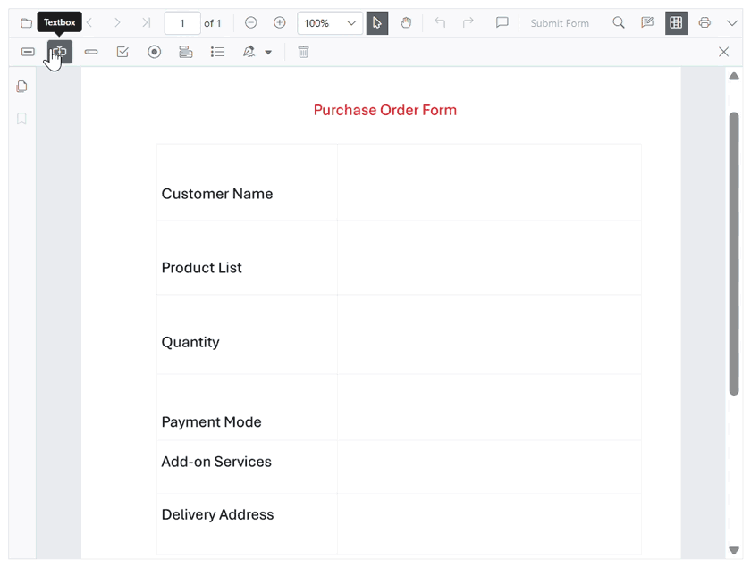

Fields retain their properties when downloaded or reloaded, even in large documents. Essential operations like cut, copy, paste, zoom, and resize work smoothly while preserving data integrity. Additional features include read-only and required field modes, validation, extensive customization, undo/redo functionality, and form submission controls.

## Supported Form Fields

SfPdfViewer supports a range of interactive form fields for structured and dynamic data collection:

> 1. [Textbox](https://help.syncfusion.com/cr/blazor/Syncfusion.Blazor.SfPdfViewer.TextBoxField.html) 
> 2. [Password](https://help.syncfusion.com/cr/blazor/Syncfusion.Blazor.SfPdfViewer.PasswordField.html) 
> 3. [Check Box](https://help.syncfusion.com/cr/blazor/Syncfusion.Blazor.SfPdfViewer.CheckBoxField.html)
> 4. [Radio Button](https://help.syncfusion.com/cr/blazor/Syncfusion.Blazor.SfPdfViewer.RadioButtonField.html)
> 5. [List Box](https://help.syncfusion.com/cr/blazor/Syncfusion.Blazor.SfPdfViewer.ListBoxField.html)
> 6. [Dropdown](https://help.syncfusion.com/cr/blazor/Syncfusion.Blazor.SfPdfViewer.DropDownField.html)
> 7. [Signature Field](https://help.syncfusion.com/cr/blazor/Syncfusion.Blazor.SfPdfViewer.SignatureField.html)
> 8. [Button](https://help.syncfusion.com/cr/blazor/Syncfusion.Blazor.SfPdfViewer.ButtonField.html)

These fields ensure seamless interaction, customization, and data consistency, enabling the creation of well-structured and user-friendly PDF forms.

## Form Field Management

The [SfPdfViewer](https://help.syncfusion.com/cr/blazor/Syncfusion.Blazor.SfPdfViewer.html) enables efficient form field management by supporting opening, saving, and printing PDFs while maintaining field integrity.

### Open the PDF Documents with Interactive Form Fields

The [SfPdfViewer](https://help.syncfusion.com/cr/blazor/Syncfusion.Blazor.SfPdfViewer.html) component enables smooth loading of PDFs with interactive form fields, preserving their properties and data. This ensures seamless modifications, validations, and data retention, even in large documents. A saved PDF with form fields can be opened using the Open icon in the toolbar. Refer to the Image below for details.

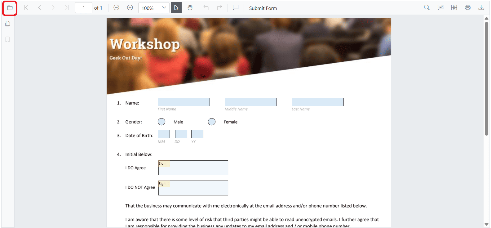

Also, refer to [Open PDF files in SfPdfViewer](https://blazor.syncfusion.com/documentation/pdfviewer-2/opening-pdf-file) for more details.

### Saving Form Fields

The [SfPdfViewer](https://help.syncfusion.com/cr/blazor/Syncfusion.Blazor.SfPdfViewer.html) saves form fields within the PDF without modifying the original file. Selecting the Download icon preserves all field data and properties for future use. Refer to the Image below for details.

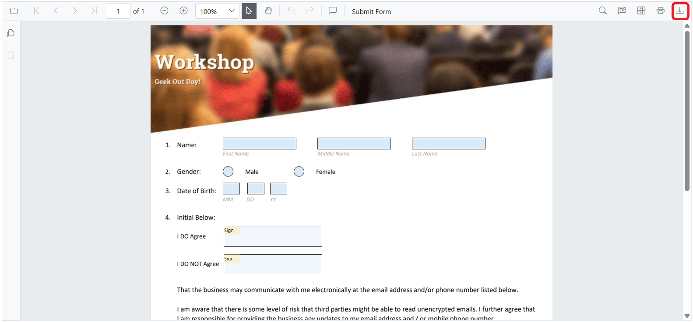

Also, refer to [Saving PDF file in Blazor SfPdfViewer Component](https://blazor.syncfusion.com/documentation/pdfviewer-2/saving-pdf-file) for more details.

### Printing Form Fields

In [SfPdfViewer](https://help.syncfusion.com/cr/blazor/Syncfusion.Blazor.SfPdfViewer.html), form fields can have different visibility modes that control their appearance in the viewer and printed documents.

To control the [Visibility](https://help.syncfusion.com/cr/blazor/Syncfusion.Blazor.SfPdfViewer.FormFieldInfo.html#Syncfusion_Blazor_SfPdfViewer_FormFieldInfo_Visibility) of form fields in print mode, the [VisibilityMode](https://help.syncfusion.com/cr/blazor/Syncfusion.Blazor.SfPdfViewer.VisibilityMode.html) enum provides the following options:

#### Available Visibility Modes

| **Mode**                 | **Behavior** |
|--------------------------|-------------|
| [Visible](https://help.syncfusion.com/cr/blazor/Syncfusion.Blazor.SfPdfViewer.VisibilityMode.html#Syncfusion_Blazor_SfPdfViewer_VisibilityMode_Visible)              | Always visible in both viewer and print. |
| [Hidden](https://help.syncfusion.com/cr/blazor/Syncfusion.Blazor.SfPdfViewer.VisibilityMode.html#Syncfusion_Blazor_SfPdfViewer_VisibilityMode_Hidden)               | Completely hidden in both viewer and print. |
| [VisibleNotPrintable](https://help.syncfusion.com/cr/blazor/Syncfusion.Blazor.SfPdfViewer.VisibilityMode.html#Syncfusion_Blazor_SfPdfViewer_VisibilityMode_VisibleNotPrintable)  | Visible in viewer but excluded from printing. |
| [HiddenPrintable](https://help.syncfusion.com/cr/blazor/Syncfusion.Blazor.SfPdfViewer.VisibilityMode.html#Syncfusion_Blazor_SfPdfViewer_VisibilityMode_HiddenPrintable)      | Hidden in viewer but appears in print. |

N> The [**Visible**](https://help.syncfusion.com/cr/blazor/Syncfusion.Blazor.SfPdfViewer.VisibilityMode.html#Syncfusion_Blazor_SfPdfViewer_VisibilityMode_Visible)  mode is the **default** mode for form fields in [**SfPdfViewer**](https://help.syncfusion.com/cr/blazor/Syncfusion.Blazor.SfPdfViewer.html).

This flexibility ensures precise control over which form fields are displayed or printed as needed. 

The following code snippet explains how to add a form field that is visible in the viewer but does not appear in print in the SfPdfViewer component.

```cshtml
@using Syncfusion.Blazor.SfPdfViewer;
@using Syncfusion.Blazor.Buttons;

<SfButton OnClick="AddVisibleNotPrintField">Add Visible Not Printable Textbox</SfButton>

<SfPdfViewer2 @ref="PdfViewerInstance" DocumentPath="wwwroot/data/Form_Fields_with_Visibility_Property.pdf"
                  Height="650px"
                  Width="100%">
    </SfPdfViewer2>
@code { 
    // Reference to the SfPdfViewer2 instance
    SfPdfViewer2 PdfViewerInstance { get; set; }

    // Adds a form field that appears in the viewer but is excluded from printing.
    private async void AddVisibleNotPrintField()
    {
        await PdfViewerInstance.AddFormFieldsAsync(
            [new TextBoxField {
                Name = "VisibleNotPrintable",
                Value = "VisibleNotPrintable",
                Bounds = new Bound { X = 270, Y = 620, Height = 30, Width = 200 },
                PageNumber = 1,
                Visibility = VisibilityMode.VisibleNotPrintable
            }]
        );
    }
}
```

Refer to the image below for the viewer.

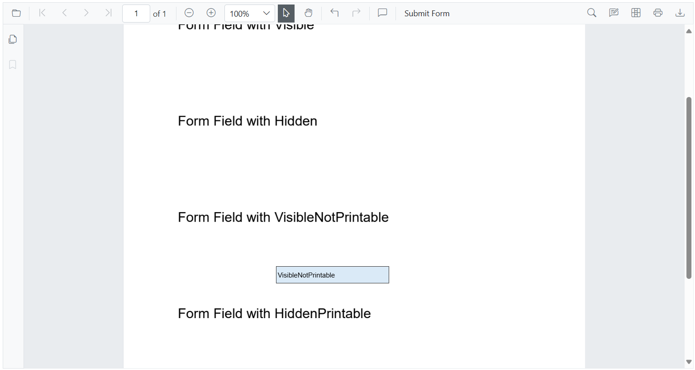

Refer to the image below for the print preview.

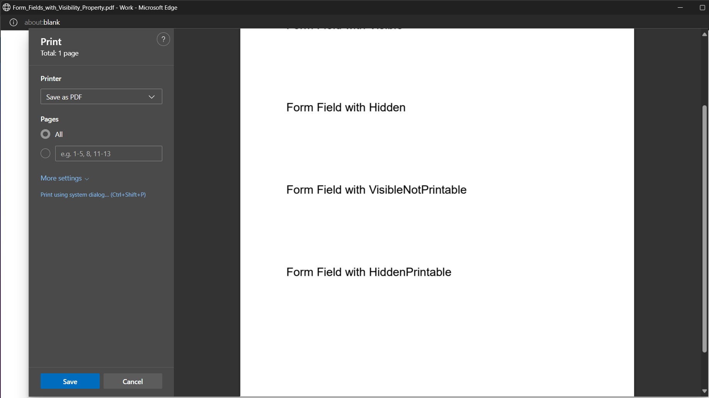

[View sample in GitHub](https://github.com/SyncfusionExamples/blazor-pdf-viewer-examples/blob/master/Form%20Designer/Components/Pages/Visibility.razor).

### Enable or Disable Form Designer Module in SfPdfViewer

The Form Designer module in [SfPdfViewer](https://help.syncfusion.com/cr/blazor/Syncfusion.Blazor.SfPdfViewer.html) allows users to add and modify form fields within a PDF document.

To enable the Form Designer icon on the toolbar, the FormDesigner module must be injected, and the [EnableFormDesigner](https://help.syncfusion.com/cr/blazor/Syncfusion.Blazor.SfPdfViewer.PdfViewerBase.html#Syncfusion_Blazor_SfPdfViewer_PdfViewerBase_EnableFormDesigner) property must be set to `true`.  

If set to `false`, the PDF Viewer remains in **Form Filling Mode only**, and the Form Designer feature is disabled.    

N> By default, [`EnableFormDesigner`](https://help.syncfusion.com/cr/blazor/Syncfusion.Blazor.SfPdfViewer.PdfViewerBase.html#Syncfusion_Blazor_SfPdfViewer_PdfViewerBase_EnableFormDesigner) is set to `true`.

#### Example code for Injecting Form Designer Module

The following code snippet explains how to inject the FormDesigner module and enable the form designer toolbar in SfPdfViewer.

```cshtml
@using Syncfusion.Blazor.SfPdfViewer;

<!-- SfPdfViewer component with Form Designer enabled -->
<SfPdfViewer2 EnableFormDesigner = "true" DocumentPath="wwwroot/data/Form_Designer.pdf"
                  Height="650px"
                  Width="100%">
</SfPdfViewer2>
```


[View sample in GitHub](https://github.com/SyncfusionExamples/blazor-pdf-viewer-examples/blob/master/Form%20Designer/Components/Pages/EnableFormDesigner.razor).

### Enable or Disable Designer Mode in Form Designer

The Designer Mode in [SfPdfViewer](https://help.syncfusion.com/cr/blazor/Syncfusion.Blazor.SfPdfViewer.html) allows users to interact with form field design elements.

When Designer Mode is enabled, users can edit, move, and manipulate form fields within the PDF Viewer.If disabled, form fields remain static and can only be filled without modification.

N> By default, [`IsDesignerMode`](https://help.syncfusion.com/cr/blazor/Syncfusion.Blazor.SfPdfViewer.PdfViewerBase.html#Syncfusion_Blazor_SfPdfViewer_PdfViewerBase_IsDesignerMode) is set to `false`, meaning form fields can be filled but not modified.

The following example demonstrates how to Enable Designer Mode using SfButton components.

```cshtml
@using Syncfusion.Blazor.SfPdfViewer;
@using Syncfusion.Blazor.Buttons;

<!-- SfPdfViewer component with Designer Mode enabled -->
<SfPdfViewer2 IsDesignerMode="true" 
                DocumentPath="wwwroot/data/Form_Designer.pdf"
                Height="650px"
                Width="100%">
</SfPdfViewer2>
```


[View sample in GitHub](https://github.com/SyncfusionExamples/blazor-pdf-viewer-examples/blob/master/Form%20Designer/Components/Pages/InteractionMode.razor).

## Export and Import Form Fields Data

The [SfPdfViewer](https://help.syncfusion.com/cr/blazor/Syncfusion.Blazor.SfPdfViewer.html) control provides support for exporting and importing form field data in multiple formats. 

This functionality allows you to save, transfer, or restore form field values efficiently using the following supported formats:

> 1. XML
> 2. FDF 
> 3. XFDF 
> 4. JSON
> 5. Object-based

The [ExportFormFieldsAsync](https://help.syncfusion.com/cr/blazor/Syncfusion.Blazor.SfPdfViewer.PdfViewerBase.html#Syncfusion_Blazor_SfPdfViewer_PdfViewerBase_ExportFormFieldsAsync_Syncfusion_Blazor_SfPdfViewer_FormFieldDataFormat_) and [ImportFormFieldsAsync](https://help.syncfusion.com/cr/blazor/Syncfusion.Blazor.SfPdfViewer.PdfViewerBase.html#Syncfusion_Blazor_SfPdfViewer_PdfViewerBase_ImportFormFieldsAsync_System_IO_Stream_Syncfusion_Blazor_SfPdfViewer_FormFieldDataFormat_) methods allow you to export the form field data as a stream, which can later be used to import the saved data into another PDF document.

### Types of Form Fields Export and Import

#### Export and Import as XML

Exports form fields data as a XML format and allows importing the same data back into a PDF document.

N> Setting [`FormFieldDataFormat`](https://help.syncfusion.com/cr/blazor/Syncfusion.Blazor.SfPdfViewer.FormFieldDataFormat.html) to [Xml](https://help.syncfusion.com/cr/blazor/Syncfusion.Blazor.SfPdfViewer.FormFieldDataFormat.html#Syncfusion_Blazor_SfPdfViewer_FormFieldDataFormat_Xml) exports or imports form field data in XML format.

The following code shows how to export the form fields as an XML data stream and import that data from the stream into the current PDF document via a button click.

```cshtml
@using Syncfusion.Blazor.SfPdfViewer;
@using Syncfusion.Blazor.Buttons;

<SfButton OnClick="ExportFormFieldData">Export Data</SfButton>
<SfButton OnClick="ImportFormFieldData">Import Data</SfButton>

<SfPdfViewer2 @ref="PdfViewerInstance" DocumentPath="wwwroot/data/Form_Filling_Document_With_Data.pdf"
              Height="650px"
              Width="100%">
</SfPdfViewer2>

@code { 
    // Reference to the SfPdfViewer2 instance
    SfPdfViewer2 PdfViewerInstance { get; set; }

    // Stream to store exported XML form field data
    Stream XMLStream = new MemoryStream();

    // List to store form field information
    List<FormFieldInfo> FormFields = new List<FormFieldInfo>();

    // Exports form field data from the PDF viewer to an XML stream
    private async Task ExportFormFieldData()
    {
        if (PdfViewerInstance != null)
        {
            // Retrieve form field information from the PDF viewer
            FormFields = await PdfViewerInstance.GetFormFieldsAsync();
            if (FormFields != null && FormFields.Count > 0)
            {
                // Export data to XML format
                XMLStream = await PdfViewerInstance.ExportFormFieldsAsync(FormFieldDataFormat.Xml); 
            }
        }
    }

    // Imports form field data from the XML stream into the PDF viewer
    private async Task ImportFormFieldData()
    {
        if (PdfViewerInstance != null && XMLStream != null)
        {
            // Import XML data into the viewer
            await PdfViewerInstance.ImportFormFieldsAsync(XMLStream, FormFieldDataFormat.Xml); 
        }
    }
}
```


[View sample in GitHub](https://github.com/SyncfusionExamples/blazor-pdf-viewer-examples/blob/master/Form%20Designer/Components/Pages/XMLFormat.razor).

#### Export and Import as FDF

Exports form field data in Forms Data Format (FDF) and allows importing the same data back into a PDF document.

N> Setting [`FormFieldDataFormat`](https://help.syncfusion.com/cr/blazor/Syncfusion.Blazor.SfPdfViewer.FormFieldDataFormat.html) to [Fdf](https://help.syncfusion.com/cr/blazor/Syncfusion.Blazor.SfPdfViewer.FormFieldDataFormat.html#Syncfusion_Blazor_SfPdfViewer_FormFieldDataFormat_Fdf) exports or imports form field data in FDF format.

The code demonstrates how to exporting form fields as FDF at a stream and importing the data back into the current PDF document through a button click.

```cshtml
@using Syncfusion.Blazor.SfPdfViewer;
@using Syncfusion.Blazor.Buttons;

<SfButton OnClick="ExportFormFieldData">Export Data</SfButton>
<SfButton OnClick="ImportFormFieldData">Import Data</SfButton>

<SfPdfViewer2 @ref="PdfViewerInstance" DocumentPath="wwwroot/data/Form_Filling_Document_With_Data.pdf"
              Height="650px"
              Width="100%">
</SfPdfViewer2>

@code { 
    // Reference to the SfPdfViewer2 instance
    SfPdfViewer2 PdfViewerInstance { get; set; }

    // Stream to store exported form field data in FDF format
    Stream FDFStream = new MemoryStream();

    // List to store form field information
    List<FormFieldInfo> FormFields = new List<FormFieldInfo>();

    // Exports form field data from the PDF viewer in FDF format
    private async void ExportFormFieldData()
    {
        // Retrieve form field information from the PDF viewer
        FormFields = await PdfViewerInstance.GetFormFieldsAsync(); 
        if (FormFields != null && FormFields.Count > 0)
        {
            // Export form fields as FDF data
            FDFStream = await PdfViewerInstance.ExportFormFieldsAsync(FormFieldDataFormat.Fdf); 
        }
    }

    // Imports form field data from FDF format into the PDF viewer
    private async void ImportFormFieldData()
    {
        if (FDFStream != null)
        {
            // Import FDF data into the viewer
            await PdfViewerInstance.ImportFormFieldsAsync(FDFStream, FormFieldDataFormat.Fdf); 
        }
    }
}
```

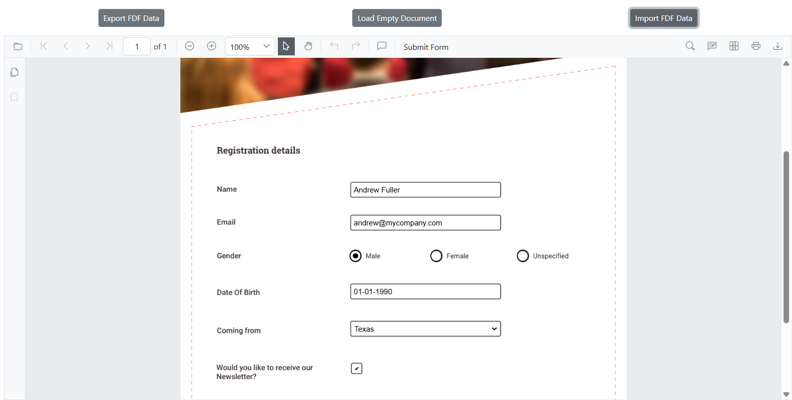

[View sample in GitHub](https://github.com/SyncfusionExamples/blazor-pdf-viewer-examples/blob/master/Form%20Designer/Components/Pages/FDFFormat.razor).

#### Export and Import as XFDF

Similar to FDF, but in XML-based format, XFDF ensures structured data handling for form fields.

N> Setting [`FormFieldDataFormat`](https://help.syncfusion.com/cr/blazor/Syncfusion.Blazor.SfPdfViewer.FormFieldDataFormat.html) to [Xfdf](https://help.syncfusion.com/cr/blazor/Syncfusion.Blazor.SfPdfViewer.FormFieldDataFormat.html#Syncfusion_Blazor_SfPdfViewer_FormFieldDataFormat_Xfdf) exports or imports form field data in XFDF format.

The following code shows how to export the form fields as an XFDF data stream and import that data from the stream into the current PDF document via a button click.

```cshtml
@using Syncfusion.Blazor.SfPdfViewer;
@using Syncfusion.Blazor.Buttons;

<SfButton OnClick="ExportFormFieldData">Export Data</SfButton>
<SfButton OnClick="ImportFormFieldData">Import Data</SfButton>

<SfPdfViewer2 @ref="PdfViewerInstance" DocumentPath="wwwroot/data/Form_Filling_Document_With_Data.pdf"
              Height="650px"
              Width="100%">
</SfPdfViewer2>

@code { 
    // Reference to the SfPdfViewer2 instance
    SfPdfViewer2 PdfViewerInstance { get; set; }

    // Stream to store exported XFDF form field data
    Stream XFDFStream = new MemoryStream();

    // List to store form field information
    List<FormFieldInfo> FormFields = new List<FormFieldInfo>();

    // Exports form field data from the PDF viewer to an XFDF stream
    private async void ExportFormFieldData()
    {
        // Retrieve form field information from the PDF viewer
        FormFields = await PdfViewerInstance.GetFormFieldsAsync(); 
        if (FormFields != null && FormFields.Count > 0)
        {
            // Export data to XFDF format 
            XFDFStream = await PdfViewerInstance.ExportFormFieldsAsync(FormFieldDataFormat.Xfdf); 
        }
    }
    // Imports form field data from the XFDF stream into the PDF viewer
    private async void ImportFormFieldData()
    {
        if (XFDFStream != null)
        {
            // Import XFDF data into the viewer
            await PdfViewerInstance.ImportFormFieldsAsync(XFDFStream, FormFieldDataFormat.Xfdf); 
        }
    }
}
```

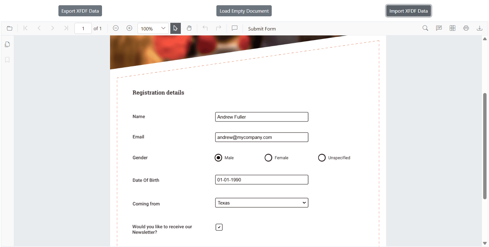

[View sample in GitHub](https://github.com/SyncfusionExamples/blazor-pdf-viewer-examples/blob/master/Form%20Designer/Components/Pages/XFDFFormat.razor).

#### Export and Import as JSON

Exports form field data in JSON format, which can be easily read and imported back into the PDF Viewer.

N> Setting [`FormFieldDataFormat`](https://help.syncfusion.com/cr/blazor/Syncfusion.Blazor.SfPdfViewer.FormFieldDataFormat.html) to [Json](https://help.syncfusion.com/cr/blazor/Syncfusion.Blazor.SfPdfViewer.FormFieldDataFormat.html#Syncfusion_Blazor_SfPdfViewer_FormFieldDataFormat_Json) exports or imports form field data in JSON format.

The code demonstrates how to exporting form fields as JSON at a stream and importing the data back into the current PDF document through a button click.

```cshtml
@using Syncfusion.Blazor.SfPdfViewer;
@using Syncfusion.Blazor.Buttons;

<SfButton OnClick="ExportFormFieldData">Export Data</SfButton>
<SfButton OnClick="ImportFormFieldData">Import Data</SfButton>

<SfPdfViewer2 @ref="PdfViewerInstance" DocumentPath="wwwroot/data/Form_Filling_Document_With_Data.pdf"
              Height="650px"
              Width="100%">
</SfPdfViewer2>

@code { 
    // Reference to the SfPdfViewer2 instance
    SfPdfViewer2 PdfViewerInstance { get; set; }

    // Stream to store exported form field data in JSON format
    Stream JSONStream = new MemoryStream();

    // List to store form field information
    List<FormFieldInfo> FormFields = new List<FormFieldInfo>();

    // Exports form field data from the PDF viewer in JSON format
    private async void ExportFormFieldData()
    {
        // Retrieve form field information from the PDF viewer
        FormFields = await PdfViewerInstance.GetFormFieldsAsync(); 
        if (FormFields != null && FormFields.Count > 0)
        {
            // Export form fields as JSON data
            JSONStream = await PdfViewerInstance.ExportFormFieldsAsync(FormFieldDataFormat.Json); 
        }
    }

    // Imports form field data from JSON format into the PDF viewer
    private async void ImportFormFieldData()
    {
        if (JSONStream != null)
        {
            // Import JSON data into the viewer
            await PdfViewerInstance.ImportFormFieldsAsync(JSONStream, FormFieldDataFormat.Json); 
        }
    }
}
```

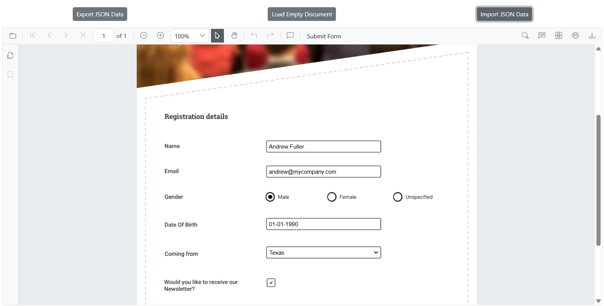

[View sample in GitHub](https://github.com/SyncfusionExamples/blazor-pdf-viewer-examples/blob/master/Form%20Designer/Components/Pages/JSONFormat.razor).

#### Export and Import as an Object

The Form fields can be exported and imported as an object, which is useful for in-memory processing and quick data manipulation.

The [ExportFormFieldsAsObjectAsync](https://help.syncfusion.com/cr/blazor/Syncfusion.Blazor.SfPdfViewer.PdfViewerBase.html#Syncfusion_Blazor_SfPdfViewer_PdfViewerBase_ExportFormFieldsAsObjectAsync) and [ImportFormFieldsAsync](https://help.syncfusion.com/cr/blazor/Syncfusion.Blazor.SfPdfViewer.PdfViewerBase.html#Syncfusion_Blazor_SfPdfViewer_PdfViewerBase_ImportFormFieldsAsync_System_Collections_Generic_Dictionary_System_String_System_String__) methods allow you to export the form field data as an Object, which can later be used to import the saved data into another PDF document.

The following code shows how to export the form fields as an XFDF data stream and import that data from the stream into the current PDF document via a button click.

```cshtml
@using Syncfusion.Blazor.SfPdfViewer;
@using Syncfusion.Blazor.Buttons;

<SfButton OnClick="ExportFormFieldData">Export Data</SfButton>
<SfButton OnClick="ImportFormFieldData">Import Data</SfButton>

<SfPdfViewer2 @ref="PdfViewerInstance" DocumentPath="wwwroot/data/Form_Filling_Document_With_Data.pdf"
              Height="650px"
              Width="100%">
</SfPdfViewer2>

@code { 
    // Reference to the SfPdfViewer2 instance
    SfPdfViewer2 PdfViewerInstance { get; set; }

    // Dictionary to store exported form field data as key-value pairs
    Dictionary<string, string> FormFieldsObject = new Dictionary<string, string>();

    // List to store form field information
    List<FormFieldInfo> FormFields = new List<FormFieldInfo>();

    // Exports form field data from the PDF viewer as an object (key-value pairs)
    private async void ExportFormFieldData()
    {
        // Retrieve form field information
        FormFields = await PdfViewerInstance.GetFormFieldsAsync();
        if (FormFields != null && FormFields.Count > 0)
        {
            // Export form fields as an object
            FormFieldsObject = await PdfViewerInstance.ExportFormFieldsAsObjectAsync();
        }
    }

    // Imports form field data from an object into the PDF viewer
    private async void ImportFormFieldData()
    {
        if (FormFieldsObject != null)
        {
            // Import object data into the viewer
            await PdfViewerInstance.ImportFormFieldsAsync(FormFieldsObject);
        }
    }
}
```

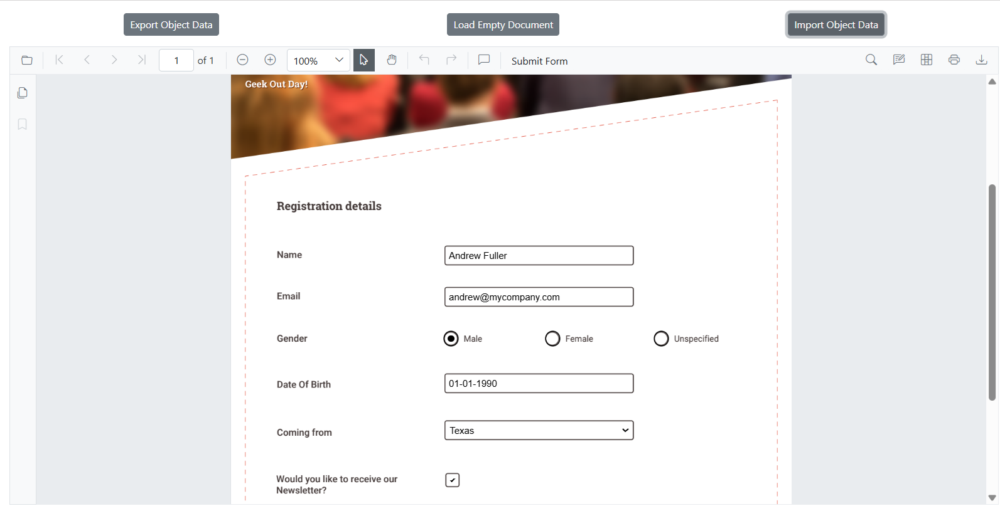

[View sample in GitHub](https://github.com/SyncfusionExamples/blazor-pdf-viewer-examples/blob/master/Form%20Designer/Components/Pages/ObjectFormat.razor).

#### Export Form Fields as a JSON File

This method allows exporting the form field data and saving it as a JSON file, which can be stored or shared for future use.

N> If [`ExportFormFieldsAsync`](https://help.syncfusion.com/cr/blazor/Syncfusion.Blazor.SfPdfViewer.PdfViewerBase.html#Syncfusion_Blazor_SfPdfViewer_PdfViewerBase_ExportFormFieldsAsync_System_String_) is called with a string(path), the form field data will be exported in JSON file format.

```cshtml
@using Syncfusion.Blazor.SfPdfViewer;
@using Syncfusion.Blazor.Buttons;

<SfButton OnClick="ExportFormFieldData">Export Data</SfButton>

<SfPdfViewer2 @ref="PdfViewerInstance" DocumentPath="wwwroot/data/Form_Filling_Document_With_Data.pdf"
              Height="650px"
              Width="100%">
</SfPdfViewer2>

@code {
    // Reference to the SfPdfViewer2 instance
    SfPdfViewer2 PdfViewerInstance { get; set; }

    // Exports form field data from the PDF viewer into a JSON file
    private async void ExportFormFieldData()
    {
        // Exports form fields and saves them as a JSON file
        await PdfViewerInstance.ExportFormFieldsAsync(""); 
    }
}
```

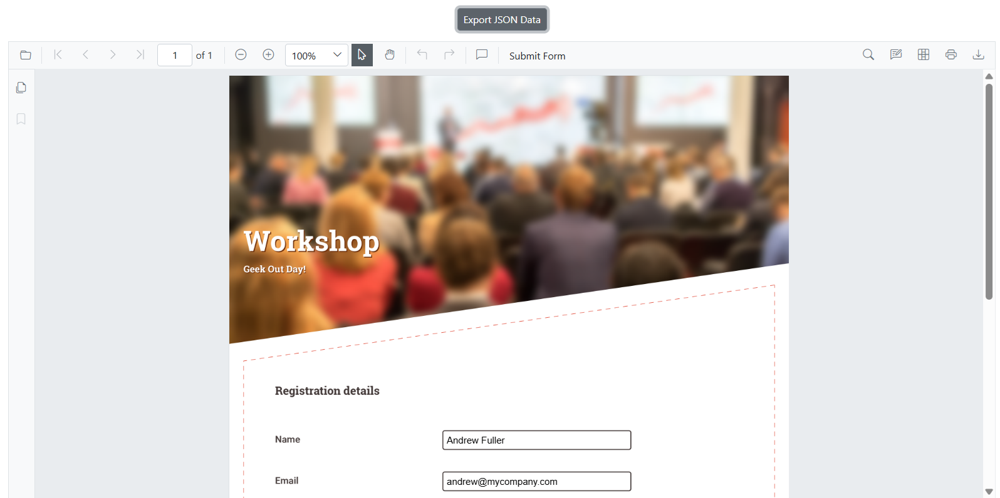

[View sample in GitHub](https://github.com/SyncfusionExamples/blazor-pdf-viewer-examples/blob/master/Form%20Designer/Components/Pages/ExportJSONFile.razor).

Additionally, the component provides a built-in Submit button that allows exporting form field data as a JSON file directly from the PDF document. The following sections demonstrate different ways to export and import form field data.

Refer to the Image below for details.

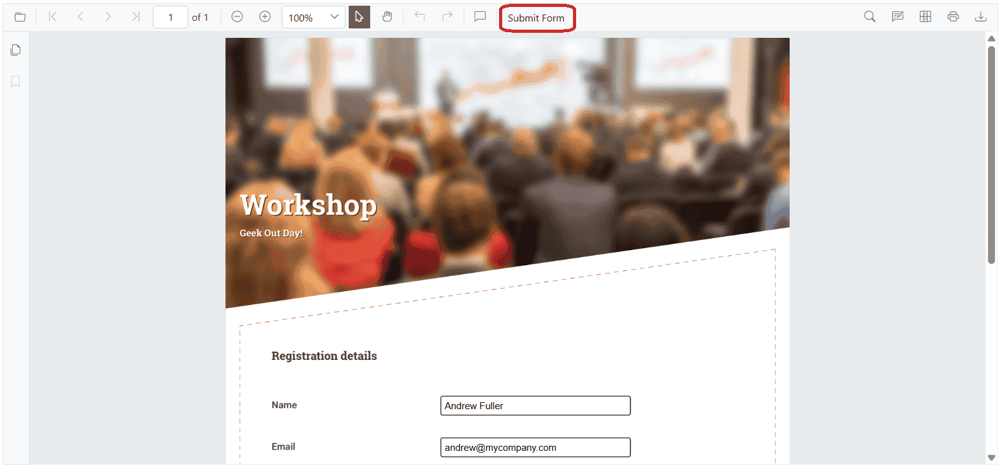

## See also

* [UI interactions in form Designer](./ui-interactions)
* [Programmatic Support in Form Designer](./create-programmatically)
* [Events in Form Designer](./events)