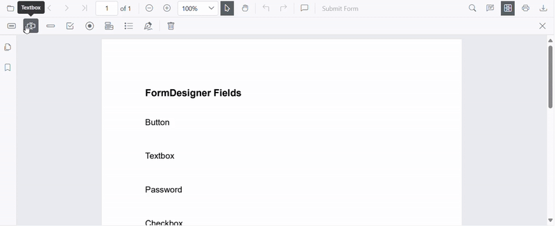
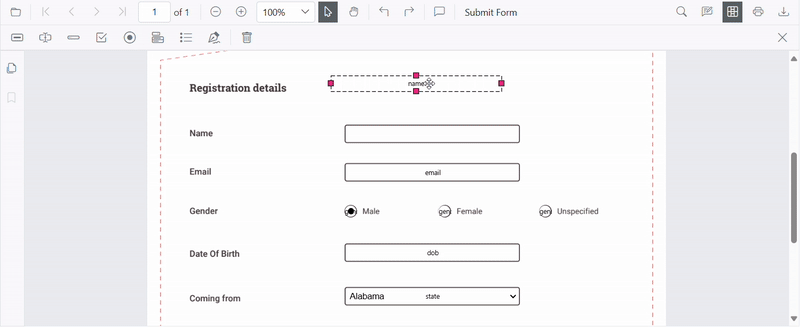
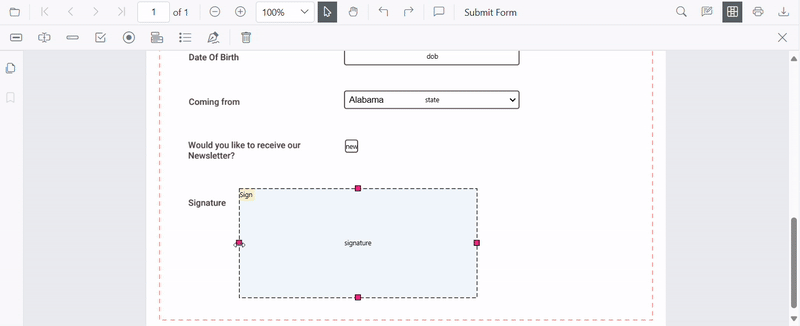
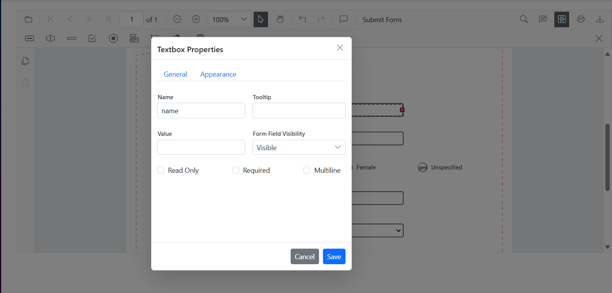
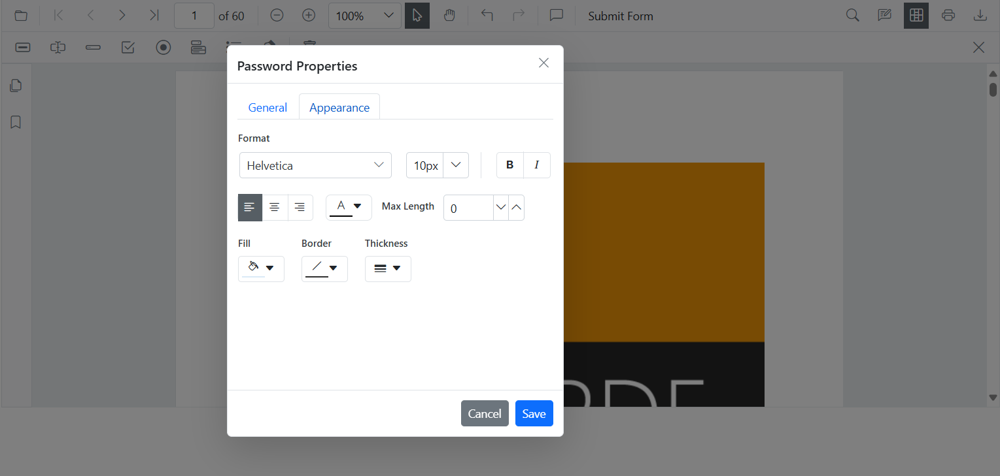
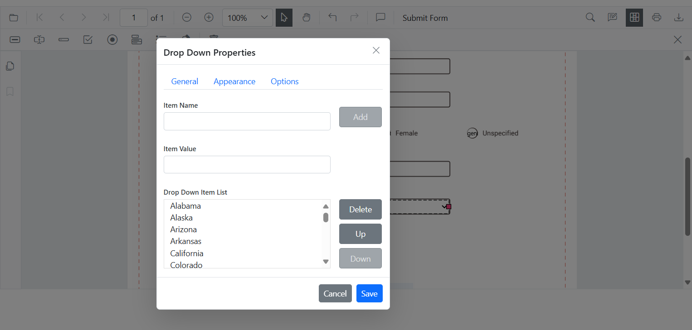
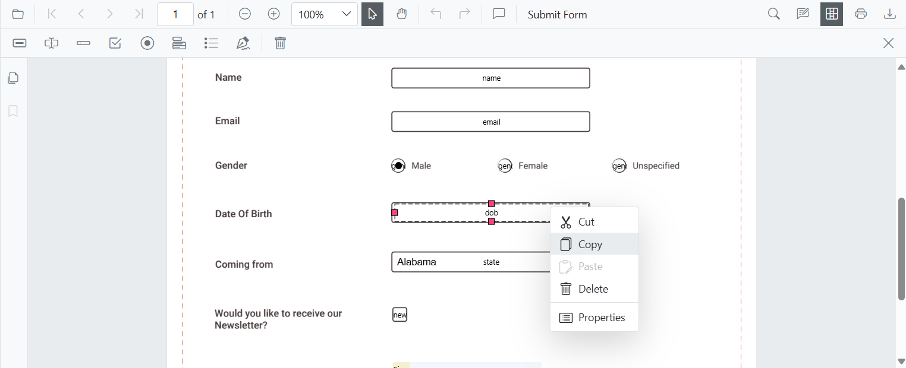
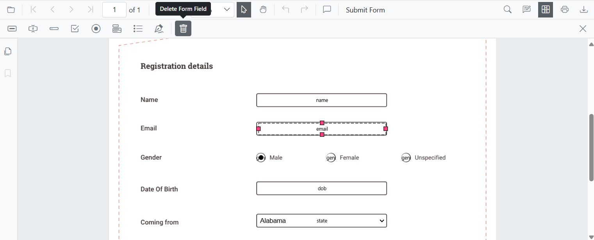

# Form Designer UI Interactions in Blazor PDF Viewer

The Form Designer feature in the Blazor PDF Viewer component allows users to add, edit, and manipulate form fields directly in a PDF document. This feature provides an intuitive user interface to design interactive forms efficiently. 

## Form Field Interactions

### Adding Form Fields

Click the **Edit Form Fields** icon on the toolbar, add the required form field, and place it onto the PDF document.

N> Users can also add form fields programmatically in SfPdfViewer for greater flexibility in customization.
[Programmatically Add the Form fields](./create-programmatically)

### Dragging Form Fields

Users can drag form fields to reposition them anywhere within the document. By clicking and holding a form field, users can move it to the desired location, and alignment guides may appear to help ensure precise placement before releasing the field.

### Resizing Form Fields

Users can resize form fields by dragging the resize handles at the edges or corners. This allows precise adjustments to fit the required dimensions within the document.

### Editing or Updating Form Fields

Users can edit form fields dynamically using the Form Field Properties window. This window can be accessed by selecting the Properties option from the context menu that appears when right-clicking a form field.

The Form Field Properties window consists of three tabs, each offering different customization options:

N> Users can also edit form fields programmatically in SfPdfViewer, allowing for more precise customization.
[Programmatically Edit the Form Fields](./create-programmatically)

#### General Tab

* Modify the Field Name to assign a unique identifier.

* Add a Tooltip to provide additional information about the field.

* Set or update the Value of the field.

* Configure the field’s Visibility settings.

* Enable or disable the Read-Only mode to prevent user modifications.

* Mark the field as Required, ensuring it must be filled before form submission.

* Enable Multiline input for text fields to allow multiple lines of text.

#### Appearance Tab

* Customize the Font Family of the text.

* Apply Bold or Italic styles.

* Adjust the Font Size for better readability.

* Set the Border Color and Fill Color for visual distinction.

* Modify the Border Thickness to adjust the field’s outline.

* Align text using the Alignment settings.

* Define the Maximum Length of text input.

#### Options Tab (For Dropdown and Listbox Fields)

* Add, modify, or remove selectable Options for dropdowns and list boxes.

* Ensure dynamic customization to display the required choices for users.

### Form Field Operations

Users can efficiently manage form fields using various operations such as copy, cut, paste, undo, and redo. Form fields can be duplicated using the Copy (Ctrl + C) command, moved to a different location using Cut (Ctrl + X), and inserted elsewhere with Paste (Ctrl + V).

Additionally, users can revert the last change using Undo (Ctrl + Z) or restore an undone action with Redo (Ctrl + Y), ensuring smooth workflow adjustments.

### Deleting a Form Field

Users can remove form fields by selecting the desired field and clicking the Delete icon in the Form Designer toolbar or choosing the Delete option from the context menu.

N> Users can also delete form fields programmatically in SfPdfViewer
[Programmatically Delete the Form fields](./create-programmatically)

## See also

* [Programmatic Support in Form Designer](./create-programmatically)
* [Events in Form Designer](./events)