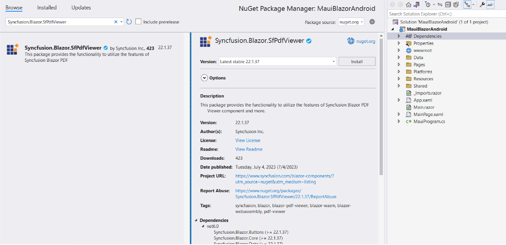

# How to Deploy the PDF Viewer (Next Gen) Component in Blazor Android MAUI Application on Windows

This section briefly explains about how to deploy [Blazor PDF Viewer (Next Gen)](https://www.syncfusion.com/blazor-components/blazor-pdf-viewer) component in your blazor android MAUI App using Visual Studio.

## Prerequisites

To use the MAUI project templates, install the Mobile development with .NET extension for Visual Studio. For more details, refer [here](https://docs.microsoft.com/en-us/dotnet/MAUI/get-started/installation).

## Deploy PDF Viewer (Next Gen) into Blazor Android MAUI application

1. Start Visual Studio and select **Create a new project**, then choose the **.NET MAUI Blazor App** template. Select **Next**. 

2. Provide a **Project Name** and confirm that the *Location* is correct. Select Next to set the target framework and create the project.

## Install Blazor SfPdfViewer NuGet package in Blazor Android MAUI application

To add Blazor PDF Viewer (Next Gen) component in Blazor MAUI App, install the [Syncfusion.Blazor.SfPdfViewer](https://www.nuget.org/packages/Syncfusion.Blazor.SfPdfViewer) and [Syncfusion.Blazor.Themes](https://www.nuget.org/packages/Syncfusion.Blazor.Themes/) NuGet packages as a reference to your project from the [NuGet.org](https://www.nuget.org/packages?q=syncfusion.blazor).

## Register Syncfusion Blazor Service

Open **~/_Imports.razor** file and import the **Syncfusion.Blazor.SfPdfViewer** namespaces.




@using Syncfusion.Blazor 
@using Syncfusion.Blazor.SfPdfViewer




* Open the **~/MauiProgram.cs** file and register the Syncfusion Blazor Service.




using Microsoft.Extensions.Logging;
using MauiBlazorAndroid.Data;
using Syncfusion.Blazor;

namespace MauiBlazorAndroid;

public static class MauiProgram
{
    public static MauiApp CreateMauiApp()
    {
        var builder = MauiApp.CreateBuilder();
        builder
            .UseMauiApp<App>()
            .ConfigureFonts(fonts =>
            {
                fonts.AddFont("OpenSans-Regular.ttf", "OpenSansRegular");
            });

        builder.Services.AddMauiBlazorWebView();
        builder.Services.AddMemoryCache();

#if DEBUG
        builder.Services.AddBlazorWebViewDeveloperTools();
        builder.Logging.AddDebug();
#endif

        builder.Services.AddSingleton<WeatherForecastService>();
        builder.Services.AddSyncfusionBlazor();
        return builder.Build();
    }
}




## Adding Style Sheet

Add the theme style sheet as follows in the server web app.

* Add the Syncfusion bootstrap5 theme in the `<head>` of the **~/wwwroot/index.html** file.




<head>
    <!-- Syncfusion Blazor PDF Viewer (Next Gen) control's theme style sheet -->
    <link href="_content/Syncfusion.Blazor.Themes/bootstrap5.css" rel="stylesheet" />
</head>




> Check out the [Blazor Themes topic](https://blazor.syncfusion.com/documentation/appearance/themes) to learn different ways ([Static Web Assets](https://blazor.syncfusion.com/documentation/appearance/themes#static-web-assets), [CDN](https://blazor.syncfusion.com/documentation/appearance/themes#cdn-reference) and [CRG](https://blazor.syncfusion.com/documentation/common/custom-resource-generator)) to refer themes in Blazor application, and to have the expected appearance for Syncfusion Blazor components. Here, the theme is referred using [Static Web Assets](https://blazor.syncfusion.com/documentation/appearance/themes#static-web-assets). Refer to [Enable static web assets usage](https://blazor.syncfusion.com/documentation/appearance/themes#enable-static-web-assets-usage) topic to use static assets in your project.

## Adding Script Reference

 In this getting started walk-through, the required scripts are referred using [Static Web Assets](https://blazor.syncfusion.com/documentation/common/adding-script-references#static-web-assets) externally inside the `<head>` as follows. Refer to [Enable static web assets usage](https://blazor.syncfusion.com/documentation/common/adding-script-references#enable-static-web-assets-usage) topic to use static assets in your project.

* Add the script in the `<head>` of the **~/wwwroot/index.html** file.




<head>
    <!-- Syncfusion Blazor PDF Viewer (Next Gen) control's theme style sheet -->
    <link href="_content/Syncfusion.Blazor.Themes/bootstrap5.css" rel="stylesheet" />
    <!-- Syncfusion Blazor PDF Viewer (Next Gen) control's scripts -->
    
</head>




> Check out [Adding Script Reference topic](https://blazor.syncfusion.com/documentation/common/adding-script-references) to learn different ways to add script reference in Blazor Application. 

> Syncfusion recommends to reference scripts using [Static Web Assets](https://blazor.syncfusion.com/documentation/common/adding-script-references#static-web-assets), [CDN](https://blazor.syncfusion.com/documentation/common/adding-script-references#cdn-reference) and [CRG](https://blazor.syncfusion.com/documentation/common/custom-resource-generator) by [disabling JavaScript isolation](https://blazor.syncfusion.com/documentation/common/adding-script-references#disable-javascript-isolation) for better loading performance of the Blazor application.

## Adding Blazor PDF Viewer (Next Gen) Component

Add the Syncfusion PDF Viewer (Next Gen) component in the **~/Pages/Index.razor** file.




@page "/"

<SfPdfViewer2 @ref="viewer" DocumentPath="@DocumentPath" Height="100%" Width="100%"></SfPdfViewer2>

@code {
    SfPdfViewer2 viewer;
    private string DocumentPath { get; set; } = "";

    protected override void OnInitialized()
    {
        string basePath = "MauiBlazorAndroid.wwwroot.data.pdf_succinctly.pdf";
        Stream DocumentStream = this.GetType().Assembly.GetManifestResourceStream(basePath);
        DocumentStream.Position = 0;
        using (MemoryStream memoryStream = new MemoryStream())
        {
            DocumentStream.CopyTo(memoryStream);
            byte[] bytes = memoryStream.ToArray();
            string base64String = Convert.ToBase64String(bytes);
            string base64prefix = "data:application/pdf;base64,";
            //Assigned the base64 path to the PDF document path.
            DocumentPath = $"{base64prefix}{base64String}";
        }
        base.OnInitialized();
    }
}



N> When developing a Blazor Android MAUI application, passing the `DocumentPath` to the PDF Viewer (Next Gen) component as a `base64 string` is needed. This ensures that the application can retrieve and render a PDF document correctly within the PDF Viewer (Next Gen) component.

## Run the PDF Viewer (Next Gen) in Blazor Android MAUI application

To run the PDF Viewer (Next Gen) in a Blazor Android MAUI application using the Android emulator, follow these steps:

**Step 1** Set up the necessary dependencies, SDKs, and tools for Blazor Android MAUI on your Windows machine. Ensure that you have installed the required `Android SDK licenses`. If any errors occur during installation, follow the provided prompts or instructions to resolve them.

**Step 2** Install and launch the Android Device Manager. Open the Android SDK Manager, go to the `SDK Tools` tab, select the `Android Device Manager` checkbox, and click `Apply` or `OK`. This will allow you to create, manage, and launch Android Virtual Devices (AVDs) for testing and running Android applications.

**Step 3** Ensure the Android emulator is running. Launch the Android Device Manager and create or select an existing AVD to run the emulator.

Now, relaunch the project in emulator mode. It will render the PDF Viewer (Next Gen) component using the Blazor Android MAUI application.

N> If you encounter any errors while using the Android Emulator, refer to the following link for troubleshooting guidance[Troubleshooting Android Emulator](https://learn.microsoft.com/en-us/dotnet/maui/android/emulator/troubleshooting).

>[View Sample in GitHub](https://github.com/SyncfusionExamples/blazor-pdf-viewer-examples/tree/master/Server%20Deployment/Maui/MauiBlazorAndroid%20-%20SfPdfViewer).

## See also

* [Supported Features: Desktop vs Mobile](./features#supported-features-desktop-vs-mobile).