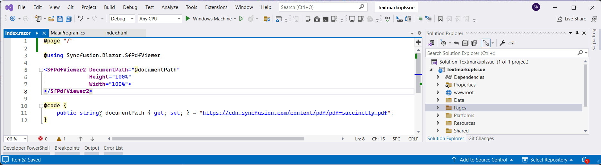

# View PDF files using PDF Viewer Component in the Blazor MAUI app 

In this section, we'll guide you through the process of adding Syncfusion's Blazor PDF Viewer (Next Gen) component to your Blazor Maui app. We'll break it down into simple steps to make it easy to follow.

## Prerequisites

To use the MAUI project templates, install the Mobile development with the .NET extension for Visual Studio. For more details, refer to [here](https://learn.microsoft.com/en-us/dotnet/MAUI/get-started/installation?tabs=vswin).

## Create a new Blazor MAUI App in Visual Studio

Create a new Blazor MAUI app and name it **PDFViewerGettingStarted**.

N> The PDF Viewer (Next Gen) component is supported from .NET 6.0 onwards.

## Install PDF Viewer NuGet package in Blazor Maui App

Add the following NuGet packages into the Blazor Maui app.

* [Syncfusion.Blazor.SfPdfViewer](https://www.nuget.org/packages/Syncfusion.Blazor.SfPdfViewer) 
* [Syncfusion.Blazor.Themes](https://www.nuget.org/packages/Syncfusion.Blazor.Themes)

## Register Syncfusion Blazor Service

* In the **~/_Imports.razor** file, add the following namespaces:




@using Syncfusion.Blazor 
@using Syncfusion.Blazor.SfPdfViewer




* Register the Syncfusion Blazor Service in the **~/MauiProgram.cs** file.




using Microsoft.Extensions.Logging;
using MauiBlazorWindow.Data;
using Syncfusion.Blazor;

namespace MauiBlazorWindow;

public static class MauiProgram
{
    public static MauiApp CreateMauiApp()
    {
        var builder = MauiApp.CreateBuilder();
        builder
            .UseMauiApp<App>()
            .ConfigureFonts(fonts =>
            {
                fonts.AddFont("OpenSans-Regular.ttf", "OpenSansRegular");
            });

        builder.Services.AddMauiBlazorWebView();
        builder.Services.AddMemoryCache();

#if DEBUG
        builder.Services.AddBlazorWebViewDeveloperTools();
        builder.Logging.AddDebug();
#endif

        builder.Services.AddSingleton<WeatherForecastService>();
        builder.Services.AddSyncfusionBlazor();
        return builder.Build();
    }
}




## Adding stylesheet and script

Add the following stylesheet and script to the head section of the **~/wwwroot/index.html** file.




<head>
    <!-- Syncfusion Blazor PDF Viewer (Next Gen) control's theme style sheet -->
    <link href="_content/Syncfusion.Blazor.Themes/bootstrap5.css" rel="stylesheet" />
    <!-- Syncfusion Blazor PDF Viewer (Next Gen) control's scripts -->
    
</head>




## Add PDF Viewer component

Add the Syncfusion PDF Viewer (Next Gen) component in the **~/Pages/Index.razor** file.




@page "/"

@using Syncfusion.Blazor.SfPdfViewer

<SfPdfViewer2 DocumentPath="@DocumentPath"
              Height="100%"
              Width="100%">
</SfPdfViewer2>

@code {
    public string DocumentPath { get; set; } = "https://cdn.syncfusion.com/content/pdf/pdf-succinctly.pdf";
}




N> If the `DocumentPath` property value is not provided, the PDF Viewer (Next Gen) component will be rendered without loading a PDF document. Users can then use the open option from the toolbar to browse and open a PDF as required.

## Run on Windows

Run the sample in Windows Machine mode, and it will run Blazor MAUI in Windows.

Upon successfully launching the application, the PDF Viewer (Next Gen) component will seamlessly render the specified PDF document within its interface.

## Run on Android

To run the PDF Viewer (Next Gen) in a Blazor Android MAUI application using the Android emulator, follow these steps:

Refer [here](https://learn.microsoft.com/en-us/dotnet/maui/android/emulator/device-manager#android-device-manager-on-windows) to install and launch Android emulator.

N> If you encounter any errors while using the Android Emulator, refer to the following link for troubleshooting guidance[Troubleshooting Android Emulator](https://learn.microsoft.com/en-us/dotnet/maui/android/emulator/troubleshooting).

>[View Sample in GitHub](https://github.com/SyncfusionExamples/blazor-pdf-viewer-examples/tree/master/Server%20Deployment/Maui/MauiBlazorWindow%20-%20%20SfPdfViewer).

## See also

* [Supported Features: Desktop vs Mobile](./features#supported-features-desktop-vs-mobile).

* [Render PDF Document from embedded source in the MAUI Android app](../how-to/deploy-maui-using-android-emulator).