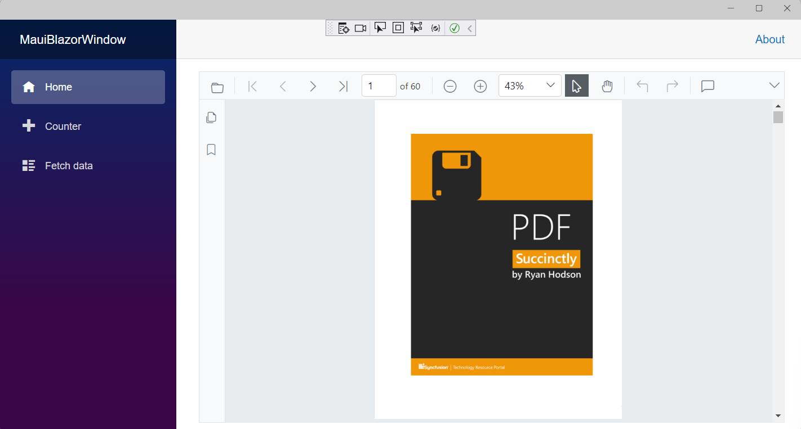

# How to Deploy the PDF Viewer (Next Gen) Component in Blazor MAUI Application on Windows

This section briefly explains how to deploy the [Blazor PDF Viewer (Next Gen) component](https://www.syncfusion.com/blazor-components/blazor-pdf-viewer) component in your Blazor MAUI in the windows App using Visual Studio.

## Prerequisites

To use the MAUI project templates, install the Mobile development with the .NET extension for Visual Studio. For more details, refer to [here](https://docs.microsoft.com/en-us/dotnet/MAUI/get-started/installation).

## Deploy PDF Viewer (Next Gen) into Blazor MAUI application on Windows

1. Start Visual Studio and select **Create a new project**, then choose the **.NET MAUI Blazor App** template. Select **Next**. 

2. Provide a **Project Name** and confirm that the *Location* is correct. Select Next to set the target framework and create the project.

## Install Blazor SfPdfViewer NuGet package in Blazor MAUI in windows application

To add Blazor PDF Viewer (Next Gen) component in Blazor MAUI App, install the [Syncfusion.Blazor.SfPdfViewer](https://www.nuget.org/packages/Syncfusion.Blazor.SfPdfViewer) and [Syncfusion.Blazor.Themes](https://www.nuget.org/packages/Syncfusion.Blazor.Themes/) NuGet packages as a reference to your project from the [NuGet.org](https://www.nuget.org/packages?q=syncfusion.blazor).

## Register Syncfusion Blazor Service

Open the **~/_Imports.razor** file and import the **Syncfusion.Blazor.SfPdfViewer** namespaces.




@using Syncfusion.Blazor 
@using Syncfusion.Blazor.SfPdfViewer




* Open the **~/MauiProgram.cs** file and register the Syncfusion Blazor Service.




using Microsoft.Extensions.Logging;
using MauiBlazorWindow.Data;
using Syncfusion.Blazor;

namespace MauiBlazorWindow;

public static class MauiProgram
{
    public static MauiApp CreateMauiApp()
    {
        var builder = MauiApp.CreateBuilder();
        builder
            .UseMauiApp<App>()
            .ConfigureFonts(fonts =>
            {
                fonts.AddFont("OpenSans-Regular.ttf", "OpenSansRegular");
            });

        builder.Services.AddMauiBlazorWebView();
        builder.Services.AddMemoryCache();

#if DEBUG
        builder.Services.AddBlazorWebViewDeveloperTools();
        builder.Logging.AddDebug();
#endif

        builder.Services.AddSingleton<WeatherForecastService>();
        builder.Services.AddSyncfusionBlazor();
        return builder.Build();
    }
}




## Adding Style Sheet

Add the theme style sheet as follows in the server web app.

* Add the Syncfusion bootstrap5 theme in the `<head>` of the **~/wwwroot/index.html** file.




<head>
    <!-- Syncfusion Blazor PDF Viewer (Next Gen) control's theme style sheet -->
    <link href="_content/Syncfusion.Blazor.Themes/bootstrap5.css" rel="stylesheet" />
</head>




> Check out the [Blazor Themes topic](https://blazor.syncfusion.com/documentation/appearance/themes) to learn different ways ([Static Web Assets](https://blazor.syncfusion.com/documentation/appearance/themes#static-web-assets), [CDN](https://blazor.syncfusion.com/documentation/appearance/themes#cdn-reference) and [CRG](https://blazor.syncfusion.com/documentation/common/custom-resource-generator)) to refer themes in Blazor application, and to have the expected appearance for Syncfusion Blazor components. Here, the theme is referred using [Static Web Assets](https://blazor.syncfusion.com/documentation/appearance/themes#static-web-assets). Refer to [Enable static web assets usage](https://blazor.syncfusion.com/documentation/appearance/themes#enable-static-web-assets-usage) topic to use static assets in your project.

## Adding Script Reference

 In this getting started walk-through, the required scripts are referred using [Static Web Assets](https://blazor.syncfusion.com/documentation/common/adding-script-references#static-web-assets) externally inside the `<head>` as follows. Refer to [Enable static web assets usage](https://blazor.syncfusion.com/documentation/common/adding-script-references#enable-static-web-assets-usage) topic to use static assets in your project.

* Add the script in the `<head>` of the **~/wwwroot/index.html** file.




<head>
    <!-- Syncfusion Blazor PDF Viewer (Next Gen) control's theme style sheet -->
    <link href="_content/Syncfusion.Blazor.Themes/bootstrap5.css" rel="stylesheet" />
    <!-- Syncfusion Blazor PDF Viewer (Next Gen) control's scripts -->
    
</head>




> Check out [Adding Script Reference topic](https://blazor.syncfusion.com/documentation/common/adding-script-references) to learn different ways to add script references in Blazor Application. 

> Syncfusion recommends to reference scripts using [Static Web Assets](https://blazor.syncfusion.com/documentation/common/adding-script-references#static-web-assets), [CDN](https://blazor.syncfusion.com/documentation/common/adding-script-references#cdn-reference) and [CRG](https://blazor.syncfusion.com/documentation/common/custom-resource-generator) by [disabling JavaScript isolation](https://blazor.syncfusion.com/documentation/common/adding-script-references#disable-javascript-isolation) for better loading performance of the Blazor application.

## Adding Blazor PDF Viewer (Next Gen) Component

Add the Syncfusion PDF Viewer (Next Gen) component in the **~/Pages/Index.razor** file.




@page "/"

<SfPdfViewer2 DocumentPath="@DocumentPath" Height="100%" Width="100%"></SfPdfViewer2>

@code {
    // Here, the 'wwwroot' folder is the web root directory and contains static files.
    private string DocumentPath { get; set; } = "wwwroot/PDF_Succinctly.pdf";
}




N> If the `DocumentPath` property value is not provided, the PDF Viewer (Next Gen) component will be rendered without loading a PDF document. Users can then use the open option from the toolbar to browse and open a PDF as required.

## Run the PDF Viewer (Next Gen) in Blazor MAUI in windows

Run the sample in Windows Machine mode, and it will run Blazor MAUI in Windows.

Upon successfully launching the application, the PDF Viewer (Next Gen) component will seamlessly render the specified PDF document within its interface.

>[View Sample in GitHub](https://github.com/SyncfusionExamples/blazor-pdf-viewer-examples/tree/master/Server%20Deployment/Maui/MauiBlazorWindow%20-%20%20SfPdfViewer).