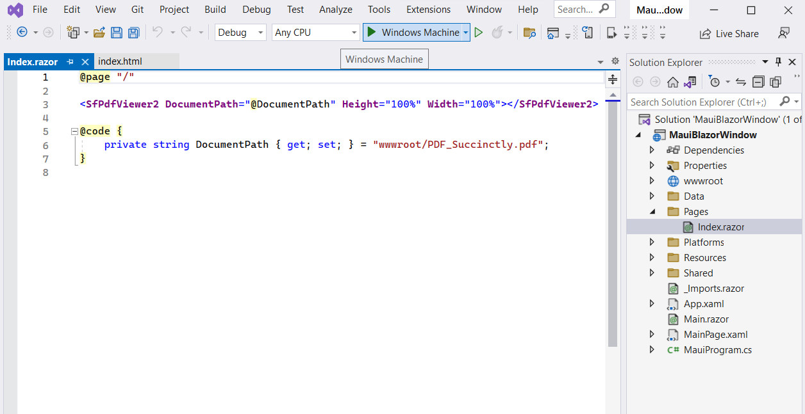
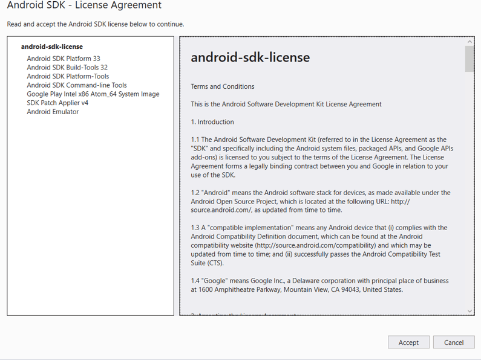

# View PDF files using PDF Viewer Component in the Blazor MAUI app 

In this section, we'll guide you through the process of adding Syncfusion's Blazor PDF Viewer (Next Gen) component to your Blazor Maui app. We'll break it down into simple steps to make it easy to follow.

## Prerequisites

To use the MAUI project templates, install the Mobile development with the .NET extension for Visual Studio. For more details, refer to [here](https://docs.microsoft.com/en-us/dotnet/MAUI/get-started/installation).

## Create a new Blazor MAUI App in Visual Studio

Create a new Blazor MAUI app and name it **PDFViewerGettingStarted**.

N> The PDF Viewer (Next Gen) component is supported from .NET 6.0 onwards.

## Install Blazor PDF Viewer NuGet package in Blazor Maui App

Add the following NuGet packages into the Blazor Maui app.

* [Syncfusion.Blazor.SfPdfViewer](https://www.nuget.org/packages/Syncfusion.Blazor.SfPdfViewer) 
* [Syncfusion.Blazor.Themes](https://www.nuget.org/packages/Syncfusion.Blazor.Themes)

## Register Syncfusion Blazor Service

* In the **~/_Imports.razor** file, add the following namespaces:




@using Syncfusion.Blazor 
@using Syncfusion.Blazor.SfPdfViewer




* Register the Syncfusion Blazor Service in the **~/MauiProgram.cs** file.




using Microsoft.Extensions.Logging;
using MauiBlazorWindow.Data;
using Syncfusion.Blazor;

namespace MauiBlazorWindow;

public static class MauiProgram
{
    public static MauiApp CreateMauiApp()
    {
        var builder = MauiApp.CreateBuilder();
        builder
            .UseMauiApp<App>()
            .ConfigureFonts(fonts =>
            {
                fonts.AddFont("OpenSans-Regular.ttf", "OpenSansRegular");
            });

        builder.Services.AddMauiBlazorWebView();
        builder.Services.AddMemoryCache();

#if DEBUG
        builder.Services.AddBlazorWebViewDeveloperTools();
        builder.Logging.AddDebug();
#endif

        builder.Services.AddSingleton<WeatherForecastService>();
        builder.Services.AddSyncfusionBlazor();
        return builder.Build();
    }
}




## Adding stylesheet and script

Add the following stylesheet and script to the head section of the **~/wwwroot/index.html** file.




<head>
    <!-- Syncfusion Blazor PDF Viewer (Next Gen) control's theme style sheet -->
    <link href="_content/Syncfusion.Blazor.Themes/bootstrap5.css" rel="stylesheet" />
    <!-- Syncfusion Blazor PDF Viewer (Next Gen) control's scripts -->
    
</head>




## Add and Run the MAUI app on Windows

### Adding MAUI PDF Viewer (Next Gen) Component in Windows

Add the Syncfusion PDF Viewer (Next Gen) component in the **~/Pages/Index.razor** file.




@page "/"

<SfPdfViewer2 DocumentPath="@DocumentPath" Height="100%" Width="100%"></SfPdfViewer2>

@code {
    // Here, the 'wwwroot' folder is the web root directory and contains static files.
    private string DocumentPath { get; set; } = "wwwroot/PDF_Succinctly.pdf";
}




N> If the `DocumentPath` property value is not provided, the PDF Viewer (Next Gen) component will be rendered without loading a PDF document. Users can then use the open option from the toolbar to browse and open a PDF as required.

### Run the MAUI PDF Viewer (Next Gen) component in Windows

* Run the sample in Windows Machine mode, and it will run Blazor MAUI in Windows.

Upon successfully launching the application, the PDF Viewer (Next Gen) component will seamlessly render the specified PDF document within its interface.

>[View Sample in GitHub](https://github.com/SyncfusionExamples/blazor-pdf-viewer-examples/tree/master/Server%20Deployment/Maui/MauiBlazorWindow%20-%20%20SfPdfViewer).

## Add and Run the MAUI app on Android

### Adding MAUI PDF Viewer (Next Gen) Component

Add the Syncfusion PDF Viewer (Next Gen) component in the **~/Pages/Index.razor** file.




@page "/"

<SfPdfViewer2 @ref="viewer" DocumentPath="@DocumentPath" Height="100%" Width="100%"></SfPdfViewer2>

@code {
    SfPdfViewer2 viewer;
    private string DocumentPath { get; set; } = "";

    protected override void OnInitialized()
    {
        string basePath = "MauiBlazorAndroid.wwwroot.data.pdf_succinctly.pdf";
        Stream DocumentStream = this.GetType().Assembly.GetManifestResourceStream(basePath);
        DocumentStream.Position = 0;
        using (MemoryStream memoryStream = new MemoryStream())
        {
            DocumentStream.CopyTo(memoryStream);
            byte[] bytes = memoryStream.ToArray();
            string base64String = Convert.ToBase64String(bytes);
            string base64prefix = "data:application/pdf;base64,";
            //Assigned the base64 path to the PDF document path.
            DocumentPath = $"{base64prefix}{base64String}";
        }
        base.OnInitialized();
    }
}



N> When developing a Blazor Android MAUI application, passing the `DocumentPath` to the PDF Viewer (Next Gen) component as a `base64 string` is needed. This ensures that the application can retrieve and render a PDF document correctly within the PDF Viewer (Next Gen) component.

### Run the MAUI PDF Viewer (Next Gen) component using Android emulator

To run the PDF Viewer (Next Gen) in a Blazor Android MAUI application using the Android emulator, follow these steps:

**Step 1** Set up the necessary dependencies, SDKs, and tools for Blazor Android MAUI on your Windows machine. Ensure that you have installed the required `Android SDK licenses`. If any errors occur during installation, follow the provided prompts or instructions to resolve them.

**Step 2** Install and launch the Android Device Manager. Open the Android SDK Manager, go to the `SDK Tools` tab, select the `Android Device Manager` checkbox, and click `Apply` or `OK`. This will allow you to create, manage, and launch Android Virtual Devices (AVDs) for testing and running Android applications.

**Step 3** Ensure the Android emulator is running. Launch the Android Device Manager and create or select an existing AVD to run the emulator.

Now, relaunch the project in emulator mode. It will render the PDF Viewer (Next Gen) component using the Blazor Android MAUI application.

N> If you encounter any errors while using the Android Emulator, refer to the following link for troubleshooting guidance[Troubleshooting Android Emulator](https://learn.microsoft.com/en-us/dotnet/maui/android/emulator/troubleshooting).

>[View Sample in GitHub](https://github.com/SyncfusionExamples/blazor-pdf-viewer-examples/tree/master/Server%20Deployment/Maui/MauiBlazorAndroid%20-%20SfPdfViewer).

## See also

* [Supported Features: Desktop vs Mobile](./features#supported-features-desktop-vs-mobile).