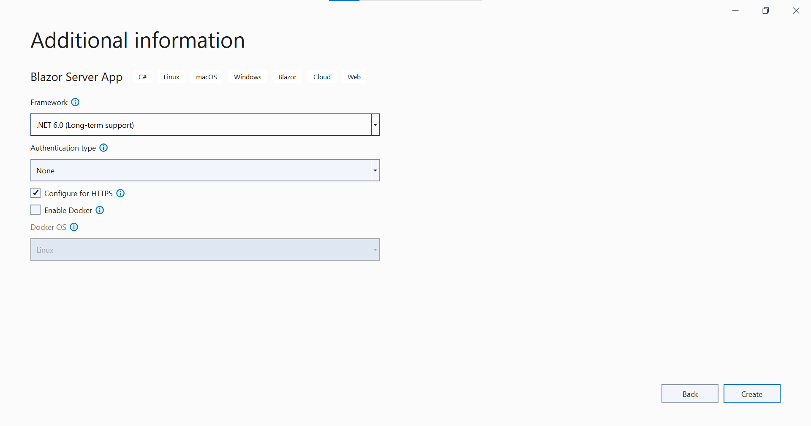
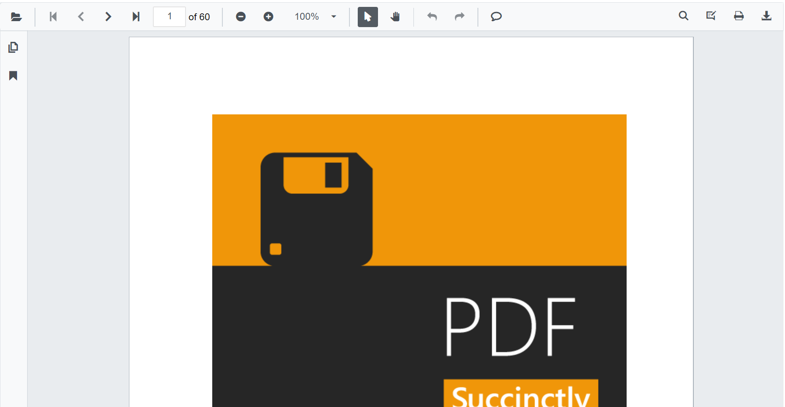

# Getting Started with Blazor SfPdfViewer Component in Blazor Server App

This section briefly explains about how to integrate [Blazor SfPdfViewer](https://www.syncfusion.com/blazor-components/blazor-pdf-viewer) component in your Blazor Server App using Visual Studio.

## Prerequisites

* [System requirements for Blazor components](https://blazor.syncfusion.com/documentation/system-requirements)

## Integrate SfPdfViewer into Blazor Server App

1. Start Visual Studio and select **Create a new project**.

2. For a Blazor Server experience, choose the **Blazor Server App** template. Select **Next**. 

3. Provide a **Project Name** and confirm that the *Location* is correct. Select Next. 

4. In the **Additional information** dialog, set the target framework. 

N> `SfPdfViewer` component supports target framework version .NET 6 and higher versions

## Install Blazor SfPdfViewer NuGet package in Blazor Server App

Syncfusion Blazor components are available in [nuget.org](https://www.nuget.org/packages?q=syncfusion.blazor). To use Syncfusion Blazor components in the application, add reference to the corresponding NuGet. Refer to [NuGet packages topic](https://blazor.syncfusion.com/documentation/nuget-packages) for available NuGet packages list with component details and [Benefits of using individual NuGet packages](https://blazor.syncfusion.com/documentation/nuget-packages#benefits-of-using-individual-nuget-packages).

To add Blazor `SfPdfViewer`, open the NuGet package manager in Visual Studio (*Tools → NuGet Package Manager → Manage NuGet Packages for Solution*), search for [Syncfusion.Blazor.SfPdfViewer](https://www.nuget.org/packages/Syncfusion.Blazor.SfPdfViewer) and then install it.

## Register Syncfusion Blazor Service

Open **~/_Imports.razor** file and import the **Syncfusion.Blazor.SfPdfViewer** namespaces.




@using Syncfusion.Blazor.SfPdfViewer




* For **.NET 6 and .NET 7** app, open the **~/Program.cs** file and register the Syncfusion Blazor Service.




using Microsoft.AspNetCore.Components;
using Microsoft.AspNetCore.Components.Web;
using Syncfusion.Blazor;

var builder = WebApplication.CreateBuilder(args);

// Add services to the container.
builder.Services.AddRazorPages();
builder.Services.AddServerSideBlazor().AddHubOptions(o => { o.MaximumReceiveMessageSize = 102400000; });

// Add Syncfusion Blazor service to the container.
builder.Services.AddSyncfusionBlazor();

var app = builder.Build();




## Adding Style Sheet

Add the theme style sheet as below in the sever web app.

* For **.NET 6** app, add the Syncfusion bootstrap5 theme in the `<head>` of the **~/Pages/_Layout.cshtml** file.

* For **.NET 7** app, add the Syncfusion bootstrap5 theme in the `<head>` of the **~/Pages/_Host.cshtml** file.




<head>
    <!-- Syncfusion Blazor SfPdfViewer controls theme style sheet -->
    <link href="_content/Syncfusion.Blazor.Themes/bootstrap5.css" rel="stylesheet" />
</head>




> Checkout the [Blazor Themes topic](https://blazor.syncfusion.com/documentation/appearance/themes) to learn different ways ([Static Web Assets](https://blazor.syncfusion.com/documentation/appearance/themes#static-web-assets), [CDN](https://blazor.syncfusion.com/documentation/appearance/themes#cdn-reference) and [CRG](https://blazor.syncfusion.com/documentation/common/custom-resource-generator)) to refer themes in Blazor application, and to have the expected appearance for Syncfusion Blazor components. Here, the theme is referred using [Static Web Assets](https://blazor.syncfusion.com/documentation/appearance/themes#static-web-assets). Refer to [Enable static web assets usage](https://blazor.syncfusion.com/documentation/appearance/themes#enable-static-web-assets-usage) topic to use static assets in your project.

## Adding Script Reference

 In this getting started walk-through, the required scripts are referred using [Static Web Assets](https://blazor.syncfusion.com/documentation/common/adding-script-references#static-web-assets) externally inside the `<head>` as follows. Refer to [Enable static web assets usage](https://blazor.syncfusion.com/documentation/common/adding-script-references#enable-static-web-assets-usage) topic to use static assets in your project.

* For **.NET 6** app, Refer script in the `<head>` of the **~/Pages/_Layout.cshtml** file.

* For **.NET 7** app, Refer script in the `<head>` of the **~/Pages/_Host.cshtml** file.




<head>
    <!-- Syncfusion Blazor SfPdfViewer controls theme style sheet -->
    <link href="_content/Syncfusion.Blazor.Themes/bootstrap5.css" rel="stylesheet" />
    <!-- Syncfusion Blazor SfPdfViewer controls scripts -->
    
</head>




> Checkout [Adding Script Reference topic](https://blazor.syncfusion.com/documentation/common/adding-script-references) to learn different ways to add script reference in Blazor Application. 

> Syncfusion recommends to reference scripts using [Static Web Assets](https://blazor.syncfusion.com/documentation/common/adding-script-references#static-web-assets), [CDN](https://blazor.syncfusion.com/documentation/common/adding-script-references#cdn-reference) and [CRG](https://blazor.syncfusion.com/documentation/common/custom-resource-generator) by [disabling JavaScript isolation](https://blazor.syncfusion.com/documentation/common/adding-script-references#disable-javascript-isolation) for better loading performance of the Blazor application.

## Adding Blazor SfPdfViewer Component

Add the Syncfusion SfPdfViewer component in the **~/Pages/Index.razor** file.




@page "/"

<SfPdfViewer2 DocumentPath="@DocumentPath" Height="100%" Width="100%"></SfPdfViewer2>

@code {
    private string DocumentPath { get; set; } = "PDF_Succinctly.pdf";
}




N> If the `DocumentPath` property value is not provided, the SfPdfViewer component will be rendered without loading the PDF document. The users can then use the open option from the toolbar to browse and open the PDF as required.

Press <kbd>Ctrl</kbd>+<kbd>F5</kbd> (Windows) or <kbd>⌘</kbd>+<kbd>F5</kbd> (macOS) to run the application. Then, the Syncfusion `Blazor SfPdfViewer` component will be rendered in the default web browser.

>[View Sample in GitHub](https://github.com/SyncfusionExamples/Blazor-Getting-Started-Examples/tree/main/PDFViewer%20%202/BlazorServerApp/PDFViewerSample).

## See also

* [Getting Started with Blazor SfPdfViewer Component in Blazor WASM App](./web-assembly-application)

* [Getting Started with Blazor SfPdfViewer Component in WSL mode](./wsl-application)