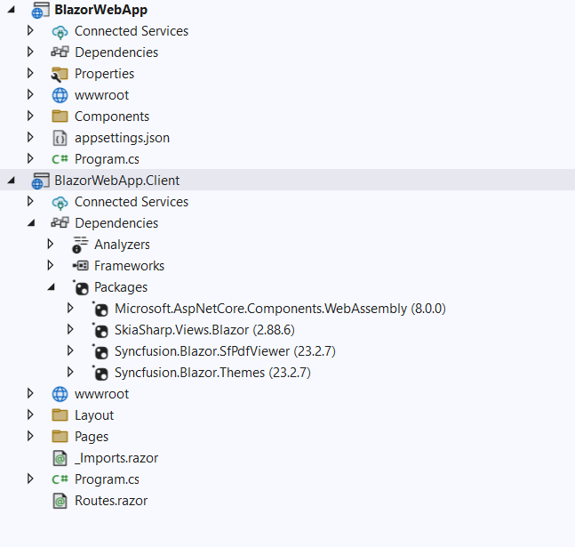

# View PDF files using PDF Viewer Component in the Blazor Web app

In this section, we’ll guide you through the process of adding Syncfusion’s Blazor PDF Viewer (Next Gen) component to your Blazor web app using [Visual Studio](https://visualstudio.microsoft.com/vs/). We’ll break it down into simple steps to make it easy to follow.

## Prerequisites

* [System requirements for Blazor components](https://blazor.syncfusion.com/documentation/system-requirements)

* If you choose an Interactive render mode such as WebAssembly or Auto, ensure that you have the necessary .NET workloads installed to use the PDF Viewer (Next Gen) component in a Blazor WebApp application with SkiaSharp. To do this, execute the following commands in the command prompt:
    * dotnet workload install wasm-tools

## Create a new Blazor Web App in Visual Studio

You can create a Blazor Web App using Visual Studio 2022 via [Microsoft Templates](https://learn.microsoft.com/en-us/aspnet/core/blazor/tooling?view=aspnetcore-8.0&pivots=windows) or the [Syncfusion Blazor Extension](https://blazor.syncfusion.com/documentation/visual-studio-integration/template-studio).
You need to configure the corresponding [Interactive render mode](https://learn.microsoft.com/en-us/aspnet/core/blazor/components/render-modes?view=aspnetcore-8.0#render-modes) and [Interactivity location](https://learn.microsoft.com/en-us/aspnet/core/blazor/tooling?view=aspnetcore-8.0&pivots=windows) while creating a Blazor Web Application. 

## Install Blazor PDF Viewer NuGet package in Blazor Web App

To add **Blazor PDF Viewer (Next Gen)** component in the app, open the NuGet package manager in Visual Studio (*Tools → NuGet Package Manager → Manage NuGet Packages for Solution*), search and install

* [Syncfusion.Blazor.SfPdfViewer](https://www.nuget.org/packages/Syncfusion.Blazor.SfPdfViewer) 
* [Syncfusion.Blazor.Themes](https://www.nuget.org/packages/Syncfusion.Blazor.Themes)

If you select an Interactive render mode as WebAssembly or Auto, you can install the NuGet package in the client-side project to add component in Web App.

N> If you select an Interactive render mode as `WebAssembly or Auto`, you can install the NuGet package in the client-side project to add component in Web App.
* [SkiaSharp.Views.Blazor](https://www.nuget.org/packages/SkiaSharp.Views.Blazor)



## Add the following PropertyGroup and ItemGroup

Interactive render mode as WebAssembly or Auto, need to add the following property group and item group in client project.




<PropertyGroup>
	<WasmNativeStrip>true</WasmNativeStrip>
	<WasmBuildNative>true</WasmBuildNative>
</PropertyGroup>

<ItemGroup>
    <NativeFileReference Include="$(SkiaSharpStaticLibraryPath)\2.0.23\*.a" />
</ItemGroup>




## Register Syncfusion Blazor Service

* In the **~/_Imports.razor** file, add the following namespaces:




@using Syncfusion.Blazor;
@using Syncfusion.Blazor.SfPdfViewer;




* Register the Syncfusion Blazor Service in the program.cs file of your Blazor Web App.

If you select an Interactive render mode as `WebAssembly` or `Auto`, you need to register the Syncfusion Blazor service in both **~/Program.cs** files of your Blazor Web App.




using BlazorWebAppServer.Components;
using Syncfusion.Blazor;

var builder = WebApplication.CreateBuilder(args);

builder.Services.AddRazorComponents() 
        .AddInteractiveServerComponents();

builder.Services.AddSignalR(o => { o.MaximumReceiveMessageSize = 102400000; });

builder.Services.AddMemoryCache();
//Add Syncfusion Blazor service to the container.
builder.Services.AddSyncfusionBlazor();

var app = builder.Build();

if (!app.Environment.IsDevelopment())
{
    app.UseExceptionHandler("/Error", createScopeForErrors: true);
    app.UseHsts();
}

app.UseHttpsRedirection();
app.UseStaticFiles();
app.UseAntiforgery();

app.MapRazorComponents<App>()
    .AddInteractiveServerRenderMode();

app.Run();





using BlazorWebApp.Client.Pages;
using BlazorWebApp.Components;
using Syncfusion.Blazor;

var builder = WebApplication.CreateBuilder(args);
builder.Services.AddRazorComponents()
.AddInteractiveWebAssemblyComponents();

builder.Services.AddMemoryCache();
//Add Syncfusion Blazor service to the container
builder.Services.AddSyncfusionBlazor();

var app = builder.Build();
if (app.Environment.IsDevelopment())
{
app.UseWebAssemblyDebugging();
}
else
{
app.UseExceptionHandler("/Error", createScopeForErrors: true);
    app.UseHsts();
}

app.UseHttpsRedirection();
app.UseStaticFiles();
app.UseAntiforgery();

app.MapRazorComponents<App>()
    .AddInteractiveWebAssemblyRenderMode()
    .AddAdditionalAssemblies(typeof(Counter).Assembly);

app.Run();





using BlazorWebAppAuto.Client.Pages;
using BlazorWebAppAuto.Components;
using Syncfusion.Blazor;

var builder = WebApplication.CreateBuilder(args);
builder.Services.AddRazorComponents()
.AddInteractiveServerComponents() .AddInteractiveWebAssemblyComponents();

builder.Services.AddMemoryCache();
//Add Syncfusion Blazor service to the container
builder.Services.AddSyncfusionBlazor();

var app = builder.Build();
if (app.Environment.IsDevelopment())
{
app.UseWebAssemblyDebugging();
}
else
{ app.UseExceptionHandler("/Error", createScopeForErrors: true);
    app.UseHsts();
}
app.UseHttpsRedirection();
app.UseStaticFiles();
app.UseAntiforgery();

app.MapRazorComponents<App>()
.AddInteractiveServerRenderMode() .AddInteractiveWebAssemblyRenderMode()
    .AddAdditionalAssemblies(typeof(Counter).Assembly);




N> [Processing Large Files Without Increasing Maximum Message Size in SfPdfViewer Component](../how-to/processing-large-files-without-increasing-maximum-message-size)

## Adding stylesheet and script

Add the following stylesheet and script to the head section of the **~/Components/App.razor** file.

```html
<head>
    <!-- Syncfusion Blazor PDF Viewer (Next Gen) control's theme style sheet -->
    <link href="_content/Syncfusion.Blazor.Themes/bootstrap5.css" rel="stylesheet" />
    <!-- Syncfusion Blazor PDF Viewer (Next Gen) control's scripts -->
    <script src="_content/Syncfusion.Blazor.SfPdfViewer/scripts/syncfusion-blazor-sfpdfviewer.min.js" type="text/javascript"></script>
</head>
```

## Adding Blazor PDF Viewer (Next Gen) Component

Add the Syncfusion PDF Viewer (Next Gen) component in the **~Pages/.razor** file. If an interactivity location as `Per page/component` in the web app, define a render mode at the top of the **~Pages/.razor** component, as follows:




@* Your App render mode define here *@
@rendermode InteractiveAuto




N> If an interactivity location as Global no need to mention render mode. Set the interactivity mode for whole sample.

Add the Syncfusion PDF Viewer component in the **~/Pages/Index.razor** file.




@page "/"
<SfPdfViewer2 DocumentPath="https://cdn.syncfusion.com/content/pdf/pdf-succinctly.pdf"
              Height="100%"
              Width="100%">
</SfPdfViewer2>




N> If you don’t provide the `DocumentPath` property value, the PDF Viewer (Next Gen) component will be rendered without loading the PDF document. Users can then use the **open** option from the toolbar to browse and open the PDF as required.

## Run the application

Run the application, and the PDF file will be displayed using Syncfusion’s Blazor PDF Viewer (Next Gen) component in your browser.



N> [View Sample in GitHub](https://github.com/SyncfusionExamples/Blazor-Getting-Started-Examples/tree/main/PDFViewer%20%202/BlazorWebApp).

## See also

* [Getting Started with Blazor PDF Viewer (Next Gen) Component in Blazor WASM App](./web-assembly-application)

* [Getting Started with Blazor PDF Viewer (Next Gen) Component in WSL mode](./wsl-application)

* [Learn different ways to add script reference in Blazor Application](https://blazor.syncfusion.com/documentation/common/adding-script-references)

* [Processing Large Files Without Increasing Maximum Message Size in SfPdfViewer Component](../how-to/processing-large-files-without-increasing-maximum-message-size)