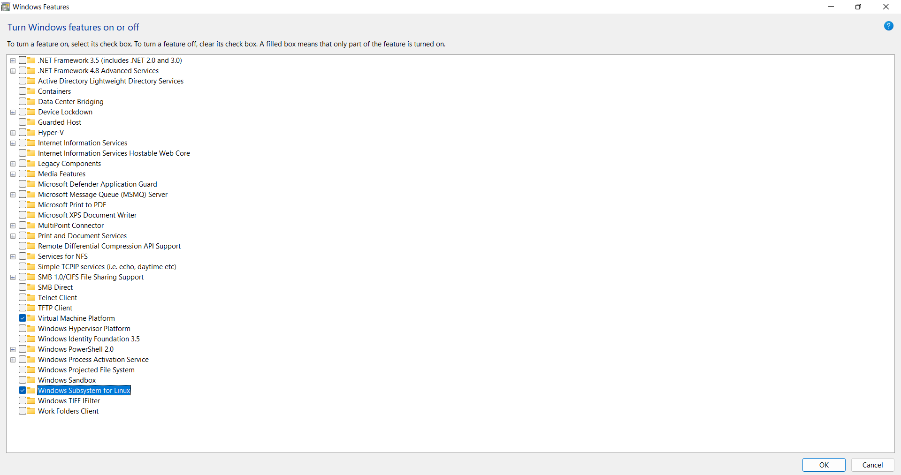
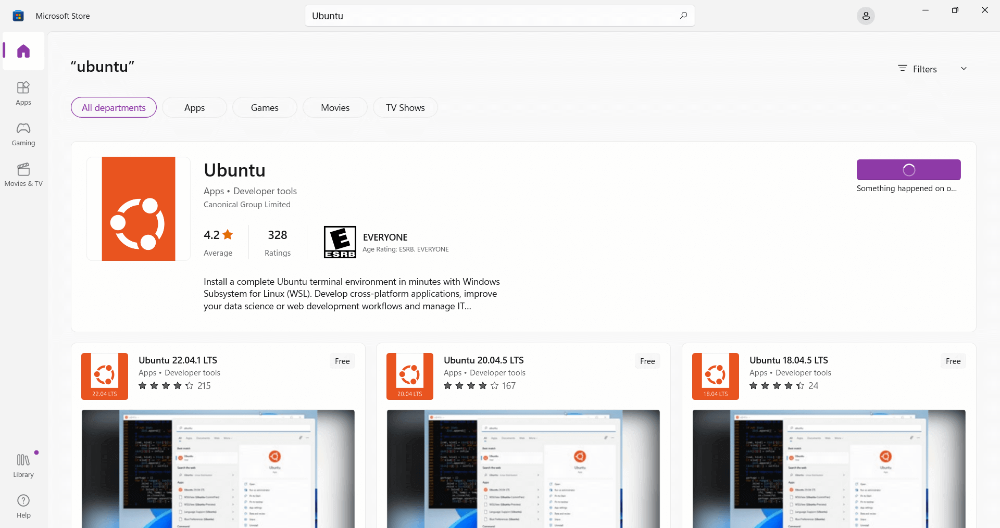
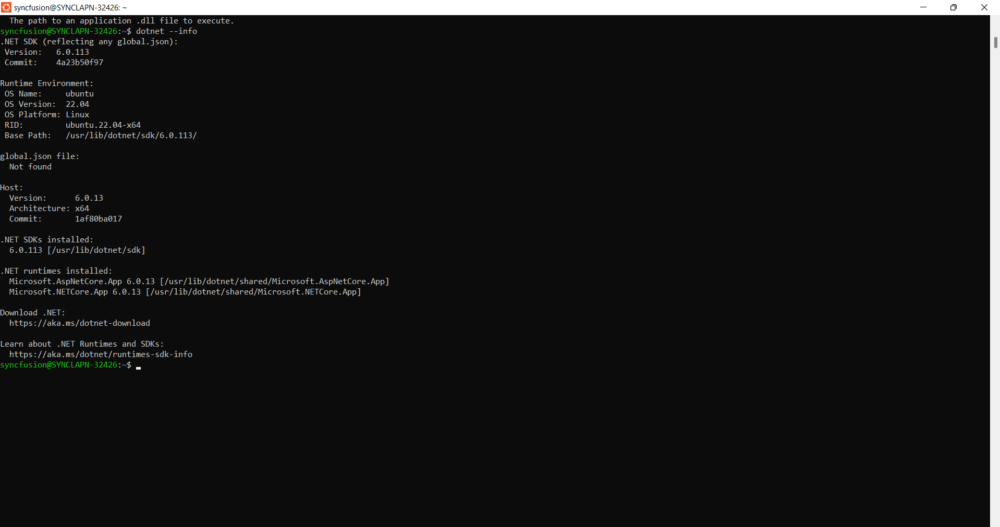
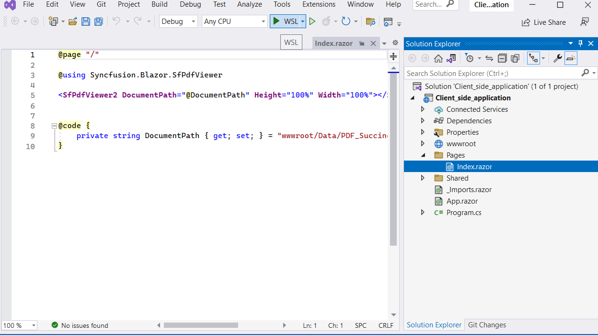
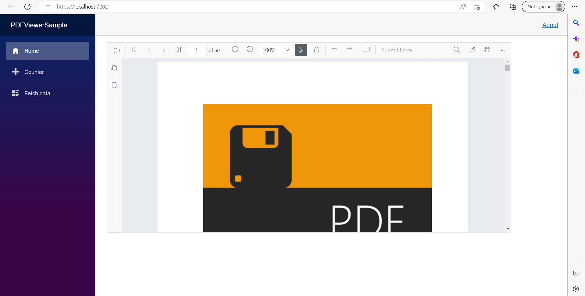

# Getting Started with Blazor PDF Viewer (Next Gen) Component in WSL mode

To run the Syncfusion Blazor PDF Viewer (Next Gen) component in WSL (Windows Subsystem for Linux) mode, follow these steps:

**Step 1:** Enable the Windows Subsystem for Linux and the Virtual Machine Platform.



To enable the Windows Subsystem for Linux (WSL) and the Virtual Machine Platform on Windows, follow these steps:

Open the Start menu and search for `Control Panel`. Click on `Programs`, then click on `Turn Windows features on or off`. Scroll down and select the boxes next to `Windows Subsystem for Linux` and `Virtual Machine Platform`. Finally, Click `OK` and restart your machine.

After restarting your computer, you can install a Linux distribution like Ubuntu from the Microsoft Store and execute Linux commands directly in Windows.

**Step 2:** Install the `Ubuntu`



Ubuntu can be installed on a Windows machine by the Microsoft Store, follow these steps:

Open the Microsoft Store on your Windows machine. Search for `Ubuntu` in the Microsoft Store search bar. Click on the `Ubuntu` application and click the `Get` button to download and install the application. Once the installation is complete, click on the `Launch` button to start Ubuntu. This will install Ubuntu as a Windows Subsystem for Linux (WSL), which allows you to run a Linux environment directly on Windows without the need for a virtual machine.

On Ubuntu, create a new user with a username and password.


**Step 3:** Install the dotnet framework for running the WSL (Windows Subsystem for Linux) in the project by running the following code one by one. 

```
    wget https://packages.microsoft.com/config/ubuntu/22.10/packages-microsoft-prod.deb -O packages-microsoft-prod.deb

    sudo dpkg -i packages-microsoft-prod.deb

    rm packages-microsoft-prod.deb

    sudo apt-get update && \
    sudo apt-get install -y dotnet-sdk-7.0

```

Check the comment dotnet --info and it should come as follows.



If the above result is not shown, please run the comments below 

```
    sudo apt remove dotnet*
    sudo apt remove aspnetcore*
    sudo apt remove netstandard*
    sudo apt-get remove dotnet-host
    sudo apt autoremove
    sudo apt autoremove -y dotnet-sdk-7.0
    sudo apt-get update
    dotnet
    sudo apt-get install -y dotnet-sdk-7.0
    dotnet
    dotnet --info
```
**Step 4:** Now, run the server or webassembly sample in WSL (Windows Subsystem for Linux) mode and it will run our Blazor PDF Viewer (Next Gen) component.



N> If you encounter any issues while running in WSL (Windows Subsystem for Linux) mode, use the following instructions to resolve them.

If the sample does not load the PDF file and throws an exception.


Then, in the Ubuntu command window, run the following commands one by one to install all necessary Blazor PDF Viewer (Next Gen) dependencies for a Linux run.

```
    sudo apt-get install libfontconfig1
    sudo apt-get update && apt-get install -y --allow-unauthenticated libgdiplus libc6-dev libx11-dev
    sudo apt-get update
    sudo apt install libgdiplus

```

Close the project, reopen it, and run it in WSL mode. It will run properly.



## See also

* [Getting Started with Blazor PDF Viewer (Next Gen) Component in Blazor Server App](./server-side-application)

* [Getting Started with Blazor PDF Viewer (Next Gen) Component in Blazor WASM App](./web-assembly-application)