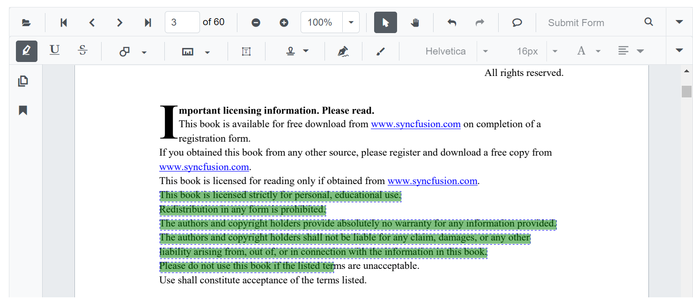

# Change highlighted color of the text in Blazor Pdf Viewer Component

You can change the highlight color of the selected annotation using the `Color` property of the [PdfViewerHighlightSettings](https://help.syncfusion.com/cr/blazor/Syncfusion.Blazor.SfPdfViewer.PdfViewerHighlightSettings.html) class.

The following code illustrates how to change the highlight color of the text.

```cshtml
@using Syncfusion.Blazor.Buttons
@using Syncfusion.Blazor.SfPdfViewer

<!--Render simple PDF Viewer with customized highlight options-->
<SfPdfViewer2 @ref="PDFViewer"
              DocumentPath="@DocumentPath">
    <PdfViewerHighlightSettings Color="@highlightColor">
    </PdfViewerHighlightSettings>
</SfPdfViewer2>

@code{
    SfPdfViewer2 PDFViewer;
    //Sets the PDF document path for initial loading.
    private string DocumentPath { get; set; } = "Data/PDF_Succinctly.pdf";

    //Defines the color for text markup annotations like highlight.
    private string highlightColor = "Green";

}
```


[View sample in GitHub](https://github.com/SyncfusionExamples/blazor-pdf-viewer-examples/tree/master/Annotations/Text%20Markup/Customize%20highlight%20annotation-SfPdfViewer).
