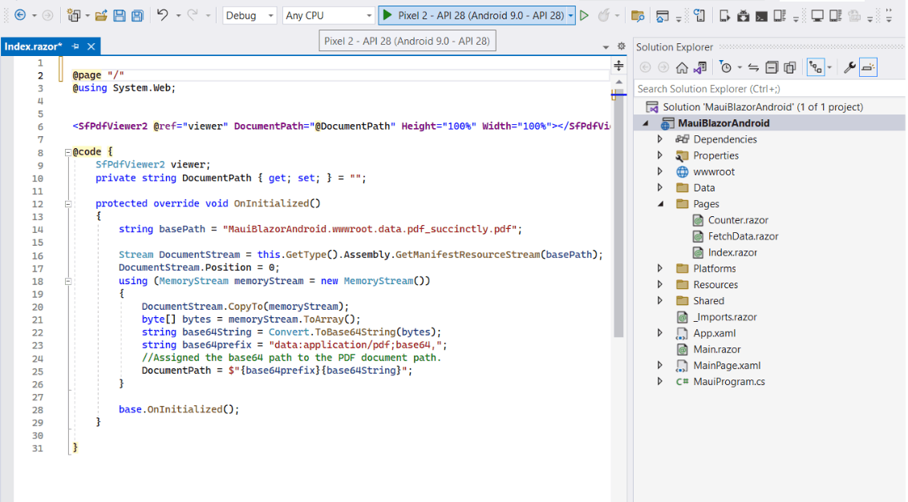
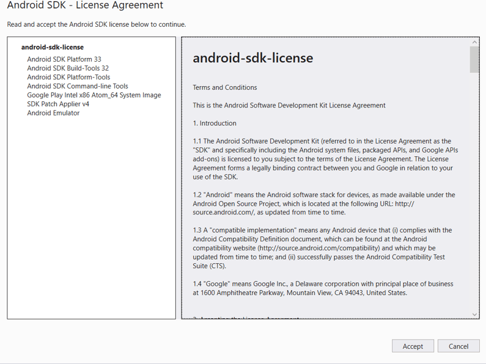
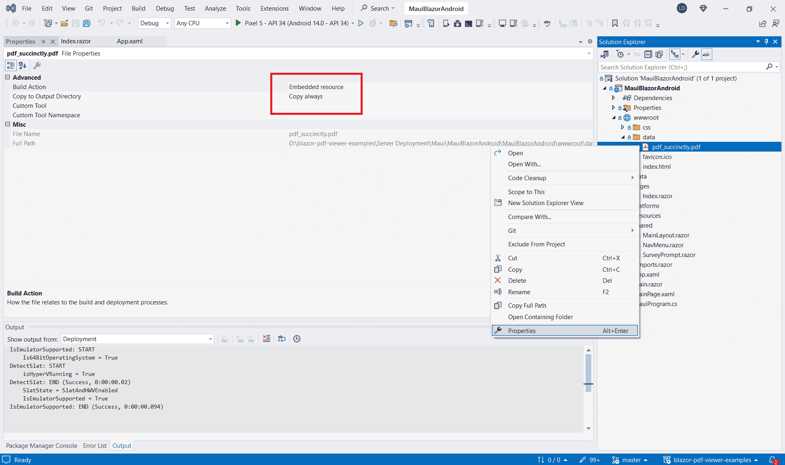
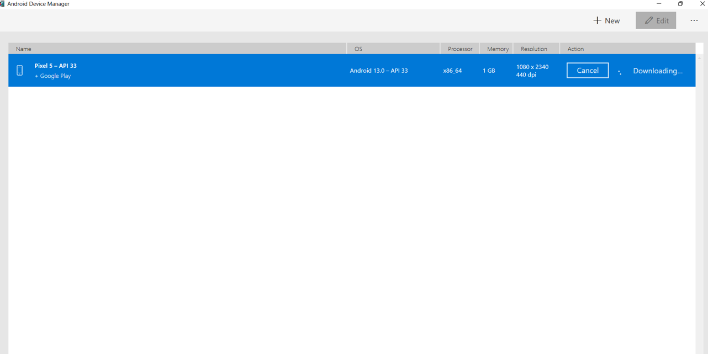
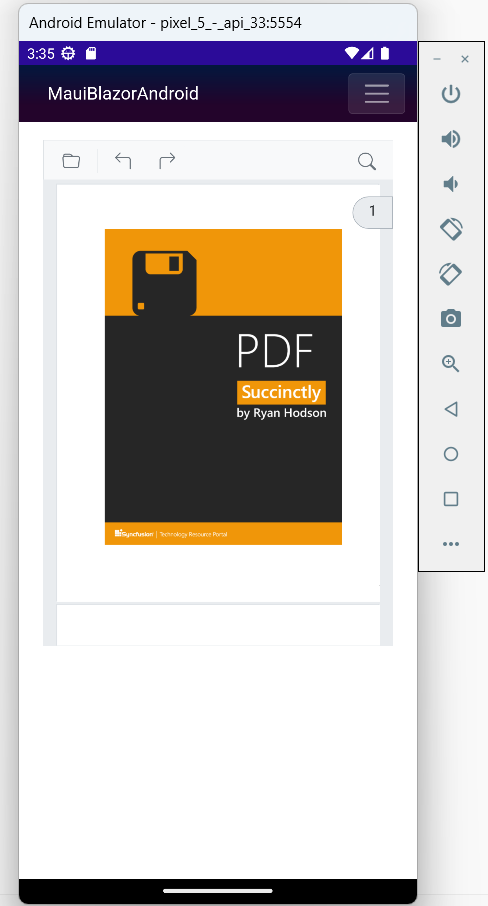

# Render PDF document from embedded source in the MAUI Android app 

In this section, we'll guide you how to render PDF Viewer from embedded source in a MAUI app. We'll break it down into simple steps to make it easy to follow.

Refer [here](https://blazor.syncfusion.com/documentation/pdfviewer-2/getting-started/deploy-maui-windows) to create MAUI app.

## Add PDF Viewer component

Add the Syncfusion PDF Viewer (Next Gen) component in the **~/Pages/Index.razor** file.




@page "/"

<SfPdfViewer2 @ref="viewer" DocumentPath="@DocumentPath" Height="100%" Width="100%"></SfPdfViewer2>

@code {
    SfPdfViewer2 viewer;
    private string DocumentPath { get; set; } = "";

    protected override void OnInitialized()
    {
        string basePath = "MauiBlazorAndroid.wwwroot.data.pdf_succinctly.pdf";
        Stream DocumentStream = this.GetType().Assembly.GetManifestResourceStream(basePath);
        DocumentStream.Position = 0;
        using (MemoryStream memoryStream = new MemoryStream())
        {
            DocumentStream.CopyTo(memoryStream);
            byte[] bytes = memoryStream.ToArray();
            string base64String = Convert.ToBase64String(bytes);
            string base64prefix = "data:application/pdf;base64,";
            //Assigned the base64 path to the PDF document path.
            DocumentPath = $"{base64prefix}{base64String}";
        }
        base.OnInitialized();
    }
}



N> When developing a Blazor Android MAUI application, passing the [DocumentPath](https://help.syncfusion.com/cr/blazor/Syncfusion.Blazor.SfPdfViewer.PdfViewerBase.html#Syncfusion_Blazor_SfPdfViewer_PdfViewerBase_DocumentPath) to the PDF Viewer (Next Gen) component as a `base64 string` is needed. This ensures that the application can retrieve and render a PDF document correctly within the PDF Viewer (Next Gen) component.

## Run on Android emulator

To run the PDF Viewer (Next Gen) in a Blazor Android MAUI application using the Android emulator, follow these steps:

**Step 1** Set up the necessary dependencies, SDKs, and tools for Blazor Android MAUI on your Windows machine. Ensure that you have installed the required `Android SDK licenses`. If any errors occur during installation, follow the provided prompts or instructions to resolve them.

**Step 2** Right-click the **~wwwroot/data/pdf_succinctly.pdf** file in Solution Explorer, go to `Properties`, and set Build Action to `Embedded Resource` and Copy to Output Directory to `Copy Always`.

**Step 3** Install and launch the Android Device Manager. Open the Android SDK Manager, go to the `SDK Tools` tab, select the `Android Device Manager` checkbox, and click `Apply` or `OK`. This will allow you to create, manage, and launch Android Virtual Devices (AVD's) for testing and running Android applications.

**Step 4** Ensure the Android emulator is running. Launch the Android Device Manager and create or select an existing AVD to run the emulator.

Now, relaunch the project in emulator mode. It will render the PDF Viewer (Next Gen) component using the Blazor Android MAUI application.

N> If you encounter any errors while using the Android Emulator, refer to the following link for troubleshooting guidance[Troubleshooting Android Emulator](https://learn.microsoft.com/en-us/dotnet/maui/android/emulator/troubleshooting).

>[View Sample in GitHub](https://github.com/SyncfusionExamples/blazor-pdf-viewer-examples/tree/master/Server%20Deployment/Maui/MauiBlazorAndroid).

## See also

* [Supported Features: Desktop vs Mobile](https://blazor.syncfusion.com/documentation/pdfviewer-2/getting-started/features#supported-features-desktop-vs-mobile).

* [Render PDF document from url in the MAUI app](https://blazor.syncfusion.com/documentation/pdfviewer-2/getting-started/deploy-maui-windows).