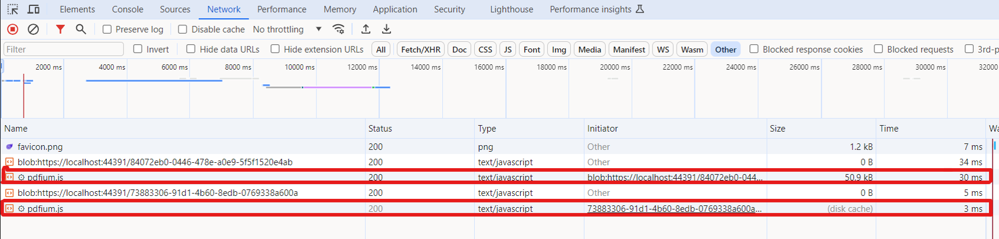

# Improve the performance using CDN in Blazor SfPdfViewer component

When all the JavaScript files in the sample are referenced from the application's hosted location or NuGet location, each time we fetch them from that location, causing delays in fetching the script files. This delay can potentially slow down component rendering. To mitigate this performance issue, you can reference the script from a **CDN**. If the file is not available in the browser cache, it will be retrieved only from the hosted location. Subsequent fetches will retrieve the script file from the browser cache unless the file has been modified.

The Syncfusion's Blazor SfPdfViewer component allows to improve performance by referring the below **CDN** link in **~/Pages/Layout.cshtml** or **~/Pages/_Host.cshtml** file.


```html

<head>
    <!-- Syncfusion Blazor PDF Viewer (Next Gen) control's theme style sheet -->
    <link href="https://cdn.syncfusion.com/blazor/25.1.35/styles/bootstrap5.css" rel="stylesheet" />
    <!-- Syncfusion Blazor PDF Viewer (Next Gen) control's scripts -->
    <script src="https://cdn.syncfusion.com/blazor/25.1.35/syncfusion-blazor-sfpdfviewer.min.js" type="text/javascript"></script>
</head>

```

## File size when referencing the script from NuGet


## File size when referencing the script from CDN

