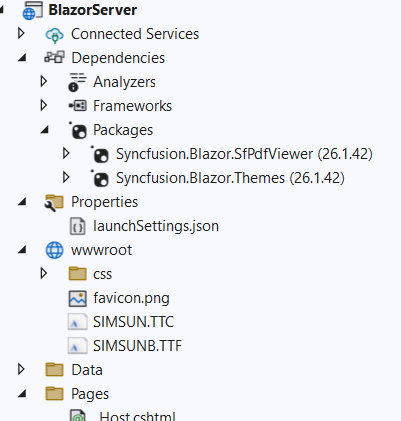

# Load Custom Fonts in a PDF Viewer

Syncfusion Blazor PDF Viewer utilizes Pdfium to extract the text and convert the PDF document as images. Pdfium supports a limited set of fonts by default. To expand this capability, [CustomFonts](https://help.syncfusion.com/cr/blazor/Syncfusion.Blazor.SfPdfViewer.PdfViewerBase.html#Syncfusion_Blazor_SfPdfViewer_PdfViewerBase_CustomFonts) can be used to load additional fonts that are not embedded within Pdfium.

To implement CustomFonts, follow these steps: 

1. Upload the font files you want to use into the `wwwroot` folder of your project.
   
2. Include the exact paths to these font files in the customFonts list for proper referencing. This ensures that Pdfium can utilize these fonts as needed.



The following code demonstrates how to load the CustomFonts to PDF Viewer.

```cshtml

<SfPdfViewer2 DocumentPath="https://cdn.syncfusion.com/content/pdf/pdf-succinctly.pdf"
              Height="100%"
              Width="100%" CustomFonts="@customFonts">
</SfPdfViewer2>
 

@code {

    public List<string> customFonts = new List<string> { "wwwroot/SIMSUN.TTC", "wwwroot/SIMSUNB.TTF"}

}
    
```
Below code snippet illustrates how to load a CustomFonts using a CDN link.

```cshtml

<SfPdfViewer2 DocumentPath="https://cdn.syncfusion.com/content/pdf/pdf-succinctly.pdf"
              Height="100%"
              Width="100%" CustomFonts="@customFonts">
</SfPdfViewer2>
 

@code {

     public List<string> customFonts = new List<string> { "https://cdn.jsdelivr.net/npm/arial-geo-bold@1.0.0/fonts/arial-geo-bold-webfont.ttf" };

}
    
```
[View sample in GitHub](https://github.com/SyncfusionExamples/blazor-pdf-viewer-examples/tree/master/Load%20and%20Save/Load%20custom%20fonts%20in%20PDF%20document).
