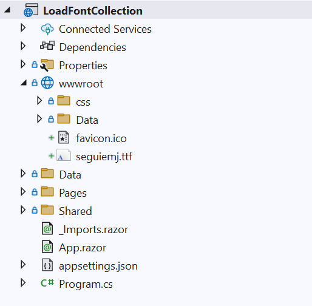

# Load Font collection in a PDF Viewer

In addition to adding a single custom font, the Syncfusion Blazor PDF Viewer also supports adding multiple fonts to the [FallbackFontCollection](https://help.syncfusion.com/cr/blazor/Syncfusion.Blazor.SfPdfViewer.PdfViewerBase.html#Syncfusion_Blazor_SfPdfViewer_PdfViewerBase_FallbackFontCollection). This is particularly useful when a PDF document utilizes various fonts that may not be embedded or supported by default on the viewing system. By configuring multiple fonts, you ensure that the document renders accurately, preserving its diverse font styles and special characters.

To implement FallbackFontCollection, follow these step: 

1. Upload the font files you want to use into the `wwwroot` folder of your project.



The following code demonstrates how to load the font collection to PDF Viewer.

```cshtml

<SfPdfViewer2 @ref="Viewer" 
              DocumentPath="https://cdn.syncfusion.com/content/pdf/pdf-succinctly.pdf"
              Height="100%"
              Width="100%">
    <PdfViewerEvents Created="@Created"></PdfViewerEvents>
</SfPdfViewer2>
 

@code {
    SfPdfViewer2 Viewer;
    
    public void Created()
    {
       Stream font = new MemoryStream(System.IO.File.ReadAllBytes("wwwroot/seguiemj.ttf"));
       Viewer.FallbackFontCollection.Add("seguiemj", font);
    }
}
    
```
[View sample in GitHub](https://github.com/SyncfusionExamples/blazor-pdf-viewer-examples/tree/master/Load%20and%20Save/Load%20font%20collection%20in%20PDF%20document).
