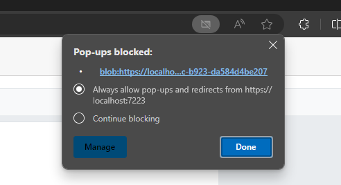

# Print large page documents in SfPdfViewer component in Blazor

This guide demonstrates how to implement a custom printing solution for large PDF documents in the Syncfusion<sup style="font-size:70%">&reg;</sup> Blazor SfPdfViewer component.

### Customize the Primary Toolbar
Add a custom print toolbar item to the SfPdfViewer's primary toolbar:

```cshtml
@using Syncfusion.Blazor;
@using Syncfusion.Blazor.SfPdfViewer;
@using Syncfusion.Blazor.Navigations;
@inject IJSRuntime JSRuntime;

<SfPdfViewer2 @ref="@Viewer" DocumentPath="@documentPath" Height="100%" Width="100%">
    <PdfViewerToolbarSettings CustomToolbarItems="@CustomToolbarItems" ToolbarItems="@ToolbarItems" />
    <PdfViewerEvents ToolbarClicked="ClickAction"></PdfViewerEvents>
</SfPdfViewer2>

@code {
    public SfPdfViewer2? Viewer { get; set; }
    public string? documentPath { get; set; } = "wwwroot/test.pdf";
  
    // Custom toolbar item for printing
    public List<PdfToolbarItem> CustomToolbarItems = new List<PdfToolbarItem>()
    {
        new PdfToolbarItem (){ Index = 1, Template = @GetTemplate("Print")}
    };

    // Default toolbar items list provided for the toolbaritems
    public List<Syncfusion.Blazor.SfPdfViewer.ToolbarItem> ToolbarItems = new List<Syncfusion.Blazor.SfPdfViewer.ToolbarItem>()
    {
        Syncfusion.Blazor.SfPdfViewer.ToolbarItem.OpenOption,
        Syncfusion.Blazor.SfPdfViewer.ToolbarItem.PageNavigationTool,
        Syncfusion.Blazor.SfPdfViewer.ToolbarItem.MagnificationTool,
        Syncfusion.Blazor.SfPdfViewer.ToolbarItem.SelectionTool,
        Syncfusion.Blazor.SfPdfViewer.ToolbarItem.PanTool,
        Syncfusion.Blazor.SfPdfViewer.ToolbarItem.UndoRedoTool,
        Syncfusion.Blazor.SfPdfViewer.ToolbarItem.AnnotationEditTool,
        Syncfusion.Blazor.SfPdfViewer.ToolbarItem.DownloadOption,
    };

    // Template for the custom print button
    private static RenderFragment GetTemplate(string name)
    {
        return __builder =>
        {
            if (name == "Print")
            {
                <ToolbarItem PrefixIcon="e-pv-print-document-icon e-pv-icon"
                             TooltipText="Print"
                             Id="print"
                             Align="ItemAlign.Right">
                </ToolbarItem>
            }
        };
    }
}

```

### Implement Print Handler
Create a click handler for the custom print toolbar item:

```cshtml
private async Task ClickAction(ClickEventArgs Item)
{
    if (Item.Item.Id == "print" && Viewer != null)
    {
        //get the byte array of loaded PDF
        byte[] bytes = await Viewer.GetDocumentAsync();

        //send the byte array to client
        await JSRuntime.InvokeVoidAsync("printPDF", bytes);
    }
}

```

### Add JavaScript Function
Add a `printPDF` function to your JavaScript file that converts the byte array into a Blob object and generates a Blob URL:

```javascript
// Convert the byte array to a Blob object
const blob = new Blob([byteArray], { type: 'application/pdf' });
// Generate a Blob URL for the loaded PDF
const blobUrl = URL.createObjectURL(blob);
```
The Blob URL is opened in a new browser window or tab, and the native window.print() function is called to execute the print operation.

```javascript
// Open the Blob URL in a new window or tab
const printWindow = window.open(blobUrl, '_blank');
// open the print window of browser
const tryPrint = () => {
    printWindow.focus();
    printWindow.print();
};
```

>N : Ensure that users have pop-ups enabled for your site in their browser settings, as this solution opens the PDF in a new window or tab for printing.


[View sample in GitHub](https://github.com/SyncfusionExamples/blazor-pdf-viewer-examples/tree/master/Print/Print%20Large%page%20document).

## See also

* [Primary Toolbar Customization in SfPdfViewer](../toolbar-customization.md)