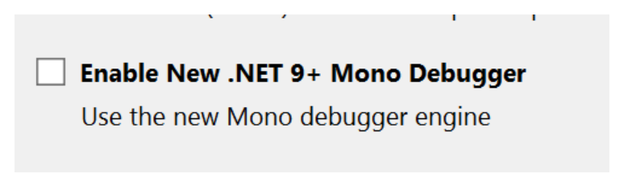

# Reduce slowness while running the WASM sample in Visual Studio

You may experience performance issues when running the WASM sample in Visual Studio. To improve performance and reduce slowness, we recommend disabling the new .NET 9+ Mono Debugger, as it can impact the execution speed in this mode.

Disabling the Mono Debugger should help resolve the performance issues and provide a smoother experience while debugging your WebAssembly project.

For detailed instructions on why disabling the Mono Debugger is recommended, and to follow the necessary steps, please refer to the links below:
  * [Crippled Visual Studio 2022 debugging performance on Blazor Web (WASM components) after updating to .NET 9](https://github.com/dotnet/aspnetcore/issues/58577)
  * [Performance Regression in Blazor WebAssembly with .NET 9](https://github.com/dotnet/aspnetcore/issues/58507)