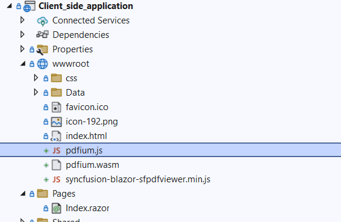

# Refer the PDFViewer script file in Blazor application

If you wish to add custom scripts to your application, please refer to the [Custom Resource Generator](https://blazor.syncfusion.com/documentation/common/custom-resource-generator) for generating the necessary resources. You need to include the [pdfium.js](https://github.com/SyncfusionExamples/blazor-pdf-viewer-examples/blob/master/Common/Pdfium%20files/pdfium.js) and [pdfium.wasm](https://github.com/SyncfusionExamples/blazor-pdf-viewer-examples/blob/master/Common/Pdfium%20files/pdfium.wasm) files in your application when referencing scripts externally.

To refer the script and pdfium files in your application, please refer the below image.
