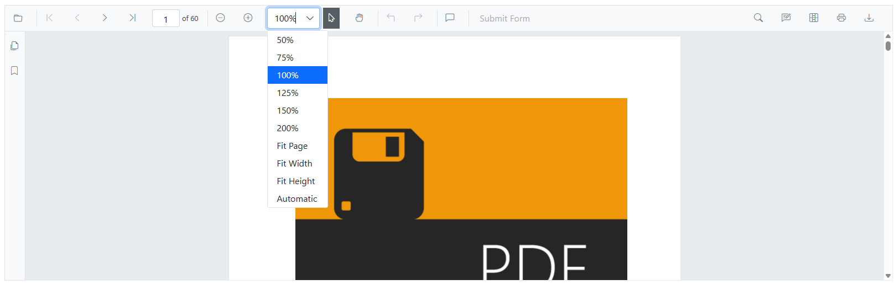
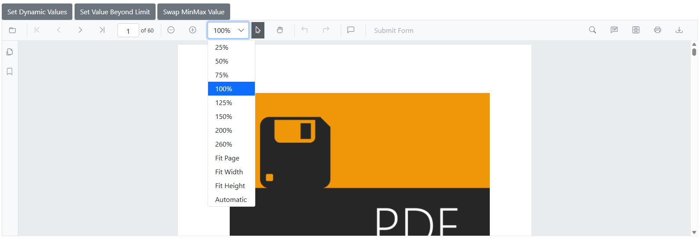
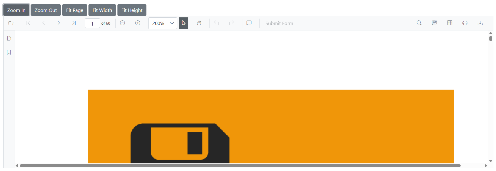
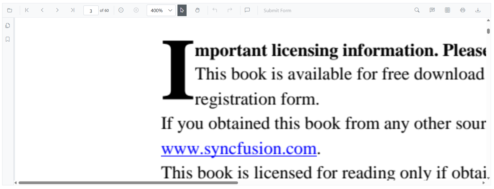

# Magnification in Blazor SfPdfViewer Component

The built-in toolbar of SfPdfViewer contains the following zooming options:

* **Zoom** **In**: Increases the zoom value (document magnification) from the current value by preset levels.
* **Zoom** **Out**: Decreases the zoom value from the current value by preset levels.
* **Zoom** **To**: Magnifies the pages to the specified zoom value.
* **Fit** **Page**: Fits the page entirely in the available document view port size.
* **Fit** **Width**: Fits the page to the width of the view port size.
* **Fit** **Height**: Fits the page to the height of the view port size.


## Enable or Disable Magnification in Blazor SfPdfViewer Component

You can enable or disable the magnification option in SfPdfViewer default toolbar by setting the [EnableMagnification](https://help.syncfusion.com/cr/blazor/Syncfusion.Blazor.SfPdfViewer.PdfViewerBase.html#Syncfusion_Blazor_SfPdfViewer_PdfViewerBase_EnableMagnification) property.

```cshtml

@using Syncfusion.Blazor.SfPdfViewer

<SfPdfViewer2 Height="100%"
              Width="100%"
              DocumentPath="@DocumentPath"
              EnableMagnification="false" />

@code{
    public string DocumentPath { get; set; } = "wwwroot/data/PDF_Succinctly.pdf";
}

```
## Programmatic Zoom Operations

Also, you can programmatically perform zooming operations as follows.

```cshtml

@using Syncfusion.Blazor.Buttons
@using Syncfusion.Blazor.Inputs
@using Syncfusion.Blazor.SfPdfViewer

<div style="display:inline-block">
    <SfButton OnClick="OnZoomInClick">Zoom In</SfButton>
</div>

<div style="display:inline-block">
    <SfButton OnClick="OnZoomOutClick">Zoom Out</SfButton>
</div>

<div style="display:inline-block">
    <SfTextBox @ref="@TextBox"></SfTextBox>
</div>

<div style="display:inline-block">
    <SfButton OnClick="OnZoomClick">Zoom</SfButton>
</div>

<div style="display:inline-block;">
    <SfButton OnClick="OnFitPageClick">Fit To Page</SfButton>
</div>

<div style="display:inline-block">
    <SfButton OnClick="OnFitWidthClick">Fit To Width</SfButton>
</div>

<div style="display:inline-block"> 
    <SfButton OnClick="OnFitHeightClick">Fit To Height</SfButton> 
</div> 

<SfPdfViewer2 Height="100%"
              Width="100%"
              DocumentPath="@DocumentPath"
              @ref="@Viewer" />

@code {
    SfPdfViewer2 Viewer;
    SfTextBox TextBox;
    public string DocumentPath { get; set; } = "wwwroot/data/PDF_Succinctly.pdf";

    public async void OnZoomInClick(MouseEventArgs args)
    {
        await Viewer.ZoomInAsync();
    }

    public async void OnZoomOutClick(MouseEventArgs args)
    {
        await Viewer.ZoomOutAsync();
    }

    public async void OnFitPageClick(MouseEventArgs args)
    {
        await Viewer.FitToPageAsync();
    }

    public async void OnZoomClick(MouseEventArgs args)
    {
        int zoomValue = int.Parse(TextBox.Value.ToString());
        await Viewer.ZoomToAsync(zoomValue);
    }

    public async void OnFitWidthClick(MouseEventArgs args)
    {
        await Viewer.FitToWidthAsync();
    }

    public async void OnFitHeightClick(MouseEventArgs args) 
    { 
        await Viewer.FitToHeightAsync(); 
    } 
}

```

N> SfPdfViewer can support zoom value ranges from 10% to 400%.

## Minimum and Maximum Zoom Values in Blazor SfPdfViewer Component

The SfPdfViewer control provides the options to configure minimum and maximum zoom levels using the [MinZoomValue](https://help.syncfusion.com/cr/blazor/Syncfusion.Blazor.SfPdfViewer.PdfViewerBase.html#Syncfusion_Blazor_SfPdfViewer_PdfViewerBase_MinZoomValue) and [MaxZoomValue](https://help.syncfusion.com/cr/blazor/Syncfusion.Blazor.SfPdfViewer.PdfViewerBase.html#Syncfusion_Blazor_SfPdfViewer_PdfViewerBase_MaxZoomValue) properties. These properties allow developers to define and control the zoom range, enhancing customization and user experience by:

* Defining a specific zoom range for better usability
* Preventing excessive zooming that may distort content or impact performance
* Ensuring readability on smaller screens
* Maintaining consistent zoom behavior across different devices

### Setting minimum and maximum zoom values

The zoom limits can be configured using the [MinZoomValue](https://help.syncfusion.com/cr/blazor/Syncfusion.Blazor.SfPdfViewer.PdfViewerBase.html#Syncfusion_Blazor_SfPdfViewer_PdfViewerBase_MinZoomValue) and [MaxZoomValue](https://help.syncfusion.com/cr/blazor/Syncfusion.Blazor.SfPdfViewer.PdfViewerBase.html#Syncfusion_Blazor_SfPdfViewer_PdfViewerBase_MaxZoomValue) properties during component initialization. These properties accept integer values representing the zoom percentage.

N> SfPdfViewer  can support zoom value ranges from 10% to 400%.

### Basic usage of Minimum and Maximum Zoom Values

```cshtml

@using Syncfusion.Blazor.SfPdfViewer

<SfPdfViewer2 DocumentPath="@DocumentPath"
              MinZoomValue="50"
              MaxZoomValue="200"
              Width="100%"
              Height="100%">
</SfPdfViewer2>

@code {
    private string DocumentPath { get; set; } = "wwwroot/Data/PDF_Succinctly.pdf";
}

```

Refer to the Image below for details.




### Zoom range scenarios

* Limit zoom functionality to a specific range for better readability and usability.

* Prevent excessive zooming to avoid distortion or performance issues.

* Ensure readability on smaller screens by setting a minimum zoom limit.

### Invalid input handling

The SfPdfViewer automatically handles invalid input values:

* **Values below 1**: Automatically fallback to default minimum (10)
* **MinZoomValue > MaxZoomValue**: MaxZoomValue will be adjusted to match MinZoomValue

### Dynamic zoom value configuration

You can dynamically change the minimum and maximum zoom values during runtime.

```cshtml

@using Syncfusion.Blazor.SfPdfViewer
@using Syncfusion.Blazor.Buttons

<SfButton OnClick="SetDynamicValues">Set Dynamic Values</SfButton>
<SfButton OnClick="SetValueBeyondLimit">Set Value Beyond Limit</SfButton>
<SfButton OnClick="SwapMinMaxValue">Swap MinMax Value</SfButton>

<SfPdfViewer2 @ref="viewer" 
              DocumentPath="@DocumentPath" 
              Height="100%" 
              Width="100%" 
              MaxZoomValue="@maxZoom" 
              MinZoomValue="@minZoom">
</SfPdfViewer2>

@code {
    public SfPdfViewer2? viewer;
    private string DocumentPath { get; set; } = "wwwroot/Data/PDF_Succinctly.pdf";

    public int maxZoom = 200;
    public int minZoom = 50;

    public void SetDynamicValues()
    {
        maxZoom = 260;
        minZoom = 25;
    }

    public void SetValueBeyondLimit()
    {
        maxZoom = 500; // Beyond default limit
        minZoom = 2;   // Beyond default limit
    }

    public void SwapMinMaxValue()
    {
        maxZoom = 50;  // Less than minZoom
        minZoom = 200; // Greater than maxZoom
    }
}

```

Refer to the Image below for details.



### Integration with zoom operations

The zoom limits work seamlessly with all zoom operations including programmatic zoom methods.

```cshtml

@using Syncfusion.Blazor.SfPdfViewer
@using Syncfusion.Blazor.Buttons

<SfButton OnClick="OnZoomInClick">Zoom In</SfButton>
<SfButton OnClick="OnZoomOutClick">Zoom Out</SfButton>
<SfButton OnClick="OnFitPageClick">Fit Page</SfButton>
<SfButton OnClick="OnFitWidthClick">Fit Width</SfButton>
<SfButton OnClick="OnFitHeightClick">Fit Height</SfButton>

<SfPdfViewer2 @ref="viewer" 
              DocumentPath="@DocumentPath" 
              Height="100%" 
              Width="100%" 
              MaxZoomValue="200" 
              MinZoomValue="50">
</SfPdfViewer2>

@code {
    public SfPdfViewer2? viewer;
    private string DocumentPath { get; set; } = "wwwroot/Data/PDF_Succinctly.pdf";

    public async void OnZoomInClick()
    {
        await viewer.ZoomInAsync();
    }

    public async void OnZoomOutClick()
    {
        await viewer.ZoomOutAsync();
    }

    public async void OnFitPageClick()
    {
        await viewer.FitToPageAsync();
    }

    public async void OnFitWidthClick()
    {
        await viewer.FitToWidthAsync();
    }

    public async void OnFitHeightClick() 
    { 
        await viewer.FitToHeightAsync();
    } 
}

```

Refer to the Image below for details.



### Integration with tile rendering

The zoom limits work seamlessly with tile rendering for enhanced performance at high zoom levels.

```cshtml

@using Syncfusion.Blazor.SfPdfViewer
@using Syncfusion.Blazor.Buttons

<SfButton OnClick="EnableTileRendering">Enable Tile Rendering</SfButton>

<SfPdfViewer2 @ref="viewer" 
              DocumentPath="@DocumentPath" 
              Height="100%" 
              Width="100%" 
              MaxZoomValue="500" 
              MinZoomValue="25">
    <PdfViewerTileRenderingSettings EnableTileRendering="enableTile" 
                                   X="@xValue" 
                                   Y="@yValue">
    </PdfViewerTileRenderingSettings>
</SfPdfViewer2>

@code {
    public SfPdfViewer2? viewer;
    public bool enableTile = false;
    public int xValue = 3;
    public int yValue = 3;
    private string DocumentPath { get; set; } = "wwwroot/Data/PDF_Succinctly.pdf";

    public void EnableTileRendering()
    {
        enableTile = true;
    }
}
```

## Optimizing Zoom Performance with RestrictZoomRequest

The SfPdfViewer provides the [RestrictZoomRequest](https://help.syncfusion.com/cr/blazor/Syncfusion.Blazor.SfPdfViewer.PdfViewerBase.html#Syncfusion_Blazor_SfPdfViewer_PdfViewerBase_RestrictZoomRequest) property to optimize performance during zoom operations. This property controls how page images are regenerated on the client-side during zoom changes.

### RestrictZoomRequest Property

**Property Value**: A boolean value that controls how images are regenerated during zoom operations. The default value is false.

* When set to `true`: A single image is generated at 100% zoom and reused across all zoom levels. This eliminates the need for image regeneration during zoom interactions, thereby reducing client-side processing and enhancing overall performance, particularly on devices with limited resources. However, this may result in a slight reduction in image clarity at zoom levels other than 100%.
* When set to `false` (default): Page images are regenerated for each zoom level, providing a smoother and more visually accurate zooming experience at the cost of increased client-side processing.

### Basic Usage of RestrictZoomRequest in Blazor SfPdfViewer Component

```cshtml

@using Syncfusion.Blazor.SfPdfViewer

<SfPdfViewer2 DocumentPath="@DocumentPath"
              Height="600px"
              Width="100%"
              RestrictZoomRequest="true">
</SfPdfViewer2>

@code {
    private string DocumentPath { get; set; } = "https://cdn.syncfusion.com/content/pdf/pdf-succinctly.pdf";
}

```

Refer to the Image below for details.



## See also

* [Navigation in Blazor SfPdfViewer Component](./navigation)