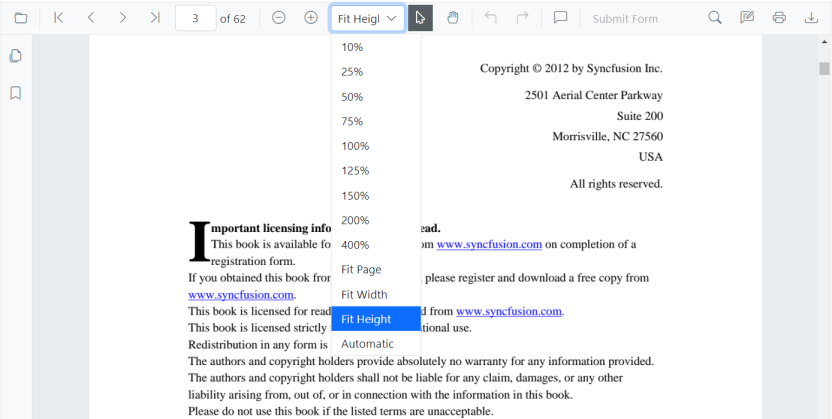

# Magnification in Blazor SfPdfViewer Component

The built-in toolbar of SfPdfViewer contains the following zooming options:

* **Zoom** **In**: Increases the zoom value (document magnification) from the current value by preset levels.
* **Zoom** **Out**: Decreases the zoom value from the current value by preset levels.
* **Zoom** **To**: Magnifies the pages to the specified zoom value.
* **Fit** **Page**: Fits the page entirely in the available document view port size.
* **Fit** **Width**: Fits the page to the width of the view port size.
* **Fit** **Height**: Fits the page to the height of the view port size.



You can enable or disable the magnification option in SfPdfViewer default toolbar by setting the `EnableMagnification` property.

```cshtml

@using Syncfusion.Blazor.SfPdfViewer

<SfPdfViewer2 Height="100%"
              Width="100%"
              DocumentPath="@DocumentPath"
              EnableMagnification="false" />

@code{
    public string DocumentPath { get; set; } = "wwwroot/data/PDF_Succinctly.pdf";
}

```

Also, you can programmatically perform zooming operations as follows.

```cshtml

@using Syncfusion.Blazor.Buttons
@using Syncfusion.Blazor.Inputs
@using Syncfusion.Blazor.SfPdfViewer

<div style="display:inline-block">
    <SfButton OnClick="OnZoomInClick">Zoom In</SfButton>
</div>

<div style="display:inline-block">
    <SfButton OnClick="OnZoomOutClick">Zoom Out</SfButton>
</div>

<div style="display:inline-block">
    <SfTextBox @ref="@TextBox"></SfTextBox>
</div>

<div style="display:inline-block">
    <SfButton OnClick="OnZoomClick">Zoom</SfButton>
</div>

<div style="display:inline-block;">
    <SfButton OnClick="OnFitPageClick">Fit To Page</SfButton>
</div>

<div style="display:inline-block">
    <SfButton OnClick="OnFitWidthClick">Fit To Width</SfButton>
</div>

<div style="display:inline-block"> 
    <SfButton OnClick="OnFitHeightClick">Fit To Height</SfButton> 
</div> 

<SfPdfViewer2 Height="100%"
              Width="100%"
              DocumentPath="@DocumentPath"
              @ref="@Viewer" />

@code {
    SfPdfViewer2 Viewer;
    SfTextBox TextBox;
    public string DocumentPath { get; set; } = "wwwroot/data/PDF_Succinctly.pdf";

    public async void OnZoomInClick(MouseEventArgs args)
    {
        await Viewer.ZoomInAsync();
    }

    public async void OnZoomOutClick(MouseEventArgs args)
    {
        await Viewer.ZoomOutAsync();
    }

    public async void OnFitPageClick(MouseEventArgs args)
    {
        await Viewer.FitToPageAsync();
    }

    public async void OnZoomClick(MouseEventArgs args)
    {
        int zoomValue = int.Parse(TextBox.Value.ToString());
        await Viewer.ZoomToAsync(zoomValue);
    }

    public async void OnFitWidthClick(MouseEventArgs args)
    {
        await Viewer.FitToWidthAsync();
    }

    public async void OnFitHeightClick(MouseEventArgs args) 
    { 
        await Viewer.FitToHeightAsync(); 
    } 
}

```

N> SfPdfViewer  can support zoom value ranges from 10% to 400%.

## See also

* [Navigation in Blazor SfPdfViewer Component](./navigation)