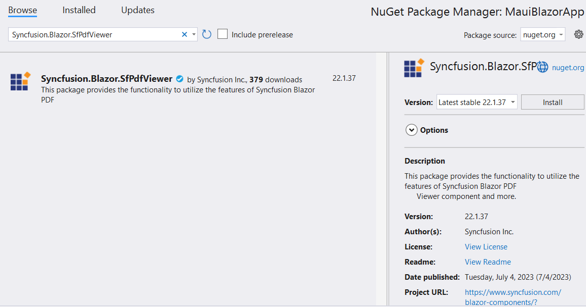
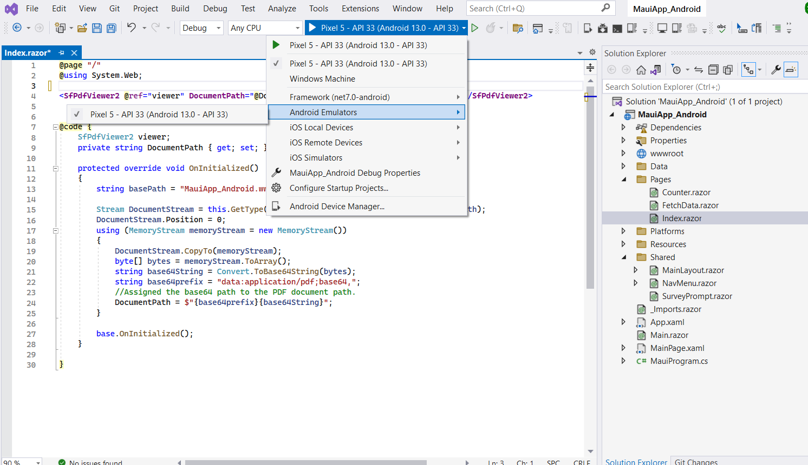

# How To Deploy PDF Viewer in Blazor android MAUI

This section briefly explains about how to deploy [Blazor SfPdfViewer](https://www.syncfusion.com/blazor-components/blazor-pdf-viewer) component in your blazor android MAUI App using Visual Studio.

## Prerequisites

To use the MAUI project templates, install the Mobile development with .NET extension for Visual Studio. For more details, refer [here](https://docs.microsoft.com/en-us/dotnet/MAUI/get-started/installation).

## Deploy SfPdfViewer into Blazor android MAUI application

1. Start Visual Studio and select **Create a new project**.

2. For a Blazor MAUI application experience, choose the **.NET MAUI Blazor App** template. Select **Next**. 

3. Provide a **Project Name** and confirm that the *Location* is correct. Select Next. 

4. In the **Additional information** dialog, set the target framework and create the project.

## Install Blazor SfPdfViewer NuGet package in Blazor android MAUI application

Syncfusion Blazor components are available in [nuget.org](https://www.nuget.org/packages?q=syncfusion.blazor). To use Syncfusion Blazor components in the application, add reference to the corresponding NuGet. Refer to [NuGet packages topic](https://blazor.syncfusion.com/documentation/nuget-packages) for available NuGet packages list with component details and [Benefits of using individual NuGet packages](https://blazor.syncfusion.com/documentation/nuget-packages#benefits-of-using-individual-nuget-packages).

Install the [Syncfusion.Blazor.SfPdfViewer](https://www.nuget.org/packages/Syncfusion.Blazor.SfPdfViewer) NuGet package as a reference to your project from the [NuGet.org](https://www.nuget.org/packages?q=syncfusion.blazor).

## Register Syncfusion Blazor Service

Open **~/_Imports.razor** file and import the **Syncfusion.Blazor.SfPdfViewer** namespaces.




@using Syncfusion.Blazor.SfPdfViewer




* Open the **~/MauiProgram.cs** file and register the Syncfusion Blazor Service.




using Microsoft.Extensions.Logging;
using MAUIApp1.Data;
using Syncfusion.Blazor;

namespace MAUIApp1;

public static class MAUIProgram
{
	public static MAUIApp CreateMAUIApp()
	{
		var builder = MAUIApp.CreateBuilder();
		builder.UseMAUIApp<App>().ConfigureFonts(fonts =>
			{
				fonts.AddFont("OpenSans-Regular.ttf", "OpenSansRegular");
			});
        builder.Services.AddMemoryCache();
        builder.Services.AddMAUIBlazorWebView();

#if DEBUG
		builder.Services.AddBlazorWebViewDeveloperTools();
		builder.Logging.AddDebug();
#endif
		builder.Services.AddSingleton<WeatherForecastService>();
        // Add Syncfusion Blazor service to the container.
        builder.Services.AddSyncfusionBlazor();
        return builder.Build();
	}
}




## Adding Style Sheet

Add the theme style sheet as below in the sever web app.

* Add the Syncfusion bootstrap5 theme in the `<head>` of the **~/wwwroot/index.html** file.




<head>
    <!-- Syncfusion Blazor SfPdfViewer controls theme style sheet -->
    <link href="_content/Syncfusion.Blazor.Themes/bootstrap5.css" rel="stylesheet" />
</head>




> Checkout the [Blazor Themes topic](https://blazor.syncfusion.com/documentation/appearance/themes) to learn different ways ([Static Web Assets](https://blazor.syncfusion.com/documentation/appearance/themes#static-web-assets), [CDN](https://blazor.syncfusion.com/documentation/appearance/themes#cdn-reference) and [CRG](https://blazor.syncfusion.com/documentation/common/custom-resource-generator)) to refer themes in Blazor application, and to have the expected appearance for Syncfusion Blazor components. Here, the theme is referred using [Static Web Assets](https://blazor.syncfusion.com/documentation/appearance/themes#static-web-assets). Refer to [Enable static web assets usage](https://blazor.syncfusion.com/documentation/appearance/themes#enable-static-web-assets-usage) topic to use static assets in your project.

## Adding Script Reference

 In this getting started walk-through, the required scripts are referred using [Static Web Assets](https://blazor.syncfusion.com/documentation/common/adding-script-references#static-web-assets) externally inside the `<head>` as follows. Refer to [Enable static web assets usage](https://blazor.syncfusion.com/documentation/common/adding-script-references#enable-static-web-assets-usage) topic to use static assets in your project.

* Add the script in the `<head>` of the **~/wwwroot/index.html** file.




<head>
    <!-- Syncfusion Blazor SfPdfViewer controls theme style sheet -->
    <link href="_content/Syncfusion.Blazor.Themes/bootstrap5.css" rel="stylesheet" />
    <!-- Syncfusion Blazor SfPdfViewer controls scripts -->
    
</head>




> Checkout [Adding Script Reference topic](https://blazor.syncfusion.com/documentation/common/adding-script-references) to learn different ways to add script reference in Blazor Application. 

> Syncfusion recommends to reference scripts using [Static Web Assets](https://blazor.syncfusion.com/documentation/common/adding-script-references#static-web-assets), [CDN](https://blazor.syncfusion.com/documentation/common/adding-script-references#cdn-reference) and [CRG](https://blazor.syncfusion.com/documentation/common/custom-resource-generator) by [disabling JavaScript isolation](https://blazor.syncfusion.com/documentation/common/adding-script-references#disable-javascript-isolation) for better loading performance of the Blazor application.

## Adding Blazor SfPdfViewer Component

Add the Syncfusion SfPdfViewer component in the **~/Pages/Index.razor** file.




@page "/"

<SfPdfViewer2 @ref="viewer" DocumentPath="@DocumentPath" Height="100%" Width="100%"></SfPdfViewer2>

@code {

    SfPdfViewer2 viewer;
    private string DocumentPath { get; set; } = "";

    protected override void OnInitialized()
    {
        string basePath = "MauiApp_Android.wwwroot.data.pdf_succinctly.pdf";
        Stream DocumentStream = this.GetType().Assembly.GetManifestResourceStream(basePath);
        DocumentStream.Position = 0;
        using (MemoryStream memoryStream = new MemoryStream())
        {
            DocumentStream.CopyTo(memoryStream);
            byte[] bytes = memoryStream.ToArray();
            string base64String = Convert.ToBase64String(bytes);
            string base64prefix = "data:application/pdf;base64,";
            //Assigned the base64 path to the PDF document path.
            DocumentPath = $"{base64prefix}{base64String}";
        }

        base.OnInitialized();
    }

}




The constructed document path, which contains the base64-encoded PDF document, is then assigned to the DocumentPath property of the SfPdfViewer component. The SfPdfViewer component will use this path to load and display the PDF document within the Blazor Android MAUI application.

N> If the `DocumentPath` property value is not provided, the SfPdfViewer component will be rendered without loading the PDF document. The users can then use the open option from the toolbar to browse and open the PDF as required.

## Run the PDF Viewer in Blazor android MAUI application

Run the sample in Android emulator mode and it will run Blazor android MAUI application

If you encounter any errors while launching the emulator, click on the error message and follow the prompts to install the required Android SDK licenses.

Ensure that you have set up the necessary dependencies, SDKs, and tools for Blazor Android MAUI.

Now launch the project again in emulator mode it will render the SfPdfViewer using Blazor android MAUI application

Press <kbd>Ctrl</kbd>+<kbd>F5</kbd> (Windows) or <kbd>⌘</kbd>+<kbd>F5</kbd> (macOS) to run the application. Then, the Syncfusion `Blazor SfPdfViewer` component will be rendered in the default web browser.

>[View Sample in GitHub]().