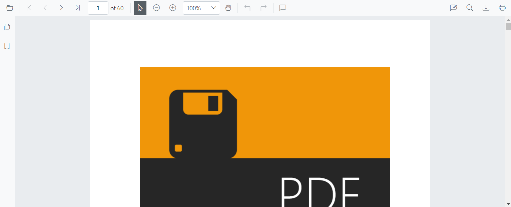
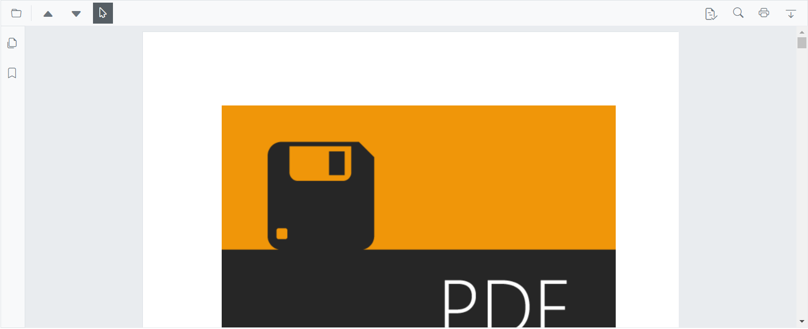
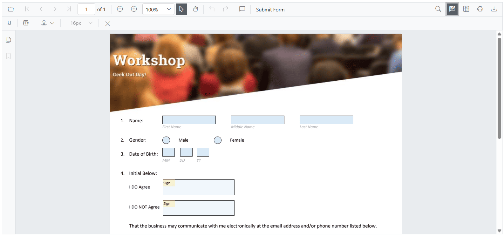
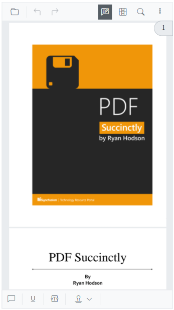
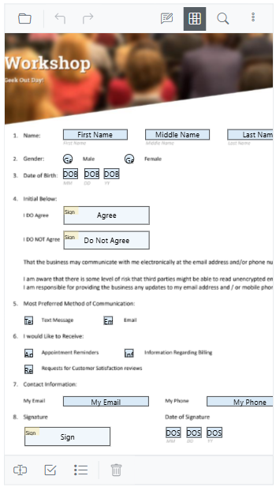
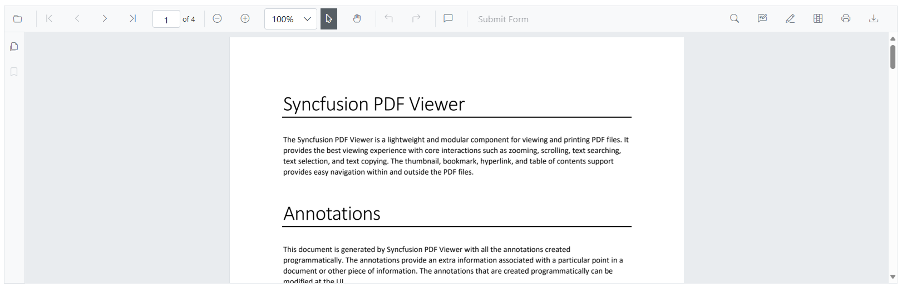
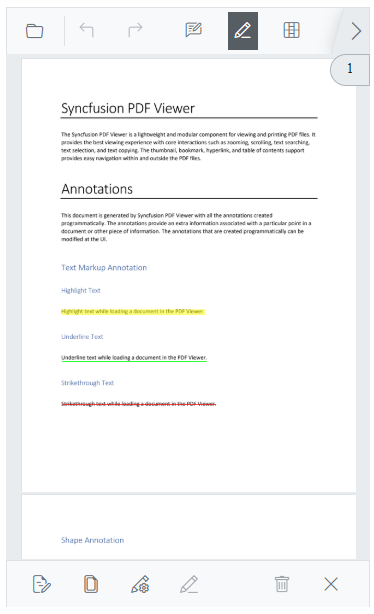
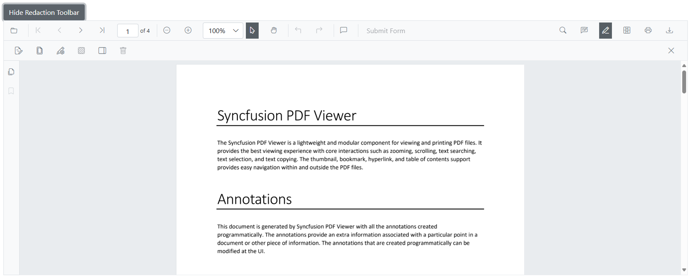

# Toolbar Customization in Blazor SfPdfViewer Component

The SfPdfViewer comes with a powerful built-in toolbar with the following important options,

* Open PDF file
* Page navigation
* Magnification
* Pan tool
* Text selection tool
* Text search
* Print
* Download
* Undo and redo
* Various annotation tools
* Bookmark panel
* Thumbnail panel


## Show or hide toolbar

At times, you might need to create your own toolbar. In that case, you need to hide the built-in toolbar. For that customization purpose, the SfPdfViewer control provides an option to show or hide the main (top) toolbar either by using the [EnableToolbar](https://help.syncfusion.com/cr/blazor/Syncfusion.Blazor.SfPdfViewer.PdfViewerBase.html#Syncfusion_Blazor_SfPdfViewer_PdfViewerBase_EnableToolbar) property or [ShowToolbar](https://help.syncfusion.com/cr/blazor/Syncfusion.Blazor.SfPdfViewer.PdfViewerBase.html#Syncfusion_Blazor_SfPdfViewer_PdfViewerBase_ShowToolbarAsync_System_Boolean_) method.

The following code snippet explains how to show or hide toolbar using the EnableToolbar property.

```cshtml

@using Syncfusion.Blazor.SfPdfViewer

<SfPdfViewer2 EnableToolbar="false" Height="100%" Width="100%" >
</SfPdfViewer2>
```

The following code snippet explains how to show or hide toolbar using the ShowToolbar method.

```cshtml

@using Syncfusion.Blazor.Buttons
@using Syncfusion.Blazor.SfPdfViewer

<SfButton @onclick="OnClick">Hide Toolbar</SfButton>

<SfPdfViewer2 Height="100%"
              Width="100%"
              @ref="@pdfViewer"
              DocumentPath="@DocumentPath">
</SfPdfViewer2>

@code {

    SfPdfViewer2 pdfViewer;
    public string DocumentPath { get; set; } = "wwwroot/Data/PDF_Succinctly.pdf";

    public async void OnClick(MouseEventArgs args)
    {
        await pdfViewer.ShowToolbarAsync(false);
    }
}

```

[View sample in GitHub](https://github.com/SyncfusionExamples/blazor-pdf-viewer-examples/tree/master/Toolbar/Custom%20Toolbar/Custom%20Toolbar).

## Show or hide navigation toolbar

Navigation toolbar is the side bar, which contains the options to expand and collapse the bookmark panel and page thumbnail panel. This navigation toolbar visibility can be toggled either by using the [EnableNavigationToolbar](https://help.syncfusion.com/cr/blazor/Syncfusion.Blazor.SfPdfViewer.PdfViewerBase.html#Syncfusion_Blazor_SfPdfViewer_PdfViewerBase_EnableNavigationToolbar) property or [ShowNavigationToolbar](https://help.syncfusion.com/cr/blazor/Syncfusion.Blazor.SfPdfViewer.PdfViewerBase.html#Syncfusion_Blazor_SfPdfViewer_PdfViewerBase_ShowAnnotationToolbar_System_Boolean_) method.

The following code snippet explains how to show or hide navigation toolbar using the EnableNavigationToolbar property.

```cshtml

@using Syncfusion.Blazor.SfPdfViewer

<SfPdfViewer2 EnableNavigationToolbar="false" Height="100%" Width="100%"></SfPdfViewer2>

```

The following code snippet explains how to show or hide navigation toolbar using the ShowNavigationToolbar method.

```cshtml

@using Syncfusion.Blazor.Buttons
@using Syncfusion.Blazor.SfPdfViewer

<SfButton @onclick="OnClick">Hide Navigation Toolbar</SfButton>
<SfPdfViewer2 EnableNavigationToolbar="true"
              Height="100%"
              Width="100%"
              @ref="@pdfViewer"
              DocumentPath="@DocumentPath">
</SfPdfViewer2>

@code {

    SfPdfViewer2 pdfViewer;
    public string DocumentPath { get; set; } = "wwwroot/Data/PDF_Succinctly.pdf";

    public void OnClick(MouseEventArgs args)
    {
        pdfViewer.ShowNavigationToolbar(false);
    }
}

```

## Show or hide the toolbar item

You can show or hide the toolbar items using the “PdfViewerToolbarSettings” class. The following code snippet explains how to show only the desired options in the toolbar. The resultant SfPdfViewer’s toolbar will have these options - Open file, magnification tools, comment tool, and download option.

```cshtml

@using Syncfusion.Blazor.SfPdfViewer

<SfPdfViewer2 Height="100%"
              Width="100%"
              DocumentPath="@DocumentPath">
    <PdfViewerToolbarSettings ToolbarItems="ToolbarItems"></PdfViewerToolbarSettings>
</SfPdfViewer2>

@code{

    public string DocumentPath { get; set; } = "wwwroot/data/PDF_Succinctly.pdf";

    List<ToolbarItem> ToolbarItems = new List<ToolbarItem>()
    {
        ToolbarItem.PageNavigationTool,
        ToolbarItem.MagnificationTool,
        ToolbarItem.CommentTool,
        ToolbarItem.SelectionTool,
        ToolbarItem.PanTool,
        ToolbarItem.UndoRedoTool,
        ToolbarItem.CommentTool,
        ToolbarItem.AnnotationEditTool,
        ToolbarItem.SearchOption,
        ToolbarItem.PrintOption,
        ToolbarItem.DownloadOption
    };
}
```

## Show or hide annotation toolbar

Annotation toolbar appears below the main toolbar, which contains the options to edit the annotations. This annotation toolbar visibility can be toggled either by using the [EnableAnnotationToolbar](https://help.syncfusion.com/cr/blazor/Syncfusion.Blazor.SfPdfViewer.PdfViewerBase.html#Syncfusion_Blazor_SfPdfViewer_PdfViewerBase_EnableAnnotationToolbar) or [ShowAnnotationToolbar](https://help.syncfusion.com/cr/blazor/Syncfusion.Blazor.SfPdfViewer.PdfViewerBase.html#Syncfusion_Blazor_SfPdfViewer_PdfViewerBase_ShowAnnotationToolbar_System_Boolean_) method.

The following code snippet explains how to show or hide annotation toolbar using the ShowAnnotationToolbar method.

```cshtml

@using Syncfusion.Blazor.SfPdfViewer

<SfPdfViewer2 @ref="viewer" Height="100%" Width="100%" DocumentPath="@documentPath">
    <PdfViewerEvents DocumentLoaded="DocumentLoad"></PdfViewerEvents>
</SfPdfViewer2>

@code {

    private string documentPath { get; set; } = "wwwroot/Data/PDF_Succinctly.pdf";

    SfPdfViewer2 viewer;

    //Invokes while loading document in the PDFViewer.
    public void DocumentLoad(LoadEventArgs args)
    {
        //Shows the annotation toolbar on initial loading.
        viewer.ShowAnnotationToolbar(true);
        //Code to hide the annoatation toolbar.
        //viewer.ShowAnnotationToolbar(false);
    }
}

```
[View sample in GitHub](https://github.com/SyncfusionExamples/blazor-pdf-viewer-examples/tree/master/Toolbar/Annotation%20Toolbar/Show%20or%20hide%20on%20loading).

## Primary Toolbar Customization

You have the capability to modify the primary toolbar options by rearranging them, disabling default options and adding new items and moreover, you can specify the index at which to add a new item within the existing toolbar options.

## Rearrange the default options of toolbar

You can adjust the order of the [ToolbarItems](https://help.syncfusion.com/cr/blazor/Syncfusion.Blazor.SfPdfViewer.PdfViewerToolbarSettings.html#Syncfusion_Blazor_SfPdfViewer_PdfViewerToolbarSettings_ToolbarItems) by rearranging how the items are listed. The toolbar will display the items based on the order in which they appear in the list

```cshtml

@using Syncfusion.Blazor.SfPdfViewer

<SfPdfViewer2 Height="100%" Width="100%" DocumentPath="@DocumentPath">
    <PdfViewerToolbarSettings ToolbarItems="ToolbarItems"></PdfViewerToolbarSettings>
</SfPdfViewer2>

@code {

    public string DocumentPath { get; set; } = "wwwroot/data/PDF_Succinctly.pdf";

    List<ToolbarItem> ToolbarItems = new List<ToolbarItem>()
    {
        ToolbarItem.OpenOption,
        ToolbarItem.PageNavigationTool,
        ToolbarItem.SelectionTool,
        ToolbarItem.MagnificationTool,
        ToolbarItem.PanTool,
        ToolbarItem.UndoRedoTool,
        ToolbarItem.CommentTool,
        ToolbarItem.AnnotationEditTool,
        ToolbarItem.SearchOption,
        ToolbarItem.DownloadOption,
        ToolbarItem.PrintOption,
    };
}

```



[View sample in GitHub](https://github.com/SyncfusionExamples/blazor-pdf-viewer-examples/tree/master/Toolbar/Custom%20Toolbar/Primary%20Custom%20Toolbar/Rearrange-Default-Options).

## Disable the default items and Add new items in Primary Toolbar

To customize the Primary Toolbar in the PDF Viewer, you can achieve this by setting the [ToolbarItems](https://help.syncfusion.com/cr/blazor/Syncfusion.Blazor.SfPdfViewer.PdfViewerToolbarSettings.html#Syncfusion_Blazor_SfPdfViewer_PdfViewerToolbarSettings_ToolbarItems) property to null and creating a list of [PdfToolbarItem](https://help.syncfusion.com/cr/blazor/Syncfusion.Blazor.SfPdfViewer.PdfToolbarItem.html#Syncfusion_Blazor_SfPdfViewer_PdfToolbarItem__ctor) objects. Each PdfToolbarItem contains a **RenderFragment** and an **Index** for positioning the toolbar items. Finally, assign this list to the [CustomToolbarItems](https://help.syncfusion.com/cr/blazor/Syncfusion.Blazor.SfPdfViewer.PdfViewerToolbarSettings.html#Syncfusion_Blazor_SfPdfViewer_PdfViewerToolbarSettings_CustomToolbarItems) property. 

```cshtml

@using Syncfusion.Blazor.SfPdfViewer; 
@using Syncfusion.Blazor.Navigations; 

<SfPdfViewer2 @ref="@Viewer" DocumentPath="@DocumentPath" Height="100%" Width="100%">  
    <PdfViewerToolbarSettings CustomToolbarItems="@CustomToolbarItems" ToolbarItems="null" />   
    <PdfViewerEvents ToolbarClicked="ClickAction"></PdfViewerEvents>              
</SfPdfViewer2>  

@code{ 
    private string DocumentPath { get; set; } = "wwwroot/Data/PDF_Succinctly.pdf"; 
    SfPdfViewer2 Viewer; 
    MemoryStream stream; 

    // List provide the position and element for the custom toolbar items
    public List<PdfToolbarItem> CustomToolbarItems = new List<PdfToolbarItem>() 
    {    
        new PdfToolbarItem (){ Index = 0, Template = @GetTemplate("PreviousPage")}, 
        new PdfToolbarItem (){ Index = 1, Template = @GetTemplate("NextPage")}, 
        new PdfToolbarItem (){ Index = 2, Template = @GetTemplate("Save")}, 
        new PdfToolbarItem (){ Index = 3, Template = @GetTemplate("Download")} 
    };  

    // Get the renderfragment element for the custom toolbaritems in the primary toolbar
    private static RenderFragment GetTemplate(string name)  
    {  
        return __builder => 
            {  
                if (name == "PreviousPage")
                { 
                    <ToolbarItem PrefixIcon="e-icons e-chevron-up" 
                          		Text="Previous Page" 
                                TooltipText="Previous Page" 
                                Id="previousPage" 
                                Align="ItemAlign.Left"> 
                    </ToolbarItem> 
                }  
                else if(name == "NextPage")
                { 
                    <ToolbarItem PrefixIcon="e-icons e-chevron-down" 
                                Text="Next Page" 
                                TooltipText="Next Page" 
                                Id="nextPage" 
                                Align="ItemAlign.Left"> 
                    </ToolbarItem> 
                }  
                else if(name == "Save")
                { 
                    <ToolbarItem PrefixIcon="e-icons e-save" 
                                Text="Save" 
                                TooltipText="Save Document" 
                                Id="save" 
                                Align="ItemAlign.Right"> 
                    </ToolbarItem>
                }  
                else if(name == "Download")
                { 
                    <ToolbarItem PrefixIcon="e-icons e-download" 
                                Text="Download"
                                TooltipText="Download" 
                                Id="download" 
                                Align="ItemAlign.Right"> 
                    </ToolbarItem> 
                }  
            };            
    }  

    // Click for the custom toolbaritems in the primary toolbar
    public async void ClickAction(ClickEventArgs Item) 
    {  
        if (Item.Item.Id == "previousPage") 
        {
            //Navigate to previous page of the PDF document.
            await Viewer.GoToPreviousPageAsync(); 
        }  
        else if (Item.Item.Id == "nextPage") 
        {
            //Navigate to next page page of the PDF document.
            await Viewer.GoToNextPageAsync(); 
        }  
        else if(Item.Item.Id == "save")  
        {
            //Gets the loaded PDF document with the changes.
            byte[] data = await Viewer.GetDocumentAsync();
            //Save the PDF document to a MemoryStream. 
            stream = new MemoryStream(data);
            //Load a PDF document from the MemoryStream. 
            await Viewer.LoadAsync(stream); 
        } 
        else if (Item.Item.Id == "download") 
        {
            //Downloads the PDF document
            await Viewer.DownloadAsync(); 
        } 
    }  
} 

```


[View sample in GitHub](https://github.com/SyncfusionExamples/blazor-pdf-viewer-examples/tree/master/Toolbar/Custom%20Toolbar/Primary%20Custom%20Toolbar/Without-Default-Options).

## How to customize the Primary Toolbar with default options

You can implement the both [ToolbarItems](https://help.syncfusion.com/cr/blazor/Syncfusion.Blazor.SfPdfViewer.PdfViewerToolbarSettings.html#Syncfusion_Blazor_SfPdfViewer_PdfViewerToolbarSettings_ToolbarItems) and [CustomToolbarItems](https://help.syncfusion.com/cr/blazor/Syncfusion.Blazor.SfPdfViewer.PdfViewerToolbarSettings.html#Syncfusion_Blazor_SfPdfViewer_PdfViewerToolbarSettings_CustomToolbarItems). The [CustomToolbarItems](https://help.syncfusion.com/cr/blazor/Syncfusion.Blazor.SfPdfViewer.PdfViewerToolbarSettings.html#Syncfusion_Blazor_SfPdfViewer_PdfViewerToolbarSettings_CustomToolbarItems) list allows you to specify items with their respective index positions, which are then incorporated into the ToolbarItems list accordingly. 

```cshtml

@using Syncfusion.Blazor.SfPdfViewer; 
@using Syncfusion.Blazor.Navigations;

<SfPdfViewer2 @ref="@Viewer" DocumentPath="@DocumentPath" Height="100%" Width="100%">  
         <PdfViewerToolbarSettings CustomToolbarItems="@CustomToolbarItems" ToolbarItems="@ToolbarItems" />   
         <PdfViewerEvents ToolbarClicked="ClickAction"></PdfViewerEvents>              
</SfPdfViewer2>  

@code { 
    private string DocumentPath { get; set; } = "wwwroot/Data/PDF_Succinctly.pdf"; 
    SfPdfViewer2 Viewer; 
    MemoryStream stream; 

    // List provide the position and element for the custom toolbar items
    public List<PdfToolbarItem> CustomToolbarItems = new List<PdfToolbarItem>() 
    {  
        new PdfToolbarItem (){ Index = 1, Template = @GetTemplate("PreviousPage")}, 
        new PdfToolbarItem (){ Index = 2, Template = @GetTemplate("NextPage")}, 
        new PdfToolbarItem (){ Index = 4, Template = @GetTemplate("Save")}, 
        new PdfToolbarItem (){ Index = 7, Template = @GetTemplate("Download")} 
    }; 

    // GetTemaplate and ClickAction function as same as the previous example

    // Default toolbar items list provided for the toolbaritems
    public List<Syncfusion.Blazor.SfPdfViewer.ToolbarItem> ToolbarItems = new List<Syncfusion.Blazor.SfPdfViewer.ToolbarItem>() 
    { 
        Syncfusion.Blazor.SfPdfViewer.ToolbarItem.OpenOption, 
        Syncfusion.Blazor.SfPdfViewer.ToolbarItem.SelectionTool, 
        Syncfusion.Blazor.SfPdfViewer.ToolbarItem.SearchOption,
        Syncfusion.Blazor.SfPdfViewer.ToolbarItem.PrintOption 
    }; 
} 

```


[View sample in GitHub](https://github.com/SyncfusionExamples/blazor-pdf-viewer-examples/tree/master/Toolbar/Custom%20Toolbar/Primary%20Custom%20Toolbar/With-Default-Options).

## How modify the toolbar Icons in the Primary Toolbar

You can customize the appearance of the toolbar icons. The below code illustrates how to create custom toolbar with custom toolbar icon.

```cshtml

@using Syncfusion.Blazor.SfPdfViewer; 
@using Syncfusion.Blazor.Navigations; 

<SfPdfViewer2 @ref="@Viewer" DocumentPath="@DocumentPath" Height="100%" Width="100%">  
    <PdfViewerToolbarSettings CustomToolbarItems="@CustomToolbarItems" ToolbarItems="@ToolbarItems" />   
    <PdfViewerEvents ToolbarClicked="ClickAction"></PdfViewerEvents>              
</SfPdfViewer2>  

@code { 
    private string DocumentPath { get; set; } = "wwwroot/Data/PDF_Succinctly.pdf"; 
    SfPdfViewer2 Viewer; 
    MemoryStream stream; 

    // List provide the position and element for the custom toolbar items
    public List<PdfToolbarItem> CustomToolbarItems = new List<PdfToolbarItem>() 
    {  
        new PdfToolbarItem (){ Index = 1, Template = @GetTemplate("PreviousPage")}, 
        new PdfToolbarItem (){ Index = 2, Template = @GetTemplate("NextPage")}, 
        new PdfToolbarItem (){ Index = 4, Template = @GetTemplate("Save")}, 
        new PdfToolbarItem (){ Index = 7, Template = @GetTemplate("Download")} 
    }; 

    // GetTemaplate and ClickAction function as same as the previous example

    // Default toolbar items list provided for the toolbaritems
    public List<Syncfusion.Blazor.SfPdfViewer.ToolbarItem> ToolbarItems = new List<Syncfusion.Blazor.SfPdfViewer.ToolbarItem>() 
    { 
        Syncfusion.Blazor.SfPdfViewer.ToolbarItem.OpenOption, 
        Syncfusion.Blazor.SfPdfViewer.ToolbarItem.SelectionTool, 
        Syncfusion.Blazor.SfPdfViewer.ToolbarItem.SearchOption,
        Syncfusion.Blazor.SfPdfViewer.ToolbarItem.PrintOption 
    };
} 

<style> 
    .e-icons.e-chevron-up::before {
        content: '\e87a';
    }

    .e-icons.e-chevron-down::before {
        content: '\e70d';
    }

    .e-icons.e-download::before {
        content: '\e7a0';
    }

    .e-icons.e-save::before {
        content: '\e7a8'
    }
</style> 

```


[View sample in GitHub](https://github.com/SyncfusionExamples/blazor-pdf-viewer-examples/tree/master/Toolbar/Custom%20Toolbar/Primary%20Custom%20Toolbar/Icon-Style-Change).

N> This is applicable only for custom toolbar.

## How to customize the Annotation Toolbar

The [`PdfViewerToolbarSettings`](https://help.syncfusion.com/cr/blazor/Syncfusion.Blazor.SfPdfViewer.PdfViewerToolbarSettings.html) in [SfPdfViewer](https://help.syncfusion.com/cr/blazor/Syncfusion.Blazor.SfPdfViewer.html) allows customization of the Annotation Toolbar by specifying which annotation tools should be displayed. The [`AnnotationToolbarItems`](https://help.syncfusion.com/cr/blazor/Syncfusion.Blazor.SfPdfViewer.PdfViewerToolbarSettings.html#Syncfusion_Blazor_SfPdfViewer_PdfViewerToolbarSettings_AnnotationToolbarItems) property accepts a list of [`AnnotationToolbarItem`](https://help.syncfusion.com/cr/blazor/Syncfusion.Blazor.SfPdfViewer.AnnotationToolbarItem.html) values, ensuring that only the selected tools are available while hiding others. This helps create a simplified and user-friendly toolbar based on the application's needs.

The following example demonstrates how to customize the Annotation Toolbar by specifying a selected set of tools using [`AnnotationToolbarItem`](https://help.syncfusion.com/cr/blazor/Syncfusion.Blazor.SfPdfViewer.AnnotationToolbarItem.html).

```cshtml
<!-- Container for the PDF Viewer -->
<div class="Pdf-viewer-container">
    <!-- SfPdfViewer2 component with Annotation Toolbar enabled -->
    <SfPdfViewer2 @ref="PdfViewerInstance" EnableFormDesigner="true" 
                  DocumentPath="wwwroot/data/Form_Designer.pdf"
                  Height="650px"
                  Width="100%">
                  
                  <!-- Configuring the Annotation Toolbar items -->
                  <PdfViewerToolbarSettings AnnotationToolbarItems="AnnotationToolbarItems"></PdfViewerToolbarSettings>
    </SfPdfViewer2>
</div>

@code {
    // Reference to the SfPdfViewer2 instance
    SfPdfViewer2 PdfViewerInstance { get; set; }

    // Define a list of annotation toolbar items to be displayed and usable
    List<AnnotationToolbarItem> AnnotationToolbarItems { get; set; } = new List<AnnotationToolbarItem>() 
    {
        AnnotationToolbarItem.UnderlineTool,
        AnnotationToolbarItem.StampAnnotationTool,
        AnnotationToolbarItem.FreeTextAnnotationTool,
        AnnotationToolbarItem.FontSizeAnnotationTool,
        AnnotationToolbarItem.CloseTool
    };
}
```
Refer to the image below for the desktop view.



Refer to the image below for the mobile view.



[View sample in GitHub](https://github.com/SyncfusionExamples/blazor-pdf-viewer-examples/blob/master/Form%20Designer/Components/Pages/CustomAnnotationToolbar.razor).

## How to customize the Form Designer Toolbar

The [`PdfViewerToolbarSettings`](https://help.syncfusion.com/cr/blazor/Syncfusion.Blazor.SfPdfViewer.PdfViewerToolbarSettings.html) component in [SfPdfViewer](https://help.syncfusion.com/cr/blazor/Syncfusion.Blazor.SfPdfViewer.html) enables customization of the Form Designer Toolbar by defining the available form design tools. The [`FormDesignerToolbarItems`](https://help.syncfusion.com/cr/blazor/Syncfusion.Blazor.SfPdfViewer.PdfViewerToolbarSettings.html#Syncfusion_Blazor_SfPdfViewer_PdfViewerToolbarSettings_FormDesignerToolbarItems) property takes a list of [`FormDesignerToolbarItem`](https://help.syncfusion.com/cr/blazor/Syncfusion.Blazor.SfPdfViewer.FormDesignerToolbarItem.html) values, allowing you to display only the necessary tools while hiding others. This ensures a more focused and user-friendly form designing experience.

The following example demonstrates how to customize the Form Designer Toolbar by configuring specific tools using [`FormDesignerToolbarItem`](https://help.syncfusion.com/cr/blazor/Syncfusion.Blazor.SfPdfViewer.FormDesignerToolbarItem.html).

```cshtml
<SfPdfViewer2 @ref="PdfViewerInstance" EnableFormDesigner="true" 
                  DocumentPath="wwwroot/data/Form_Designer.pdf"
                  Height="650px"
                  Width="100%">
                  
                  <!-- Configuring the Form Designer Toolbar items -->
                  <PdfViewerToolbarSettings FormDesignerToolbarItems="FormDesignerToolbarItems"></PdfViewerToolbarSettings>
</SfPdfViewer2>

@code {
    // Reference to the SfPdfViewer2 instance
    SfPdfViewer2 PdfViewerInstance { get; set; }

    // Define a list of form designer toolbar items to be displayed and usable
    List<FormDesignerToolbarItem> FormDesignerToolbarItems { get; set; } = new List<FormDesignerToolbarItem>() 
    {
        FormDesignerToolbarItem.TextBox,   
        FormDesignerToolbarItem.CheckBox,  
        FormDesignerToolbarItem.ListBox,   
        FormDesignerToolbarItem.Delete    
    };
}
```

Refer to the image below for the desktop view.


Refer to the image below for the mobile view.



[View sample in GitHub](https://github.com/SyncfusionExamples/blazor-pdf-viewer-examples/blob/master/Form%20Designer/Components/Pages/CustomFormDesignerToolbar.razor).

## How to customize the  Redaction Toolbar

The **Redaction Toolbar** in the PDF Viewer allows users to mark and permanently redact sensitive content from a PDF document. This guide explains how to enable and customize the Redaction Toolbar for both desktop and mobile platforms, and how to control its visibility dynamically.

### Enabling the Redaction Toolbar on Desktop

To enable the Redaction Toolbar on desktop platforms, include the required `ToolbarItems` in the `SfPdfViewer2` component as shown below:

#### Code Example

```cshtml
@page "/"

<SfPdfViewer2 Height="100%" Width="100%" DocumentPath="Annotations.pdf">
    <PdfViewerToolbarSettings ToolbarItems="ToolbarItems"></PdfViewerToolbarSettings>
</SfPdfViewer2>

@code {
    private List<ToolbarItem> ToolbarItems = new List<ToolbarItem>();
    protected override void OnInitialized()
    {
        ToolbarItems = new List<ToolbarItem>()
        {
            ToolbarItem.OpenOption,
            ToolbarItem.PageNavigationTool,
            ToolbarItem.MagnificationTool,
            ToolbarItem.SelectionTool,
            ToolbarItem.PanTool,
            ToolbarItem.UndoRedoTool,
            ToolbarItem.CommentTool,
            ToolbarItem.SubmitForm,
            ToolbarItem.SearchOption,
            ToolbarItem.AnnotationEditTool,
            ToolbarItem.Redaction,              // Enables Redaction toolbar
            ToolbarItem.FormDesigner,
            ToolbarItem.PrintOption,
            ToolbarItem.DownloadOption
        };
    }
}
```
Refer to the image below for the desktop view.


### Enabling the Redaction Toolbar on Mobile

To enable the Redaction Toolbar in mobile view, use the `MobileToolbarItems` property as shown below:

#### Code Example

```cshtml
@page "/"

<SfPdfViewer2 Height="100%" Width="100%" DocumentPath="Annotations.pdf">
    <PdfViewerToolbarSettings MobileToolbarItems="MobileToolbarItems"></PdfViewerToolbarSettings>
</SfPdfViewer2>

@code {
    private List<MobileToolbarItem> MobileToolbarItems = new List<MobileToolbarItem>();
    protected override void OnInitialized()
    {
        MobileToolbarItems = new List<MobileToolbarItem>()
        {
            MobileToolbarItem.Open,
            MobileToolbarItem.UndoRedo,
            MobileToolbarItem.EditAnnotation,
            MobileToolbarItem.Redaction,        // Enables Redaction toolbar
            MobileToolbarItem.FormDesigner,
            MobileToolbarItem.Search
        };
    }
}
```

Refer to the image below for the mobile view.



## Showing or Hiding the Redaction Toolbar

The Redaction Toolbar in the Blazor PDF Viewer provides tools for applying redactions to PDF documents. Its visibility can be controlled either through the built-in toolbar interface or programmatically using the `ShowRedactionToolbar` API.

### Displaying the Redaction Toolbar Using the Toolbar Icon

When `ToolbarItem.Redaction` or `MobileToolbarItem.Redaction` is enabled, clicking the redaction icon in the main toolbar toggles the visibility of the Redaction Toolbar.

Refer to the Image below for details.


### Displaying the Redaction Toolbar Programmatically

The visibility of the Redaction Toolbar can also be controlled programmatically by invoking the `ShowRedactionToolbar` method of the SfPdfViewer component. This approach is suitable for scenarios where toolbar visibility must be managed based on application logic, user permissions, or contextual requirements.

The following example demonstrates how to toggle the visibility of the Redaction Toolbar using a button:

```cshtml
@page "/"

<SfButton @onclick="ToggleRedactionToolbar">
    @(isRedactionToolbarVisible ? "Hide Redaction Toolbar" : "Show Redaction Toolbar")
</SfButton>
<SfPdfViewer2 @ref="SfPdfViewer2" DocumentPath="wwwroot/data/Annotations.pdf" Width="100%" Height="600px" >
     <PdfViewerToolbarSettings ToolbarItems="ToolbarItems"></PdfViewerToolbarSettings>
</SfPdfViewer2>

@code {
    private SfPdfViewer2 SfPdfViewer2;
    private bool isRedactionToolbarVisible = false;
    private List<ToolbarItem> ToolbarItems = new List<ToolbarItem>();
    protected override void OnInitialized()
    {
        ToolbarItems = new List<ToolbarItem>()
        {
            ToolbarItem.OpenOption,
            ToolbarItem.PageNavigationTool,
            ToolbarItem.MagnificationTool,
            ToolbarItem.SelectionTool,
            ToolbarItem.PanTool,
            ToolbarItem.UndoRedoTool,
            ToolbarItem.CommentTool,
            ToolbarItem.SubmitForm,
            ToolbarItem.SearchOption,
            ToolbarItem.AnnotationEditTool,
            ToolbarItem.Redaction,              // Enables Redaction toolbar
            ToolbarItem.FormDesigner,
            ToolbarItem.PrintOption,
            ToolbarItem.DownloadOption
        };
    }
    private void ToggleRedactionToolbar()
    {
        isRedactionToolbarVisible = !isRedactionToolbarVisible;
        SfPdfViewer2.ShowRedactionToolbar(isRedactionToolbarVisible);
    }
}
```

Refer to the Image below for details.

