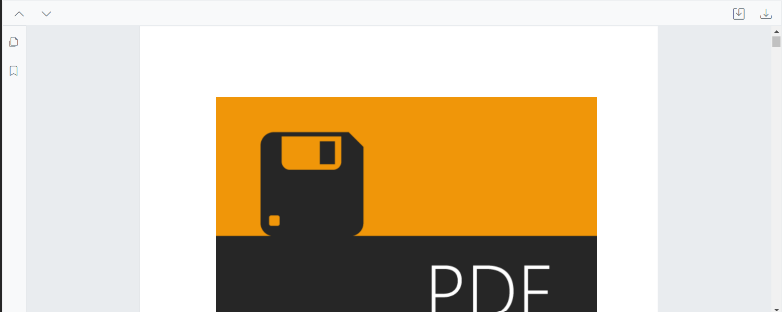
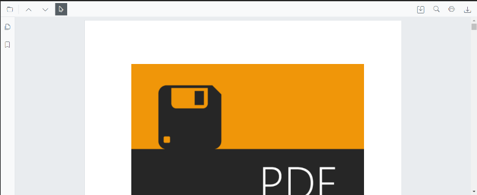

# Toolbar Customization in Blazor SfPdfViewer Component

The SfPdfViewer comes with a powerful built-in toolbar with the following important options,

* Open PDF file
* Page navigation
* Magnification
* Pan tool
* Text selection tool
* Text search
* Print
* Download
* Undo and redo
* Various annotation tools
* Bookmark panel
* Thumbnail panel


## Show or hide toolbar

At times, you might need to create your own toolbar. In that case, you need to hide the built-in toolbar. For that customization purpose, the SfPdfViewer control provides an option to show or hide the main (top) toolbar either by using the `EnableToolbar` property or `ShowToolbar` method.

The following code snippet explains how to show or hide toolbar using the EnableToolbar property.

```cshtml

@using Syncfusion.Blazor.SfPdfViewer

<SfPdfViewer2 EnableToolbar="false" Height="100%" Width="100%" >
</SfPdfViewer2>
```

The following code snippet explains how to show or hide toolbar using the ShowToolbar method.

```cshtml

@using Syncfusion.Blazor.Buttons
@using Syncfusion.Blazor.SfPdfViewer

<SfButton @onclick="OnClick">Hide Toolbar</SfButton>

<SfPdfViewer2 Height="100%"
              Width="100%"
              @ref="@pdfViewer"
              DocumentPath="@DocumentPath">
</SfPdfViewer2>

@code {

    SfPdfViewer2 pdfViewer;
    public string DocumentPath { get; set; } = "wwwroot/Data/PDF_Succinctly.pdf";

    public async void OnClick(MouseEventArgs args)
    {
        await pdfViewer.ShowToolbarAsync(false);
    }
}

```

[View sample in GitHub](https://github.com/SyncfusionExamples/blazor-pdf-viewer-examples/tree/master/Toolbar/Custom%20Toolbar/Custom%20Toolbar%20-%20%20SfPdfViewer).

## Show or hide navigation toolbar

Navigation toolbar is the side bar, which contains the options to expand and collapse the bookmark panel and page thumbnail panel. This navigation toolbar visibility can be toggled either by using the `EnableNavigationToolbar` property or `ShowNavigationToolbar` method.

The following code snippet explains how to show or hide navigation toolbar using the EnableNavigationToolbar property.

```cshtml

@using Syncfusion.Blazor.SfPdfViewer

<SfPdfViewer2 EnableNavigationToolbar="false" Height="100%" Width="100%"></SfPdfViewer2>

```

The following code snippet explains how to show or hide navigation toolbar using the ShowNavigationToolbar method.

```cshtml

@using Syncfusion.Blazor.Buttons
@using Syncfusion.Blazor.SfPdfViewer

<SfButton @onclick="OnClick">Hide Navigation Toolbar</SfButton>
<SfPdfViewer2 EnableNavigationToolbar="true"
              Height="100%"
              Width="100%"
              @ref="@pdfViewer"
              DocumentPath="@DocumentPath">
</SfPdfViewer2>

@code {

    SfPdfViewer2 pdfViewer;
    public string DocumentPath { get; set; } = "wwwroot/Data/PDF_Succinctly.pdf";

    public void OnClick(MouseEventArgs args)
    {
        pdfViewer.ShowNavigationToolbar(false);
    }
}

```

## Show or hide the toolbar item

You can show or hide the toolbar items using the “PdfViewerToolbarSettings” class. The following code snippet explains how to show only the desired options in the toolbar. The resultant SfPdfViewer’s toolbar will have these options - Open file, magnification tools, comment tool, and download option.

```cshtml

@using Syncfusion.Blazor.SfPdfViewer

<SfPdfViewer2 Height="100%"
              Width="100%"
              DocumentPath="@DocumentPath">
    <PdfViewerToolbarSettings ToolbarItems="ToolbarItems"></PdfViewerToolbarSettings>
</SfPdfViewer2>

@code{

    public string DocumentPath { get; set; } = "wwwroot/data/PDF_Succinctly.pdf";

    List<ToolbarItem> ToolbarItems = new List<ToolbarItem>()
    {
        ToolbarItem.PageNavigationTool,
        ToolbarItem.MagnificationTool,
        ToolbarItem.CommentTool,
        ToolbarItem.SelectionTool,
        ToolbarItem.PanTool,
        ToolbarItem.UndoRedoTool,
        ToolbarItem.CommentTool,
        ToolbarItem.AnnotationEditTool,
        ToolbarItem.SearchOption,
        ToolbarItem.PrintOption,
        ToolbarItem.DownloadOption
    };
}
```

## Show or hide annotation toolbar

Annotation toolbar appears below the main toolbar, which contains the options to edit the annotations. This annotation toolbar visibility can be toggled either by using the `EnableAnnotationToolbar` or `ShowAnnotationToolbar` method.

The following code snippet explains how to show or hide annotation toolbar using the ShowAnnotationToolbar method.

```cshtml

@using Syncfusion.Blazor.SfPdfViewer

<SfPdfViewer2 @ref="viewer" Height="100%" Width="100%" DocumentPath="@documentPath">
    <PdfViewerEvents DocumentLoaded="DocumentLoad"></PdfViewerEvents>
</SfPdfViewer2>

@code {

    private string documentPath { get; set; } = "wwwroot/Data/PDF_Succinctly.pdf";

    SfPdfViewer2 viewer;

    //Invokes while loading document in the PDFViewer.
    public void DocumentLoad(LoadEventArgs args)
    {
        //Shows the annotation toolbar on initial loading.
        viewer.ShowAnnotationToolbar(true);
        //Code to hide the annoatation toolbar.
        //viewer.ShowAnnotationToolbar(false);
    }
}

```
[View sample in GitHub](https://github.com/SyncfusionExamples/blazor-pdf-viewer-examples/tree/master/Toolbar/Annotation%20Toolbar/Show%20or%20hide%20on%20loading%20-%20SfPdfViewer).

## Primary Toolbar Customization

Unlock unprecedented control over your PDF viewing experience with the latest feature in our NextGen Blazor PDF Viewer: "Customizable Primary Toolbar". 
Now, you have the power to tailor their toolbar exactly to your needs, adding new items, hiding existing ones, and repositioning items for optimal workflow efficiency .

### Key Features:

* Add New Toolbar Items
    * Enhance your PDF Viewer's functionality by seamlessly integrating new toolbar items tailored to your specific requirements.
    * Integrate custom actions, such as annotation tools, bookmark management, or document navigation shortcuts, directly into your primary toolbar for quick and convenient access.

* Change Positions of Existing and New Toolbar Items
    * Take full control over your toolbar layout by rearranging the positions of existing toolbar items to better suit your preferences.
    * Organize your toolbar intuitively, placing frequently used tools front and center for easy access and improved productivity.

## How to customize primary toolbar without default options

You can Modify the Primary Toolbar in the PDF Viewer by Assign the `ToolbarItems` as null and Create PdfToolbarItem list which Contains RenderFragment and Index for the Toolbar Items. Assign the list to the property `CustomToolbarItems`.

The following code example show how to customize the primary toolbar without default items.

```cshtml

@using Syncfusion.Blazor.SfPdfViewer; 
@using Syncfusion.Blazor.Navigations; 

<SfPdfViewer2 @ref="@Viewer" DocumentPath="@DocumentPath" Height="100%" Width="100%">  
         <PdfViewerToolbarSettings CustomToolbarItems="@CustomToolbarItems" ToolbarItems="null" />   
         <PdfViewerEvents ToolbarClicked="ClickAction"></PdfViewerEvents>              
</SfPdfViewer2>  

@code{ 
    private string DocumentPath { get; set; } = "wwwroot/Data/PDF_Succinctly.pdf"; 
    SfPdfViewer2 Viewer; 
    MemoryStream stream; 

    // List provide the position and element for the custom toolbar items
    public List<PdfToolbarItem> CustomToolbarItems = new List<PdfToolbarItem>() 
    {    
        new PdfToolbarItem (){ Index = 0, Template = @GetTemplate("PreviousPage")}, 
        new PdfToolbarItem (){ Index = 1, Template = @GetTemplate("NextPage")}, 
        new PdfToolbarItem (){ Index = 2, Template = @GetTemplate("Save")}, 
        new PdfToolbarItem (){ Index = 3, Template = @GetTemplate("Download")} 
    };  

    // Get the renderfragment element for the custom toolbaritems in the primary toolbar
    private static RenderFragment GetTemplate(string name)  
    {  
        return __builder => 
            {  
                if (name == "PreviousPage")
                { 
                    <ToolbarItem PrefixIcon="e-icons e-chevron-up" 
                          		Text="Previous Page" 
                                TooltipText="Previous Page" 
                                Id="previousPage" 
                                Align="ItemAlign.Left"> 
                    </ToolbarItem> 
                }  
                else if(name == "NextPage")
                { 
                    <ToolbarItem PrefixIcon="e-icons e-chevron-down" 
                                Text="Next Page" 
                                TooltipText="Next Page" 
                                Id="nextPage" 
                                Align="ItemAlign.Left"> 
                    </ToolbarItem> 
                }  
                else if(name == "Save")
                { 
                    <ToolbarItem PrefixIcon="e-icons e-save" 
                                Text="Save" 
                                TooltipText="Save Document" 
                                Id="save" 
                                Align="ItemAlign.Right"> 
                    </ToolbarItem>
                }  
                else if(name == "Download")
                { 
                    <ToolbarItem PrefixIcon="e-icons e-download" 
                                Text="Download"
                                TooltipText="Download" 
                                Id="download" 
                                Align="ItemAlign.Right"> 
                    </ToolbarItem> 
                }  
            };            
    }  

    // Click for the custom toolbaritems in the primary toolbar
    public async void ClickAction(ClickEventArgs Item) 
    {  
        if (Item.Item.Id == "previousPage") 
        {  
            await Viewer.GoToPreviousPageAsync(); 
        }  
        else if (Item.Item.Id == "nextPage") 
        {  
            await Viewer.GoToNextPageAsync(); 
        }  
        else if(Item.Item.Id == "save")  
        {  
            byte[] data = await Viewer.GetDocumentAsync(); 
            stream = new MemoryStream(data); 
            await Viewer.LoadAsync(stream); 
        } 
        else if (Item.Item.Id == "download") 
        { 
            await Viewer.DownloadAsync(); 
        } 
    }  
} 

```


[View sample in GitHub](https://github.com/SyncfusionExamples/blazor-pdf-viewer-examples/tree/master/Toolbar/Custom%20Toolbar/Custom%20toolbar%20with%20save%20option%20-%20SfPdfViewer).

The following sample mimics all the options of the SfPdfViewer default toolbar in a custom toolbar along with the save button.

[View sample in GitHub](https://github.com/SyncfusionExamples/blazor-pdf-viewer-examples/tree/master/Toolbar/Custom%20Toolbar/Custom%20Toolbar%20-%20%20SfPdfViewer).

## How to customize the primary toolbar with default options

You can include both `ToolbarItems` and `CustomToolbarItems` within the PDF Viewer. The following code demonstrate how to add customized items between the default toolbar items by specifying the correct index value for adding them to the toolbar.

```cshtml

@using Syncfusion.Blazor.SfPdfViewer; 
@using Syncfusion.Blazor.Navigations;

<SfPdfViewer2 @ref="@Viewer" DocumentPath="@DocumentPath" Height="100%" Width="100%">  
         <PdfViewerToolbarSettings CustomToolbarItems="@CustomToolbarItems" ToolbarItems="@ToolbarItems" />   
         <PdfViewerEvents ToolbarClicked="ClickAction"></PdfViewerEvents>              
</SfPdfViewer2>  

@code { 
    private string DocumentPath { get; set; } = "wwwroot/Data/PDF_Succinctly.pdf"; 
    SfPdfViewer2 Viewer; 
    MemoryStream stream; 

    // List provide the position and element for the custom toolbar items
    public List<PdfToolbarItem> CustomToolbarItems = new List<PdfToolbarItem>() 
    {  
        new PdfToolbarItem (){ Index = 1, Template = @GetTemplate("PreviousPage")}, 
        new PdfToolbarItem (){ Index = 2, Template = @GetTemplate("NextPage")}, 
        new PdfToolbarItem (){ Index = 4, Template = @GetTemplate("Save")}, 
        new PdfToolbarItem (){ Index = 7, Template = @GetTemplate("Download")} 
    }; 

    // GetTemaplate and ClickAction function as same as the previous example

    // Default toolbar items list provided for the toolbaritems
    public List<Syncfusion.Blazor.SfPdfViewer.ToolbarItem> ToolbarItems = new List<Syncfusion.Blazor.SfPdfViewer.ToolbarItem>() 
    { 
        Syncfusion.Blazor.SfPdfViewer.ToolbarItem.OpenOption, 
        Syncfusion.Blazor.SfPdfViewer.ToolbarItem.SelectionTool, 
        Syncfusion.Blazor.SfPdfViewer.ToolbarItem.SearchOption,
        Syncfusion.Blazor.SfPdfViewer.ToolbarItem.PrintOption 
    }; 
} 

```


[View sample in GitHub](https://github.com/SyncfusionExamples/blazor-pdf-viewer-examples/tree/master/Toolbar/Custom%20Toolbar/Custom%20toolbar%20with%20PNG%20image%20-%20SfPdfViewer).

N> This is applicable only for custom toolbar.