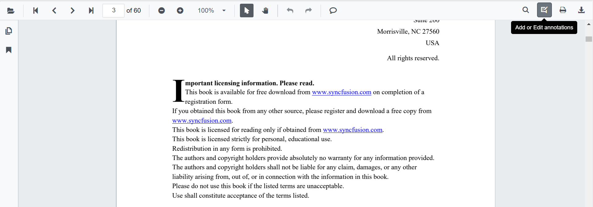
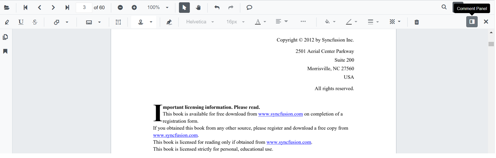

# Import and export annotation

The PDF Viewer control provides the support to import and export annotations using JSON object in the PDF document.

* Click the Add or Edit annotation button in the PDF Viewer toolbar.



* The annotation toolbar will appear.
* Click the Comment Panel button in the annotation toolbar.



* The comments panel will displayed.
* Click the **More Option** button in the comment panel container.


## Importing annotation to the PDF document

* Click the Add or Edit annotation button in the PDF Viewer toolbar.
* The annotation toolbar will appear.
* Click the Comment Panel button in the annotation toolbar.
* The comments panel will displayed.
* Click the **More Option** button in the comment panel container.
* Select the Import Annotations Option.


* Then the file explorer dialog will opened. Choose the JSON file to be imported in to the loaded PDF document.


## Importing annotation using PDF Viewer API

You can import annotations using JSON file or JSON object in code behind like the below code snippet

```csharp
@using Syncfusion.Blazor.PdfViewerServer
@using Syncfusion.Blazor.Buttons

<SfButton OnClick="@OnImportAnnotationsClick">Import Annotations</SfButton>
<SfPdfViewerServer @ref=Viewer Width="1060px" Height="500px" DocumentPath="@DocumentPath" />
@code{
        SfPdfViewerServer Viewer;
public string DocumentPath { get; set; } = "wwwroot/data/PDF_Succinctly.pdf";
    public void OnImportAnnotationsClick(MouseEventArgs args)
    {
        Viewer.ImportAnnotations("wwwroot/data/ImportedAnnotation.json"); //The json file has been placed inside the data folder.
    }
}
```

>The JSON file for importing the annotation should be placed in the desired location and the path has to be provided correctly.

## Exporting annotation from the PDF document

The PDF Viewer control provides the support to export the annotations as JSON file and JSON object using annotation toolbar.

* Click the Add or Edit annotation button in the PDF Viewer toolbar.
* The annotation toolbar will appear.
* Click the Comment Panel button in the annotation toolbar.
* The comments panel will displayed.
* Click the **More Option** button in the comment panel container.
* Select the Export Annotations Option.


>Export annotations will be in the disabled state when the loaded PDF document does not contain any annotations.

## Exporting annotation using PDF Viewer API

You can export annotations as JSON file in code behind like the following code snippet

```csharp
@using Syncfusion.Blazor.PdfViewerServer
@using Syncfusion.Blazor.Buttons

<SfButton OnClick="@OnExportAnnotationsClick">Export Annotations</SfButton>
<SfPdfViewerServer Width="1060px" Height="500px" DocumentPath="@DocumentPath" @ref="@Viewer" />
@code{
    SfPdfViewerServer Viewer;
    public string DocumentPath { get; set; } = "wwwroot/data/PDF_Succinctly.pdf";
    public void OnExportAnnotationsClick(MouseEventArgs args)
    {
        Viewer.ExportAnnotations();
    }
}
```