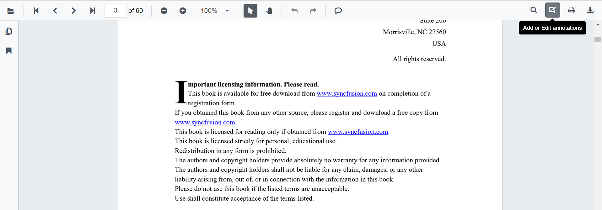
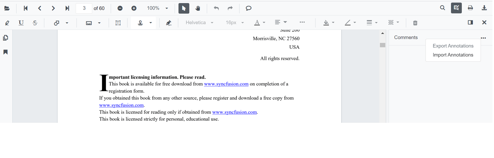
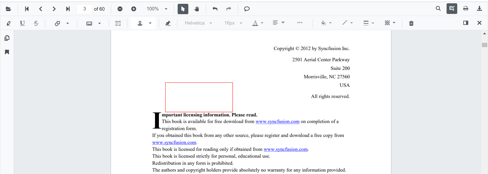
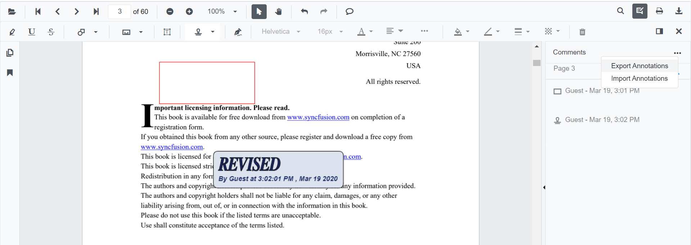

N> Syncfusion recommends using [Blazor PDF Viewer (NextGen)](https://blazor.syncfusion.com/documentation/pdfviewer-2/getting-started/server-side-application) Component which provides fast rendering of pages and improved performance. Also, there is no need of external Web service for processing the files and ease out the deployment complexity. It can be used in Blazor Server, WASM and MAUI applications without any changes.

# Import and Export annotations in Blazor PDF Viewer Component

The PDF Viewer control provides the support to import and export annotations using JSON object in the PDF document.

* Click the Add or Edit annotation button in the PDF Viewer toolbar.



* The annotation toolbar will appear.
* Click the Comment Panel button in the annotation toolbar.


* The comments panel will be displayed.
* Click the **More Option** button in the comment panel container.



## Importing annotation to the PDF document

* Click the Add or Edit annotation button in the PDF Viewer toolbar.
* The annotation toolbar will appear.
* Click the Comment Panel button in the annotation toolbar.
* The comments panel will displayed.
* Click the **More Option** button in the comment panel container.
* Select the Import Annotations Option.


* Then the file explorer dialog will be opened. Choose the JSON file to be imported into the loaded PDF document.



## Importing annotation using PDF Viewer API

You can import annotations using JSON file or JSON object in code behind like the following code snippet.

```cshtml
@using Syncfusion.Blazor.PdfViewerServer
@using Syncfusion.Blazor.Buttons

<SfButton OnClick="@OnImportAnnotationsClick">Import Annotations</SfButton>
<SfPdfViewerServer @ref=Viewer Width="1060px" Height="500px" DocumentPath="@DocumentPath" />
@code{
        SfPdfViewerServer Viewer;
public string DocumentPath { get; set; } = "wwwroot/data/PDF_Succinctly.pdf";
    public void OnImportAnnotationsClick(MouseEventArgs args)
    {
        Viewer.ImportAnnotations("wwwroot/data/ImportedAnnotation.json"); //The json file has been placed inside the data folder.
    }
}
```

N> [View sample in GitHub](https://github.com/SyncfusionExamples/blazor-pdf-viewer-examples/tree/master/Annotations/Import-Export/Annotations%20as%20JSON%20stream%20and%20file).

N>The JSON file for importing the annotation should be placed in the desired location and the path has to be provided correctly.

## Exporting annotation from the PDF document

The PDF Viewer control provides the support to export the annotations as JSON file and JSON object using annotation toolbar.

* Click the Add or Edit annotation button in the PDF Viewer toolbar.
* The annotation toolbar will appear.
* Click the Comment Panel button in the annotation toolbar.
* The comments panel will be displayed.
* Click the **More Option** button in the comment panel container.
* Select the Export Annotations Option.



N>Export annotations will be in the disabled state when the loaded PDF document does not contain any annotations.

## Exporting annotation using PDF Viewer API

You can export annotations as JSON file in code behind like the following code snippet.

```cshtml
@using Syncfusion.Blazor.PdfViewerServer
@using Syncfusion.Blazor.Buttons

<SfButton OnClick="@OnExportAnnotationsClick">Export Annotations</SfButton>
<SfPdfViewerServer Width="1060px" Height="500px" DocumentPath="@DocumentPath" @ref="@Viewer" />
@code{
    SfPdfViewerServer Viewer;
    public string DocumentPath { get; set; } = "wwwroot/data/PDF_Succinctly.pdf";
    public void OnExportAnnotationsClick(MouseEventArgs args)
    {
        Viewer.ExportAnnotations();
    }
}
```
N> [View sample in GitHub](https://github.com/SyncfusionExamples/blazor-pdf-viewer-examples/tree/master/Annotations/Import-Export/Annotations%20as%20JSON%20stream%20and%20file).

N> You can refer to the [Blazor PDF Viewer](https://www.syncfusion.com/blazor-components/blazor-pdf-viewer) feature tour page for its groundbreaking feature representations. You can also explore the [Blazor PDF Viewer example](https://blazor.syncfusion.com/demos/pdf-viewer/default-functionalities?theme=bootstrap5) to understand how to explain core features of PDF Viewer.