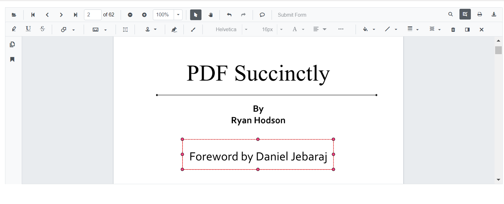

N> Syncfusion recommends using [Blazor PDF Viewer (NextGen)](https://blazor.syncfusion.com/documentation/pdfviewer-2/getting-started/server-side-application) Component which provides fast rendering of pages and improved performance. Also, there is no need of external Web service for processing the files and ease out the deployment complexity. It can be used in Blazor Server, WASM and MAUI applications without any changes.

# Shape annotations in Blazor PDF Viewer Component

The PDF Viewer control provides the options to add, edit and delete the shape annotations. The shape annotation types supported in the PDF Viewer control are:

* Line
* Arrow
* Rectangle
* Circle
* Polygon


## Adding a shape annotation to the PDF document

Shape annotations can be added to the PDF document using the annotation toolbar.

* Click the **Edit Annotation** button in the PDF Viewer toolbar. A toolbar appears below it.
* Click the **Shape Annotation** dropdown button. A dropdown pop-up will appear and shows the shape annotations to be added.
* Select the shape types to be added to the page in the dropdown pop-up. It enables the selected shape annotation mode.
* You can add the shapes over the pages of the PDF document.

In the pan mode, if the shape annotation mode is entered, the PDF Viewer control will switch to text select mode.


```cshtml
@using Syncfusion.Blazor.PdfViewerServer
@using Syncfusion.Blazor.Buttons
@using Syncfusion.Blazor.PdfViewer

<SfButton OnClick="OnClick">Click Here</SfButton>
<SfPdfViewerServer DocumentPath="@DocumentPath" @ref="viewer" Width="1060px" Height="500px">
</SfPdfViewerServer>

@code{
    SfPdfViewerServer viewer;

    public void OnClick(MouseEventArgs args)
    {
        viewer.SetAnnotationMode(AnnotationType.Circle);
    }
    private string DocumentPath { get; set; } = "wwwroot/Data/PDF_Succinctly.pdf";
}
```

## Editing the properties of the shape annotation

The fill color, stroke color, thickness and opacity of the shape annotation can be edited using the Edit color tool, Edit stroke color tool, Edit thickness tool and Edit opacity tool in the annotation toolbar.

### Editing fill color

The fill color of the annotation can be edited using the color palette provided in the Edit Color tool.


### Editing stroke color

The stroke color of the annotation can be edited using the color palette provided in the Edit Stroke Color tool.


### Editing thickness

The thickness of the border of the annotation can be edited using the range slider provided in the Edit Thickness tool.


### Editing opacity

The opacity of the annotation can be edited using the range slider provided in the Edit Opacity tool.


### Editing the line properties

The properties of the line shapes such as line and arrow annotations can be edited using the Line Properties window. It can be opened by selecting the Properties option in the context menu that appears on right clicking the line and arrow annotations.


## Setting default properties during control initialization

The properties of the shape annotations can be set before creating the control using LineSettings, ArrowSettings, RectangleSettings, CircleSettings, and PolygonSettings.

```cshtml
@using Syncfusion.Blazor
@using Syncfusion.Blazor.PdfViewerServer

<SfPdfViewerServer @ref="@viewer" DocumentPath="@DocumentPath" LineSettings="@LineSettings" ArrowSettings="@ArrowSettings" RectangleSettings="@RectangleSettings" CircleSettings="@CircleSettings" PolygonSettings="@PolygonSettings">
</SfPdfViewerServer>

@code{
    SfPdfViewerServer viewer;
    private string DocumentPath { get; set; } = "wwwroot/Data/PDF_Succinctly.pdf";
    PdfViewerLineSettings LineSettings = new PdfViewerLineSettings { FillColor="blue", Opacity = 0.6 ,StrokeColor="green"};
    PdfViewerArrowSettings ArrowSettings = new PdfViewerArrowSettings { FillColor="green", Opacity = 0.6 ,StrokeColor="blue"};
    PdfViewerRectangleSettings RectangleSettings = new PdfViewerRectangleSettings { FillColor="yellow", Opacity = 0.6 ,StrokeColor="orange" };
    PdfViewerCircleSettings CircleSettings = new PdfViewerCircleSettings { FillColor = "orange", Opacity = 0.6, StrokeColor = "pink" };
    PdfViewerPolygonSettings PolygonSettings = new PdfViewerPolygonSettings {FillColor="pink", Opacity = 0.6 ,StrokeColor="yellow" };
}
```

## Customize annotation selector

You can customize the appearance of the annotation's selector using the [AnnotationSelectorSettings](https://help.syncfusion.com/cr/blazor/Syncfusion.Blazor.PdfViewer.PdfViewerAnnotationSelectorSettings.html) property of the [PdfViewerRectangleSettings](https://help.syncfusion.com/cr/blazor/Syncfusion.Blazor.PdfViewer.PdfViewerRectangleSettings.html) class.

The following code illustrates how to change the resizer shape of the shape annotation's selector.

```cshtml
@using Syncfusion.Blazor.PdfViewer
@using Syncfusion.Blazor.PdfViewerServer

<SfPdfViewerServer @ref="viewer" DocumentPath="@DocumentPath" Height="500px" Width="100%" RectangleSettings=@rectangleSettings>    
</SfPdfViewerServer>


@code{
    //Sets the PDF document path for initial loading.
    private string DocumentPath { get; set; } = "wwwroot/data/PDF Succinctly.pdf";
    
    SfPdfViewerServer viewer;

    //Defines the settings of rectangle annotation.
    PdfViewerRectangleSettings rectangleSettings = new PdfViewerRectangleSettings
    {
        //Defines the annotation selector settings for the annotation.
        AnnotationSelectorSettings = new PdfViewerAnnotationSelectorSettings()
        {
            //Defines the shape of the resizer. By default it is square.
            ResizerShape = AnnotationResizerShape.Circle
        }
    };
    
}
```



N> [View sample in GitHub](https://github.com/SyncfusionExamples/blazor-pdf-viewer-examples/tree/master/Annotations/Selector/Customize%20annotation%20selector).

N> You can refer to the [Blazor PDF Viewer](https://www.syncfusion.com/blazor-components/blazor-pdf-viewer) feature tour page for its groundbreaking feature representations. You can also explore the [Blazor PDF Viewer example](https://blazor.syncfusion.com/demos/pdf-viewer/default-functionalities?theme=bootstrap5) to understand how to explain core features of PDF Viewer.