# Develop a Blazor PDF Viewer Component in Blazor Server Application and deploy it on AWS Elastic Beanstalk Linux

This section briefly explains about how to integrate [Blazor PDF Viewer](https://www.syncfusion.com/blazor-components/blazor-pdf-viewer) component in your Blazor Server App using Visual Studio and deploy it on AWS Elastic Beanstalk.

## Prerequisites

* [System requirements for Blazor components](https://blazor.syncfusion.com/documentation/system-requirements)

## Integrate PDF Viewer into Blazor Server App

1. Start Visual Studio and select **Create a new project**.
2. For a Blazor Server experience, choose the **Blazor Server App** template. Select **Next**.

3. Provide a **Project Name** and confirm that the *Location* is correct. Select Next.

4. In the **Additional information** dialog, set the target framework.


## Install Blazor PDF Viewer NuGet package in Blazor Server App to deploy in AWS Elastic Beanstalk Linux

To add Blazor PDF Viewer component in Blazor Server App and deploy it to AWS Elastic Beanstalk Linux, use `SfPdfViewerServer` component and theme style sheet in corresponding NuGet based on the operating system of the server you intend to host, as shown below.
* [Syncfusion.Blazor.PdfViewerServer.Linux](https://www.nuget.org/packages/Syncfusion.Blazor.PdfViewerServer.Linux)
* [Syncfusion.Blazor.Themes](https://www.nuget.org/packages/Syncfusion.Blazor.Themes/)
* [SkiaSharp.NativeAssets.Linux.NoDependencies](https://www.nuget.org/packages/SkiaSharp.NativeAssets.Linux.NoDependencies/)

## Register Syncfusion Blazor Service

Open **~/_Imports.razor** file and import the **Syncfusion.Blazor** and **Syncfusion.Blazor.PdfViewerServer** namespaces.




@using Syncfusion.Blazor
@using Syncfusion.Blazor.PdfViewerServer




Now, register the Syncfusion Blazor Service in the Blazor Server App. Here




using Microsoft.AspNetCore.Components;
using Microsoft.AspNetCore.Components.Web;
using Syncfusion.Blazor;

var builder = WebApplication.CreateBuilder(args);

// Add services to the container.
builder.Services.AddRazorPages();
builder.Services.AddServerSideBlazor().AddHubOptions(o => { o.MaximumReceiveMessageSize = 102400000; });
// Add Syncfusion Blazor service to the container.
builder.Services.AddSyncfusionBlazor();

var app = builder.Build();
....




## Adding Style Sheet and Script Reference

Add the theme style sheet and script reference as below in the Blazor Server App.
Refer script and style sheet in the `<head>` of the **~/Pages/_Layout.cshtml**.





<head>
    ....
    <!-- Syncfusion Blazor PDF Viewer controls theme style sheet -->
    <link href="_content/Syncfusion.Blazor.Themes/bootstrap5.css" rel="stylesheet" />
    <!-- Syncfusion Blazor PDF Viewer controls scripts -->
    <script src="_content/Syncfusion.Blazor.PdfViewer/scripts/syncfusion-blazor-pdfviewer.min.js" type="text/javascript"></script>
</head>




## Adding Blazor PDF Viewer Component

Add the Syncfusion PDF Viewer component in the **~/Pages/Index.razor** file.




@page "/"
<SfPdfViewerServer DocumentPath="@DocumentPath" Height="500px" Width="1060px" ></SfPdfViewerServer>

@code{
private string DocumentPath { get; set; } = "wwwroot/Data/PDF_Succinctly.pdf";
}




Press <kbd>Ctrl</kbd>+<kbd>F5</kbd> (Windows) or <kbd>⌘</kbd>+<kbd>F5</kbd> (macOS) to run the application. Then, the Syncfusion `Blazor PDF Viewer` component will be rendered in the default web browser.

## Steps to Configure the Linux VM used for deploying Blazor Server App in AWS Elastic Beanstalk Linux

1. Open the PuTTY app and Login as ec2-user in Linux VM after adding SSH Authentication credentials.
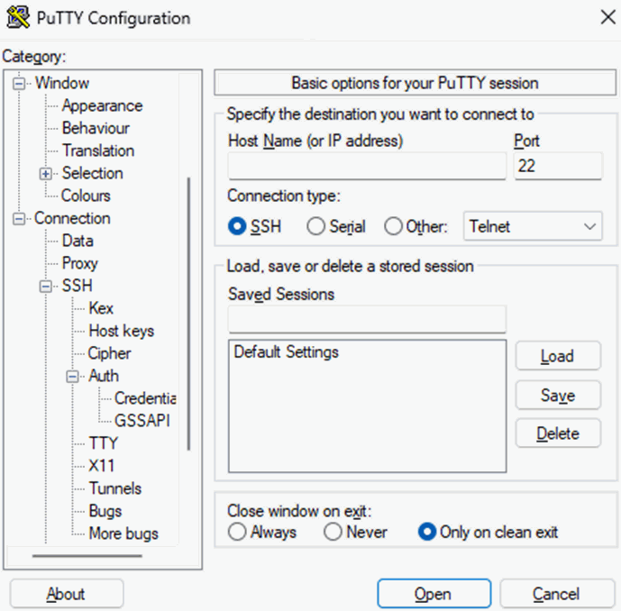
2. Navigate to root directory in the opened terminal and type ls for listing the directories
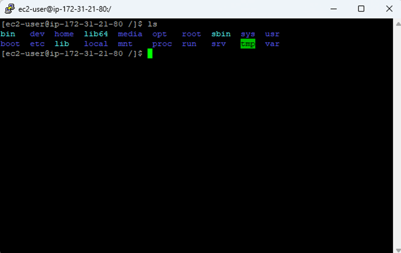
3. Install the dotnet framework for running the Blazor Server App in Linux by running the following code. 

```
    wget https://packages.microsoft.com/config/ubuntu/22.10/packages-microsoft-prod.deb -O packages-microsoft-prod.deb

    sudo dpkg -i packages-microsoft-prod.deb

    rm packages-microsoft-prod.deb

    sudo yum update && \
    sudo yum install -y dotnet-sdk-6.0

```
Check the comment dotnet --info and it should come as follows.

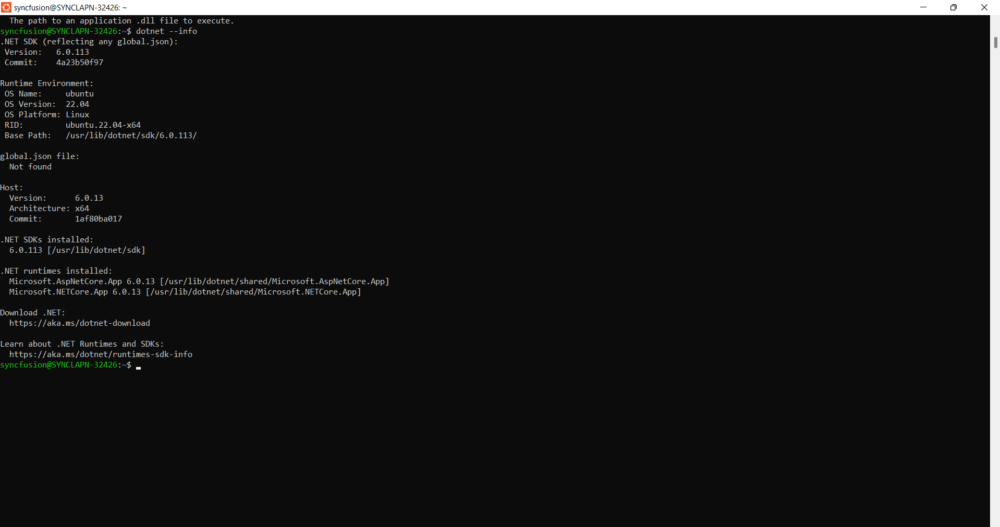

4. Navigate to lib64 directory and use the following commands

```
    sudo cp -u libdl.so.2 libdl.so

```

## Steps to publish as AWS Elastic Beanstalk

1. Right-click the project and select Publish to AWS Elastic Beanstalk (Legacy) option.
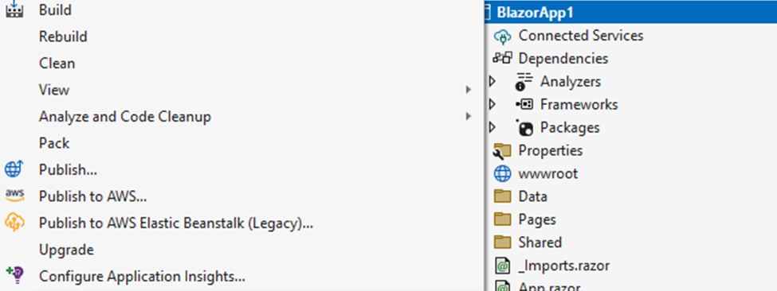
2. Select the Deployment Target as Create a new application environment and click Next button.
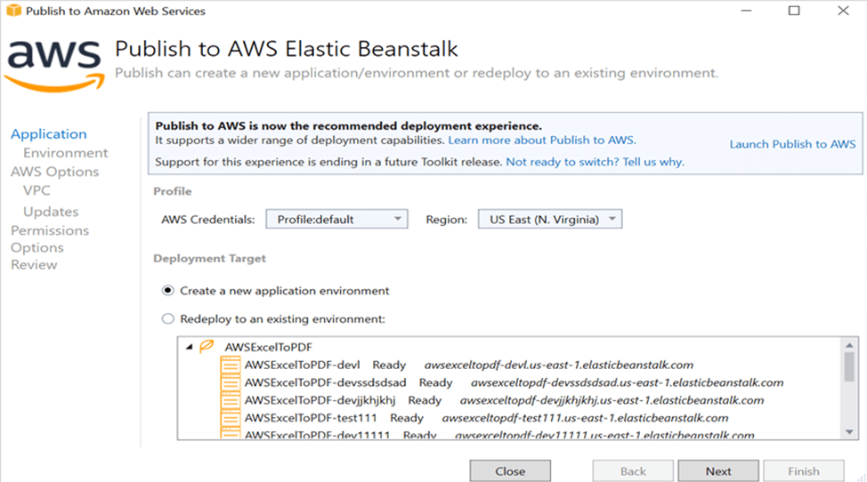
3. Choose the Environment Name in the dropdown list and the URL will be automatically assign and check the URL is available, if available click next otherwise change the URL
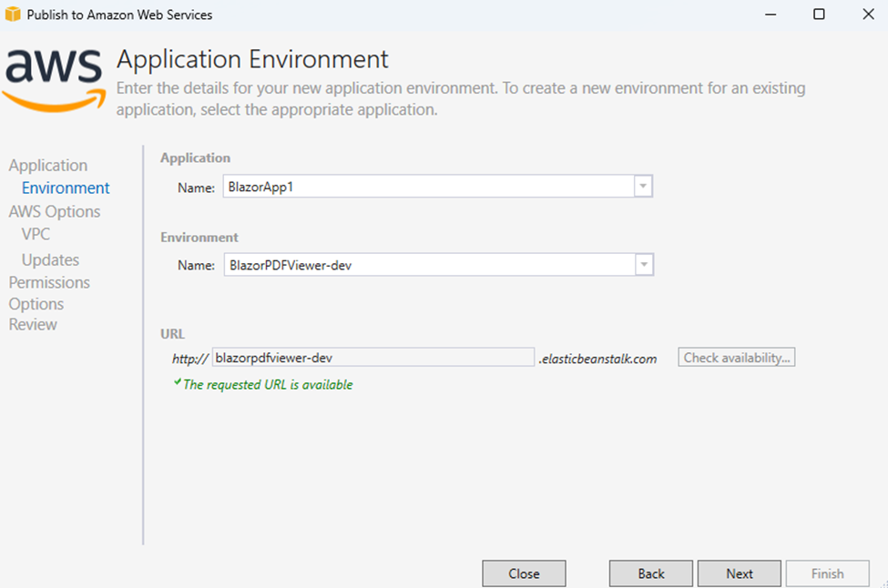
4. Select the instance type in t3a.micro from the dropdown list and click next.
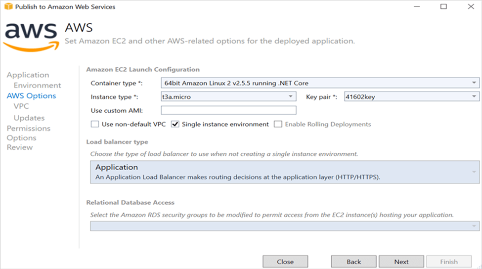
5. Click the Next button to proceed further.
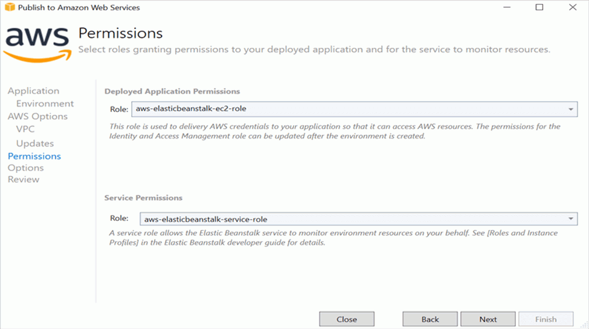
6. Click the Next button

7. Click the Deploy button to deploy the sample on AWS Elastic Beanstalk.
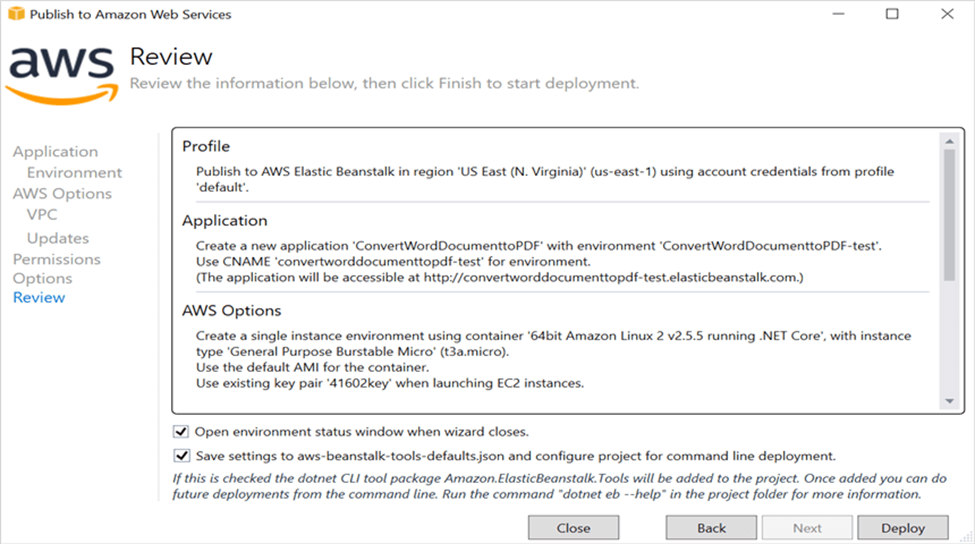
8. After changing the status from Updating to Environment is healthy, click the URL.
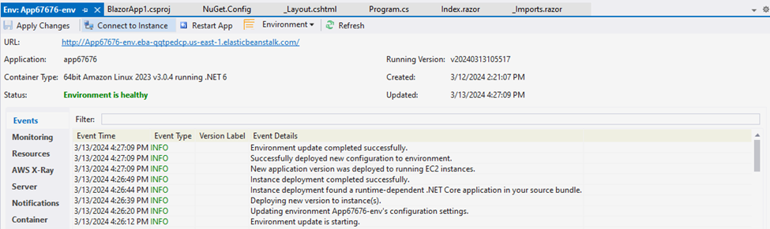
9. After opening the provided URL the provided PDF document will be displayed in PDF Viewer.
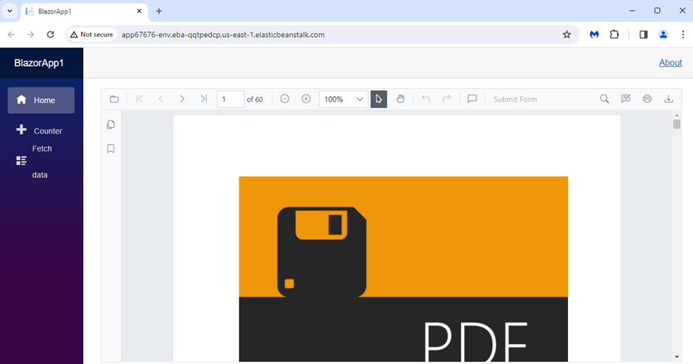


An online sample for [Getting Started - Server App](https://blazor.syncfusion.com/documentation/pdfviewer/getting-started/server-side-application) in Blazor PDF Viewer.

