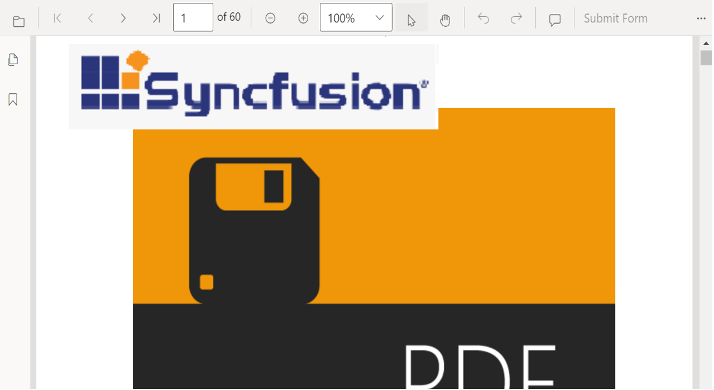

# Digital Signature appearance in Blazor PDF Viewer Component

The PDF Viewer control provides the appearance support for digital signature. If a PDF file that has a digital signature is loaded in the PDF Viewer, the digital signature will show up as an image. Using the 'ShowDigitalSignatureAppearance' API, you may choose whether the digital signature should be seen in the document when loading it into the PDF Viewer or not. By default, it is true. By default, it is true.



The following code explains how to disable the ShowDigitalSignatureAppearance in the PDF Viewer.

```cshtml
<SfPdfViewer @ref="viewer"
             ID="pdfviewer"
             ShowDigitalSignatureAppearance="false">
</SfPdfViewer>
```


